智力洪流已至，你的企业AI应用为何仍困在Demo阶段？

过去两年，ChatGPT引发的AI浪潮席卷全球，智力供给已不再是瓶颈。然而，当企业试图将这种强大能力引入核心业务系统时，却遭遇了普遍的困境：**智力供给已解决，但应用工程严重滞后。**

<!--truncate-->

那么，如何才能打破僵局，真正将AI智力转化为企业的**内生生产力**？

:::info 内生生产力
**内生生产力**工具是企业通过科技创新、数字化转型及内部能力建设，从组织架构、业务流程或生产要素优化中**内生培育**的新型生产工具。

它不是像以前那样买一条标准生产线，而是基于企业独有的数据、流程、规则“长”出来的能力。因此无法通用，必须自主研发或内生培育。
:::

## 一、从智力实验到内生生产力的跃迁

### 智力如何变成生产力？

技术变革从来不是一蹴而就的。回顾每一次重大技术革命，我们都能看到相似的演进路径：从实验期到工程期。

*   **实验期：** 基础技术加上应用实验，探索应用范式，创造出新生产力的雏形，比如我们过去两年看到的各种C端聊天机器人、Demo和原型应用。
*   **工程期：** 基础技术加上**应用工程**，再结合特定场景下的商业化产品，才能发展出普惠的新生产力。

AI要真正进入产业，必须补齐**应用工程**这个短板。


### 技术复用与系统重构的历史铁律

站在巨人的肩膀上。新一代技术是对前一代技术的复用与重构，这几乎是历史的铁律。

*   **动力视角**：动力革命直接导致交通工具的彻底重构。
*   **算力视角**：冯诺依曼体系、操作系统、互联网的层层叠加，最终爆发为今天的企业信息系统。
*   **AI视角**：AI技术的涌现激发了应用系统智能化的需求。


### 智力供给与需求

AI产业的上下游形态清晰可见。

**上游：AI智力供给端**

*  **中心化云端智厂**：像发电厂一样，提供通用大模型的算力。例如 OpenAI、Google、Anthropic。
*  **独立式、便携式的智机**：像发电机和充电宝，提供边缘端和私有化的算力。

**下游：生产力应用工具形态**

*   **ToC标准市场**：标准化专业垂直软件，例如 **Midjourney**、**GitHub Copilot**。这是通用模型+专业工具+领域数据的组合。
*   **ToB定制市场**：长在企业系统上的、垂类专门性的功能模块或子系统。构成公式是：**垂类/通用大模型 + 企业系统 + 专门工具模块 + 企业数据**。

这决定了ToB市场需要全新的定制开发平台和工具。


### 应用工程的扩展与融合

在AI时代，应用工程的内涵已经发生了根本性扩展。它必须融合AI侧和IT侧的能力。

*   **AI侧应用工程**：包括AI智力的输出方式，以及AI感知和驱动外界系统的方法。
*   **IT侧应用工程**：包括系统中各种工具技术模块和业务模块的加载运行方法、构建方法、接口规范、语义表达方法。

这两侧的融合，引出了一个关键洞察：**载体即工具**。

在AI原生应用工程和架构中，传统的OS、浏览器、互联网、数据库、IoT，既是载体又是工具。JitAI的价值在于将所有这些载体标准化为**AI可感知的元素**，让AI能够利用所有这些工具。这不是改进，而是重构。


## 二、新商业范式：FDE 与 Service-as-Software

补齐应用工程这一环，能带来怎样的新价值？答案是全新的商业模式和全新的职业角色。

### 商业模式的跃迁

传统软件行业是“卖软件账号”的一次性合同模式，但内生系统完全不同。

我们将从"卖软件账号"转向"卖业务结果"，从一次性合同转向订阅式合同。

为什么？因为内生系统需要长期维护和迭代，它不是一次性交付的产品，而是持续演进的能力。未来的服务模式是**长期订阅**和**陪伴式服务**。

这种模式下，B端内生AI开发生态将由三个角色构成：企业自研团队、软件服务提供商（按行业分化）、以及通用技术模块提供商。


### 前沿部署工程师的崛起

**FDE**（Forward Deployed Engineer），即**前沿部署工程师**，这是AI时代最稀缺的新职业。

新的分工体系正在形成：通用技术模块提供者负责开发高复用的底层"积木"；而FDE则不需要从零造轮子，他们利用JitAI平台和这些"积木"，深入前沿，快速搭建解决客户痛点的内生系统。

他们既懂业务，又懂技术，懂得如何利用AI和平台的力量，快速构建内生能力。


### 原子化与语义包裹：衔接断层的关键机制

要实现上述蓝图和商业价值，必须首先解决技术障碍。这个障碍的核心是传统软件模块无法被AI理解和使用。

解决方案是两个关键机制：
1.  **原子化**：将复杂业务功能拆解为最小、可独立执行的单元。
2.  **语义包裹**：赋予这些单元自描述能力（通过元数据和协议），让AI知道该工具的能力、参数和使用方法。

## 三、为何旧容器装不下新智力

让我们直面问题的核心，这正是阻碍我们的**工程断层**。

### 传统模块未能"工具化"

现象是：大模型日新月异，然而应用工程受传统软件生态拖累，进展缓慢。

**核心症结在于不够AI友好**。具体来说，编译后系统的运行时无法被AI感知和驱动。更根本的问题是，经典软件设计理论体系下的软件模块不能"工具化"。

:::warning 什么是"不能工具化"？
它意味着模块**不能原子化、不能动态化、不能自加载、缺乏解释性、缺乏语义自描述**。这是传统软件系统无法与AI技术融合的根本问题。
:::


### 业务与技术的双重复杂度

问题还不止于此。

*   **复杂度倒挂**：AI应用的复杂度远大于IT应用的复杂度。IT应用是静态映射、逻辑预设；AI应用是动态决策、不确定性常态。
*   **难度升级**：从"记录型信息管理系统"到"执行任务的事务执行系统"。AI的不确定性叠加业务的复杂性，难度呈指数级上升。
*   **通用性悖论**：AI应用无法通用，必须定制，因为企业间的流程、数据、规则、方法、操作标准都不同。

这带来了高昂的成本：缺乏AI工程人才，试错周期长。


很多人试图走捷径，但事实证明捷径往往是弯路。

例如，**C端Agent**，虽然在演示中表现突出，但其能力本质上**无法在企业级严肃场景中应用**。此外，**纯Agent平台**也注定不行，因为它缺乏对业务系统的深度集成能力。

> **AI必须与企业的业务系统原生融合。**

## 四、重构AI原生底座

那么解决方案是什么？

**JitAI**，作为新一代AI原生应用工程平台，正是为解决这一根本问题而生。它如何从底层实现“工具化”？

### 全新的AI原生应用工程技术体系

JitAI的愿景是构建一个全新的AI原生应用工程技术体系。这包括**一体化平台**（IT应用和AI应用开发的一体化）、**解释型架构**（解释型运行机制）和**规范化封装**（统一规范的技术模块工具封装方法）。

### 核心协议：JAAP

**JAAP**（JitAI AI Application Protocol）是整个体系的核心。它定义了一套全新的协议，让软件模块真正成为 AI 可用的工具，即**元素系统**。

元素系统实现了工具化的本质：
*   **元素语义**解决"AI 感知"；
*   **元素加载/调用**解决"AI 驱动"；
*   **元素编排**支持AI根据意图动态组合。


### 矩阵框架：现实建模与技术集成载体

如果说JAAP是协议，那么矩阵框架就是承载和实现这个协议的**核心载体**。

**矩阵框架**的核心定义是：现实建模与技术集成平台。它通过**现实建模**对企业业务实体进行数字化建模，并实现**技术集成/封装**，将底层技术封装为"元素化工具"，使AI能力"长"在业务系统中。


### 微内核运行平台与双模开发工具

架构需要高效的运行环境和开发工具。

*   **微内核应用运行平台**：全栈解释型，适配JAAP。
*   **可视化与全代码双模开发工具**：理念是结构编排（宏观）加过程编程（微观）。它超越低代码，拒绝DSL黑盒，提供更透明、无边界的白盒体验。

## 五、内生生产力的落地场景

让我们看看JitAI平台如何让FDE快速搭建AI应用，并实际应用到企业业务中。

### 核心工作流：感知、驱动、协作

鉴于AI不确定性的客观存在，**人机协作**模式具有重要的现实意义。

**感知驱动编排**是核心：AI能感知并驱动系统中的工具，并根据任务需求动态编排。同时，企业知识也通过建模与AI 原生集成。

### 三大应用场景

JitAI的观点是：所有对AI智力有需求的场景都必定属于以下三类之一。

**1. 设计和生成（Content Generation）**

场景包括文字、图片、视频等多种模态生成。AI 不仅能生成内容，还能直接将内容输出到业务系统中。

    

    

**2. 决策分析（Decision Analysis）**

场景是数据驱动的决策分析，包含大型数据模型应用。AI 能直接访问企业数据，进行深度分析，并给出决策建议。

    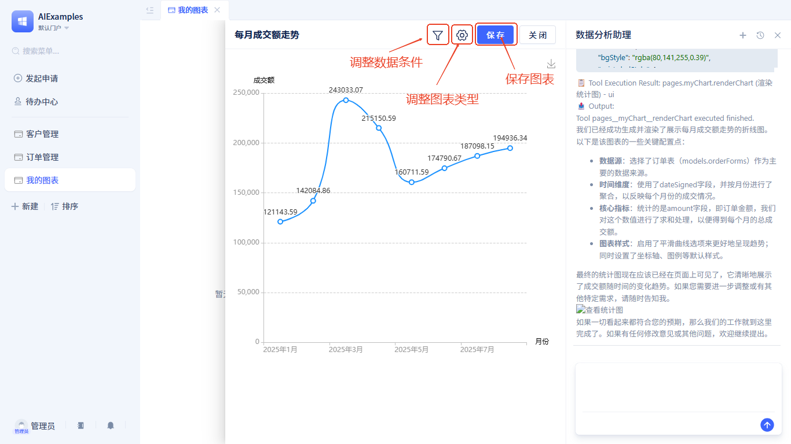

**3. 自主操控（Automation）**

场景是自动化操作业务系统、执行任务。系统从"记录型"向"执行型"转变，AI 能代表你执行操作。

    <video src="https://jit-www.oss-accelerate.aliyuncs.com/zh_preview.mp4" controls width="100%" height="100%" />

## 重塑AI时代的企业基因

让我们回到开篇的问题：大模型已经如此强大，为何企业AI应用还停留在 Demo 阶段？

因为智力供给已不再是瓶颈，瓶颈在**应用工程**。

**JitAI重构了系统底层，将传统软件升级为AI可驱动的工具**，从而释放了企业的**内生生产力**。

:::tip
内生生产力不是买来的，而是长出来的。它基于你的企业独有的数据、流程、规则、方法、操作标准，因此无法通用，必须自主培育。
:::
