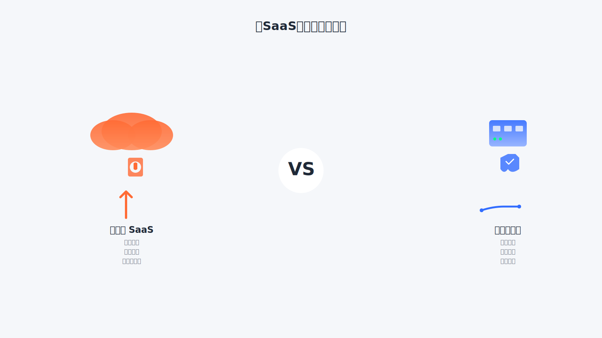
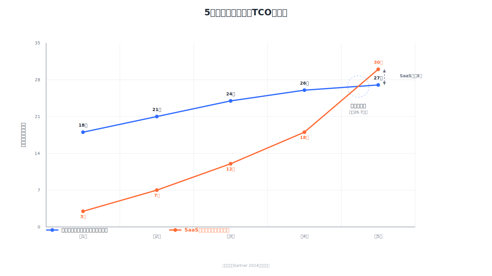
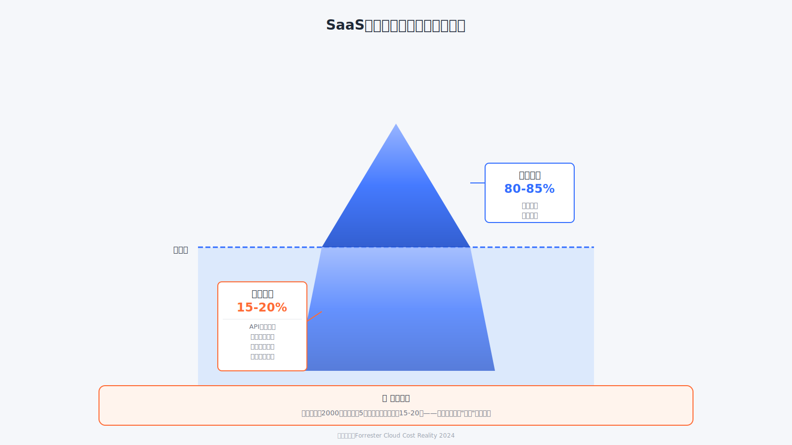
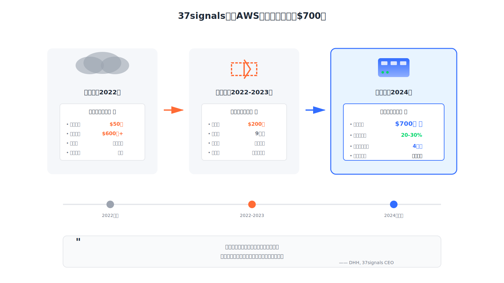
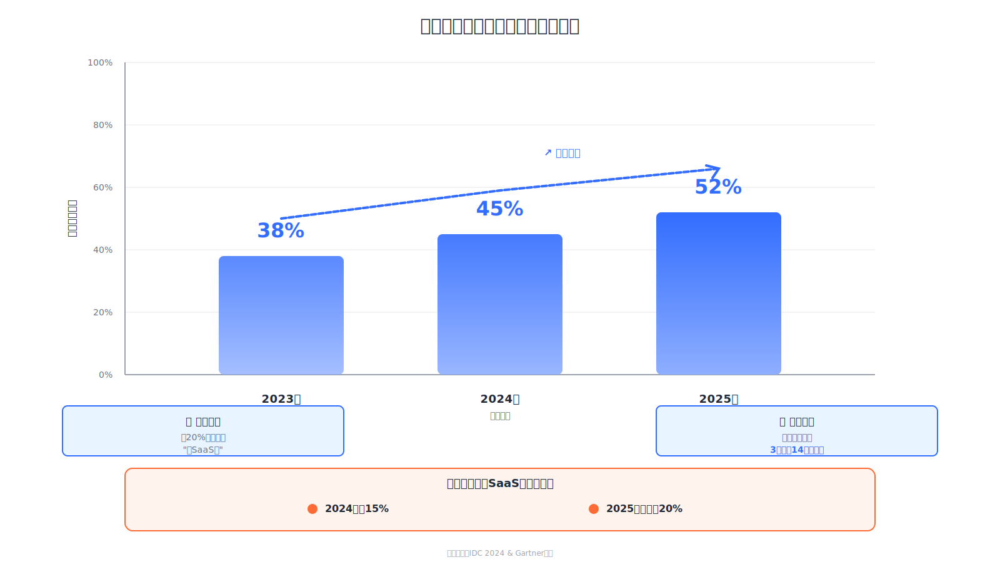
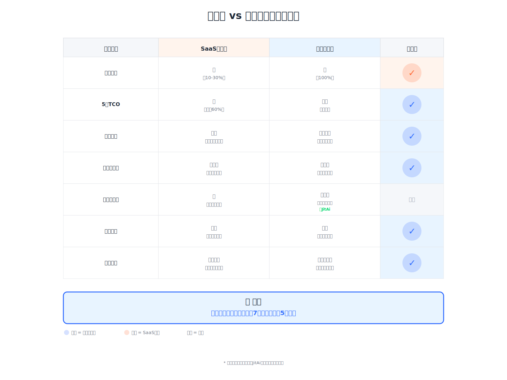

# 私有化vs公有云：被SaaS厂商隐藏的真相

37signals的CEO DHH在博客中公开了一组数据：他们从AWS迁出后，**每年节省约700万美元**。这不是个例。Gartner 2024年报告显示，企业SaaS订阅费**5年累计成本比私有化部署高出60%以上**。更触目惊心的是，Forrester发现企业平均存在**15-20%的SaaS隐藏支出**——来自API限额、强制升级、数据迁移成本。

过去十年，SaaS厂商用"快速上线、按需付费、无需运维"的口号吸引客户。但等企业深度依赖后，真相逐渐浮现：订阅费随用户数递增失控，供应商锁定让迁移成本高昂，核心数据托管给第三方带来安全和合规双重风险。Forrester调查显示，**超过60%的CIO在新系统采购时最关心的已不是功能，而是"可迁移性"**。

技术进步改变了游戏规则。现代应用平台让私有化部署告别了高昂运维成本，一键部署、自动化运维成为现实。本文将用真实数据和案例揭示：为什么越来越多企业开始"云遣返"，重新拥抱私有化基础设施。

<!--truncate-->

## 企业数据天生私有，私有化才是正解

企业的核心资产是数据和业务知识。客户信息、交易记录、生产工艺、管理流程——这些信息具有天然的私密性和竞争性。

**数据主权意味着完全的控制权**。数据在自己服务器上，企业掌控访问权限、备份策略、安全措施；数据在第三方平台上，企业失去对核心资产的控制，只能依赖供应商的承诺。

IDC China 2024报告显示，国内多家金融和制造业企业正因数据主权和合规要求，放弃SaaS转向私有化部署。这不是技术倒退，而是理性回归。

私有化部署是企业应用的本质诉求，不是落后的选择。过去因为技术门槛和运维成本过高，企业不得不转向SaaS。这是妥协，不是最优解。

## 公有云SaaS：被迫的妥协

过去的私有化部署意味着什么？专业运维团队、复杂的部署流程、频繁的故障响应。部署一套系统需要数天甚至数周，更新一个版本可能要停服半天。

中小企业难以承受这样的成本，大企业也要投入大量预算和人力。

公有云SaaS在这种背景下成为替代方案。供应商承诺接管运维复杂性，企业按月付费即可使用，以较低初始成本快速上线。

但代价是企业用**数据主权和系统控制权**，换取可负担的运维成本。核心数据存储在供应商服务器上，系统功能受限于供应商能力，业务连续性依赖供应商服务质量。

## SaaS的隐性成本远超账面价格

数据存储在第三方平台，面临**安全和合规双重风险**。供应商服务器可能遭受攻击，内部人员可能滥用权限，企业无法真正掌控数据。

**更严重的是供应商锁定**。业务系统积累大量数据和配置后，更换平台成本极其高昂。

数据导出受限，系统功能完全受限于供应商产品能力，无法深度定制和集成。企业实际上被供应商绑架，失去技术自主权。

按用户数付费看起来灵活，长期成本往往超出预期。业务增长，订阅费用持续上涨，多个SaaS服务叠加，总成本可能远超自建系统。

**自建系统投入是一次性的，SaaS订阅费用是无限期的**。持续多年累计可能比私有化部署更贵。

业务连续性依赖供应商，平台故障或供应商经营不善，企业系统立即中断只能等待，供应商调价时缺乏议价权。

## SaaS的真实成本：5年TCO对比

**Gartner 2024云经济报告**揭示了一个被刻意忽略的事实：

**第1年**：SaaS的初始成本仅为私有化的10-30%，看起来极具吸引力。

一套CRM系统，SaaS订阅可能只需3万/年，而私有化部署需要15-20万初始投入。

**第3年**：成本曲线开始分化。SaaS订阅费随用户数增长累计至约12万，私有化总成本稳定在25万左右。

**第5年**：差距拉大。SaaS累计成本达到25-30万，接近甚至超过私有化方案。

更关键的是，私有化系统已完成固定资产摊销，后续**边际成本极低**；而SaaS订阅费将无限期持续。

Forrester进一步指出，企业平均存在**15-20%的SaaS隐性支出**：

- API调用超限需要升级套餐
- 强制升级到更高价格计划
- 数据导出与迁移成本
- 定制开发受限需要额外购买企业版

**换算成人话**：表面上每月2000元的订阅，5年下来实际花费可能达到15-20万，而且永远没有"付清"的那一天。

## 云遣返潮起：企业用脚投票

数据和案例比任何论证都更有说服力。越来越多的企业正在用行动证明：**私有化不是倒退，而是理性选择**。

### 案例一：37signals —— 从AWS逃离的700万美元教训

37signals（Basecamp母公司）是协作软件领域的知名企业。

2022年，他们的AWS账单已达到**每月50万美元**，年成本超过600万美元。CEO DHH做了详细的成本分析后发现问题所在：

**问题所在**：

- 相同的计算资源，AWS收费是自建成本的3-5倍
- 随着用户增长，成本几乎线性上涨
- 性能瓶颈频现，却要为更高配置支付溢价

**迁移决策**（2022-2023）：

- 投入约200万美元自建服务器集群
- 9个月完成核心业务迁出
- 保留少量非核心业务在云端

**迁移成果**（2024年数据）：

- **每年节省约700万美元**
- 性能提升20-30%
- 完全掌控数据和基础设施
- **投资回报期：约4个月**

DHH在博客中总结："云服务的真正成本不是账单上的数字，而是你为了便利性放弃的控制权和利润空间。"

### 案例二：Dropbox —— 早期云遣返的标杆

Dropbox在2015-2017年完成了从AWS的大规模迁移，自建"Magic Pocket"存储系统。

虽然他们没有公开详细财务数据，但技术团队透露：

- **成本节省：估计30-40%**
- **性能提升**：I/O延迟降低，用户体验改善
- **技术自主**：存储技术成为核心竞争力

### 行业趋势：不是个例，而是潮流

Gartner预测，**2025年将有近20%的中大型企业考虑部分"去SaaS化"**。

IDC报告显示，企业**混合架构**（Hybrid Cloud + On-prem）预算占比从2023年的**38%**升至2025年预计**52%**。

**这不是技术倒退，而是理性回归**：在SaaS便利性和私有化控制权之间，企业正在重新找平衡点。

## 现代技术让私有化在经济上完全可行

过去私有化部署成本高，根本原因是**运维复杂**。但现代应用平台已将运维能力内建到系统中。

**一键部署不再是营销口号**。系统自动检测环境、安装依赖、配置服务；应用开发完成即部署完成，边改边用，实时生效。

发布升级只是可视化界面上的几次简单操作，非专业IT人员即可胜任。

企业在云厂商租一台ECS，安装**JitAi**这样的应用开发、运行、运维管理平台，就能获得稳定可控的私有化环境。

除了**运维成本接近零**，JitAi支持**可视化开发和全代码开发无缝切换**，业务复杂度增加时系统自由扩展，不像SaaS受限于平台能力边界。

## 重新审视这个选择

过去十年，企业软件市场被SaaS主导。但**数据不会说谎**：

- **Gartner证明了5年TCO的真相**——SaaS长期成本超出私有化**60%**
- **37signals用700万美元的节省证明了可行性**——**4个月**收回投资
- **Forrester揭示了60%的CIO已经开始担心供应商锁定**——可迁移性成为首要考虑

现代部署技术让私有化告别了运维地狱。

当JitAi这样的应用平台提供**一键部署、可视化运维、零代码开发能力**时，私有化不再是"能力问题"，而是"认知问题"。

**真正的问题不是你能不能做私有化部署，而是你愿不愿意重新掌控自己的数据和成本**。先行者已经开始享受红利！
