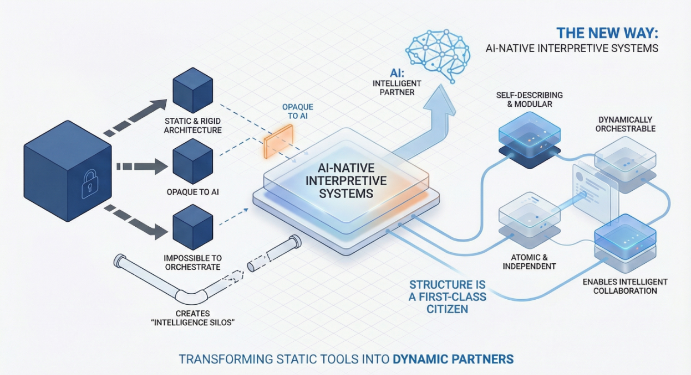

软件工程的历史，本质上是一部抽象的历史。我们从直接操作硬件寄存器（汇编语言），演进到描述算法（C/Fortran），再到对对象和关系进行建模（Java/OOP）。每一次转变不仅仅是为了让输入代码变得更容易，更从根本上改变了我们将人类意图映射到机器执行的方式。

今天，我们正面临一个新的拐点。随着大语言模型（LLMs）的兴起，我们试图大规模地自动生成代码。然而，大多数团队发现自己撞上了一堵“看不见的墙”：AI 在编写单个函数时表现出色，但在架构一个连贯的企业级系统时却往往是一场灾难。

问题不在于模型的智能程度，而在于我们当前的范式：**软件结构是隐式的**，它们被深埋在文本文件、文件夹层级和团队成员的隐性知识（Tribal Knowledge）中。为了构建真正的 AI 原生应用，我们必须推动一次范式转移：**让「结构」成为一等公民（First-Class Citizen）**——使其显式化、可寻址且机器可读。

<!--truncate-->

## “看不见的墙”：为什么基于文本的 AI 难以规模化

当前的 AI 开发工具在很大程度上仍然是代码的“随机鹦鹉”。它们基于从数十亿行文本中得出的概率分布来预测下一个 token。

当 AI 编写一个 Python 脚本时，它并不“知道”自己在写脚本；它只是在预测看起来像脚本的文本。这种方式在小范围内有效。但随着系统复杂度的增加，我们会遇到 **“语义坍塌”（Semantic Collapse）**。

- **上下文窗口陷阱**：即使拥有 1M+ token 的窗口，将整个代码库“投喂”给 LLM 也往往会降低其推理能力。模型看到的是一锅代码“汤”，缺乏对核心业务实体与辅助工具之间区别的结构性理解。
- **隐式依赖**：在传统代码中，用户模型（User Model）和订单服务（Order Service）之间的关系是由散落在各处文件中的 import 语句和函数调用定义的。对 AI 来说，这些只是字符串模式，它无法“看见”系统的拓扑结构。
- **脆弱的重构**：要求 AI 在一个 50,000 行的单体应用中“重命名 User ID 字段”，它可能会漏掉 3 处，或者幻觉出第 4 处。它缺乏一个严格的参考模型来保证一致性。

我们正试图用写散文的工具来建造摩天大楼。

## 范式转移：从“代码优先”到“结构优先”

为了让 AI 能够构建复杂且可靠的系统，我们必须将 **应用结构（Application Structure）** 从文档的附属品提升为系统内部有形的、可操作的实体。

**工程原语的演进**

| **时代**         | **核心原语**  | **开发焦点**           | **AI/自动化的角色** |
| ---------------- | ------------- | ---------------------- | ------------------- |
| **汇编时代**     | 寄存器 / 内存 | 让人类逻辑适应机器限制 | 无                  |
| **高级语言时代** | 算法 / 函数   | 表达逻辑（人类可读）   | 编译器优化          |
| **面向对象时代** | 类 / 对象     | 业务实体建模           | IDE 重构工具        |
| **AI 原生时代**  | **显式结构**  | 编排系统能力           | **协作架构师**      |

在这个新范式中，“应用”不再仅仅是编译后代码的集合。它是一个在编写任何一行业务逻辑代码之前就已经存在的 **结构化对象（Structured Object）**。

### 什么是“结构作为一等公民”？

让结构成为一等公民，意味着你的应用架构——包括模型、服务、页面和工作流——是以一种显式的格式定义的。这种格式允许机器和人类在不依赖具体实现逻辑的情况下，对其进行解析、验证和操作。

- **显式定义**：订单（Order）和客户（Customer）之间的关系不仅仅是 SQL 文件中的外键，而是结构图中的一条明确定义的连线。
- **可寻址元素**：系统的每一部分（页面上的按钮、数据库中的字段、工作流中的步骤）都有一个唯一且稳定的身份标识。
- **协议驱动**：交互遵循严格的协议，而不仅仅是临时的函数调用。

## JitAI 的解法：JAAP 协议

这一哲学正是 JitAI 的基础及其核心创新——**JAAP (JitAi Ai Application Protocol)** 的来源。

JitAI 不把 AI 视为一个“阅读”你代码的插件。相反，它将应用结构提升为一种 AI 能够原生理解的标准化协议。

### 1. 三层结构：Meta, Type, Instance

JitAI 强制执行一种关注点分离（Separation of Concerns），这与 AI 的推理方式完美契合：

- **Meta（元数据/概念）**：能力的抽象定义（例如：“数据存储”、“用户界面”、“身份验证”）。
- **Type（类型/模版）**：具体的实现类（例如：“MySQL 数据库”、“React 页面”、“OAuth 登录”）。这些封装了技术复杂性。
- **Instance（实例/具体应用）**：业务中的实际用法（例如：“客户表”、“订单管理页面”）。

通过显式定义这些层级，JAAP 允许 AI 在 **Instance（实例）** 层进行操作，而无需去“幻觉”底层的 Type 代码。

### 2. AI 操作的是结构，不仅仅是文本

当你要求 JitAI “在客户表中添加一个电话号码字段”时，AI 并不是在猜测应该在哪个 `.sql` 文件的哪里插入文本。

1.  它查询 **结构** 以找到“客户表”这个 Instance。
2.  它理解数据模型的 Meta 定义。
3.  它执行一个精确的结构化操作来添加字段。
4.  底层的代码（SQL DDL、API 端点、前端类型）是基于该结构 **确定性地（Deterministically）** 生成的。

这种方法消除了“幻觉鸿沟”。AI 操作的是经过验证的结构模型，而不是基于概率的文本。

## 实施手册：采纳结构化思维

即使你尚未使用 JitAI，也可以开始采用这种思维方式，为你的工程团队迎接 AI 时代做准备。

步骤 1：形式化你的领域模型

停止将数据库 Schema 视为实现细节。显式定义你的领域实体（Models）及其关系。使用工具或格式（如 JSON Schema 或 OpenAPI）创建一个独立于代码的“单一事实来源（Source of Truth）”。

步骤 2：解耦接口与实现

用严格的契约设计你的内部服务。如果一个 AI Agent 需要调用“退款服务”，该服务应该有一个机器可读的自描述定义（输入/输出/副作用）。

步骤 3：使用“自描述”元素

确保你的系统组件——页面、API 端点、工作流——携带关于自身的元数据。

- **Bad**: 一个名为 `proc_data_v2` 的函数。
- **Good**: 一个包含标题、描述、输入 Schema 和输出 Schema 的函数定义。

在 JitAI 中，每个元素（服务、页面、Agent）都有 `functionList` 和配置文件（`e.json`），明确告诉 AI 它是什么以及如何使用它。

## 收益：从副驾驶（Co-Pilot）到自动驾驶（Auto-Pilot）

当结构成为一等公民时，AI 的角色发生了转变：

- **从自动补全到编排**：AI 可以将前端页面、后端服务和数据库“连接”在一起，因为它理解连接器，而不仅仅是语法。
- **确定性完整性**：你可以通过数学方法验证结构的正确性（例如：“页面是否引用了模型中确实存在的字段？”）。
- **演进式架构**：你可以通过更改 Type 定义来替换底层技术（例如：从 MySQL 切换到 PostgreSQL），而 Instance 结构（你的业务逻辑）保持不变。

## 常见问题 (FAQ)

Q: 这意味着“无代码（No-Code）”吗？

A: 不。“结构作为一等公民”常与无代码混淆，但它们是不同的。例如在 JitAI 中，你仍然编写全代码业务逻辑（使用 Python/TypeScript）来处理复杂行为。结构是通过可视化或协议管理的，但逻辑仍然是灵活的代码。这是带有结构护栏的 “高代码”（High-Code） 或 “专业代码”（Pro-Code）。

Q: 这如何帮助减少 AI 幻觉？

A: 幻觉通常发生在 AI 缺乏约束时。通过强制 AI 在有效的结构定义内操作（例如：“你必须从 Agent 配置中定义的这个特定工具列表中选择工具”），极大地缩小了模型的搜索空间，迫使其保持精确。

Q: 我可以将此用于现有的遗留系统吗？

A: 可以，但通常需要一个适配层。你可以将遗留系统的 API 建模为“外部 API 元素”（如 JitAI 集成能力中所示），赋予它们一个新的 AI 原生系统可以理解和交互的结构定义。

## 结语

向 AI 原生开发的转型，不仅仅在于寻找更聪明的模型，而在于给模型一张更好的地图。通过让软件结构显式化——通过将其视为一等公民——我们弥合了人类意图与机器执行之间的鸿沟。

我们正从 AI 仅仅是在猜测代码的时代，迈向 AI 真正理解系统的时代。

准备好见证“结构优先”的开发了吗？

下载 [JitAI](https://jit.pro) 或探索开发者指南，构建你的第一个符合 JAAP 规范的应用。
