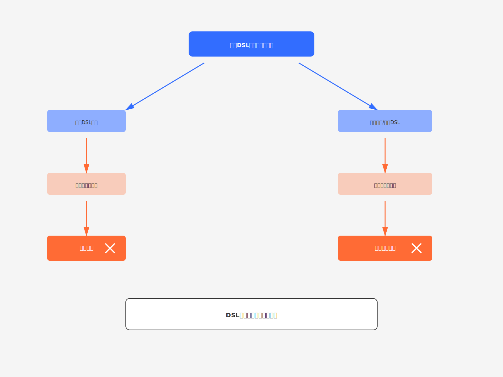
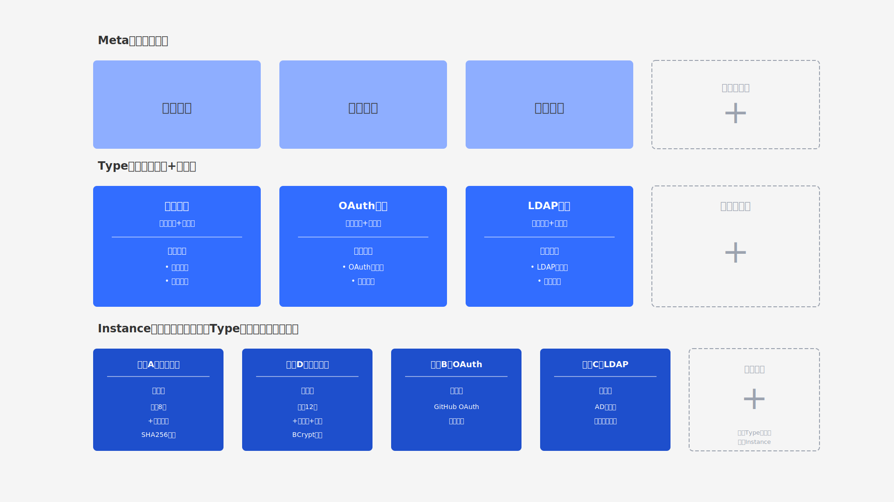

# 低代码的终极形态：从DSL黑盒到开放编排

一家企业在低代码平台上开发了审批系统，运行良好。但当业务部门要求增加"根据员工地理位置自动路由审批人"的功能时，技术团队发现平台的工作流配置根本无法表达这个逻辑。

明明是"低代码"应该更灵活，为什么反而被困住了？

这不是个例，而是**DSL（Domain Specific Language，领域特定语言）技术路线的本质困境**。传统编程遇到新需求可以随时扩展，低代码平台却被DSL框住。

更要命的是，npm生态拥有300万+包，GitHub有1亿+代码仓库，而低代码平台通常只有几十到几百个内置功能。用户想用新技术，却不得不等待平台厂商适配，错过业务窗口期。

接下来，我们将揭示低代码的终极形态：**从封闭的DSL黑盒转向开放的编排协议**。理解这个转变，将彻底改变你对可视化开发的认知。
<!--truncate-->
## DSL引擎的表达能力受限

企业应用的复杂性在于需求的不可预测性。**DSL只能表达设计者能够预见的场景**，当遇到DSL无法表达的需求时，只有两条路可走。

第一条路是扩展DSL语法，结果是语法越来越复杂，最终变得难以维护。

第二条路是在某些地方放弃DSL搞特殊处理，结果是系统一致性被破坏，用户被迫在两套体系之间切换。

### 工作流DSL的扩展困境

以工作流DSL为例：

初始版本：平台提供串行审批、并行审批、条件分支等基础能力。大部分常规场景都能覆盖，用户很满意。

需求1：需要"动态审批人"——根据金额、部门动态决定审批人。平台扩展DSL，增加`<dynamicApprover>`标签。问题解决。

需求2：需要"跨系统审批"——调用外部CRM的API。又扩展DSL，增加`<externalAPI>`标签。再次解决。

需求3：需要"AI智能路由"——调用机器学习模型预测最佳审批人，还要处理异步回调、超时重试、降级策略...

此时DSL已经变得臃肿复杂。每个新标签都带来学习成本。

更要命的是，**扩展速度永远追不上需求变化**。用户遇到新场景时，必须等待平台厂商适配，可能是几周，可能是几个月，甚至"这个需求太小众，暂不支持"。

### 无法逃脱的两难

DSL设计者面临根本性矛盾：

- 如果不断扩展语法，最终DSL会变成"图灵完备"的编程语言，失去简化的意义
- 如果拒绝扩展，就要承认表达能力不足，破坏"低代码万能"的承诺

对比传统代码：实现动态审批人只需一个函数调用，调用外部API只需几行代码，集成AI服务也只是引入一个SDK。**灵活性完全不受限，没有等待时间，没有"不支持"的说法**。

DSL的局限性不是设计问题，而是**技术路线的本质约束**。

不要企图设计出表达能力更强的DSL，这是一条死胡同。

## DSL引擎的技术集成能力受限

DSL解释引擎是封闭的黑盒，只有平台方才能修改。

然而，现代技术生态高度开放，技术迭代日新月异。**封闭的DSL引擎永远追不上技术演进的速度。**

### 新技术集成的时间差

你的企业想在低代码表单中集成最新的AI OCR服务来识别发票信息。

在开放架构下，开发者自己写一个适配器，调用云服务API，**1-2天就能上线**。

但在封闭的低代码平台上，你只能这样：

1. 向平台厂商提交功能需求
2. 等待产品经理评估优先级（2-4周）
3. 排期进入开发计划（1-2个季度）
4. 等待开发、测试、发布（2-3个月）
5. 升级平台版本才能使用

整个周期**3-6个月甚至更长**。这期间，业务窗口期可能早已关闭，竞争对手可能已经用上了新技术。

更糟的是，如果需求被评估为"小众场景，暂不支持"，就只能彻底放弃。

### 生态规模的量级差距

开放技术生态与封闭DSL平台的规模对比：

**开放技术生态**：
- npm：300万+包
- GitHub：1亿+代码仓库
- 社区力量：全球数百万开发者持续贡献

**封闭低代码平台**：
- 内置功能：50-200个组件和服务
- 更新周期：以季度或年为单位
- 生态：依赖平台方一家之力

这是**1:10,000+的数量级差距**。封闭系统如何能追上开放生态的创新速度？

### 技术选择权的丧失

封闭DSL带来的更深层问题：**用户丧失了技术选择权**。

- 平台用React，你想用Vue？不行
- 平台集成阿里云OSS，你想用腾讯云COS？等适配
- 平台不支持WebSocket？无法实现实时通信
- 想用最新的LLM做智能推荐？平台还没跟上AI浪潮

这种技术锁定意味着：用户的竞争力受制于平台厂商的技术视野和开发速度。当行业技术快速演进时，这会成为致命劣势。

## 可视化开发不是要可视化地完成所有编程

上述DSL的两重限制都建立在一个错误假设上：**可视化开发就是用可视化方式完成所有编程工作**。

这就像认为建筑设计应该用图纸完成所有工作一样荒谬。建筑图纸（结构）和施工流程（过程）缺一不可，二者各司其职。

### 编程与编排的天然分工

一个应用系统由**结构和过程**构成，编程和编排各有所长：

**编程擅长表达过程逻辑**：条件判断、循环迭代、算法实现、状态转换

**编排擅长表达结构关系**：模块组合、依赖关系、系统拓扑、配置管理

二者**互为补充，而非相互替代**。试图用可视化编排表达复杂的if/else逻辑，会变成"连线意大利面"。试图用代码描述复杂的系统拓扑，会淹没在大量配置代码中。

### 不是"要不要编程"，而是"什么该编程，什么该编排"

低代码平台的核心问题不是编程太多，而是**没有明确区分编程和编排的边界**。

- DSL想用可视化规则取代所有编程 → 表达能力受限
- 传统代码把编排逻辑也写成代码 → 结构不直观，难以复用

真正的解法：该用编程的地方保留完整编程能力，该用编排的地方用可视化方式编排。

### 低代码的终极形态

基于这个认知，低代码技术的终极形态一定是：**面向编排的架构 + 保留完整编程能力**。

**这是JitAi始终坚持的技术路线**。接下来看看这条路线如何实现。

## 面向编排的系统架构

既然认清了问题所在，解决方案的方向就很清晰：**不是改进DSL，而是彻底抛弃DSL引擎，转向开放的编排协议**。

### 从DSL引擎到JAAP(JitAi AI Application Protocol)

传统DSL引擎：
- 封闭黑盒：只有平台方能修改
- 解释执行：DSL配置由引擎解释运行
- 平台锁定：用户无法扩展

JitAi的 **JAAP**完全不同：
- 开放协议：任何人都可以实现符合协议的模块
- 自描述：每个模块携带自己的元数据和接口
- 动态编排：模块在运行时相互感知、驱动
- 技术中立：可以用任何语言和框架

**JAAP是协议，不是引擎**。这是根本性的架构转变。

### Meta/Type/Instance三层结构

JitAi通过Meta/Type/Instance分层结构定义系统模块，实现灵活的编排和复用。

**Meta层**：定义场景类别（元素族）
- 例如："登录方式"定义身份认证场景

**Type层**：封装技术实现并开放配置项
- 密码登录（配置：密码策略、加密方式）
- OAuth登录（配置：服务商、回调地址）
- LDAP登录（配置：服务器、查询规则）
- 你的自定义登录方式（开发者可扩展）

**Instance层**：承载差异化的业务配置
- 企业A的密码策略（最小8位，必须包含特殊字符）
- 企业B的GitHub OAuth配置
- 企业C的AD域集成配置

关键在于：**Type可扩展，Instance可复用**。开发者可以实现自己的Type，也可以复用官方和社区的Type，创建符合业务需求的Instance。

## 面向编排的开发框架

有了开放的协议和三层结构，接下来需要一套开发框架来落地。

### 企业应用的基础元素

企业级应用系统，无论行业和场景如何不同，本质上都由基础元素组合而成：

- **门户、页面、组件**：UI层
- **数据模型、服务**：业务逻辑层
- **工作流、权限**：流程控制层
- **组织架构、登录认证、数据源**：基础设施层

JitAi将这些元素封装为不同的**Meta元素族类**，每个Meta都提供大量**开箱即用的Type元素**。

### 开箱即用 + 无限扩展

开发者可以直接使用官方提供的Type：
- 选择合适的Type，创建Instance，配置参数
- 标准场景下不写一行代码即可搭建系统

当遇到特殊需求时：
- 扩展定义自己的Type：实现业务逻辑，定义配置项
- 改写官方的Type：基于官方Type定制
- 集成任何技术：调用任何npm包、GitHub库、云服务API

**不存在能力受限的问题**，因为你拥有完整的编程能力和技术选择权。

## 面向编排的可视化开发工具

编排结构的最佳表达方式就是可视化。但关键在于：**可视化的是编排结构，而不是编程逻辑**。

### 可视化编排 + 代码编程

JitAi的双向工作流：

1. 可视化拖拽组装模块 → 实时预览效果
2. 自动生成高质量原生代码 → 代码可自由修改
3. 代码修改后 → 可视化视图自动更新
4. 循环往复 → 可视化与代码保持同步

**你既能享受可视化编排的直观性，又不失去代码的灵活性**。

需要实现复杂业务逻辑时，在代码编辑器中写代码。需要调整模块组合和配置时，切换到可视化视图编排。两种方式无缝切换，各取所长。

## 面向编排的应用代码

应用代码本身也是面向编排的。

### 模块级别的独立和复用

传统项目中，代码文件之间存在大量`import`依赖，模块耦合紧密。想把一个功能复用到另一个项目，往往要连带复制一堆依赖文件。

JitAi的应用模块设计不同：

**完全独立**：
- 每个模块（Type或Instance）是独立的资源包
- 模块之间没有静态依赖（通过JAAP协议动态连接）
- 模块携带自己的代码、配置、元数据

**自由复用**：
- 模块可以在不同应用中直接复用
- 不需要复制代码片段
- 协议保证接口一致

### 企业项目交付的价值

这种编排复用能力在基于标品大量定制化交付企业项目时尤其有价值：

- 标准产品提供核心Type元素
- 不同客户创建自己的Instance配置
- 特殊需求通过扩展Type实现

你不再需要为每个客户维护一套代码分支，而是通过编排不同的模块组合满足差异化需求。

## 从黑盒到开放：技术路线的根本转变

回到文章开头的问题：低代码的终极形态是什么？

答案已经清晰：**不是更强大的DSL，而是从封闭的DSL黑盒转向开放的编排协议**。

### 两种路线的本质差异

| 维度 | DSL黑盒路线 | 开放编排路线 |
|------|------------|------------|
| **核心机制** | 封闭的解释引擎 | 开放的协议标准 |
| **表达能力** | 受限于DSL语法 | 保留完整编程能力 |
| **技术集成** | 等待平台适配 | 自主集成任何技术 |
| **扩展性** | 平台方控制 | 开发者自由扩展 |
| **生态规模** | 几十到几百 | 接入开源生态（百万级）|
| **技术选择权** | 被平台锁定 | 自主选择技术栈 |

这不是简单的功能改进，而是**方向性的技术路线转变**。

### 重新认识低代码

低代码的终极形态不是"消灭编程"，而是**让编程和编排各司其职**：

- 编程负责过程逻辑（算法、状态、流程）
- 编排负责结构关系（组合、依赖、配置）
- 可视化工具展现编排结构
- 代码编辑器实现业务逻辑

四者相辅相成，共同构成完整的开发体验。

### 给技术决策者的建议

如果你正在选型或使用低代码平台，关注这些问题：

1. **平台是基于DSL引擎还是开放协议？** 这决定了扩展性的天花板
2. **遇到平台不支持的功能时，能否自己扩展？** 检验真实的开放程度
3. **能否集成最新的技术和服务？** 评估技术选择的自由度
4. **代码是否可以导出和自由修改？** 避免被平台锁定

不要被表面的"简单易用"迷惑，**开放性和扩展性才是长期价值的保障**。

---

当低代码从追求"零代码"转向"编程与编排并重"时，它才真正释放了生产力的潜能。这不是技术的妥协，而是对软件开发本质的深刻理解。
