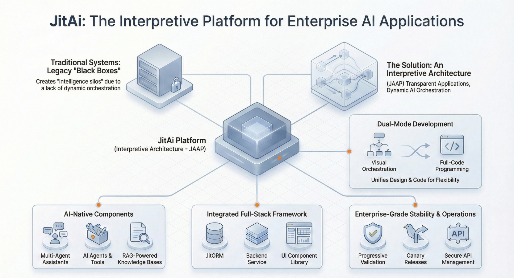

## 引言：企业级 AI 的“玩具”阶段已结束

过去两年，科技行业沉迷于“聊天机器人 (Chatbot)”范式。几乎每个 SaaS 产品都争相添加一个悬浮的 ✨ 图标，点击后弹出一个对话侧边栏。虽然这在信息检索方面是巨大的飞跃，但它也给企业管理者灌输了一个危险的误解：认为所谓的“企业级 AI 应用”，仅仅是一个连接了 LLM（大语言模型）和数据库的聊天窗口。

这种过度简化正导致行业陷入失望的低谷。资深开发者和架构师们开始意识到，虽然聊天机器人非常适合“查询”，但在“干活”方面往往表现糟糕。要从“AI 玩具”进化到关键任务系统，我们必须粉碎关于 AI 应用开发的三个普遍谎言。

<!--truncate-->

## 谎言 1：“自然语言是通用接口”

行业叙事暗示，最终所有的软件 UI 都会消融为一个单一的文本框。这完全无视了人机交互 (HCI) 领域数十年来关于信息密度和操作效率的研究成果。

### 信息密度难题

自然语言是线性的、低密度的。如果一位物流经理需要调整 50 辆卡车的配送时间表，输入“把所有卡车从 A 区移到 B 区，但不包括冷链车”不仅充满歧义，而且效率极低。相比之下，使用基于网格 (Grid) 的 GUI，用户可以通过筛选、多选和批量编辑，在几秒钟内完成操作并获得视觉确认。

### 真相：AI + GUI 深度协同

真正的 AI 原生应用不会取代 GUI，而是**操作** GUI。AI 的功能不应止步于聊天机器人，而应进化为能够操作用户所见视觉元素的“副驾驶 (Co-pilot)”。

在一个健壮的 AI 原生架构中，AI 必须能够：

- **读取 UI 状态**：理解用户当前正在看什么（例如：当前的表格筛选条件、选中的行）。
- **触发 UI 动作**：主动打开弹窗、填写表单或高亮特定字段。
- **可视化复杂输出**：AI 不应输出大段文本，而应直接在界面中生成图表、表格或结构化报告。

## 谎言 2：“搞定数据只需 RAG 和向量数据库”

检索增强生成 (RAG) 是让 LLM “阅读”文档的标准配置。然而，企业应用不仅仅是阅读数据，更重要的是**管理事务**。

### 事务完整性的缺失

想象一个负责审批报销单的 AI Agent（智能体）。向量数据库可以帮它找到“晚餐报销限额 50 美元”的政策文档，但它无法可靠地回答：“这名员工的剩余预算是否充足？”，也无法执行“更新总账并锁定该行数据以防编辑”的操作。

### 真相：结构化数据模型与 RBAC

企业级 AI 需要非结构化知识（向量/RAG）与结构化业务实体（关系型数据库）的融合。更重要的是，它需要严格的**基于角色的访问控制 (RBAC)**。

如果一个 AI Agent 只是一个漂浮在数据库之上的“大脑”，它将成为安全噩梦。这个 Agent 有权限查看 CEO 的工资吗？它能删除生产订单吗？

- **数据治理**：应用结构必须在模型层强制执行权限，确保 AI 无法通过幻觉绕过安全协议。
- **确定性逻辑**：关键业务规则（如税务计算）应由确定性的代码（服务函数）处理，而不是依赖概率性的 LLM Token。

## 谎言 3：“AI 可以通过 API ‘外挂’在现有系统上”

最常见的架构错误是将 AI 视为一个外部插件——一个你发送字符串进去、它返回字符串出来的“黑盒”。

### 上下文窗口的极限

当 AI 作为“局外人”时，它缺乏上下文。你不得不将大量的系统状态、API 定义和业务规则塞进提示词 (Prompt) 中。这不仅昂贵、缓慢，而且容易导致“上下文窗口溢出”，使模型遗忘指令。

### 真相：AI 作为系统的结构化参与者

在 AI 原生应用中，AI 是系统的**结构化参与者**。它不应仅仅是调用 API，而应理解应用的“元结构”。

- **自描述元素**：应用的页面、表单和逻辑应以 AI 可原生读取的格式（如 JSON Schema 或专用协议）定义。
- **深度集成**：AI 与业务逻辑共享相同的运行时环境，允许它检查代码、调试错误并理解实体关系，而无需每次都依赖数千 Token 的解释。

## JitAI 如何破局：AI 原生范式

JitAI 通过从根本上重新思考应用与 AI 的关系来挑战这些谎言。它不是一个外挂聊天机器人的低代码工具，而是一个**解释型系统**，在这里，应用结构本身就是“一等公民”。

### 1. 超越聊天机器人：AI 操作前端 (AI Operating the Frontend)

JitAI 实现了 **AI 与 UI 页面的深度双向交互**：

- **AI 控制网页 (AI Controls Web Pages)**：不同于标准聊天机器人，JitAI 的 **AI 助理 (AI Assistant)** 可以主动调用前端函数。例如，如果用户说“筛选高价值订单”，AI 不仅仅在文本中列出它们，而是实际触发用户当前查看的数据表格组件上的筛选器。
- **网页驱动 AI (Web Pages Drive AI)**：UI 元素（按钮、表单）可以触发 AI Agent 执行后台任务，形成一个用户与 AI 在同一屏幕上下文中协作的无缝闭环。

### 2. 通过 JAAP 实现结构理解

JitAI 使用 **JAAP (JitAi Ai Application Protocol)** 来定义应用。这使得 AI 能够“阅读”应用的 DNA——其数据模型、页面布局和逻辑流——而无需复杂的提示词工程。

- **结构即上下文**：因为应用是通过显式协议（Meta/Type/Instance）定义的，AI 天生就能理解“客户”实体拥有特定的字段和权限。
- **权限继承**：Agent 继承应用逻辑层定义的严格 **RBAC** 权限，防止未经授权的数据访问。

### 3. 逻辑与数据治理

JitAI 集成了用于结构化数据建模的 **JitORM** 和用于确定性流程编排的 **JitWorkflow**。

- **Agent + 工具**：Agent 可以配置 **服务函数 (Service Functions)**（Python 代码）作为工具。这意味着 AI 负责意图（推理），而服务函数负责计算（数学/逻辑），确保关键业务步骤的 100% 准确性。

## 对比：聊天机器人套壳 vs AI 原生应用

| **特性**       | **聊天机器人套壳 (传统模式)** | **AI 原生应用 (JitAI 模式)**            |
| -------------- | ----------------------------- | --------------------------------------- |
| **主要接口**   | 仅聊天窗口                    | **混合界面**：GUI + Chat (AI 可操作 UI) |
| **数据交互**   | 只读 / RAG 搜索               | **CRUD + 事务性操作**                   |
| **上下文感知** | 受限于提示词窗口              | **深度系统结构感知 (JAAP)**             |
| **逻辑执行**   | 概率性 (LLM 生成代码)         | **确定性 (LLM 调用服务函数)**           |
| **安全/RBAC**  | 常被绕过 / “上帝模式”         | **原生基于角色的访问控制**              |
| **开发方式**   | 拼接 API 和提示词             | **定义结构与协议**                      |

## 实战指南：构建超越聊天机器人的应用

要构建真正的企业级 AI 应用，请遵循这种“结构优先 (Structure-First)”的方法：

### 阶段 1：定义领域模型 (结构)

不要从提示词开始，要从数据开始。

- **模型实体**：使用严格的数据类型定义你的业务对象（如合同、发票）。
- **定义权限**：尽早设置 **RBAC** 角色。谁可以查看合同？谁可以审批？

### 阶段 2：封装确定性逻辑 (流程)

识别那些绝对不能出错的逻辑。

- **编写服务函数**：为计算创建独立的函数（例如 `calculateTax(amount)`）。
- **暴露为工具**：将这些函数注册为 AI Agent 的工具。不要让 LLM 做数学题，让它调用数学工具。

### 阶段 3：编排 UI (交互)

设计协作层。

- **构建 GUI**：为高信息密度的任务创建密集的数据表格和表单。
- **绑定 AI 事件**：配置 **AI 助理** 监听 UI 事件（如“选中项变更”），并允许 AI 触发 UI 更新（如“打开审批弹窗”）。

## 如何验证与复现

要验证标准聊天机器人与 AI 原生应用的区别，请在你的开发环境中尝试以下测试：

1.  **“行动”测试**：要求你的 AI “删除最后三个订单”。
    - _聊天机器人_：可能会说“我无法直接访问您的数据库”或幻觉出一个确认信息但并未执行。
    - _AI 原生应用_：应该触发后端的删除函数（在请求确认后），并立即刷新前端表格以反映更改。

2.  **“权限”测试**：以受限用户身份登录，要求 AI “显示管理员日志”。
    - _聊天机器人_：如果 RAG 切片没有做权限隔离，可能会泄露数据。
    - _AI 原生应用_：应返回“拒绝访问”，因为 Agent 继承了用户的 RBAC 上下文。

## 常见问题 (FAQ)

Q: “AI 原生”是否意味着我必须重写整个遗留系统？

A: 不一定。像 JitAI 这样的平台允许你将现有的数据库表映射为新协议中的模型，从而有效地用 AI 原生层包裹你的遗留数据，而无需进行数据迁移。

Q: 我不能直接用 OpenAI 的 Assistants API 做这个吗？

A: Assistants API 处理推理，但它不知道你的应用结构或前端状态。你仍然需要构建大量的胶水层来连接 API 与 UI 并强制执行权限。JitAI 开箱即用地提供了这些基础设施。

Q: 对于 AI Agent 来说，GUI 真的有必要吗？

A: 是的。对于复杂的决策，人类需要“人机回环 (Human-in-the-loop)”界面。GUI 允许人类审查、编辑和批准 AI 提出的计划（例如草拟的时间表），这比阅读该计划的文本描述要快得多。

## 结语

“聊天机器人时代”是必要的第一步，帮助我们理解了 LLM 的力量。但为了创造企业价值，我们必须迈向“应用时代”。这意味着构建这样的系统：AI 不仅仅是一个对话者，更是一个有能力的**操作者**——它尊重数据结构，遵守安全协议，并通过丰富、高效的图形界面与用户协作。

准备好构建真正的 AI 原生应用了吗？

- [下载 JitAI 桌面版](https://jit.pro/download)
- [查看开发者指南](https://jit.pro/docs/tutorial)
