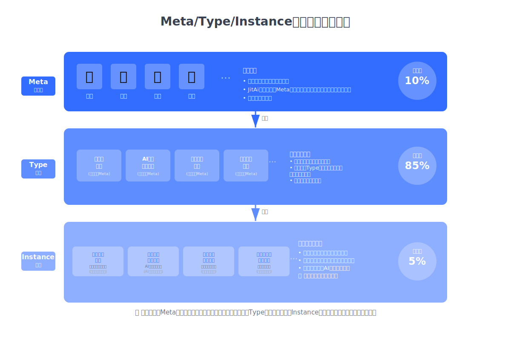
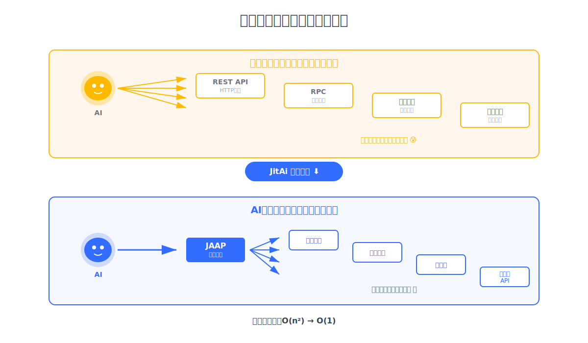

你有没有见过这样的场景：企业上线了AI系统，结果AI只能做简单问答；开发团队为每个AI功能写大量胶水代码，维护成本高得离谱；系统上线后使用率越来越低，变成了昙花一现的绩效项目。

**企图在旧的事件驱动架构中集成AI能力，就好比在牛车上安装内燃机——结构不匹配，注定愚蠢低效。** 传统架构的致命问题在于：它是为"静态映射"设计的（事件→函数的关系在开发时确定），而AI需要的是"动态感知"（AI根据意图实时识别和调用模块）。这不是小修小补能解决的，这是范式冲突。

本文将揭示**AI原生架构的四大核心支柱**：让系统可被理解的**规范化建模**（Meta/Type/Instance）、让AI看懂系统的**模块感知**、让AI调用系统的**智能驱动**、以及让AI改造系统的**热加载**。更重要的是，我们会说明为什么这不只是技术升级，而是关乎ERP、CRM、OA等所有企业应用生死存亡的架构革命。

<!--truncate-->

## 01 旧架构的致命缺陷：事件驱动的困境

事件驱动是当前所有企业应用的基石。

无论是CPU响应中断信号调用驱动程序，还是Web服务根据用户点击执行业务逻辑，这都是事件驱动的典型场景。它的核心逻辑很简单：**事件发生 → 触发预定义的函数**。

这套机制运行了几十年，为什么现在突然不行了？

**因为事件驱动有三个致命假设，而这三个假设在AI时代全部失效：**

**假设一：事件和响应函数的映射关系可以预先确定。**  
传统系统中，用户点击"提交订单"按钮，系统就调用`submitOrder()`函数。这种映射在开发阶段就已经硬编码完成。

但AI的工作方式完全不同。用户说"帮我处理一下昨天的订单"，AI需要根据意图**动态识别**应该调用哪些函数（查询订单？修改状态？发送通知？）。静态映射根本无法应对这种动态需求。

**假设二：函数不需要自我解释。**  
在传统架构中，开发者知道每个函数是干什么的，因为是他们自己写的。系统不需要"理解"函数的作用。

但AI必须理解。AI需要知道`processRefund()`这个函数是干什么的、需要哪些参数、有什么限制条件。如果函数是黑盒，AI就无法调用。传统架构下的模块根本没有"自描述"能力。

**假设三：系统功能在部署后相对稳定。**  
传统应用上线后，功能变更需要重新开发、测试、部署。这个周期可能是几周甚至几个月。

但AI应用不一样。AI应用需要**边用边改、快速迭代**。用户提出新需求，AI应该能立即调用或生成新模块。静态依赖、硬编码的开发方式完全跟不上AI应用的迭代速度。

**这就是为什么90%的企业AI项目会失败。** 不是AI不够聪明，而是底层架构根本不支持AI的工作方式。

你不可能在马车的基础上改出汽车，同样，你也不可能在事件驱动架构上改出AI原生系统。

## 02 规范化建模：让系统可被理解的基础

要让AI驱动应用，第一个基础问题是：**AI如何理解一个复杂的企业系统？**

传统企业应用动辄上百个模块、数千个函数。如果让AI直接面对这些细粒度的代码，理解成本会高到无法接受——就像让你从汇编语言开始学编程，学习曲线陡峭得令人绝望。

**复杂度确实不能消除，但可以转移。** 关键在于对系统进行**规范化建模**，提升抽象层次。

让AI理解系统的关键在于**抽象层次**。越微观的内容，理解成本越高；越宏观的内容，理解成本越低。

举个例子：编程语言的语法虽然规范，但因为是细粒度、微观的规范，学习成本很高（你花了多久学会第一门编程语言？）。

这个原理对AI同样适用。**越宏观的内容，AI理解越快越准，token消耗也越少。**

JitAi的解决方案是：**Meta/Type/Instance三层结构。**

**Meta层：定义领域和类别。**

比如"门户"、"页面"、"组件"、"模型"这些是应用的元类别。Meta层最抽象、最宏观，变化最少。

就像建筑学中的"住宅"、"办公楼"、"商场"这些大类，是稳定的概念框架。

**Type层：封装技术实现，开放可控配置。**

比如"开发者门户"是一种Type，它基于"门户"这个Meta，提供了在线编辑开发应用的能力；"数据表格组件"是另一种Type，基于"组件"Meta提供数据展示能力。

Type层是复杂技术逻辑的容器，但对外暴露的配置项是有限的、可控的。

就像汽车发动机内部很复杂，但留给用户的控制界面只有油门、刹车、档位。

**Instance层：承载业务个性化配置。**

比如"应用开发门户"是开发者门户的一个Instance，用于在线编辑应用；"订单列表表格"是数据表格组件的Instance，包含具体的筛选、分页配置。

Instance层复杂度极低，主要是配置数据。

**这种结构的精妙之处在于：它把复杂度控制在了应用层之外。**

应用层（Instance层）的复杂度极低，基本上就是填配置表。

人类开发者用JitAi的可视化开发工具几分钟就能完成一个模块，AI也只需消耗极少的token就能准确理解和生成应用模块。

而真正复杂的技术实现被封装在Type层和Meta层，由专业的框架开发者完成。

**JitAi开发框架中已经实现了大量常用的Meta和Type**——包括门户、页面、组件、模型、服务、审批、事件、任务、权限、组织架构、登录方式、数据库等，足以满足绝大多数企业应用的搭建需要。

更重要的是，**JitAi框架是完全开放的**。开发者可以：
- 无限扩展自己的Meta和Type，满足特殊业务需求
- 覆盖重写官方的Meta和Type，实现定制化
- 将自定义的Meta和Type分享给社区复用

**复杂度分布数据揭示了这种设计的价值：Meta层占10%、Type层占85%、Instance层仅占5%。**

这意味着95%的技术复杂度已经被框架封装，应用开发者只需面对5%的简单配置。这就是为什么用JitAi搭建企业应用可以如此快速。

**规范化建模是AI原生架构的基石。** 只有系统是可理解的，后续的感知、驱动、热加载才有意义。这就像盖房子，地基打不好，上层建筑就是空中楼阁。

## 03 统一的模块感知机制：让AI看懂系统

要让AI驱动应用，第一步是让AI知道"系统里有什么"。

传统系统对AI来说就像一个黑盒。AI看不到系统有哪些模块、每个模块能做什么、怎么调用它们。这就像让一个人蒙着眼睛开车，怎么可能开得好？

**JAAP协议**（JitAi AI Application Protocol）从根本上解决了这个问题。

**JAAP是一个结构化、可解释的应用架构协议。** 它定义了应用系统的构建标准和模块化架构。符合JAAP的应用，在构建时会自动生成模块的**声明信息**——清晰、准确、结构化，专门为AI设计。

这些声明信息包含：
- 模块的功能描述（这个模块是干什么的）
- 输入参数要求（需要什么数据）
- 输出结果格式（会返回什么）
- 调用限制条件（什么情况下能用）

就像每个模块都有一张"说明书"，AI读一遍就知道怎么用。

**更关键的是，这种自描述不仅适用于后端业务逻辑，前端UI模块也是自描述的。** 这意味着AI不仅能调用后端功能，还能理解和操作前端界面。这为AI驱动全栈系统奠定了基础。

想象一下：用户说"帮我生成上个月的销售报表"，AI不仅能调用后端的数据查询和计算模块，还能自动生成前端的图表展示。这在传统架构下几乎不可能，但在AI原生架构中是标配。

## 04 统一的模块驱动机制：让AI调用系统

AI理解了系统有哪些模块，下一步就是"怎么调用它们"。

在传统系统中，不同模块的调用方式千差万别：
- 有的是REST API调用
- 有的是RPC调用
- 有的是消息队列
- 有的是直接函数调用

AI要调用这些模块，就得为每种调用方式写适配代码。

一个稍微复杂的企业应用可能有上百个模块，这意味着要写上百套适配逻辑。**开发成本和维护成本都高得可怕。**

JitAi的解决方案是：**统一的调用语法。**

在JitAi应用中，AI通过解读模块的声明信息，**使用统一的语法调用所有模块**——无论是前端组件、后端服务、数据库查询，还是第三方API，调用方式都一样。

这就像从方言到普通话。过去AI要学会各地的方言才能和不同模块交流，现在所有模块都说"普通话"，AI只需学一种语言就能调用整个系统。

**集成复杂度从O(n²)降到O(1)。** 

以前每增加一个模块，可能需要为N个已有模块写适配代码；现在每个模块只需要声明自己的接口，AI自动搞定调用。

更重要的是，这种统一驱动机制让**AI编排复杂业务流程**成为可能。

用户说"帮我完成客户下单到发货的全流程"，AI可以依次调用：客户信息查询 → 库存检查 → 订单创建 → 支付处理 → 物流安排。每一步都是统一语法，AI轻松编排。

## 05 统一的模块热加载机制：让AI改造系统

AI原生应用的最大特点是：**功能边界难以预先规划。**

传统应用开发遵循"需求分析 → 设计 → 开发 → 测试 → 部署"的瀑布流程。一个功能从提出到上线，可能需要几周甚至几个月。

但AI应用不一样。用户在使用过程中会不断提出新需求，要能够**立即响应、快速迭代**。"边用边改、实时调整"才是AI应用的常态。

静态依赖和硬编码的开发方式根本跟不上这种节奏。

**JitAi的解决方案是热加载机制。**

**JitAi应用运行平台**是一个跨平台的应用运行容器，类似于JVM之于Java、Docker之于容器化应用。它对符合JAAP的应用进行解释、加载和运行，实现了：

- **运行时更新**：新模块可以动态加载，旧模块可以热替换，无需重启系统
- **即时可用**：AI可以立即调用新加载的模块，实现快速迭代

这意味着什么？

假设你的ERP系统上线运行中，突然需要增加一个"供应商评分"功能。

在传统架构下，你需要：开发代码 → 测试 → 停机部署 → 重启系统，可能需要几天时间，还要承担停机风险。

在JitAi架构下，你只需要：开发新模块 → 热加载到运行平台。

**整个过程可能只需要几分钟，而且不影响系统运行。** AI立即就能调用这个新功能。

**模块加载过程没有任何外部耦合。** 每个模块都是自包含、自加载的，不依赖其他模块的存在。

这让系统具备了极强的灵活性和可扩展性。

## 06 四大支柱构成完整体系

回顾一下AI原生架构的四大核心支柱，它们形成了一个完整的体系：

**规范化建模（基础）**：通过Meta/Type/Instance三层结构，将复杂的企业应用系统以宏观、结构化的方式呈现，让AI能够以较低成本理解系统。这是地基。

**模块感知（感知层）**：通过JAAP协议的自描述机制，让AI知道系统有哪些模块、每个模块能做什么。这是感知能力。

**模块驱动（执行层）**：通过统一的调用语法，让AI能够调用任何模块，并编排复杂的业务流程。这是执行能力。

**模块热加载（进化层）**：通过运行时动态加载机制，让AI能够随时增加、替换模块，实现系统的持续进化。这是进化能力。

**四者缺一不可。** 

没有规范化建模，AI无法理解系统；没有模块感知，AI不知道调用什么；没有模块驱动，AI无法执行操作；没有热加载，系统无法快速迭代。

这不是四个独立的技术点，而是一个有机的整体架构。

## 07 范式转变正在发生

如果你把这篇文章看到这里，应该已经明白：AI原生架构不是在旧架构上打补丁，而是一次彻底的范式转变。

从事件驱动到AI驱动，从静态映射到动态感知，从黑盒模块到自描述系统，从硬编码到热加载——**每一个变化都直指传统企业应用架构的根基。**

这场变革的深层逻辑是：**软件系统的"使用者"变了。**

传统企业应用的使用者是人类，人类通过鼠标点击、键盘输入与系统交互。系统只需要响应这些明确的操作事件就够了。

但AI原生应用的使用者不只是人类，还有AI。**AI的交互方式是意图理解、动态推理、自主决策。** 系统必须能被AI"看懂"、被AI"驱动"、被AI"改造"。

这不是技术细节的优化，这是应用架构的范式革命。

**更重要的是，这场革命的窗口期很短。** 就像移动互联网时代，最先完成移动化转型的企业获得了巨大优势，后来者只能追赶。AI原生架构的窗口期可能只有2-3年。

**传统的ERP、CRM、OA等企业应用，要么主动拥抱AI原生架构完成重塑，要么被新一代应用淘汰。** 历史不会给第三个选项。
