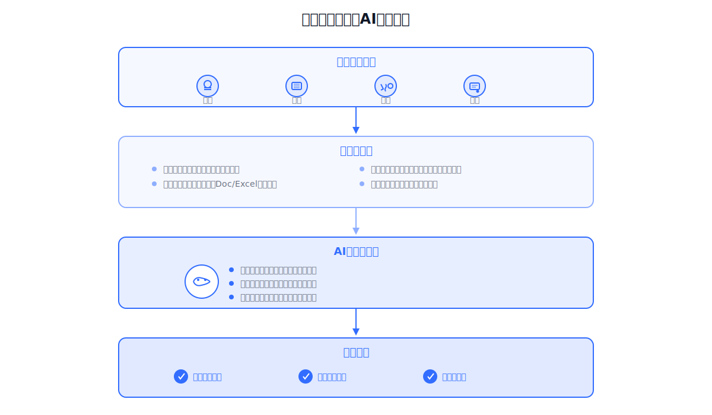

**你有没有想过：为什么高额投入的AI系统，最后却沦为摆设？**

这样的故事每天都在上演。

企业花费巨资引入AI，承诺的自动化率高达80%，但三个月后实际使用率连10%都不到。整个行业都在探索企业AI应用的落地形态，但大多数尝试都走入了死胡同：输出结果不能局部调整、与业务系统割裂而独立部署、独立UI不能与人协同、企图打造通用标品。

**这些都不是生产级AI应用该有的样子。**

本文将揭示生产级AI应用的三大核心特征，帮你避开那些已经被验证失败、代价惨重的路径。

<!--truncate-->

## 企业AI应用失败的典型场景

很多企业在引入AI系统后都会遇到类似的问题。

供应商承诺能够自动处理大部分业务，但上线几个月后发现：

**AI生成的回复无法针对具体错误进行修改，只能完全重新生成。**

**系统无法调用已有的ERP和CRM数据。**

**员工必须在聊天界面和业务系统之间来回切换。**

**面对不同行业客户的专业问题，AI给出的答案千篇一律。**

最终，这些高额投入的AI系统实际使用率极低，沦为摆设。

这并非个例。你的企业，是否也面临着类似的困境？

## 现有AI应用的四大误区

### 误区一：输出结果不能局部调整

以Cursor为代表的AI Coding工具确实能为开发者提效。一句话生成一堆代码文件。

**但生成的内容一定不是最终正确结果。**

为什么？

因为大模型必定存在幻觉。即使你给出的信息非常明确，AI生成的结果也可能存在错误。

况且，你也未必能一次性说清楚所有要求。

在消费级场景下，用户对AI输出的容忍度很高。错了重来，无伤大雅。

**但在生产级场景下，情况完全不同。**

你需要持续局部调整的能力，而且不能影响其它正确的部分。这不是可选项，而是刚需。

如果每次调整都要完全重新生成，会发生什么？等待时间长、token消耗巨大、修改效率低下。

**这样的AI应用根本无法在生产环境中落地。**

### 误区二：与业务系统割裂而独立部署

传统软件模块在事务记录场景下，成本更低、确定性更高。

在逻辑固化的业务领域，我们仍然应该使用传统软件。这没有问题。

**关键是：AI的价值不在这里。**

AI的价值在于那些需要智力去思考、去决策、去灵活执行的环节。这才是AI应该发挥作用的地方。

那么，一套与传统业务系统割裂而独立部署的AI系统会怎样？

**结果很明显：**

无法全面理解已有软件模块的能力。

无法便捷地对特定软件模块发起调用。

更无法基于已有模块能力去编排执行时序。

**割裂的AI系统，只能沦为系统外的装饰品。**

### 误区三：独立UI不能与人协同

目前市面上的AI应用，几乎都有一个专属的聊天对话界面。

这也是绝大多数人对AI应用的认知。

这种模式有用吗？有用。

**但远远不够。**

想象一下：你在聊天框里和AI对话，AI给你一段建议，然后你要切换到业务系统去手动执行。这是协同吗？

**这不是协同，这是隔空喊话。**

真正的AI应该像一个聪明的工作伙伴，在你可操作的UI上与你协同工作：

你可以对AI的操作进行确认或调整。

AI可以代替你执行业务系统上的操作。

双方在同一个界面上实时协同。

**困在聊天框里的AI，永远无法真正融入你的业务流程。**

### 误区四：企图打造通用标品

不同企业的业务流程、业务规则、业务数据、业务模型都不同。

企业之间存在巨大的差异性。这是常识。

**有些开发团队却企图打造一套放之四海而皆准的通用AI应用。**

为什么行不通？

因为AI如果不理解你的业务流程、不掌握你的业务规则、不熟悉你的数据结构，它能提供什么价值？

**答案是：没有价值。**

生产级AI应用一定是定制化开发的，深度理解你企业特有的业务逻辑。通用标品只能是玩具。

## 生产级AI应用的三大核心特征

看清楚了问题，才能找到答案。

那么，真正的生产级AI应用应该是什么样子？

JitAi对生产级AI应用提出了具象化定义，归纳为三大核心特征：

**1. AI对传统软件模块的感知、驱动和编排**
让AI成为系统的原生能力，而非独立应用

**2. AI与人类基于UI的协同**
让AI在你的工作界面上协同操作，而非割裂的聊天窗口

**3. AI对企业私有数据/知识/特有业务模型的理解使用**
让AI真正理解你企业特有的业务逻辑

下面我们详细探讨这三大特征。

## 特征一：AI对传统软件模块的感知、驱动和编排

传统软件系统成本低、确定性高，在操作逻辑固化的领域仍然有效。

那么，生产级AI应用应该如何对待这些已有系统？

取代它们？错了。

**正确做法是：原生融合。**

具体而言，AI要能够：
- 使用你企业私有的信息化系统
- 将AI功能嵌入到你的业务流程中
- 作为不同的事务执行助理嵌入到业务操作的各个环节

这些事务执行类的AI助理和系统的事务记录管理功能是原生一体的，相互驱动和调用。

### 实际应用场景：智能采购审批助理

想象一下你的采购审批流程：

供应商信息查询、历史采购记录分析、预算检查、多级审批流转等。

**传统做法是什么？**

采购员需要在多个系统间切换操作。查供应商信息要打开一个系统，查历史记录要打开另一个系统，检查预算又是一个系统。耗时费力，容易出错。

**但在使用JitAi构建的采购审批系统中，情况完全不同。**

AI助理能够：

**感知**：理解供应商管理模块、财务预算模块、审批流程模块各自的能力边界

**驱动**：根据采购需求自动调用供应商评分系统、查询历史采购数据、检查预算余额

**编排**：智能安排执行顺序，先进行资质审查，再进行价格比对，最后提交审批流程

这一切都发生在统一的业务界面上，AI助理与传统软件模块无缝协作。

### 技术实现：JAAP协议与模块自描述

**模块自描述机制**

JitAi的AI原生应用架构遵循**JAAP（JitAi AI Application Protocol）**协议。

最核心的特点：每个模块都是自描述的。

什么是自描述？

在开发阶段就生成精炼、准确的描述信息。

AI读取这些信息，无需翻阅大量代码和文档，就能快速感知：

- 系统模块的能力边界
- 输入输出要求
- 调用方式等关键信息

就像给每个模块配了一张"说明书"，AI看一眼就知道怎么用。

**可视化编排与智能调度**

一个业务操作流程通常需要调用多个独立的系统模块。而且需要按照一定的时序执行。

JitAi提供的可视化开发界面让这一切变得简单：

为特定业务操作开发专用的AI助理。

以可视化形式添加AI助理需要使用的系统模块。

支持的模块类型包括：业务数据增删改查功能、自定义的业务函数、前端页面操作等。

在运行时，AI根据业务数据和你的需求，自主决策调用哪些功能模块，并智能编排多个功能模块的执行时序。

## 特征二：AI与人类基于UI的协同

AI作为智能助理辅助你工作，真正的协同关系应该是什么？

**不是AI在聊天框里给建议，你在业务系统里手动执行。**

**而是AI和你在同一个界面上，共同完成工作。**

你可以对AI的决策和动作进行观察与干预，共同实现工作成果的正确性。

在使用JitAi开发的AI应用中，这种协同体现为：

AI助理不仅可以与你对话，还可以操作你操作的一切界面UI。

AI的操作以你完全可理解的方式被可视化。

你使用相同的UI界面去精准干预AI的结果。

形成"AI操作-你观察-你干预-AI调整"的闭环。

### 实际应用场景：智能合同审核助理

传统AI方案是什么？在聊天窗口中让AI生成审核报告。

**问题在哪？**

律师看到AI的报告，然后要切换到Word文档去手动修改。AI说"第三条有风险"，律师要自己去找第三条，自己判断怎么改。

这是协同吗？这是单向输出。

**但使用JitAi开发的智能合同审核系统中，情况完全不同：**

**AI的操作**：
- 在合同文本界面上直接高亮风险条款
- 在相应位置插入修改建议
- 自动填充标准条款模板
- 在审批流程界面上标记需要关注的环节

**你的干预**：
- 直接在AI标注的位置进行微调
- 保留AI建议的部分内容，修改不恰当的部分
- 使用相同的界面工具进行补充标注
- 一键确认或调整AI的修改建议

AI和你在同一个工作界面上协同操作。就像两个人共同编辑一份文档。

你可以实时观察AI的每一步操作，随时介入调整。而不是面对一个黑盒生成的结果。

**这才是真正的协同。**

### 技术实现：前端模块的AI原生化

这种AI对前端UI的操作能力得益于JitAi的AI原生应用架构。

前端功能模块作为系统模块的组成部分，同样可以被AI感知、驱动和编排。

AI不仅能调用后端API，还能直接操作前端组件。实现真正的人机协同。

## 特征三：AI对企业私有数据/知识/特有业务模型的理解使用

一个不争的事实是：

不可能存在一种AI应用，在对你企业私有数据/知识/业务模型一无所知的情况下，就能为你提供有价值的服务。

**这是常识，但很多人忽略了。**

每个企业都有自己独特的：

业务流程和操作规范。

业务规则和决策逻辑。

数据结构和知识体系。

行业术语和专业概念。

**通用标品AI无法深入理解这些你企业特有的要素。**

不理解，就无法提供价值。这也是生产级AI应用必须定制开发的根本原因。

### 实际应用场景：智能产品配置助理

想象一家工业设备制造商。生产高度定制化的设备，每个客户的需求都不同。

销售人员需要根据客户场景配置设备参数。

这涉及什么？

复杂的技术规格、兼容性规则、价格策略等企业私有知识。

**通用AI无法理解这些特定领域的知识。**

如果AI不知道哪些组件可以兼容，不清楚你的定价策略，不了解历史成功案例，它能提供什么帮助？

但使用JitAi构建的智能配置系统可以做到：

**企业知识建模**：
- 定义产品配置模型：包含设备类型、规格参数、性能指标等结构化字段
- 建立兼容性规则知识库：不同组件之间的兼容关系
- 构建价格策略模型：基于批量、客户等级、定制程度的定价规则
- 整理案例库模板：历史成功案例的配置方案

**AI的理解与应用**：
- 理解客户需求后，AI从案例库中检索相似配置
- 根据兼容性规则自动筛选可行方案
- 调用价格策略模型计算报价
- 在标准配置模板上进行定制化调整

你和AI都基于相同的业务模型在界面上工作。

AI的建议符合你企业的业务逻辑，你可以直接在配置界面上调整AI的方案。

### 技术实现：领域结构建模与模型操作

你企业的数据和知识资产，都可以通过建模让AI理解和使用。

JitAi提供便捷的领域结构建模能力。你和AI基于双方都能理解的模型，在UI上协同工作。

**结构建模包括什么？**

数据表模型：业务实体及其属性、关系。

文档模板：各领域特有的Doc/Excel文档模板。

业务规则：决策规则、计算公式、约束条件。

知识图谱：概念关系、实体关联。

JitAi提供对各类数据模型的操作能力。这些能力作为系统模块的一部分，AI可以感知、驱动和编排它们。

AI不仅能读取模型数据，还能基于模型进行推理、计算和决策。

## 结语：从聊天机器人到智能工作伙伴

生产级AI应用不是一个独立的聊天机器人。

**而是与你业务系统深度融合的若干个智能助理。**

**从割裂到融合**

AI不再是独立部署的系统，而是与传统软件模块原生一体。通过JAAP协议实现模块级的感知、驱动和编排。

**从对话到协同**

AI不再局限于聊天窗口，而是在你的工作界面上直接操作。实现真正的人机协同，让AI的每一步操作都可观察、可调整、可验证。

**从通用到定制**

AI不再是放之四海而皆准的标品，而是深度理解你企业私有数据和业务模型。提供符合你特定领域逻辑的智能服务。

---

企业智能化建设并不是为传统系统简单加上AI功能。

**而是从AI原生的视角重构业务系统。**

**当我们真正理解了生产级AI应用的三大特征，才能避开那些投入高昂却沦为摆设的失败路径。**

只有这样，才能打造出真正为企业创造价值的AI应用。

你的企业准备好了吗？

还是说，你还困在聊天框里寻找答案？

