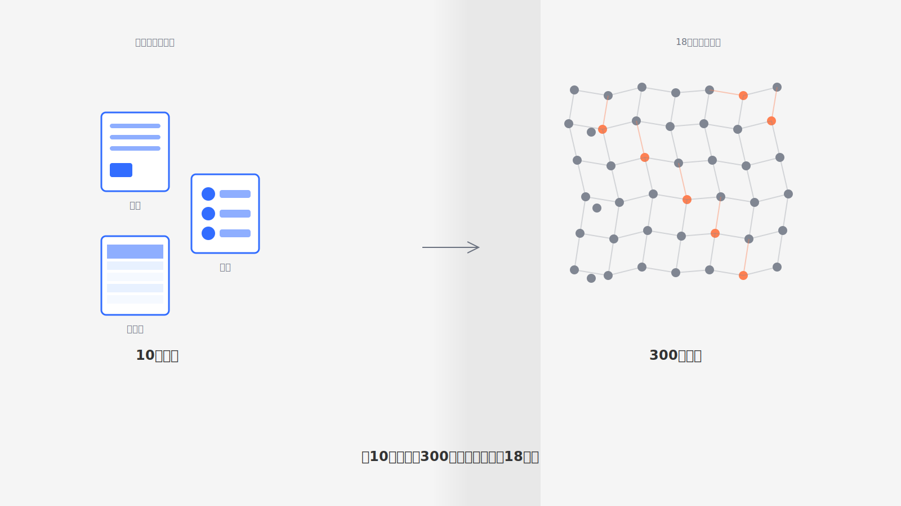
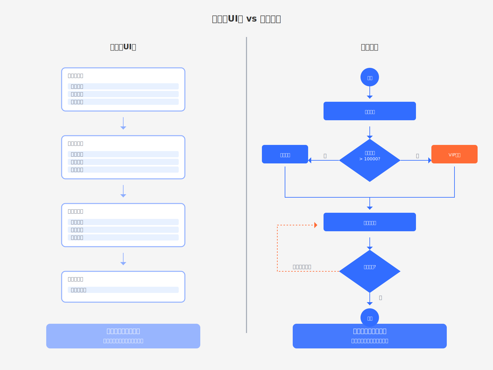
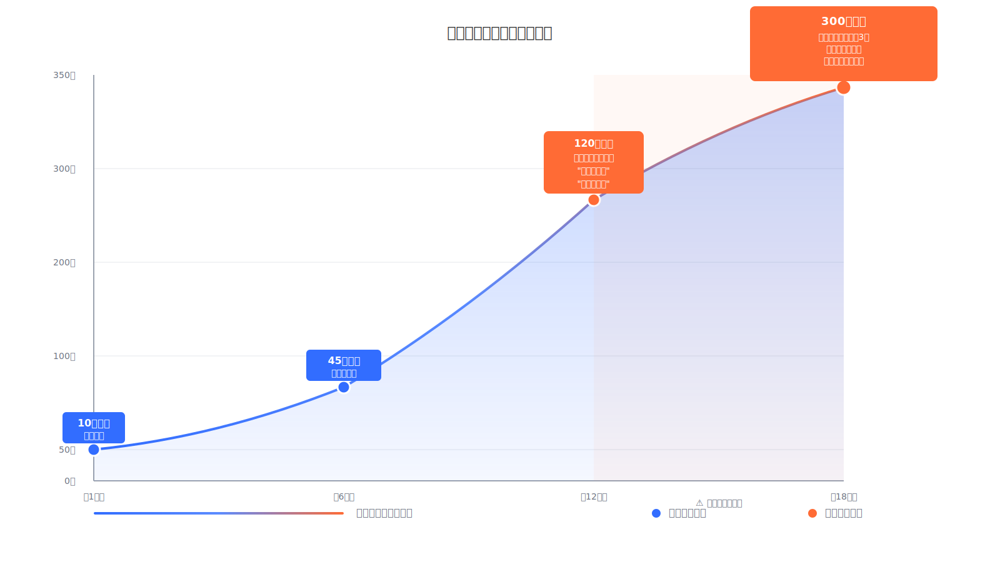
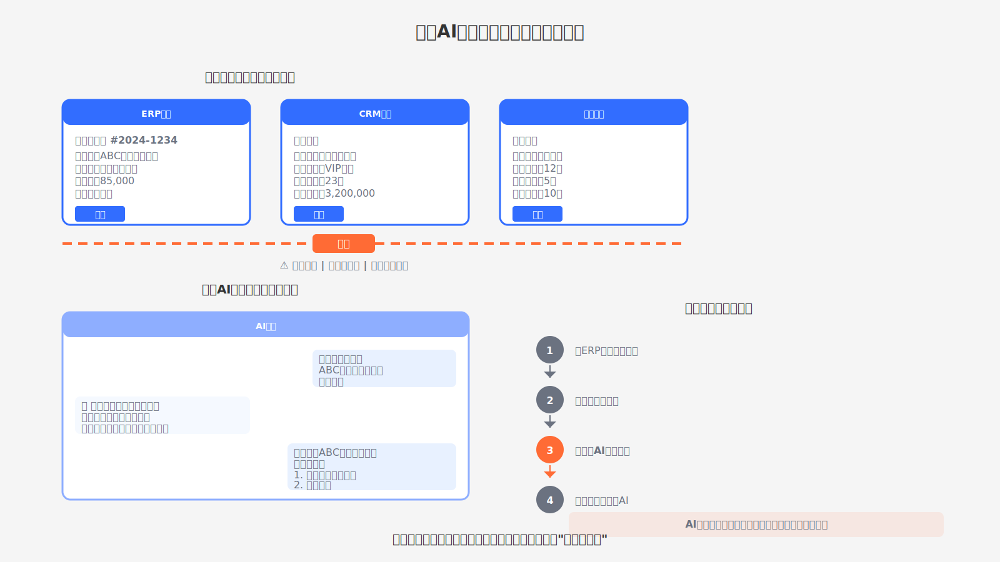
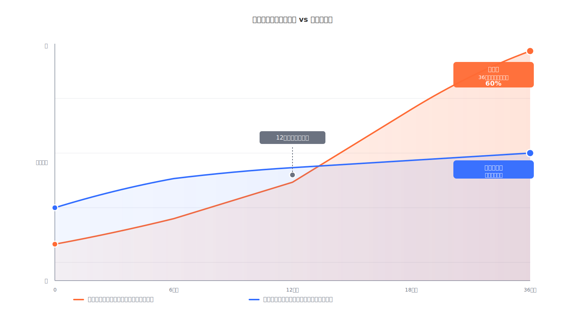

# 为什么Coze/n8n不适合严肃场景？轻应用的致命缺陷

IT主管打开配置后台，300多条业务规则密密麻麻堆在界面上。两年前上线时只有十几条规则，现在每次业务调整都要新增几条，谁也不敢轻易修改——改一条字段显示规则，可能影响三个审批流程；调整一个权限设置，可能导致五个报表失效。新来的IT专员看了三天文档（最惨的是没有文档！），还是理不清这些规则之间的依赖关系。

这是企业信息化建设中的典型困境。前期选型时，看重的是"一周搭建原型、无需编程、拖拽配置"；等业务复杂度上来了，才发现系统扩展不动——不是功能不够用，而是配置规则已经复杂到无法维护。想升级到更专业的系统，数据迁移、业务中断、员工重新培训的成本，比当初节省的开发时间还要高。

**这不是某一家企业的问题，而是轻应用平台的范式缺陷**。本文揭示基于数据库UI化构建的轻应用和脱离业务土壤的AI应用，在严肃业务场景中为什么走不通，以及什么样的系统才符合企业的长期利益。

<!--truncate-->

## 基于数据库UI化思路构建的轻应用

所谓数据库UI化思路构建的轻应用，就是把数据库表结构可视化，让用户通过界面创建表格、字段和视图，然后自动生成表单和列表页面。这类应用擅长记录数据——员工填表、数据入库、查询统计，整个过程简单直观，构建快速。市面上不少流行的多维表/低代码/零代码平台（如Notion、Airtable、简道云等）都采用类似的思路。

但企业业务需要的不只是数据记录，更需要能够应对复杂的业务流程编排。**数据库UI化的底层范式，从根本上限制了应用的能力边界**。

### 复杂业务逻辑无法表达

初期用表单记录信息确实方便。但当你需要在采购审批流程中加入条件分支——金额小于5万走简易流程，大于5万需要副总审批，涉及特定供应商还要法务会签——你会发现平台只能通过字段可见性规则来迂回实现。

5个审批节点，每个节点根据3个条件判断是否显示，就需要配置15条规则。再加上字段联动（选择A类物资，自动显示质检字段；选择B类物资，显示仓储字段），又是10多条规则。一个看起来简单的审批流程，背后是30-40条规则在支撑。

更棘手的是异常处理。采购单提交后发现供应商信息填错了，需要退回修改。但数据库表结构已经记录了这条数据，状态字段标记为"已提交"。要实现退回，需要新增一个"退回"状态，还要配置规则：退回后哪些字段可编辑，哪些不能改；重新提交后走哪个审批节点；退回次数超过2次要特殊标记……每增加一个异常场景，配置复杂度就翻倍。

**它只能记录发生了什么，无法编排应该怎么做**。数据库表结构天然不适合表达"如果...那么...否则..."这种流程逻辑。你用字段关联和可见性规则拼凑出来的流程，本质上是在用螺丝刀砸钉子。

### 配置复杂度爆炸式增长

系统上线第一个月，配置界面清清爽爽：3个表格，20个字段，10条规则。半年后，业务部门提了15个优化需求，配置界面变成了：12个表格，80个字段，45条规则。一年后，配置后台打开需要等3秒加载，滚动查看规则列表要滚5屏。

新来的IT专员接手维护，主管交给他一份20页的配置说明文档。文档里写着："修改客户类型字段时，注意检查报价单模板、折扣规则、开票流程三个地方的关联配置。"专员看了三天，还是不敢动手——文档是半年前写的，现在又新增了几个模块，哪些地方有关联依赖，谁也说不清。

最后的解决方案是：不改了。业务部门提新需求，IT部门评估后回复："这个需求会影响现有逻辑，风险太大，建议用手工处理。"**本来是为了提升效率上的系统，结果变成了业务创新的枷锁**。

### 迁移成本远超预期

当系统真的扩展不动，决定换一套更专业的方案时，才发现迁移成本远超预期。

数据导出的字段名是中文、关联关系用ID引用、多选字段用逗号分隔，新系统导入需要写脚本清洗。业务逻辑要用新系统的工作流引擎重新实现，相当于把需求再做一遍。员工要重新培训，业务要找窗口期中断切换。

前期选型时为了节省3个月开发时间，后期迁移却要花费6个月。这还没算业务中断的机会成本。

## 脱离业务土壤的AI应用

整个世界都在探索AI在企业中的应用。有一种AI应用的构建思路是将AI能力独立部署为聊天机器人或工作流引擎。用户通过对话式界面与AI交互，配置提示词模板和工具调用规则，让AI完成问答、内容生成、数据处理等任务。

这种独立部署的AI应用在知识问答、内容创作等轻量场景下确实能快速见效。市面上一些AI应用搭建平台（如Coze、Dify、n8n等）采用这种思路，让用户不写代码就能发布AI应用。

但当企业试图将这类AI应用引入实际业务场景时，会发现独立部署的AI应用与业务系统存在着严重的兼容问题。

### API对接的无底洞

AI应用搭建平台给出的方案是：给每个业务功能写一个API接口，配置到AI的工具列表里，AI就能调用业务系统了。听起来简单，实际是个无底洞。

查询客户信息，要写一个接口；创建销售订单，要写另一个接口；更新库存，又是一个接口。每个接口都需要写详细的Schema定义——参数类型、必填项、取值范围、关联关系。还要写接口说明文档，告诉AI这个接口是干什么的、什么场景下调用、返回的数据结构是什么含义。

更关键的是，业务系统的原有接口往往不适合AI直接调用。内部接口可能返回几十个字段，但AI只需要其中3-4个；内部接口需要传入复杂的参数组合，但AI不知道这些参数之间的约束关系。你要么在AI和业务系统之间加一层适配接口，要么重新设计一套"AI友好"的接口。

业务系统有50个常用功能，就要写50个接口定义，加上适配层代码、Schema定义、接口文档，每个接口平均100-200行，加起来就是5000-10000行代码。这还没算接口的测试、文档维护。业务调整了，接口要跟着改；AI调用方式变了，Schema定义要重新优化。

更麻烦的是组合调用。员工问AI："帮我给上个月下单超过10万的客户发一封感谢邮件。"AI要串联三个接口调用，处理数据传递和异常情况。如果订单数据有5万条，AI能判断需要分页查询吗？如果中间出错，AI能正确中断而不是继续执行吗？

**为了让AI能用上业务系统，IT部门变成了接口工厂**——不是在写接口，就是在改接口。

### 两个系统之间的切换成本

即使API都对接好了，员工的使用体验依然糟糕。

采购主管在审批一个大额采购申请，想让AI分析这个供应商的风险——历史交付质量、财务状况、行业口碑。这需要AI从订单系统、财务系统、质检系统提取数据综合判断。但AI在另一个聊天窗口，主管要复制供应商名称切换过去询问，等AI分析完再切回来继续审批。AI不知道主管正在审批哪个采购单，给出的建议主管还要手工记录到审批意见里。

**员工想让AI辅助决策，结果变成了在两个系统之间当"信息搬运工"**。确实省了一些脑力，但多出来的体力劳动也没有必要。

### 权限和上下文的脱节

独立部署的AI应用还有一个致命问题：它不知道当前用户是谁，有什么权限。

业务系统里，销售人员只能看自己负责的客户，财务人员能看所有客户的财务数据，总监能看全部。但AI应用是独立部署的，它调用业务系统API时，要么用一个管理员账号（所有人通过AI都能查到所有数据，权限失控），要么每次调用都要验证用户身份（AI要问你："请输入你的工号和密码"，安全性和体验都很糟）。

AI也不知道你当前在做什么业务。你在处理一个采购申请，打开了申请单详情页，上面有供应商名称、采购物资、金额等信息。你问AI："这个供应商的历史交付质量怎么样？"AI不知道你在看哪个供应商，只能回复："请提供供应商名称。"你还要再复制粘贴供应商名称，告诉AI。

**业务系统有完整的上下文，AI在另一个窗口，这些上下文全部丢失**。每次对话都要重新描述背景，效率反而更低。

## 为什么企业还是会入坑

既然轻应用平台和独立AI应用有这么多问题，为什么企业还是会选择它们？

### 决策者和使用者的脱节

做采购决策的看到的是演示环境——10个字段、5条规则，十分钟配出一个流程。实际使用的员工遇到的是真实业务——7种特殊情况、40个字段、5个表格关联查询。等发现问题时，系统已经上线半年，决策者很难推翻自己的决策。

### 前期投入小，沉没成本感知滞后

前期投入小，一个IT专员配置两周就能上线。问题到一年半后才暴露——系统里已经有几万条数据，50个员工已经习惯了操作流程。换系统的成本（重新选型、数据迁移、员工培训、业务中断）可能比当初选择专业开发还高。

决策者陷入两难：继续用，问题解决不了；推倒重来，成本太高还要承担决策失误的责任。**最后往往是拖着用，系统变成"能用但不好用"的状态**。

### 供应商的话术陷阱

"我们的平台可以满足90%的企业需求。"但剩下的10%往往是业务的核心——紧急采购、海关报备、董事会审批这些特殊情况，恰恰是业务风险最高的环节。供应商演示里不会展示这10%，等你真正用起来，发现实现这些特殊情况，配置复杂度直接翻三倍。

## 什么样的应用才符合企业的长期利益

企业需要的不是快速搭建后无法演进的系统，而是能随业务成长而持续扩展的应用。符合长期主义的应用系统应该具备什么特征？JitAi作为生产级AI应用快速开发平台给出了一份答案。

### 业务复杂度增长时，系统能不受限制地自由扩展

应用不应该只是数据库的UI化，而应该是完整的业务系统。业务专家可以基于JitAi的可视化开发工具快速实现客户需求，一边沟通一边实现，即改即生效。当极端需求场景需要专业工程师介入时，则可以无缝切换到全代码开发模式。当企业的需求在变化时，能够做到低成本快速调整。

### AI真正融入业务环节，与人在UI上协同工作

AI应用不应该是独立的聊天机器人，而应该是业务系统的有机组成。AI需要理解系统中有哪些功能模块，能像人类一样操作业务界面——填写表单、点击按钮、浏览数据。人和AI应该在同一个业务界面上协同工作，人可以实时观察和干预AI的操作。上述生产级AI应用形态，用JitAi都可以实现。

---

**企业的数字化、智能化转型，最大的风险不是选错工具，而是选了看起来快、用起来慢的工具**。短期主义的代价，往往在两年后才会暴露，但那时推倒重来的成本，已经远超当初省下的时间。

JitAi作为生产级AI应用快速开发平台，正是基于长期主义理念构建的——既有可视化开发的快速交付能力，又有全代码开发的无限扩展性；既有AI原生的智能协同能力，又有工程化的质量保障。

**前期不牺牲速度，后期不受限于能力**。这才是企业真正需要的系统。

