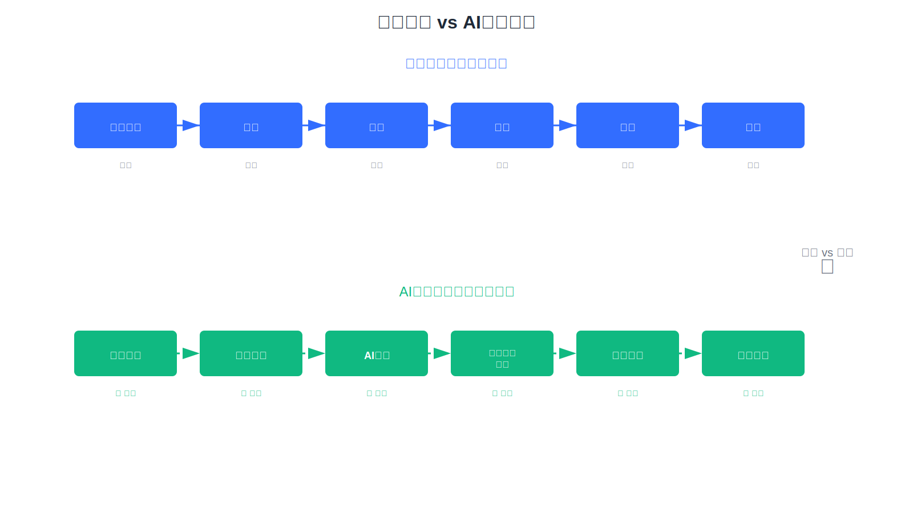

McKinsey 2025年1月报告显示，只有1%的企业领导者认为其公司在AI部署上达到"成熟"水平。Gartner数据更触目惊心：52%的AI项目从未从原型进入生产环境，至少30%的生成式AI项目将在概念验证阶段被放弃。

更残酷的是，即使在高成熟度组织中，也只有45%的AI项目能持续运行3年以上；而在低成熟度组织中，这个比例更是降至20%。数十亿美元的投资正在打水漂，这不是个案，而是整个行业的困局。

我们正在见证软件工程的第三次范式革命，而99%的企业还在用旧地图走新路。

**这篇文章会告诉你，AI规模化为什么这么难，以及如何破局**。

<!--truncate-->

## 四大死结：为什么AI难以规模化？

### 01 天然复杂性：从"记录"到"执行"的范式跃迁

传统企业应用是什么？是逻辑相对固定的事务记录系统。

你的ERP、CRM、OA，本质上都是在记录数据——通过CRUD操作管理信息，真正的事务执行还是靠人完成。这套体系运转了30年，开发范式早已成熟。

**但生产级AI应用彻底不同**。

它的本质是"做事"的事务执行系统，需要AI来判断、规划、执行事务。这不是改进，是范式跃迁。

根据McKinsey的研究，AI应用的复杂度是传统应用的3-5倍。

AI应用的功能边界难以预先规划，需要边用边改、快速反馈、快速迭代。更要命的是，大模型幻觉导致AI执行时必须有人的干预和校正机制。

**想要基于旧的开发范式、在旧的应用架构上解决AI应用的复杂度问题？方向就错了**。

这就像用马车的思维去理解汽车，用汽车的思维去理解飞机。

### 02 定制化陷阱：通用产品在企业场景必然失效

表面上看，AI应该让软件更加通用、更加智能。

实际上恰恰相反。

企业的业务流程、规则、数据和知识存在显著差异。即使是同行业的不同企业，因管理理念、组织架构、业务重点各不相同，工作流程方法也必然不同。

行业内不乏这样的案例：企业采购通用AI产品用于库存管理、需求预测等场景，却发现系统无法理解企业特有的促销策略、区域差异、供应商关系等复杂因素，最终效果远低于预期。

**这决定了通用AI产品在企业场景中必然失效，定制开发是唯一选择**。

McKinsey的数据印证了这一点：在服务运营、财务等职能层面，只有约11%的公司在规模化使用GenAI。在北美和欧洲大型公司的调查中，真正实现规模化的仅约3%。

AI应用的定制开发，意味着你需要投入资源将企业知识资产通过建模让AI理解和利用。

这不是简单的系统集成或配置工作，而是需要：

- 深入业务场景，理解复杂的业务逻辑
- 将企业知识资产转化为AI可理解、可使用的数据和知识
- 将AI助理嵌入到具体的业务操作流程中
- 建立人机协同的工作模式

每一步都需要大量时间和专业能力。

### 03 成本黑洞：人才稀缺与试错周期的双重困境

定制开发听起来可行，但现实是残酷的。

根据IDC数据，全球AI工程人才缺口超过50万。**你想招一个能做生产级AI应用的人？** 凤毛麟角！这种能力需要时间和实战打磨，不是培训班能速成的。

**成本有多高？**

- 平均试错成本：200-500万人民币
- 平均开发周期：8-12个月
- 首次上线可用性：不到50%

类似的教训在行业内并不罕见：企业投入数百万开发智能质检、风险预测等AI系统，经历漫长的开发周期后，系统可用性却远低于预期，一线员工拒绝使用。不得不推倒重来，再次投入大量资源。

更可怕的是技术选型和架构设计的坑。很多团队用传统Web应用的架构思维去做AI应用，导致系统难以扩展和演进。等发现问题时，已经投入了太多，推倒重来成本更高。

**居高不下的试错成本和漫长的开发周期，进一步打击了企业推进AI应用落地的信心**。

这是一个恶性循环：失败导致谨慎，谨慎导致投入不足，投入不足导致更多失败。

### 04 工程真空：缺失的AI原生开发方法论

数据、算力、算法等AI基础设施已经相当成熟。

但配套的应用工程技术却仍处于探索阶段，缺乏成熟的开发方法论。

这就像有了引擎、有了燃料，却没有造飞机的图纸和工艺标准。每个人都在摸着石头过河，重复踩坑。

**LangChain等技术实现层框架虽然降低了AI功能开发的门槛，但无法解决根本问题：**

它们只是提供了调用大模型的便捷方式，却无法解决AI与企业信息系统的深度集成问题。

开发人员需要为每个系统模块单独适配AI调用能力——一个模块一个模块地写代码、调试、维护。工作量和集成复杂度居高不下，维护成本难以控制。

根据Forrester的调研，企业平均使用7-12个不同的AI技术栈和工具，彼此之间缺乏统一标准和协议。这种技术碎片化进一步加剧了开发和维护的复杂度。

**行业需要的不是更多的轮子，而是标准化的生产线**。

---

从天然复杂性到定制化陷阱，从成本黑洞到工程真空，这四大死结相互交织、层层递进，共同构成了AI规模化应用的根本障碍。

它们不是孤立的问题，而是系统性困境。

## 破局之道：AI原生工程体系的崛起

问题已经清晰，答案也逐渐浮现。

行业需要的不是简单的工具拼凑，而是一套完整的AI原生应用工程体系——**既要有统一的技术协议，又要有配套的开发方法论来指导实践，还要有成熟的工具链来降低开发和维护成本**。

这不是某一家公司能独自完成的使命，而是整个行业必须共同面对的挑战。

**JitAi正在做的，是定义这个新范式的基础设施**。

通过定义JAAP（JitAi AI Application Protocol）并提供配套的开发框架、开发工具和运维管理工具，系统性地解决AI规模化应用的工程技术问题。

更重要的是，为行业提供生产级AI应用开发方法论。

生产级AI应用的本质是什么？

- AI对传统软件模块的感知、驱动和编排
- AI与人类基于UI的无缝协同
- AI对企业私有数据、知识和特有业务模型的深度理解与使用

因此，AI原生应用架构必须具备：

- 统一的模块感知机制（让AI知道系统有什么）
- 统一的驱动机制（让AI能调用和编排）
- 统一的热加载机制（让AI能快速适应变化）
- 规范化的系统建模（降低应用层复杂度）

这就是JAAP协议要解决的核心问题。

## 软件工程新旧范式分水岭

软件工程正在经历第三次重大变迁。

第一次，高级语言让开发从面向机器转向面向人类思维。第二次，互联网和云计算让软件从本地工具变成连接世界的基础设施。第三次，AI让软件从执行预定义规则，变成理解意图、自主决策的智能体。

**这不是技术的渐进式改良，而是开发范式的根本性重构**。

那些率先掌握AI原生开发能力的企业，将在未来3-5年获得巨大的竞争优势。那些还在用旧范式做AI应用的企业，会发现自己投入越来越多，却离成功越来越远。
