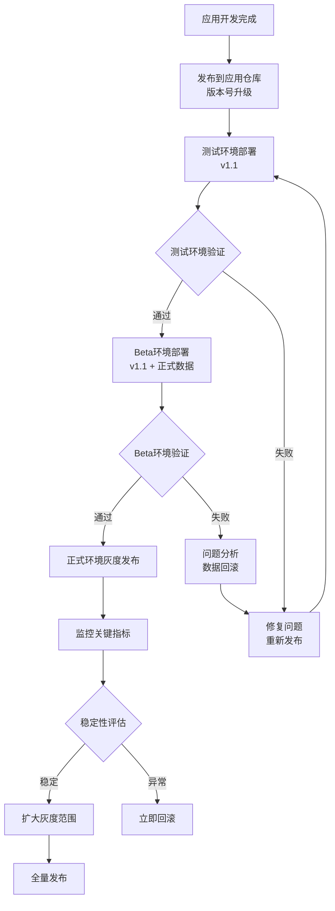
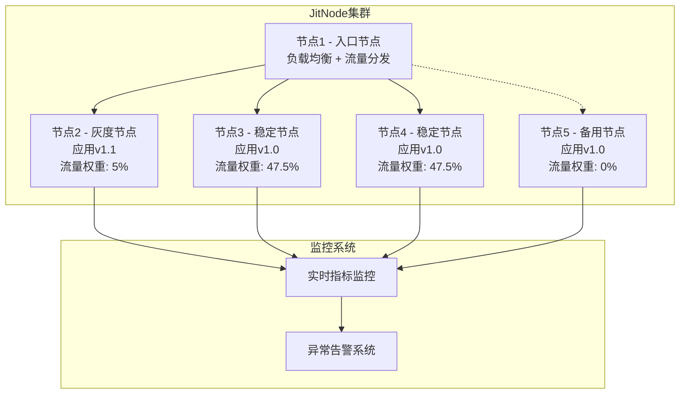
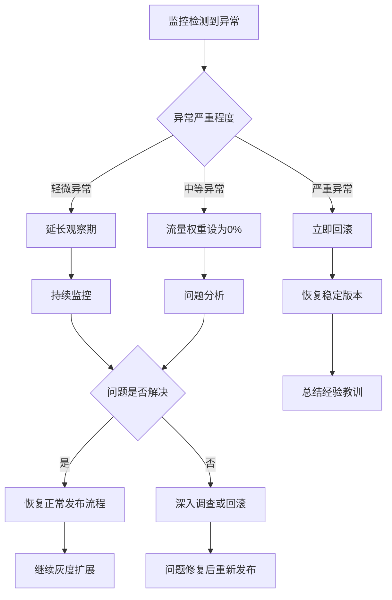

import Tabs from '@theme/Tabs';
import TabItem from '@theme/TabItem';

# 应用层稳定性保障
JitAi有能力支撑行业主流和领先的应用层稳定性保证措施。

应用层更新具有**影响范围相对局部、更新频率较高、用户体验敏感**的特点，需要在保证稳定性的同时支持快速迭代。

:::tip 
- 🎯 **局部影响**：单个或少数应用更新，风险可控
- ⚡ **快速迭代**：支持频繁更新，响应业务需求  
- 👤 **用户控制**：用户可选择升级时机，降低强制升级风险
- 🔄 **独立部署**：不影响其他应用运行，故障隔离
:::

## 渐进式验证流程 {#progressive-validation-process}

### 多运行环境 {#multiple-runtime-environments}

在JitAi运维平台创建多个运行环境，采用**测试环境 → Beta环境 → 正式环境**的渐进式验证流程：



### 环境配置策略 {#environment-configuration-strategy}

<Tabs>
<TabItem value="test" label="🧪 测试环境" default>

:::info 测试环境配置
**功能定位**：功能验证和基础性能测试

🔧 **环境特征**
- **数据源**：模拟数据或脱敏数据
- **流量来源**：测试团队和开发人员
- **资源配置**：中等规模，满足功能测试需求

✅ **验证重点**
- 业务逻辑正确性验证
- 用户界面和交互体验测试
- 基础性能和响应时间测试
- 与其他系统的集成功能测试
:::

</TabItem>
<TabItem value="beta" label="🚀 Beta环境">

:::info Beta环境配置  
**功能定位**：真实环境验证，连接正式环境数据

🔧 **环境特征**
- **数据源**：正式环境数据（只读模式或副本）
- **流量来源**：内部用户和少量外部用户
- **资源配置**：接近生产环境规模

✅ **验证重点**
- 真实数据的兼容性验证
- 生产级性能和稳定性测试
- 完整业务流程的端到端验证
- 数据安全性和一致性检查
:::

</TabItem>
<TabItem value="prod" label="🌐 正式环境">

:::info 正式环境配置
**功能定位**：生产服务，服务真实用户

🔧 **环境特征**
- **数据源**：生产数据
- **流量来源**：全量用户流量
- **资源配置**：生产级资源配置

✅ **验证重点**
- 系统整体稳定性监控
- 用户体验和满意度指标
- 业务关键指标监控
- 7x24小时可用性保障
:::

</TabItem>
</Tabs>

### 版本管理与发布策略 {#version-management-and-release-strategy}

| 发布阶段 | 版本状态 | 验证周期 | 通过标准 | 失败处理 |
|---------|---------|---------|---------|---------|
| **应用仓库** | 开发完成版本 | 代码审查 | 代码规范 + 功能完整性 | 重新开发修复 |
| **测试环境** | 功能测试版本 | 1-2天 | 功能正确性 + 基础性能 | 回到开发阶段 |
| **Beta环境** | 准生产版本 | 3-5天 | 真实数据兼容 + 生产性能 | 数据问题分析 |
| **正式环境** | 生产版本 | 持续监控 | 稳定性指标 + 用户体验 | 灰度回滚 |

## 灰度发布机制 {#canary-release-mechanism}

### 节点级灰度发布 {#node-level-canary-release}

在JitAi集群架构中，其中一个JitNode节点承担负载均衡器角色，负责流量分发控制。运行环境入口地址就是解析到该节点。



### 灰度发布流程控制 {#controlling-canary-release-process}

#### 稳定性与可用性双重评估 {#assessing-stability-and-availability}

灰度发布需要同时评估**稳定性**和**可用性**两个维度：

- **稳定性**：系统运行的错误率、响应时间等技术指标
- **可用性**：业务功能的正常服务能力、用户体验指标

| 灰度阶段 | 灰度节点数 | 流量比例 | 观察期 | 稳定性标准 | 可用性标准 | 异常处理 |
|---------|----------|---------|--------|----------|----------|----------|
| **初始灰度** | 1个节点 | 5% | 2小时 | 错误率 &lt; 0.01% | 业务可用性 &gt; 99.9% | 流量权重设为0% |
| **小规模扩展** | 2个节点 | 20% | 4小时 | 错误率 &lt; 0.005% | 业务可用性 &gt; 99.95% | 流量权重设为0% |
| **中等规模** | 50%节点 | 50% | 8小时 | 错误率 &lt; 0.001% | 业务可用性 &gt; 99.98% | 立即回滚或流量设为0% |
| **全量发布** | 全部节点 | 100% | 持续监控 | 系统稳定 | 业务正常 | 紧急回滚 |

:::tip 灰度节点流量归零机制
当灰度节点表现异常时，可以**立即将其流量权重设置为0%**，实现秒级故障隔离：
- 🚨 **即时响应**：无需等待回滚部署，直接切断异常节点流量
- 🛡️ **用户保护**：确保用户请求不会路由到异常节点
- 🔄 **快速恢复**：问题修复后可快速恢复该节点的流量分配
- 📊 **数据保留**：节点继续运行，便于问题分析和调试
:::

### 灰度发布操作流程 {#operating-canary-release-process}

**标准发布流程：**

1. **选择灰度节点**：选择1个节点作为初始灰度节点
2. **调整流量权重**：将该节点流量权重调整为5%
3. **部署新版本**：在灰度节点上部署新版本应用
4. **启动监控**：开启全方位监控和告警
5. **双重评估**：同时评估稳定性和可用性指标
6. **决策执行**：根据评估结果决定下一步操作
7. **逐步扩展**：稳定后逐步增加灰度节点和流量比例
8. **完成发布**：所有节点升级完成，恢复正常流量分发

**异常处理流程：**



**流量归零操作步骤：**

1. **异常检测**：监控系统检测到稳定性或可用性指标异常
2. **即时隔离**：将灰度节点流量权重设置为0%（耗时 &lt; 10秒）
3. **状态确认**：确认用户流量已完全切换到稳定节点
4. **问题诊断**：在隔离状态下进行问题分析和调试
5. **修复验证**：问题修复后进行功能验证
6. **流量恢复**：验证通过后逐步恢复该节点的流量分配

## 可观测性 {#observability}

:::info
可观测性相关能力正在建设中，即将上线
:::

### OpenTelemetry及APM生态集成 {#integrating-with-opentelemetry-and-apm-ecosystem}

JitAi应用运行平台支持[OpenTelemetry](https://opentelemetry.io/)，这是可观测性领域的核心标准，在技术演进、生态整合和行业实践中具有不替代的地位。

```mermaid
graph TB
    subgraph "JitAi三层架构"
        subgraph "应用层"
            App1[业务应用A<br/>应用实例运行]
            App2[业务应用B<br/>应用实例运行]
        end
        
        subgraph "开发框架层"
            Framework[元素族类<br/>(运行平台不感知具体族类)]
        end
        
        subgraph "应用运行平台层"
            JAAP[JAAP协议引擎<br/>元素定义解析与生命周期管理]
            Runtime[运行时环境<br/>请求路由与沙箱环境管理]
        end
    end
    
    subgraph "OpenTelemetry SDK"
        Tracer[分布式追踪<br/>JAAP协议Spans]
        Metrics[架构层级指标<br/>元素生命周期计数]
        Logs[结构化日志<br/>JAAP协议事件]
    end
    
    subgraph "可观测性数据存储"
        Jaeger[Jaeger<br/>JAAP调用链存储]
        Prometheus[Prometheus<br/>JitAI架构指标]
        ES[Elasticsearch<br/>元素生命周期日志]
    end
    
    subgraph "可视化与分析"
        Grafana[Grafana Dashboard<br/>三层架构监控]
        JitAiConsole[极态运维平台<br/>内置APM控制台]
        AlertManager[告警系统<br/>JAAP异常告警]
    end
    
    subgraph "外部APM集成(可选)"
        Skywalking[SkyWalking<br/>Python Agent]
        Others[其他APM<br/>OpenTelemetry兼容]
    end
    
    %% 运行平台层到OpenTelemetry的连接
    App1 --> Tracer
    App2 --> Tracer
    Framework --> Tracer
    JAAP --> Tracer
    Runtime --> Tracer
    
    App1 --> Metrics
    App2 --> Metrics
    Framework --> Metrics
    JAAP --> Metrics
    Runtime --> Metrics
    
    App1 --> Logs
    Framework --> Logs
    JAAP --> Logs
    Runtime --> Logs
    
    %% OpenTelemetry到存储的连接
    Tracer --> Jaeger
    Metrics --> Prometheus
    Logs --> ES
    
    %% 存储到可视化的连接
    Jaeger --> Grafana
    Prometheus --> Grafana
    ES --> Grafana
    Jaeger --> JitAiConsole
    Prometheus --> JitAiConsole
    ES --> JitAiConsole
    
    %% 告警连接
    Prometheus --> AlertManager
    
    %% 外部APM集成
    Tracer -.-> Skywalking
    Metrics -.-> Skywalking
    Tracer -.-> Others
    Metrics -.-> Others
```
