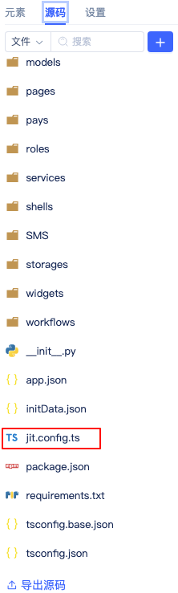
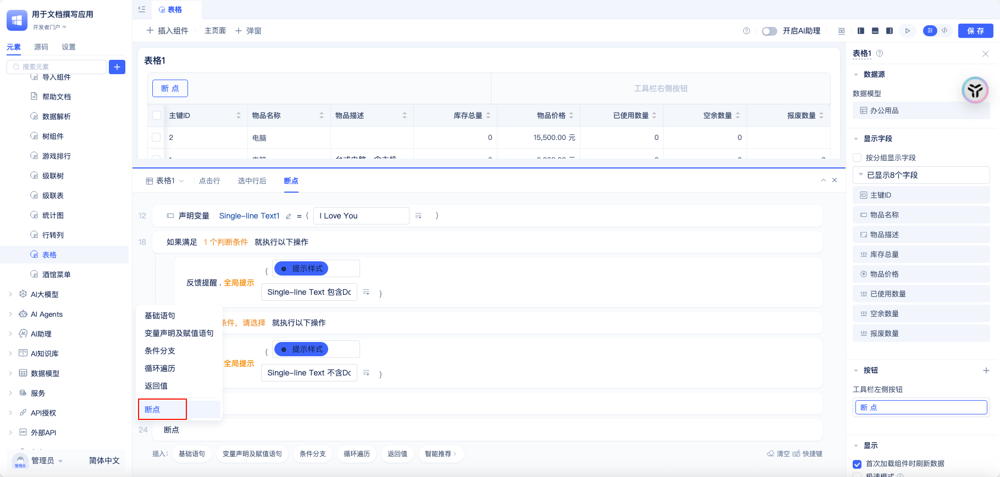
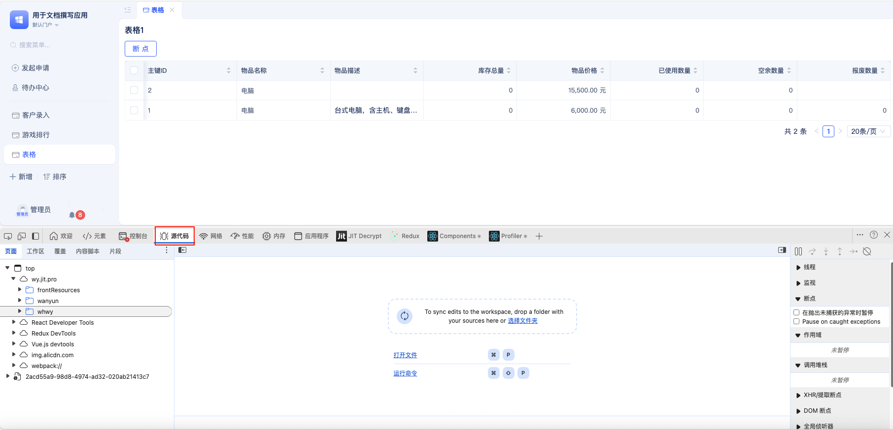
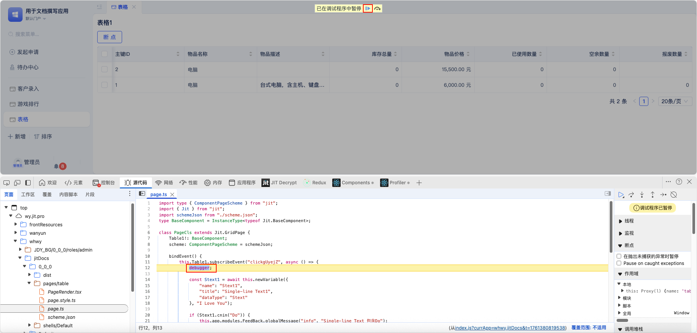
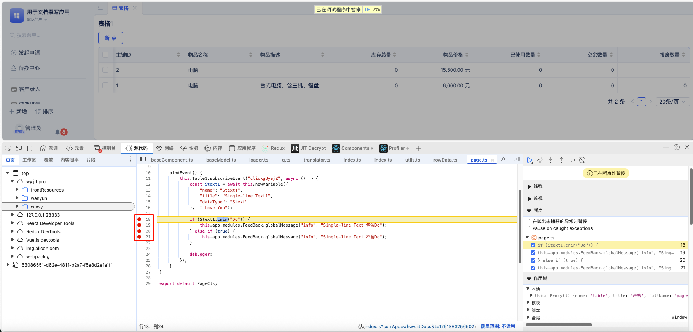
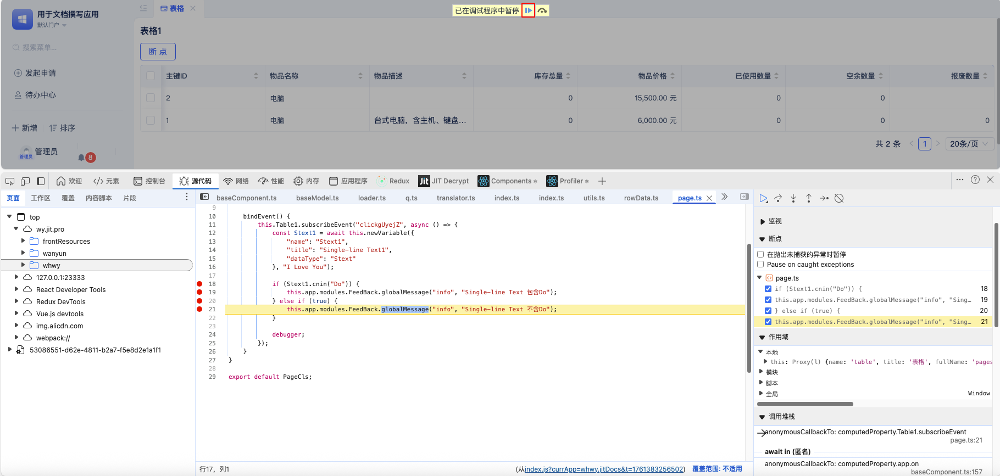
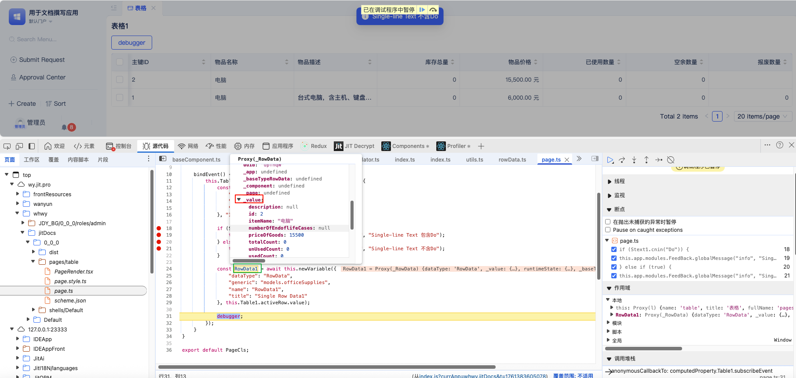
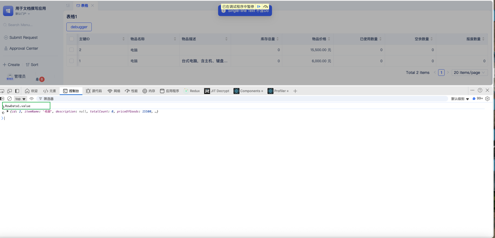

# 前端调试指南
## 使用场景

很多小伙伴在使用极态的时候,  经常会遇到自己写的事件没有按照预料情况执行， 这时候就需要前端调试来定位是哪里的问题。

## 一 准备工作 

1. 检查源码区有没有 jit.config.ts文件, 如果没有就新建,  文件名不能写错。




2. 配置如下， 关键行在于sourcemap参数

:::tip
inline  用于调试,   会稍微影响运行速度。
linked  会提高运行速度，调试完成后记得切换回linked模式。
:::


```typescript
import type { TlConfig } from "jit-builder";

export default {
  esBuildOptions: {
    // sourcemap: 'linked',
    sourcemap: 'inline',
  },
} as TlConfig;

```

## 二 调试步骤

### 开发区的事件中添加断点




### 使用区调试

打开使用区，进入需要调试的页面



按F12,打开浏览器的调试面板(最好使用chrome浏览器进行调试),会在底部弹出调试面板。




然后点击按钮触发事件




然后在判断语句下面， 点击行号， 增加红点断点



然后点击调试三角按钮， 让代码一步步往下走。



这时候， 把鼠标放到源代码的变量上， 就会出现代码的值的弹框。




也可以在调试的控制台中，把变量.value粘贴过去，然后按回车查看判断条件运行的结果。

通过以上的方法，可以查看事件在执行中每一步的变量值，发现问题所在。