# 模型性能优化

在处理大量数据或高并发场景时,合理使用数据模型的内置函数和优化策略可以显著提升应用性能。本文档将以**产品表**模型为例,介绍常见的性能优化技巧和最佳实践。

## 示例模型定义 {#example-model}

本文档所有示例代码都基于以下产品表模型:

```python
from models.NormalType import NormalModel
from datatypes.Meta import datatypes

class productTable(NormalModel):

    id = datatypes.AutoInt(name="id", title="主键ID", primaryKey=True, readOnly=1)
    productName = datatypes.Stext(title="产品名称", isAllowScan=False, name="productName")
    typeOfProduct = datatypes.Stext(title="产品型号", isAllowScan=False, name="typeOfProduct")
    productSpecifications = datatypes.Stext(title="产品规格", isAllowScan=False, name="productSpecifications")
    code = datatypes.Stext(title="码", isAllowScan=False, name="code")
    productEncoding = datatypes.Serial(title="产品编码", name="productEncoding", unique=True, 
                                        prefix="", connector="", dateTimeFormat="", 
                                        incNum=4, startNumber=1, fieldId="code", readOnly=1)
    f026 = datatypes.File(title="附件", maxCount=5, maxSize=20, selectedDown=False, 
                          selectedDelete=False, selectedDownUser=None, 
                          selectedDeleteUser=None, name="f026")
    number = datatypes.Numeric(title="数量", decimal=0, unit="", placeholder="", name="number")
    description = datatypes.RichText(title = "描述" , name = "description")
    f894 = datatypes.RelateData(title = "关联数据单选" , name = "f894" , relateType = "mto" , generic = "models.productTable" , relateField = "id" , relateFieldType = "AutoInt")

    class Meta:
        modelType = "NormalType"
        db = "databases.Default"
        dataTitle = "id"
        dbTable = "productTable"
        name = "productTable"
        baseModel = ""
        unionIndexList = []
        unionUniqueList = []
```


---

## 查询优化策略 {#query-optimization}

### 限制查询字段 {#limit-query-fields}

避免查询不必要的字段,特别是大字段（如附件字段 `f026`、富文本字段 `description`）,可以显著减少数据传输量和处理时间。

#### 页面示例 {#limit-query-fields-page-example}

**❌ 错误示例:** 查询时不设置字段列表，字段列表为空默认返回所有字段

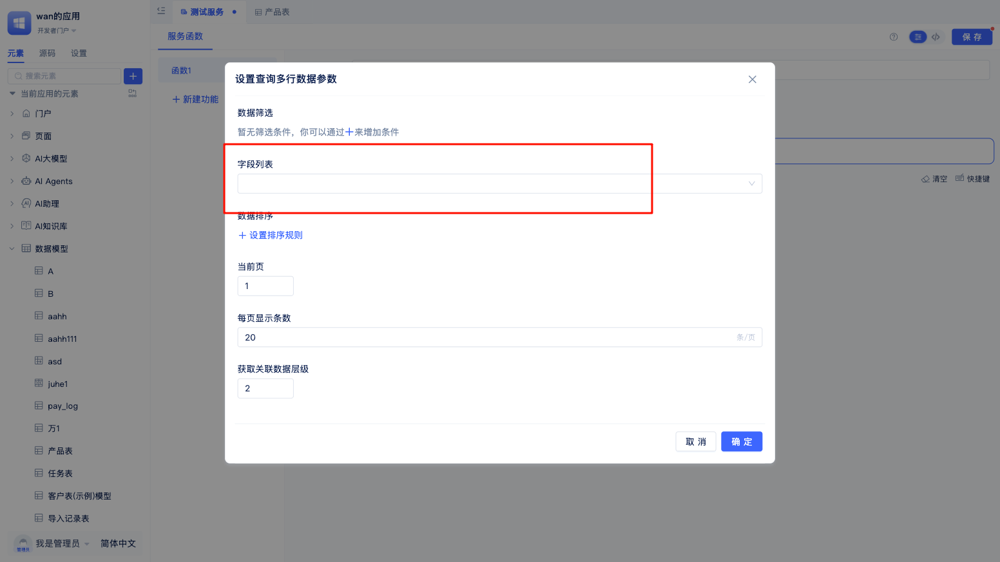

**✅ 正确示例:** 只选择需要的字段，排除附件和富文本

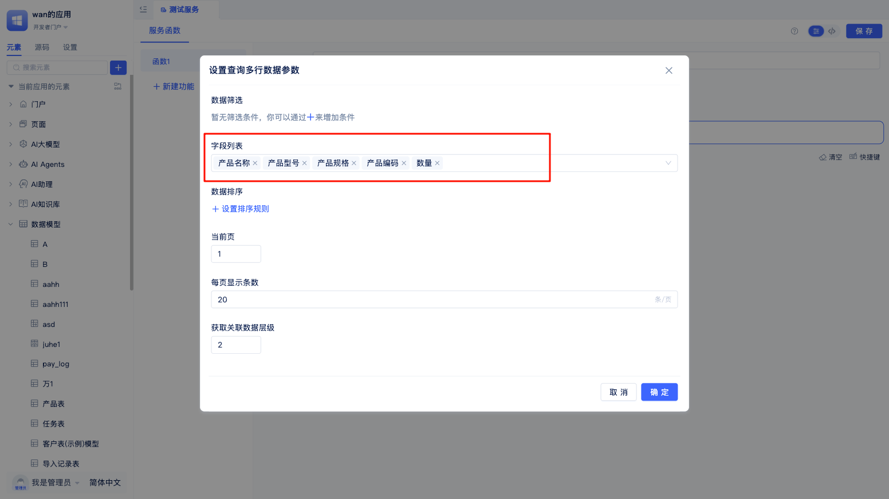

#### 源码示例 {#limit-query-fields-code-example}

**不推荐的做法:**
```python
# 获取产品表模型元素，查询所有字段（包含附件字段，数据量大）
productTable = app.getElement("models.productTable")
result = productTable.query(page=1, size=100)  # 返回所有字段包括附件
```

**推荐的做法:**
```python
# 获取产品表模型元素，只查询需要的字段
productTable = app.getElement("models.productTable")
result = productTable.query(
    fieldList=["id", "productName", "typeOfProduct", "productSpecifications", "number"],  # 排除附件和富文本字段
    page=1, 
    size=100
)
```

**性能提升:** 排除附件字段后,可减少 50%-80% 的数据传输量。

---

### 控制关联数据层级 {#control-relation-level}

模型查询时默认返回2层关联数据。如果不需要关联数据或只需要部分层级,可以通过 关联层级（`level`）参数控制。

#### 页面示例 {#control-relation-level-page-example}

**❌ 错误示例:** level设置过高（如3-5层），查询大量不需要的关联数据


**✅ 正确示例:** 根据实际需要设置level，不需要关联时设为0

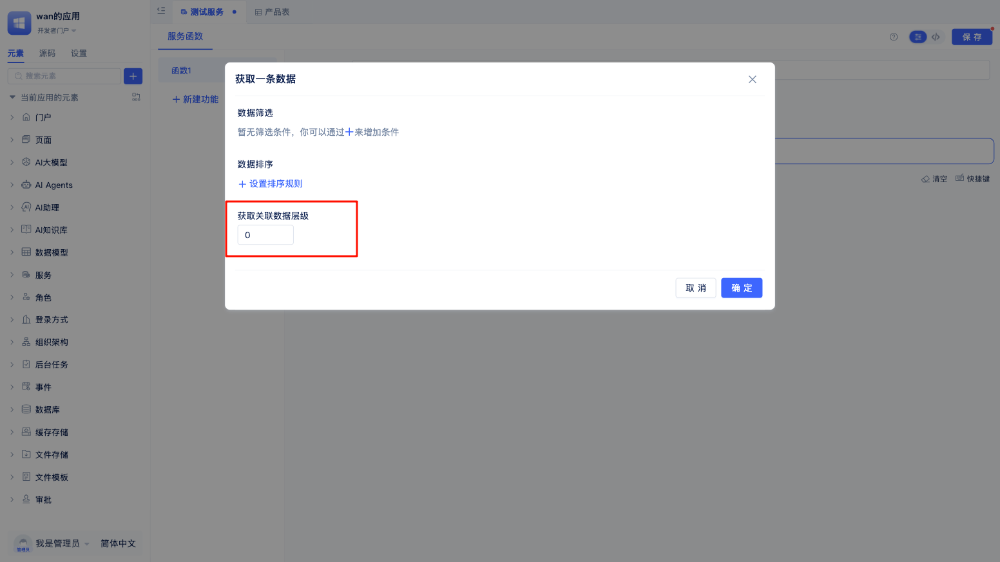

#### 源码示例 {#control-relation-level-code-example}

```python
# 获取产品表模型元素
productTable = app.getElement("models.productTable")

# 不查询关联数据（性能最优）
product = productTable.get("Q(id=1)", [], level=0)

# 只查询一层关联
product = productTable.get("Q(id=1)", [], level=1)

# 查询两层关联（默认值）
product = productTable.get("Q(id=1)", [], level=2)
```

:::warning 注意
`level` 参数最大值为5层。建议根据实际需求设置合理的层级,避免过度查询关联数据。
:::

**性能影响:** 每增加一层关联,查询时间可能增加 30%-100%。

---

### 合理使用分页 {#pagination-strategy}

分页查询时,合理设置每页大小可以平衡性能和用户体验。

#### 页面示例 {#pagination-strategy-page-example}

**❌ 错误示例:** 每页数量设置过大（如1000条以上）

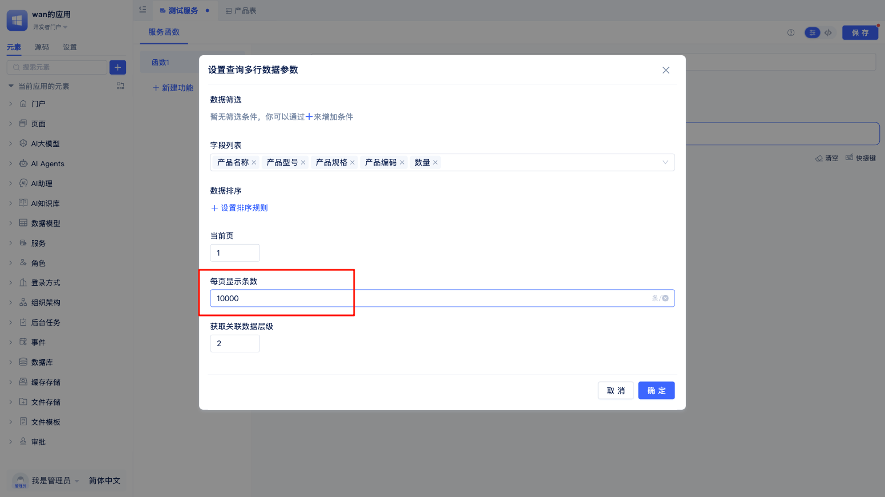

**✅ 正确示例:** 合理设置每页数量（20-50条）

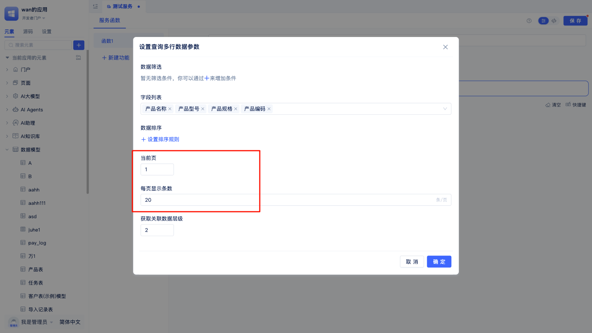

#### 源码示例 {#pagination-strategy-code-example}

```python
# 获取产品表模型元素
productTable = app.getElement("models.productTable")

# 列表页面: 推荐 20-50 条/页
result = productTable.query(page=1, size=20)

# 下拉选择框: 推荐 10-20 条/页
result = productTable.query(page=1, size=10)

# 避免过大的分页
# result = productTable.query(page=1, size=20000)  # ❌ 不推荐
```
---

### 优化筛选条件 {#optimize-filters}

使用索引字段作为筛选条件,避免复杂的嵌套条件。

#### 页面示例 {#optimize-filters-page-example}

**❌ 错误示例:** 使用模糊查询或未建索引的字段筛选

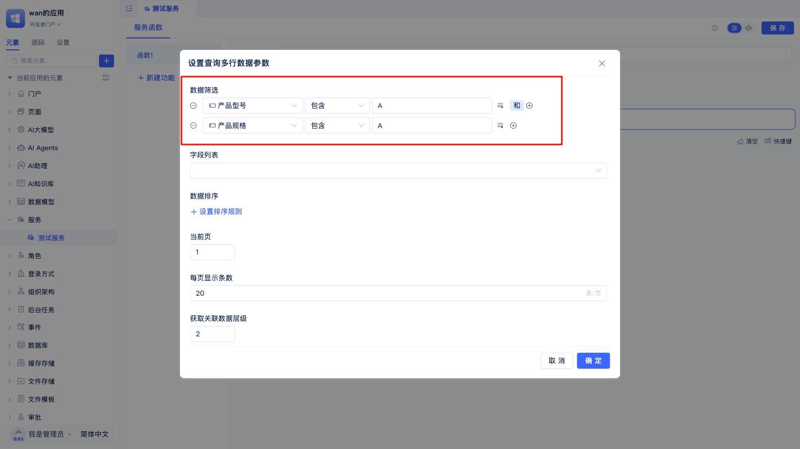

**✅ 正确示例:** 使用已建索引的字段进行精确筛选

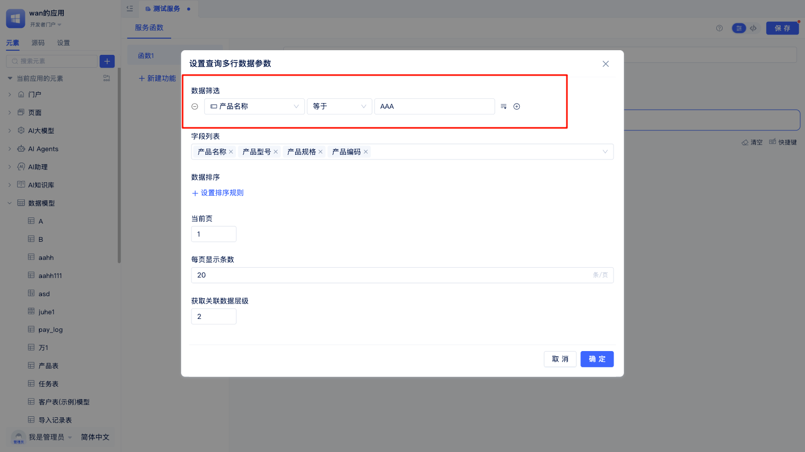

**✅ 正确示例:** 为常用筛选字段创建索引

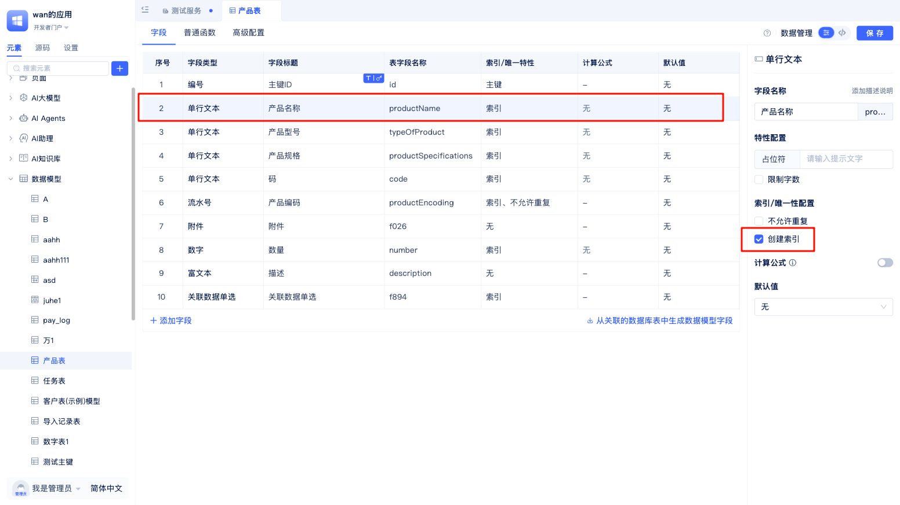

#### 源码示例 {#optimize-filters-code-example}

```python
# 获取产品表模型元素
productTable = app.getElement("models.productTable")

# ✅ 推荐: 使用索引字段筛选
result = productTable.query(
    filter="Q(productName='手机') & Q(number__gt=0)",  # productName 建议创建索引
    page=1, 
    size=20
)

# ❌ 避免: 在大表上使用 LIKE 模糊查询
# result = productTable.query(
#     filter="Q(productName__like='手')",  # 可能导致全表扫描
#     page=1, 
#     size=20
# )
```

:::tip 提示
为常用的筛选字段（如产品名称 `productName`、产品型号 `typeOfProduct`）创建索引可以大幅提升查询性能。参考 [配置表索引优化查询](data-table-model#configure-table-index-optimization)。
:::

---

## 批量操作优化 {#batch-operations}

### 批量创建数据 {#bulk-create}

批量创建产品数据时,使用批量函数比循环调用`新增数据`函数效率高得多。

#### 页面示例 {#bulk-create-page-example}

**❌ 错误示例:** 在循环中调用`新增数据`函数逐条创建

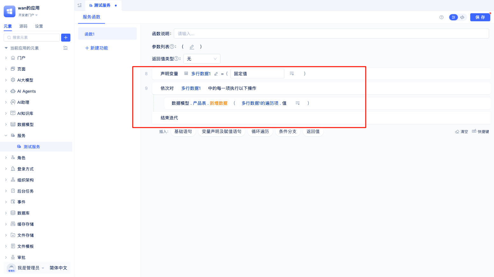

**✅ 正确示例:** 使用`批量新增或更新`函数

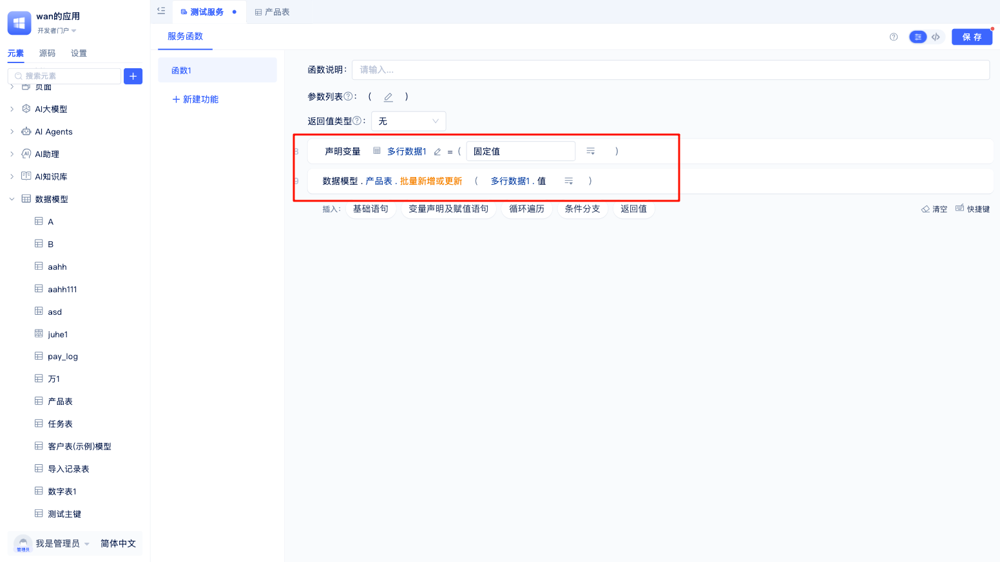

#### 源码示例 {#bulk-create-code-example}

**不推荐的做法:**
```python
# 获取产品表模型元素
productTable = app.getElement("models.productTable")

# ❌ 循环创建（慢）
product_list = [
    {"productName": "手机", "typeOfProduct": "P001", "number": 100},
    {"productName": "电脑", "typeOfProduct": "P002", "number": 50},
    {"productName": "平板", "typeOfProduct": "P003", "number": 80},
    # ... 更多产品
]

for product_data in product_list:
    productTable.create(product_data)  # 每次都是独立的数据库操作
```

**推荐的做法:**
```python
# 获取产品表模型元素
productTable = app.getElement("models.productTable")

# ✅ 批量创建（快）
product_list = [
    {"productName": "手机", "typeOfProduct": "P001", "number": 100},
    {"productName": "电脑", "typeOfProduct": "P002", "number": 50},
    {"productName": "平板", "typeOfProduct": "P003", "number": 80},
    # ... 更多产品
]

productTable.createOrUpdateMany(product_list)  # 一次批量操作
```
---

### 批量更新数据 {#bulk-update}

批量更新产品数据时,根据场景选择合适的函数。当需要将多条数据的**相同字段**更新为**相同的值**时,推荐使用`根据主键修改数据`或`按筛选条件更新数据`函数。

#### 页面示例 {#bulk-update-page-example}

**❌ 错误示例:** 在循环中调用`修改或新增`函数逐条更新

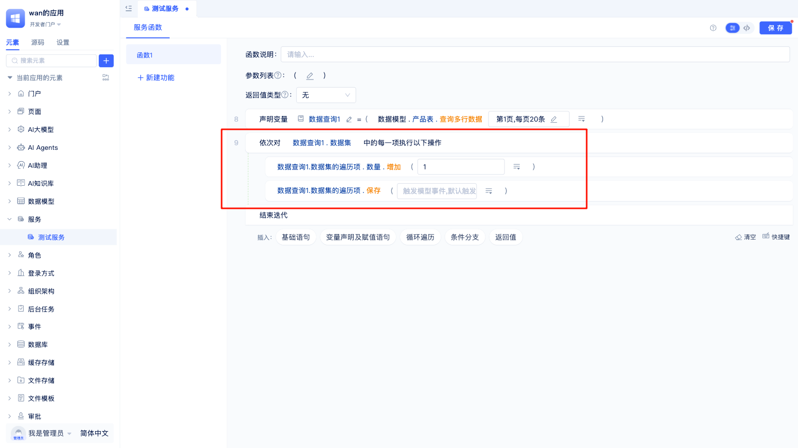

**✅ 正确示例:** 使用`根据主键修改数据`函数批量更新

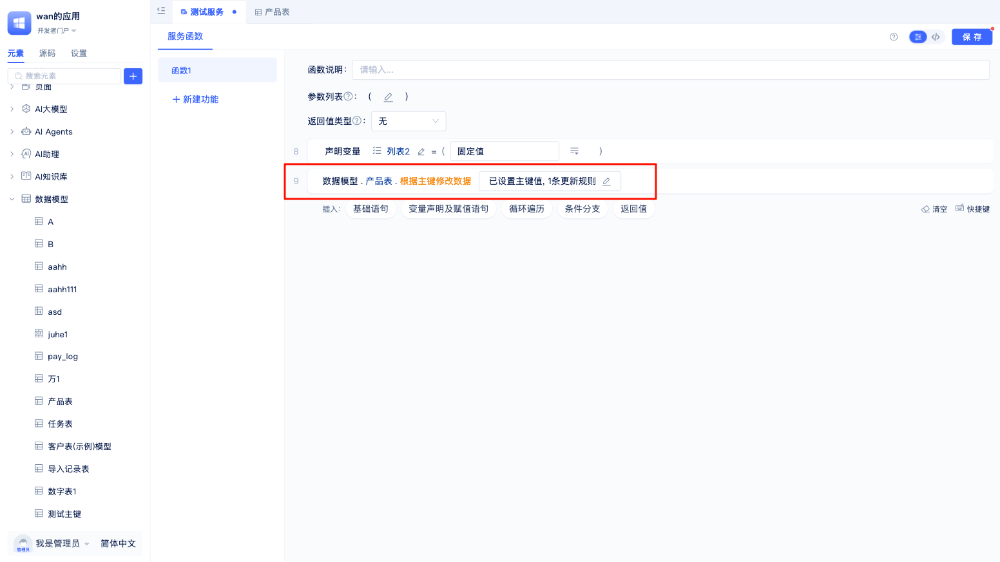

**✅ 正确示例:** 使用`按筛选条件更新数据`函数批量更新

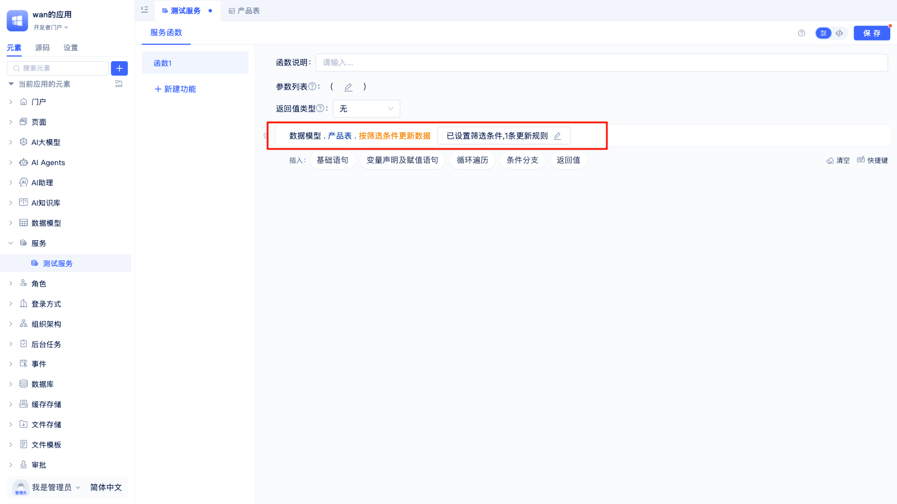

#### 源码示例 {#bulk-update-code-example}

```python
# 获取产品表模型元素
productTable = app.getElement("models.productTable")

# ✅ 方式1: 按主键批量更新（推荐）
productTable.updateByPK(
    [1, 2, 3, 4, 5],  # 产品ID列表
    {"number": 200}    # 更新数量为200
)

# ✅ 方式2: 按条件批量更新
productTable.updateByFilter(
    "Q(typeOfProduct='P001') & Q(number__lt=50)",  # 型号为P001且数量小于50的产品
    {"number": 100}  # 更新数量为100
)

# ❌ 避免: 循环更新
# for product_id in id_list:
#     product = productTable.get(f"Q(id={product_id})", [])
#     product["number"] = 200
#     productTable(**product).save()  # 慢
```

:::warning 注意
`按筛选条件更新数据`函数不会触发更新事件,如果需要触发事件,请使用`根据主键修改数据`函数。
:::

---

### 批量删除数据 {#bulk-delete}

批量删除产品数据时,使用批量函数可以提高效率。

#### 页面示例 {#bulk-delete-page-example}

**❌ 错误示例:** 在循环中调用`按筛选条件删除数据`函数逐条删除

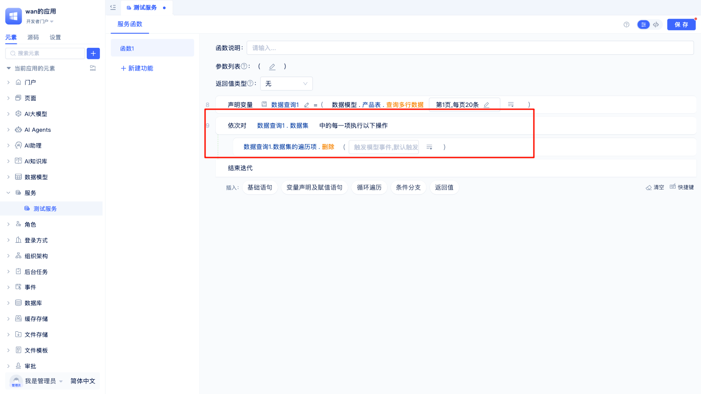

**✅ 正确示例:** 使用`根据主键删除数据`函数批量删除

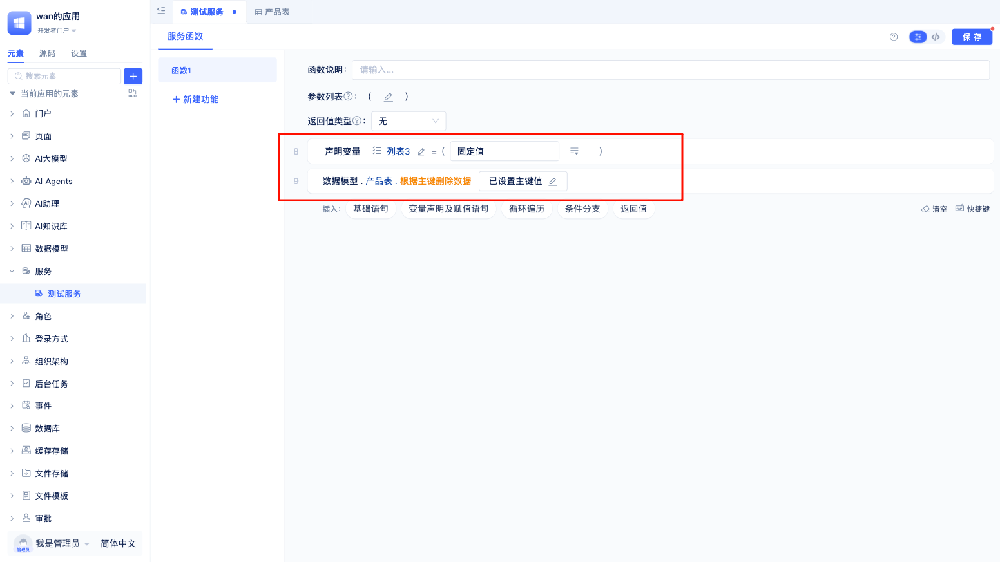

#### 源码示例 {#bulk-delete-code-example}

```python
# 获取产品表模型元素
productTable = app.getElement("models.productTable")

# ✅ 方式1: 按主键批量删除（推荐）
productTable.deleteByPK([1, 2, 3, 4, 5])  # 删除ID为1-5的产品

# ✅ 方式2: 按条件批量删除
productTable.deleteByFilter("Q(number=0)")  # 删除数量为0的产品

# ❌ 避免: 循环删除
# for product_id in id_list:
#     product = productTable.get(f"Q(id={product_id})", [])
#     productTable(**product).delete()  # 慢
```

---

### 大批量数据入库 {#bulk-import}

当需要导入或同步大批量数据（如1000条以上）时,选择合适的入库方法至关重要。系统提供了多种高性能的批量入库函数。

#### 页面示例 {#bulk-import-page-example}

**❌ 错误示例:** 使用`批量新增或更新`函数导入大批量数据（1000条以上）

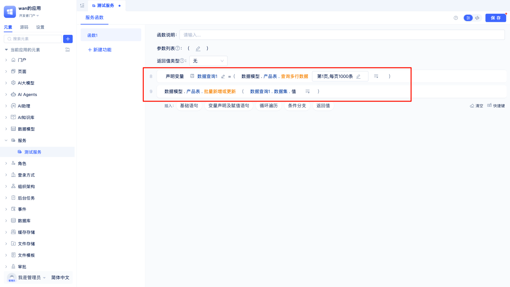

**✅ 正确示例:** 使用`批量导入或替换`函数高性能导入

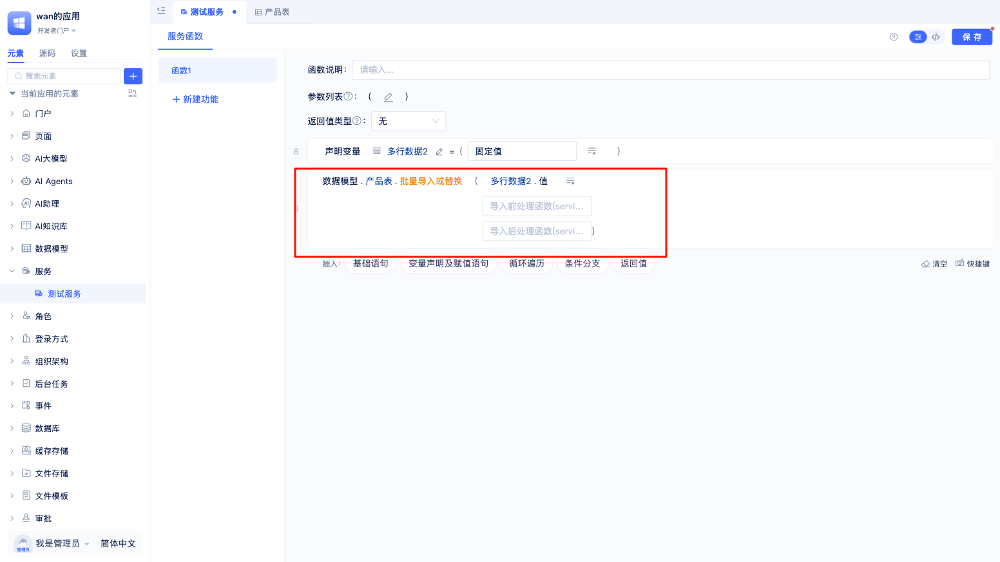

#### 源码示例 {#bulk-import-code-example}

```python
# 获取产品表模型元素
productTable = app.getElement("models.productTable")

# 准备产品数据
product_list = [
    {"productName": "手机", "typeOfProduct": "P001", "productSpecifications": "6.1寸", "number": 100},
    {"productName": "电脑", "typeOfProduct": "P002", "productSpecifications": "15.6寸", "number": 50},
    # ... 更多产品数据
]

# 场景1: 纯新增数据（推荐用于初始化数据）
productTable.queryset.insertImport(product_list, checkPkDuplicate=True)

# 场景2: 新增或更新（有主键更新,无主键新增）
productTable.queryset.insertUpdateImport(product_list)

# 场景3: 带前置/后置处理的导入
productTable.insertUpdateImport(
    product_list,
    importBeforeFunc="services.ProductService.beforeImport",
    importAfterFunc="services.ProductService.afterImport"
)
```

:::tip 提示
`批量导入或替换`接口不会触发模型事件，适合大批量数据初始化或同步场景。如果业务需要触发事件，请使用`批量新增或更新`函数。
:::

---

## 事件控制优化 {#event-control}

### 跳过事件触发 {#skip-events}

在批量操作或数据导入场景中,可以通过 `triggerEvent=0` 跳过事件触发,显著提升性能。

#### 页面示例 {#skip-events-page-example}

**❌ 错误示例:** 批量操作时triggerEvent=1，每条数据都触发事件

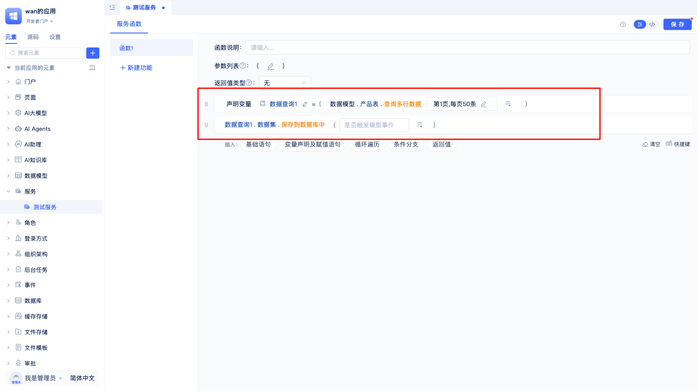

**✅ 正确示例:** 批量操作时triggerEvent=0，跳过事件触发


#### 源码示例 {#skip-events-code-example}

```python
# 获取产品表模型元素
productTable = app.getElement("models.productTable")

# 批量创建时跳过事件
product_list = [
    {"productName": "手机", "typeOfProduct": "P001", "number": 100},
    {"productName": "电脑", "typeOfProduct": "P002", "number": 50},
]
productTable.createOrUpdateMany(product_list, triggerEvent=0)

# 批量更新时跳过事件
productTable.updateByPK([1, 2, 3], {"number": 200}, triggerEvent=0)

# 批量删除时跳过事件
productTable.deleteByPK([1, 2, 3], triggerEvent=0)
```

**性能提升:** 跳过事件触发可以减少 20%-50% 的执行时间。

:::warning 注意事项
跳过事件触发意味着:
- 不会触发模型的前置/后置事件
- 不会记录数据历史
- 关联的业务逻辑不会执行

请确保这些副作用符合业务需求。
:::

---

## 聚合统计优化 {#aggregation-optimization}

在需要对数据进行统计分析时（如求和、计数、平均值等），使用模型内置的聚合函数比查询全部数据后在代码中计算效率高得多。聚合计算直接在数据库层面完成，避免了大量数据的传输和内存占用。

### 单字段聚合计算 {#single-field-aggregate}

使用`统计`函数对单个字段进行聚合计算，支持求和、平均值、最大值、最小值、计数等聚合类型。

#### 页面示例 {#single-field-aggregate-page-example}

**❌ 错误示例:** 先查询全部数据，再在代码中循环计算统计值


**✅ 正确示例:** 使用`统计`函数直接在数据库计算

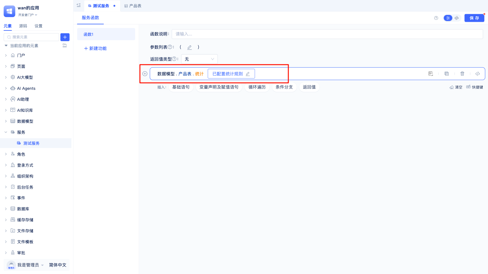

#### 源码示例 {#single-field-aggregate-code-example}

```python
# 获取产品表模型元素
productTable = app.getElement("models.productTable")

# 计算所有产品的总数量
total_quantity = productTable.aggregate(
    "Q(number__gt=0)",  # 筛选条件（可为空字符串表示无条件）
    "number",           # 字段名
    "SUM"               # 聚合类型: SUM/AVG/MAX/MIN/COUNT
)
print(f"产品总数量: {total_quantity}")

# 计算平均数量
avg_quantity = productTable.aggregate(
    "",          # 无筛选条件
    "number",    # 字段名
    "AVG"        # 聚合类型
)
print(f"平均数量: {avg_quantity}")

# 统计产品数量
product_count = productTable.aggregate(
    "",
    "id",
    "COUNT"
)
print(f"产品总数: {product_count}")
```

---

### 多表聚合查询（使用数据集） {#multi-table-aggregate-dataset}

当业务场景涉及多个数据表的联合查询和聚合计算时，在代码中分别查询各个表再进行关联计算会导致性能低下。此时推荐使用**数据集（Dataset）**功能，在数据库层面完成多表关联和聚合计算。

#### 适用场景 {#dataset-use-cases}

- 多表关联统计报表（如：订单表+产品表+客户表联合统计）
- 跨表数据汇总（如：统计各产品类型的销售总额）
- 复杂的分组聚合查询（如：按客户分组统计产品数量和金额）

#### 页面示例 {#dataset-page-example}
下面是获取某产品名称对应的订单总金额的示例。

**❌ 错误示例:** 在代码中分别查询多个表，手动进行数据关联和计算

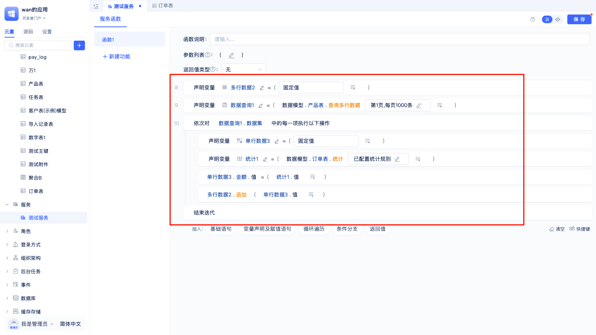

**✅ 正确示例:** 使用数据集配置多表关联，直接查询聚合结果


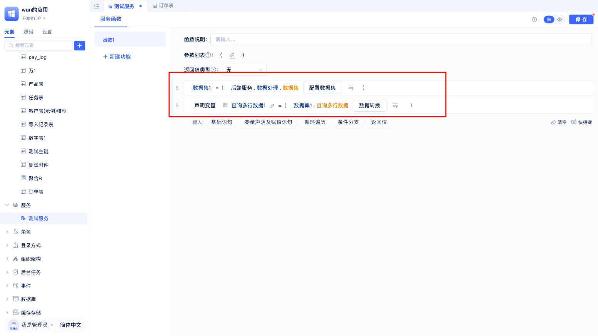

---

## 性能优化总结 {#optimization-checklist}

**查询优化:**
- ✅ 只查询需要的字段，排除附件、富文本等大字段
- ✅ 控制关联层级，不需要关联数据时level=0
- ✅ 为常用筛选字段创建索引
- ✅ 合理设置分页大小(20-50条/页)

**批量操作:**
- ✅ 批量新增用批量函数，避免循环单条创建
- ✅ 批量更新用批量函数，避免循环单条更新
- ✅ 批量删除用批量函数，避免循环单条删除
- ✅ 大批量数据入库用高性能导入函数

**事件控制:**
- ✅ 批量操作时可跳过事件触发
- ✅ 了解跳过事件的业务影响

**聚合统计:**
- ✅ 统计计算用聚合函数，避免查询后再计算
---

## 实战案例 {#case-studies}

### 案例1: 产品列表查询优化 {#case-product-list}

**❌ 错误示例:** 查询所有字段、高关联层级、大分页

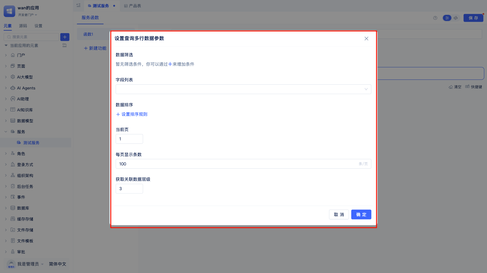

**✅ 正确示例:** 只查询需要的字段，level=0，size=20

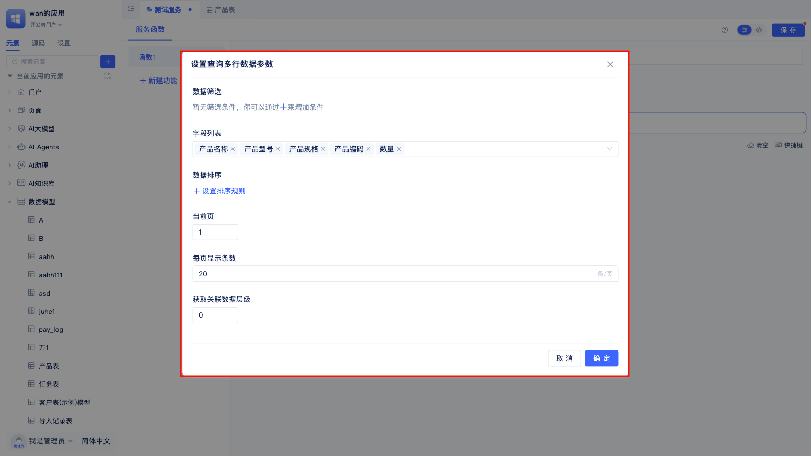

**场景描述:**
产品列表页面加载缓慢,每次查询耗时3-5秒。

**问题分析:**
- 查询了所有字段包括附件字段 `f026`与富文本字段 `description`
- 加载了3层关联数据
- 每页显示100条数据

#### 源码示例 {#case-product-list-code-example}

**优化前代码:**
```python
# 获取产品表模型元素
productTable = app.getElement("models.productTable")

result = productTable.query(
    filter="Q(number__gt=0)",
    page=1,
    size=100,   # 每页100条
    level=3     # 2层关联
)
```

**优化后代码:**
```python
# 获取产品表模型元素
productTable = app.getElement("models.productTable")

result = productTable.query(
    filter="Q(number__gt=0)",
    fieldList=[
        "id", "productName", "typeOfProduct", 
        "productSpecifications", "productEncoding", "number"
    ],  # 只查询列表页需要的字段
    page=1,
    size=20,    # 减少每页数量
    level=0     # 不加载关联
)
```
---

### 案例2: 产品库存批量更新优化 {#case-batch-update}

**场景描述:**
需要将1000个产品的库存数量增加100。

#### 页面示例 {#case-batch-update-page-example}

**❌ 错误示例:** 循环中调用save逐条更新

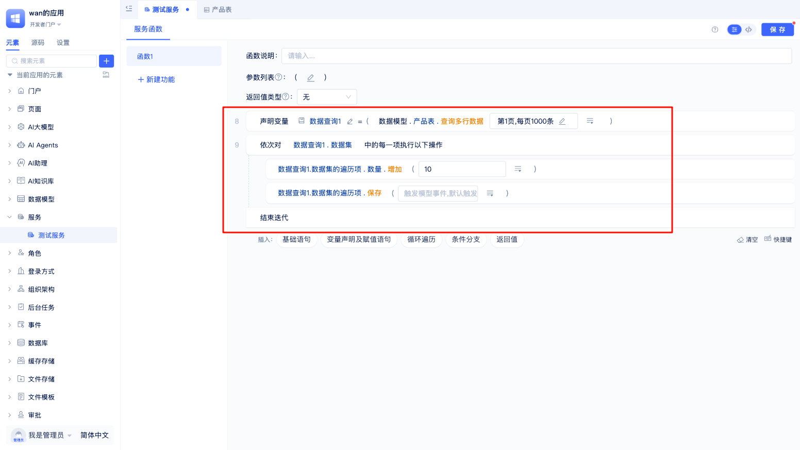

**✅ 正确示例:** 使用`根据主键修改数据`或`按筛选条件更新数据`函数批量更新


#### 源码示例 {#case-batch-update-code-example}

**优化前代码:**
```python
# 获取产品表模型元素
productTable = app.getElement("models.productTable")

# ❌ 先查询,再循环更新
products = productTable.query(
    filter="Q(typeOfProduct='P001')",
    page=1,
    size=1000
)

for product in products["rowDatas"]:
    product["number"] = product["number"] + 100
    productTable(**product).save()  # 每次独立事务
```

**优化后代码:**
```python
# 获取产品表模型元素
productTable = app.getElement("models.productTable")

# ✅ 方式1: 按条件批量更新（适合已知条件）
# 注意: updateByFilter 无法实现字段自增,需要设置固定值
productTable.updateByFilter(
    "Q(typeOfProduct='P001')",
    {"number": 200}  # 设置为固定值
)

# ✅ 方式2: 按主键批量更新（需要触发事件时）
# 先查询ID列表
products = productTable.query(
    filter="Q(typeOfProduct='P001')",
    fieldList=["id"],  # 只查询ID
    page=1,
    size=1000,
    level=0
)
product_ids = [p["id"] for p in products["rowDatas"]]

productTable.updateByPK(
    product_ids,
    {"number": 200},
    triggerEvent=0  # 不需要事件时跳过
)
```

**效果对比:**
- 优化前: ~30秒
- 优化后: ~2秒
- 性能提升: **93% ↑**

---

:::tip 总结
性能优化的核心原则:
1. **减少数据传输** - 使用`字段列表`参数排除附件等大字段
2. **批量操作** - 用`批量新增或更新`、`根据主键修改数据`函数代替循环调用
3. **合理控制** - 控制 `level` 层级、`size` 分页大小
4. **跳过事件** - 批量操作时使用 `triggerEvent=0`
5. **分批处理** - 大数据量操作分批进行(1000条/批)
6. **聚合统计** - 使用`统计`函数代替查询后计算
:::
