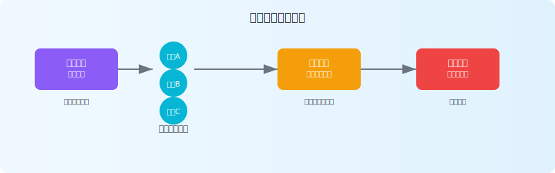

# 使用JitAi桌面版进行团队协作开发
## 桌面版开发流程（推荐）

1. **本地开发** → 使用 JitNode 桌面版（Windows/Mac）进行应用开发和调试（使用Git仓库管理源码）
2. **版本发布** → 开发完成后发布应用版本
3. **测试部署** → 在测试环境部署对应版本进行验证
4. **生产部署** → 测试通过后在生产环境部署该版本

## 服务器版协作流程

1. **开发节点** → 使用服务器版节点作为共享开发环境
2. **开发测试** → 业务人员分模块在线可视化搭建，即时生效即时测试
3. **生产发布** → 发布版本，并在生产环境部署该版本

:::warning 生产环境安全
虽然平台支持即改即生效，但强烈建议不要直接对生产环境进行修改，应严格按照开发→测试→生产的流程进行部署。
:::
