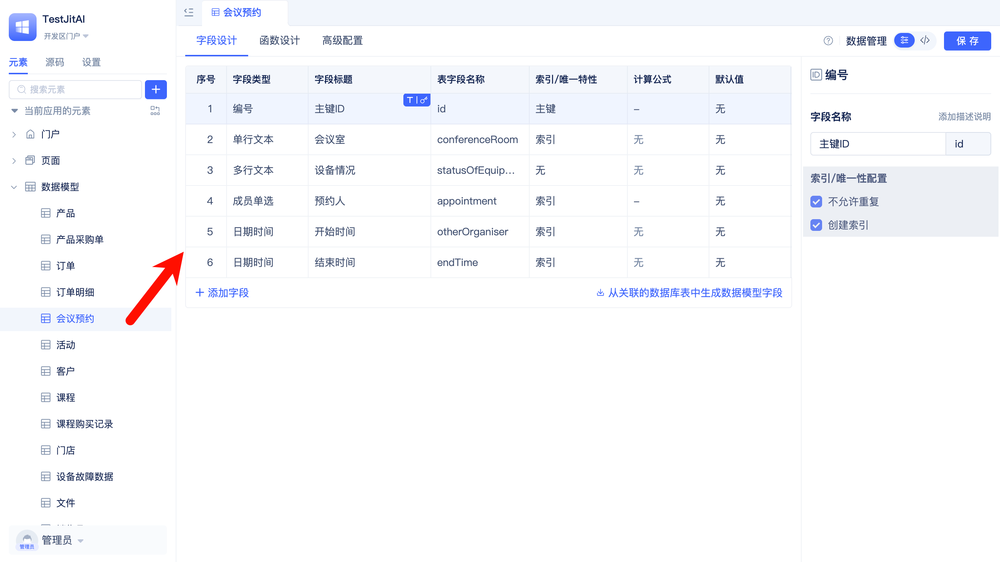
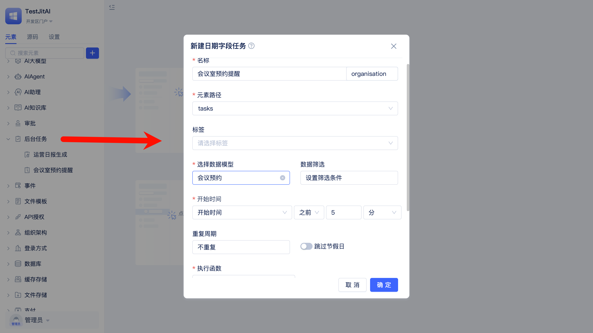
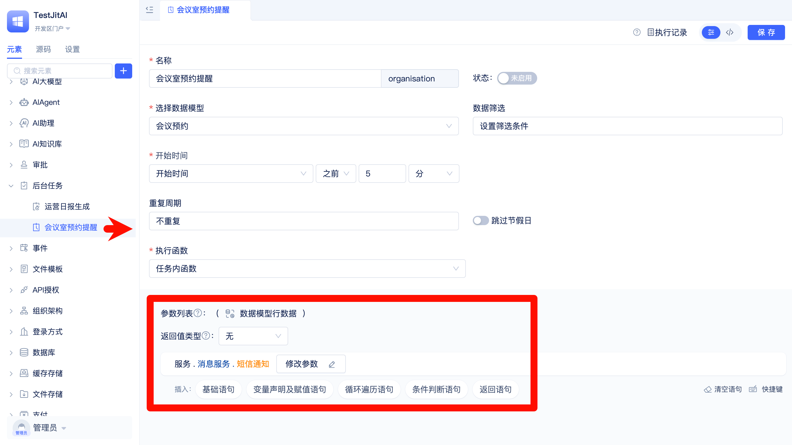

# 使用数据库表的时间字段触发定时任务
以会议预约为例，在会议开始前5分钟自动短信提醒预约人。

首先，你需要准备好`会议预约`数据模型，并添加开始时间字段，如图：

关于业务实体建模请参考[业务实体建模与数据分析](./business-entity-modeling-and-data-analysis)。

## 创建日期字段任务
在JitAi可视化开发工具中新建一个`日期字段任务`元素实例。

选择创建好的`会议预约`数据模型，开始时间使用模型的`开始时间`字段，设置为提前5分钟。

## 编写任务函数逻辑
编写任务逻辑：发送短信通知给预约人。

关于短信请参考[发送短信通知](./sending-sms-notifications)。