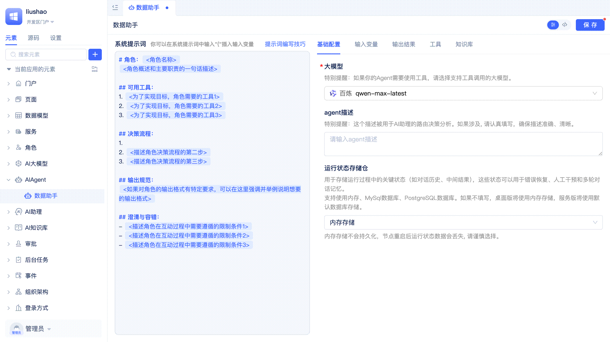
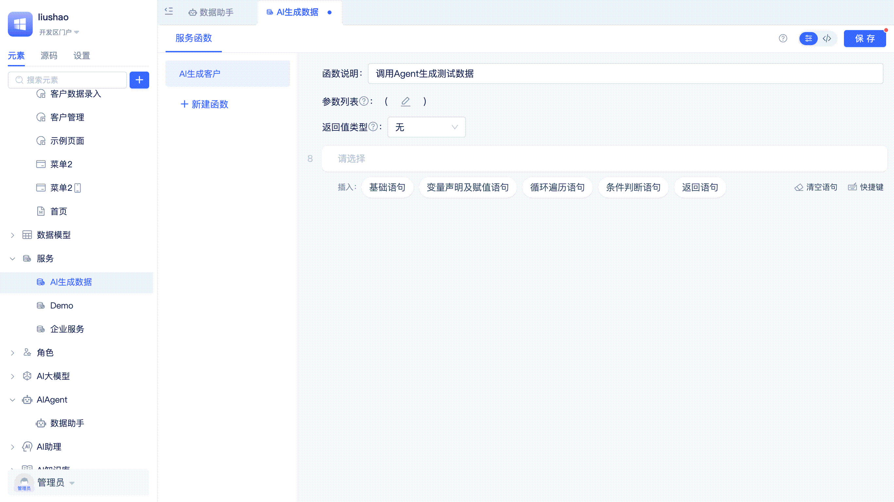

# Agent的输入与输出

Agent的输入输出配置是实现智能交互的关键环节。通过合理配置输入变量，Agent可以接收多样化的参数和上下文信息；通过定义输出结果格式，Agent可以返回结构化数据供程序逻辑使用；通过流式输出，可以实时获取Agent的运行状态和结果。本文将详细介绍这些配置方法和使用技巧。

## 配置输入变量 {#configuring-input-variables}
每个Agent被调用时都会接收一个默认的参数，即`用户输入`。开发者也可以自定义其它输入变量，并在系统提示词或程序逻辑中引用这些变量。

开发者在Agent可视化编辑器中切换到`输入变量`页签，点击`添加输入变量`按钮，在弹出的对话框中填写变量标题、选择变量数据类型，点击`确定`按钮即可。

输入变量支持单行文本、多行文本、数字、金额、字典等JitAi[数据类型](../../reference/framework/JitORM/data-types)及其配置项。

### 在提示词中使用变量 {#using-variables-in-prompts}
在调用Agent时，除了可以传递用户的输入内容，还可以动态传入变量。这些变量能够在提示词中被引用，实现更灵活的上下文定制和信息填充，使Agent能够根据实际业务场景动态调整行为和响应内容。

开发者在需要插入变量的地方输入`{`即可触发变量选择列表，单击对应的变量即可将其插入到提示词中，在Agent运行时会自动将变量替换为实际的值。

默认可以使用的变量仅有`用户输入`，但开发者可以在输入变量中进行添加。

## 配置输出结果 {#configuring-output-results}
Agent运行完成后默认会输出一个字典，字典中仅包括一个`output`文本字段。如果要在程序逻辑中调用Agent，或者在[AI助理](../ai-assistant/create-ai-assistant)中编排Agent和其它节点的流转关系，则Agent的输出结果需要是能够被程序逻辑解析的结构化数据，而不是仅有一段字符串。

开发者在Agent可视化编辑器中切换到`输出结果`页签，可以修改`output`字段的数据类型以及标题，也可以点击`添加输出结果`按钮添加新的输出字段。

输出结果会被自动转换为大模型能够准确理解的JSON Schema，并作为系统提示词的一部分发送给大模型服务。如果没有特别的要求，开发者就不需要在系统提示词中编写输出规范相关的内容了。

:::tip
每一个输出结果字段的标题和名称都需要仔细斟酌，做到见名知其意，以便大模型能正确理解。
:::

### 输出结果数据类型 {#output-result-data-types}
输出结果支持JitAi平台的各种[数据类型](../../reference/framework/JitORM/data-types)，包括：

- **单行文本**：适用于简短的文本输出，如标题、名称等
- **多行文本**：适用于较长的文本内容，如描述、总结等
- **数字**：适用于数值型结果，如计算结果、统计数据等
- **金额**：适用于货币相关的输出
- **字典**：适用于复杂的结构化数据输出
- **布尔值**：适用于是/否类型的判断结果
- **日期时间**：适用于时间相关的输出

选择合适的数据类型有助于大模型更准确地理解输出要求，并生成符合预期格式的结果。

## Agent的流式输出 {#agent-streaming-output}
在Agent运行过程中，会不断接收到大模型推理进展、文本内容以及工具调用等信息，开发者可以以流式方式实时获取并处理这些数据。

AI助理调用Agent时已支持流式输出。如果开发者通过代码调用Agent的run方法，也可以传入自定义的流式回调函数，实时订阅和处理流式输出消息。请查看参考手册中的[流式回调处理](../../reference/framework/JitAi/AIAgent#streaming-callback-processing)了解详细用法。

## 在前端函数中调用Agent {#calling-agent-in-frontend-functions}
在实际业务场景中，常常需要根据用户在页面上的操作（如点击按钮、填写表单、切换选项等）实时调用AI能力，实现智能推荐、自动补全、智能问答等功能。为满足这些需求，平台支持在前端函数逻辑（页面函数、页面事件函数、组件事件函数）中直接调用Agent，并灵活传递参数，使AI能力能够无缝集成到各类前端交互中，提升用户体验和业务智能化水平。

如上图所示，开发者在函数逻辑中插入一条`基础语句`，选择调用指定Agent的`运行`函数，在参数输入框中填写用户指令，紧接着再插入一条刷新表格当前页的`基础语句`，即可实现点击按钮后，Agent根据用户指令生成内容，并刷新表格当前页的功能。

:::tip
Agent的运行通常需要一定时间，若用户等待过久会影响体验。建议结合AI助理，优化交互流程，实现AI与用户的持续互动，提升整体使用感受。
:::

## 在后端服务函数中调用Agent {#calling-agent-in-backend-service-functions}
后端服务函数常用于处理业务流程、数据处理等场景。需要在这些流程中引入AI能力（如智能分析、内容生成、自动问答等）时，可直接在服务函数中调用Agent，实现AI与业务逻辑的结合，如自动审批、智能推荐、内容审核等。

开发者在服务函数编辑器中插入一条`基础语句`，选择调用指定AI Agent的`运行`函数，在参数输入框中填写用户指令，即可实现服务函数调用Agent的功能，切换到源码模式后可以看到仅需一行代码就能完成调用。

## 在页面助理中测试Agent {#testing-agent-in-page-assistant}
在Agent开发过程中，需要频繁进行调试。开发者可以创建一个简单的AI助理，该助理内部编排为直接调用目标Agent，然后将助理集成到页面中即可。在AI助理的对话框中我们可以看到Agent的运行过程和输出结果。

[如何在AI助理中调用Agent?](../ai-assistant/process-orchestration-node-configuration#ai-agent)

[如何在页面中启用AI助理？](../shell-and-page/generic-page#enabling-ai-assistant)

