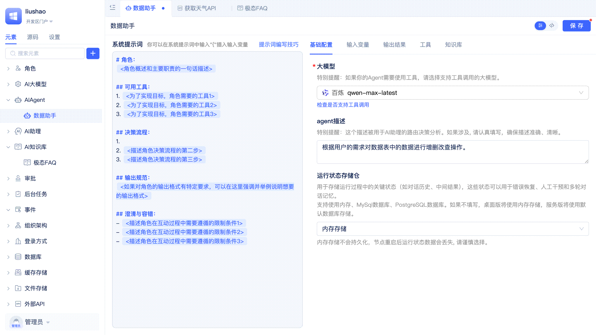

# 使用知识库实现检索增强生成（RAG）

Agent通过集成知识库实现检索增强生成（Retrieval-Augmented Generation, RAG），能够在生成回答前先从知识库中检索相关信息，从而提升回答的准确性和时效性。

## 在Agent中添加知识库 {#integrate-knowledge-base-rag}
RAG是一种结合了知识检索与大模型生成能力的AI解决方案。它通过在模型生成回答前，先从知识库中检索相关信息，将检索结果与用户问题一同输入大模型，从而提升回答的准确性和时效性。

开发者在Agent可视化编辑器中切换到`知识库`页签，点击`添加知识库`按钮，在弹窗中选择目标知识库元素，点击`确定`按钮即可。Agent中支持添加多个知识库，每个知识库可以启用或关闭，默认是启用状态。当不再需要某个知识库时，开发者点击右侧的删除按钮将其从Agent中移除即可。

还有一个`由大模型决策是否使用`开关，默认是开启状态，开启时为非强制模式，关闭时为强制模式。强制模式下，Agent在首次请求大模型之前会使用用户输入的内容先查询一次知识库，将结果作为上下文的补充和增强。如果开发者将其关闭，则由大模型自行决策是否查询以及如何查询知识库。无论`由大模型决策是否使用`是开启还是关闭，开发者都可以在系统提示词中去设计知识库的使用策略，指导大模型对知识库的使用。

关于知识库的创建，请参考[AI知识库](../knowledge-base/create-knowledge-elements#create-ai-knowledge-base-element)。
