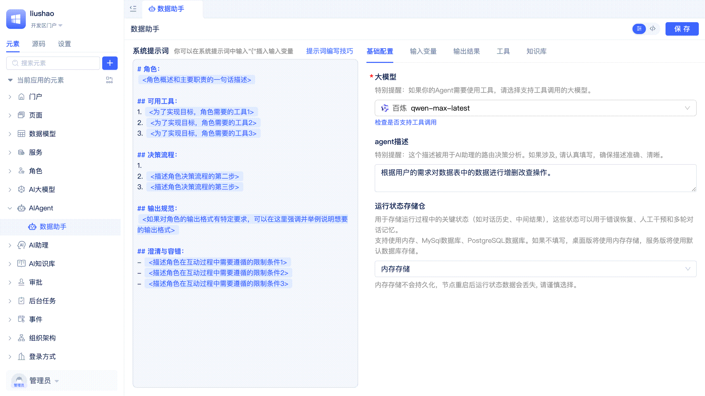
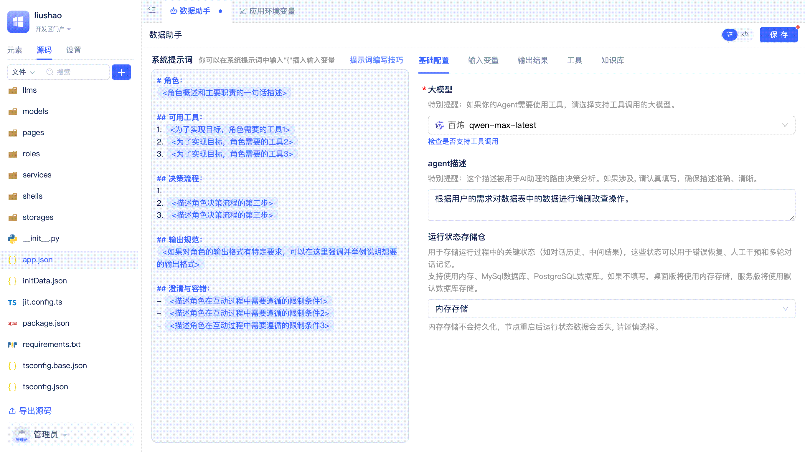
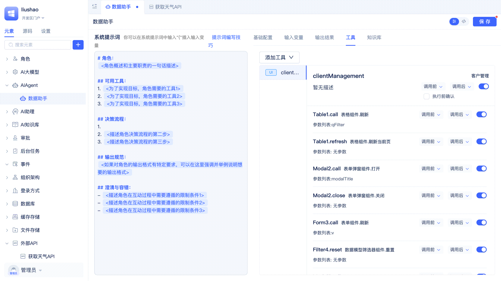
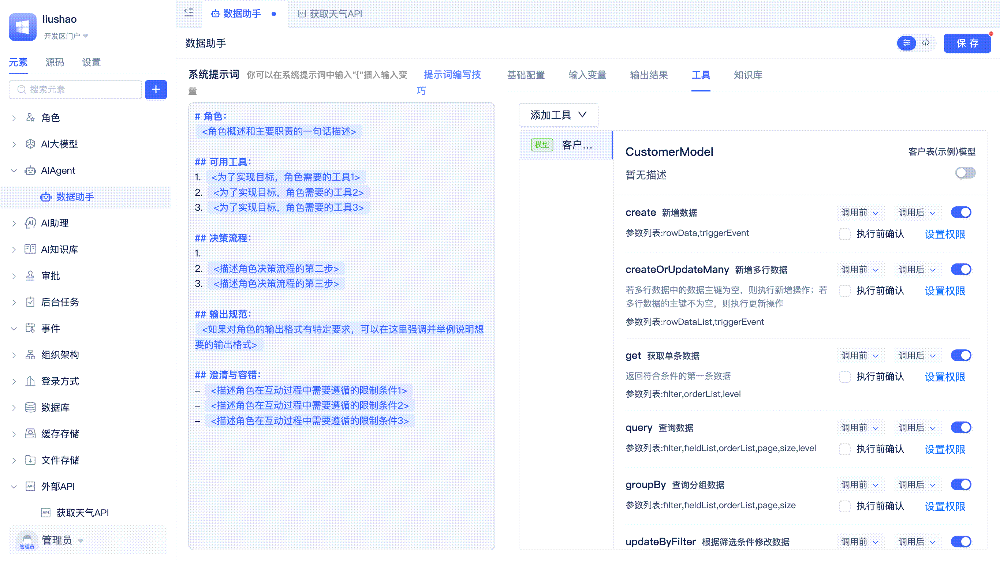
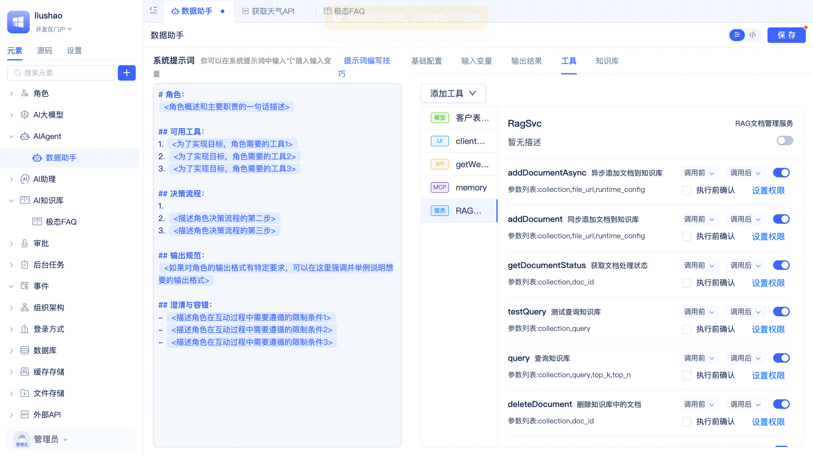

# Agent中的工具

工具为Agent扩展了可执行的能力，使其不仅能理解和处理自然语言，还能主动调用外部服务、数据库、API等，实现信息查询、数据处理、任务执行等复杂操作。通过为Agent添加合适的工具，开发者可以让Agent具备更强的业务处理和自动化能力，满足多样化的应用场景需求。

基于JitAi解释型系统架构构建的应用，其自描述的元素可以被大模型准确理解，成为Agent可用的工具。开发者可以在Agent可视化编辑器的`工具`中添加[模型函数](../data-modeling/create-data-model-functions)、[服务函数](../business-logic-development/creating-service-elements#create-service-functions)、[MCP服务](https://modelcontextprotocol.io/docs/getting-started/intro)、[外部API](../third-party-integration/external-api)、[页面函数](../shell-and-page/component-based-page-development#page-functions)，实现AI对前后端全栈元素的调用。

## Agent调用模型函数 {#calling-model-functions}
[数据模型](../../reference/framework/JitORM/data-models#model-built-in-functions)自带常用的增删改查函数，开发者还可以根据实际业务需求[自定义模型函数](../data-modeling/create-data-model-functions)。将数据模型函数作为工具添加到Agent后，Agent便能够通过这些函数实现对数据的增、删、改、查等操作，满足多样化的数据处理场景。

开发者在Agent可视化编辑器中切换到`工具`页签，点击`添加工具`按钮，在列表中选择`数据模型`，然后在弹窗中选择目标模型，点击`确定`按钮即可。

默认情况下会把模型所有函数都添加为工具，开发者应按照实际需要将不需要的函数关闭。界面上提供了一键全选/取消全选按钮，方便开发者快速操作。

## Agent调用服务函数 {#calling-service-functions}
开发者通常使用服务函数来封装复杂的业务逻辑处理过程，当服务函数被添加为工具后，Agent就可以直接调用这些函数。这意味着可以通过定义服务函数来让Agent完成复杂业务逻辑处理，**为Agent提供强有力的工具，是优化Agent执行能力、准确度的重要手段**。

开发者在Agent可视化编辑器中切换到`工具`页签，点击`添加工具`按钮，在列表中选择`服务`，然后在弹窗中选择目标服务，点击`确定`按钮即可。

默认情况下会把服务所有函数都添加为工具，开发者应按照实际需要将不需要的函数关闭。

:::tip
清晰无歧义的函数名称、函数描述、参数声明，可以提高大模型的理解准确度，更精准地完成任务。
:::

## Agent调用MCP服务 {#calling-mcp-servers}
MCP（Model Context Protocol，模型上下文协议）是Anthropic在2024年11月推出的一种开放标准协议，旨在标准化大型语言模型（LLM）与外部数据源、工具和服务之间的交互方式。它通过定义统一的通信规范，使AI模型能够安全、灵活地访问实时数据、API、数据库等资源，从而提升AI应用的执行能力和准确性。JitAi支持开发者以可视化的方式配置MCP服务，并将其添加为工具。

开发者在Agent可视化编辑器中切换到`工具`页签，点击`添加工具`按钮，在列表中选择`MCP服务`，然后在弹窗中填写服务名称和配置，点击`确定`按钮。平台会进行MCP Server的加载，加载成功后会展示MCP Server的函数列表，开发者按需勾选。

为了方便开发者使用，JitAi在MCP Server添加界面中内置了一些经过验证的MCP Server，开发者在弹窗中将鼠标放在`选择MCP服务`上即可在内置列表中进行快速选择，配置信息会被自动填写。不在内置列表中的则需要开发者手动填写配置。

对于已添加的MCP Server可以随时修改配置，平台还提供了复制配置的功能，可以一键把MCP Server配置复制到系统剪贴板中，方便开发者进行粘贴使用。

将鼠标放在MCP Server的标题右侧即可看到`复制配置`、`修改配置`以及`设置为环境变量`按钮。

:::warning
目前市面上的MCP Server实现良莠混杂，开发者需要仔细甄别，确保所使用MCP Server的安全性和可靠性。
:::

### 将MCP配置转为环境变量 {#converting-mcp-config-to-environment-variable}
在实际开发中，部分MCP Server的配置项（如API密钥、Token等）涉及敏感信息。为保障安全，建议开发者将这类敏感配置转为应用环境变量进行管理。这样不仅可以避免敏感信息在配置界面明文暴露，还便于在不同环境下灵活切换和统一维护。

开发者点击`设置为环境变量`按钮后，在弹窗中填写环境变量名称和变量值，点击`确定`按钮即可将配置存储到应用环境变量中，开发者也可以随时修改回JSON格式的配置。

## Agent调用外部API {#calling-external-apis}
JitAi支持开发者通过[外部API](../third-party-integration/external-api)元素，将各类外部系统接口集成到平台中，并将这些API作为Agent的工具使用。

开发者在Agent可视化编辑器中切换到`工具`页签，点击`添加工具`按钮，在列表中选择`外部API`，然后在弹窗中选择目标外部API元素，点击`确定`按钮即可。

默认情况下会把外部API所有函数都添加为工具，开发者应按照实际需要将不需要的函数关闭。

## Agent调用页面函数 {#calling-page-functions}
页面中的内置函数（例如获取页面变量）、页面中组件的函数（例如表格刷新、打开弹窗）以及开发者自定义的[页面函数](../shell-and-page/component-based-page-development#page-functions)都可以作为工具被Agent调用，从而实现了AI对前端界面的操作。

:::tip
在开发者门户中无法验证对页面函数的调用，需切换到用户实际访问的门户中进行验证。参考[在页面助理中测试Agent](./agent-input-output#testing-agent-in-page-assistant)。
:::

## 工具函数管理 {#tool-function-management}

### 启用/关闭工具函数 {#enabling-disabling-tool-functions}
每个数据模型、服务函数、页面、MCP Server、外部API元素中都包含多个函数。开发者在Agent开发过程中，可以根据实际需求开启需要调用的函数，把不需要使用的函数关闭。

:::warning
不要简单粗暴地启用全部函数，要根据实际需要针对性启用函数，否则会增加不必要的Token消耗、给大模型带来理解负担、引入不必要的操作风险。
:::

### 工具函数调用前/后事件触发 {#tool-function-call-pre-post-event-triggering}
Agent的每一次工具调用都可以产生两个后端事件：调用前事件和调用后事件。开发者可以启用或关闭其中一个或全部事件，也可以针对每个事件配置是否携带事件参数。利用事件机制，开发者可以在工具调用前/后执行自定义的业务逻辑，延伸Agent的能力。

开发者在每个工具函数的右侧可以看到`调用前`和`调用后`两个事件配置入口，鼠标悬浮在入口上即可弹出配置面板，在面板中开启或关闭`触发事件`、开启或关闭`事件消息中包含数据`。调用前事件消息参数包括工具名称、工具入参，调用后事件消息参数包括工具名称、工具返回结果，工具名称是必传参数，只有工具入参和工具返回结果受`事件消息中包含数据`开关限制。

开发者需要通过创建[Agent工具事件](../business-logic-development/event-handling#agent-tool-call-events)实例元素来订阅Agent的工具调用事件并执行事件函数逻辑。

### 工具函数执行前的人工确认 {#manual-confirmation-before-tool-execution}
在涉及敏感或高风险操作时，可以为工具函数启用"执行前确认"。启用后，Agent会在执行前暂停，并向用户请求确认，只有同意后才继续执行。适用于审批、关键数据变更等需要人工把关的场景，可防止误操作和风险。

开发者在工具函数右侧可以看到`执行前确认`开关，勾选后即可启用执行前确认。当Agent调用工具之前，会在对话框中向用户请求确认，只有同意后才继续执行。

:::tip
页面函数没有`执行前确认`开关，默认无需确认。这是因为页面函数通常已通过前端交互（如弹窗、按钮等）实现了用户确认，因此无需在Agent工具中重复设置。
:::

### 限制工具函数调用的用户角色 {#restricting-user-roles-for-tool-calls}
在企业级AI应用中，不同用户角色拥有不同的操作权限。通过限制工具函数的可调用角色，可防止越权和误操作，保障数据安全。

开发者在工具函数右侧可以看到`设置权限`按钮，点击后在弹窗中选择[应用角色](../user-and-permission/role-portal-menu-permissions)即可，支持选择多个应用角色。

没有配置任何角色时，所有使用Agent的用户都能正常调用该工具函数。当配置了角色后，只有拥有这些角色的用户才能调用该工具函数。
