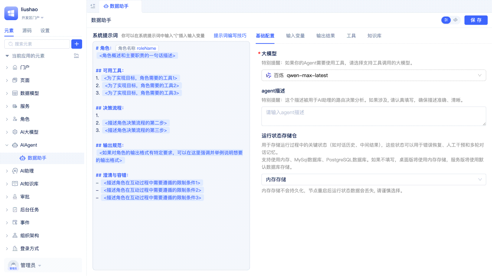

# 创建AI Agent
AI Agent是具备自主决策和任务执行能力的智能体，能够理解用户意图，自主选择并调用合适的工具，完成复杂的业务流程。

Agent由系统提示词、大模型和工具三个核心部分组成。平台支持为Agent配置丰富的工具集，包括数据模型函数、服务函数、MCP服务、外部API和页面函数，**实现AI对前后端全栈元素的智能调用**。此外，Agent还支持灵活的输入输出配置以实现程序化调用，以及集成知识库实现检索增强生成（RAG），提升回答的准确性和时效性。

## 创建ReActAgent {#creating-react-agent}
ReAct（Reasoning and Acting）是一种结合"推理"与"行动"的Agent工作模式。它让AI在面对复杂任务时，能够交替进行思考和采取行动，并根据每一步的反馈动态调整后续决策。开发者使用JitAi可以快速开发调试出与应用原生融合的ReAct模式Agent，即ReActAgent。

开发者在元素目录树中依次点击`+`、`AI Agent`、`ReActAgent`，在表单弹窗中填写一个名称，点击`确定`按钮，即可创建一个ReActAgent并自动进入可视化编辑器。

ReActAgent中支持编写系统提示词、选择大模型、编写描述信息、配置运行状态存储仓、[配置输入输出](./agent-input-output)、[添加工具](./agent-tools)、[添加知识库](./agent-knowledge-base)。

## 编写系统提示词 {#writing-system-prompts}
系统提示词是指导Agent行为和决策的重要依据。它为Agent提供任务目标、角色设定、行为规范等关键信息，指导Agent更准确地完成任务。合理设计系统提示词可以提升Agent的智能表现和交互体验。

考虑到许多开发者并不擅长提示词的编写，JitAi提供了默认的系统提示词模版，开发者可以基于默认模版进行修改，在熟练掌握提示词编写技巧后也可以按照自己的格式进行编写。

Agent可视化编辑器的整个左侧区域都用于提示词编写，开发者按需填写模版，将不需要的部分删除即可。

更多关于系统提示词的编写技巧，请参考[Agent提示词编写技巧](../advanced-guide/agent-prompt-writing-techniques)。

## 选择模型并配置参数 {#selecting-models-configuring-parameters}
大模型是Agent智能决策和任务执行的核心。它负责理解用户输入、结合提示词和上下文进行推理，并生成响应结果。选择合适的大模型和参数，能显著提升Agent的表现和适应性。反之，如果大模型选择不当，可能会导致Agent无法正确理解用户意图，生成错误的响应结果。

JitAi提供了[AI大模型](../ai-llm/create-ai-llm)元素，用于对接市面上主流的大模型服务，而且支持私有化大模型服务的集成。在ReActAgent的基础配置中，从已经创建的大模型实例中选择并配置其参数即可。

:::tip
开发者需要先完成大模型实例元素的创建，才能在ReActAgent中选择使用。如果需要调用工具，则对应的模型必须支持Function Calling。

可以参考各大模型服务厂商的官方文档，了解模型能力以及参数配置。
:::

## 为Agent编写简介描述 {#writing-agent-descriptions}
`Agent描述`是用于描述Agent的用途、功能、特点等信息的文本。在创建ReActAgent时，开发者可以编写一个简洁明了的描述。当Agent被AI助理编排时，描述信息将用于AI助理的路由决策分析，从而在多个Agent中选择最合适的Agent来处理用户请求。

开发者在Agent可视化编辑器的`基础配置`-`Agent描述`输入框中填写描述信息后点击`保存`即可。通常，描述信息和系统提示词中的角色描述可以保持一致。

## 配置运行状态存储仓 {#configuring-runtime-state-storage}
Agent在执行过程中需要保存和更新状态信息，以便在对话中保持一致性和连续性。开发者需要选择一个合适的存储仓来保存Agent的运行状态。JitAi支持使用内存、MySQL或者PostgreSQL作为存储仓。如果开发者不进行配置，桌面版默认使用内存存储，服务器版默认使用内置的MySQL数据库存储。

### 内存存储 {#memory-storage}
内存存储适用于测试和调试阶段，快速验证，不需要依赖数据库。一旦Jit节点重启，内存存储的会话上下文信息会丢失，不建议在生产环境中使用。

开发者在Agent可视化编辑器的`基础配置`-`运行状态存储仓`下拉列表中选择`内存存储`后点击`保存`即可。

### 数据库存储 {#database-storage}
数据库存储适用于生产环境，可以持久化保存Agent的运行状态，即使Jit节点重启，会话上下文信息也不会丢失。在集群模式下，数据库存储的会话上下文信息也可以被多个Jit节点共享。

开发者在Agent可视化编辑器的`基础配置`-`运行状态存储仓`下拉列表中选择目标数据库后点击`保存`即可。

:::tip
开发者需要先创建一个MySQL或者PostgreSQL数据库元素，才能在Agent中选择使用。

可以参考[管理数据库连接](../data-modeling/manage-database-connections)。
:::

## 源码模式修改Agent {#modifying-agents-source-code-mode}
在Agent可视化编辑器中的所有配置都会生成对应的源码文件，开发者可以切换到源码模式进行修改，与可视化编辑器中修改的效果相同。

开发者在Agent可视化编辑器右上角点击`</>`按钮即可切换到源码模式。

## 自定义回调处理器 {#custom-callback-processors}
回调处理器为开发者提供了灵活的业务扩展能力。通过这些机制，开发者可以在Agent推理、工具调用等关键流程节点插入自定义逻辑，实现如日志记录、参数校验、上下文增强、权限控制、审计监控等业务需求。例如，可以在模型推理前后自动补充业务上下文，或在工具调用前后进行操作审计和结果处理。回调和钩子机制让Agent的行为更加可控和可观测，便于对企业级AI应用的深度定制化开发。

开发者需要以全代码方式创建自定义回调处理器，请查看参考手册中的[自定义回调处理器](../../reference/framework/JitAi/AIAgent#custom-callback-handlers)了解详细用法。

