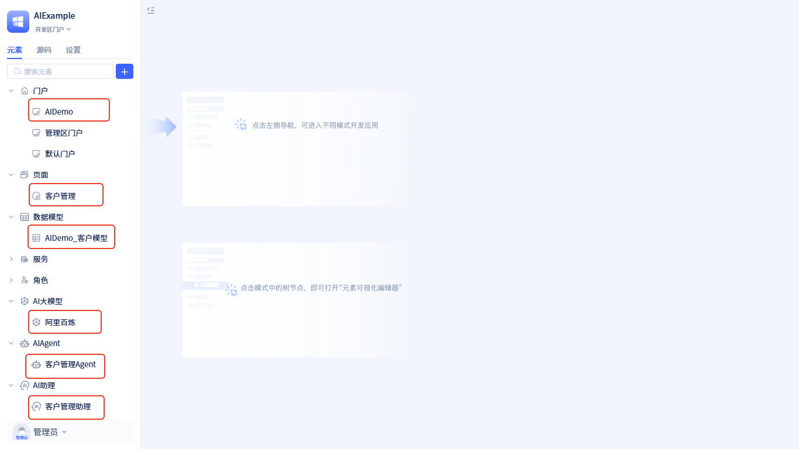

# 示例演示 {#example-demo}
本示例将展示如何构建一个智能客户信息管理助理，该助理能够理解用户的自然语言指令，并自动执行客户信息的增删改查操作。

**运行效果展示**：

**助理流程设计**：

- **客户管理Agent**：AIAgent节点，负责理解用户需求，通过分析用户描述来确定具体的数据操作类型和操作内容，并输出相应的操作指令。
- **数据操作类型判断**：条件分支节点，根据客户管理Agent输出的操作类型，智能判断后续应该执行哪个处理流程。
- **新增数据确认**：对话区人机交互节点，当需要新增数据时，该节点会向用户展示即将新增的数据内容，等待用户确认。
- **新增数据**：函数调用节点，调用新增客户信息的业务函数，将确认后的数据保存到系统中。当**新增数据确认**节点获得用户同意后，流程会流转到该节点。
- **修改数据确认**：对话区人机交互节点，当需要修改数据时，该节点会向用户展示修改后的数据内容，等待用户确认。
- **修改数据**：函数调用节点，调用修改客户信息的业务函数，将确认后的修改数据保存到系统中。当**修改数据确认**节点获得用户同意后，流程会流转到该节点。
- **删除数据确认**：工作区人机交互节点，当需要删除数据时，该节点会在前端页面弹出删除确认对话框，等待用户操作。
- **删除数据**：函数调用节点，调用删除客户信息的业务函数，执行数据删除操作。当用户在**删除数据确认**的确认框中点击`删除`按钮后，系统会发送"删除"指令，然后流程流转到该节点。

当用户需要查询数据时，**客户管理Agent**会直接触发前端页面中的客户列表查询功能，因此无需在流程中单独体现查询操作。

**示例源码获取与配置**

下载地址：<a href="https://jit-www.oss-cn-beijing.aliyuncs.com/AIDemo.zip">演示示例源码</a>

**源码导入步骤**：

1. 进入IDE开发环境，切换到`源码`模式
2. 点击` + ` -> `导入文件夹`，选择下载的示例源码进行导入
3. 导入完成后，切换到 `元素` 视图，可以看到以下内容：

如果元素列表没有显示，请刷新页面重新加载。

**环境配置**：

该示例使用的大模型是阿里云百炼平台的qwen-max-latest，需要先<a href="https://bailian.console.aliyun.com/?tab=model#/api-key" target="_blank">申请API Key</a>，然后配置到应用环境变量中：

1. 打开`设置` -> `应用环境变量`
2. 将获取的API Key更新到`qwenApiKey`变量中
3. 保存配置即可

**运行演示**：

配置完成后，进入`AIDemo`门户即可体验完整的客户信息管理助理功能。

