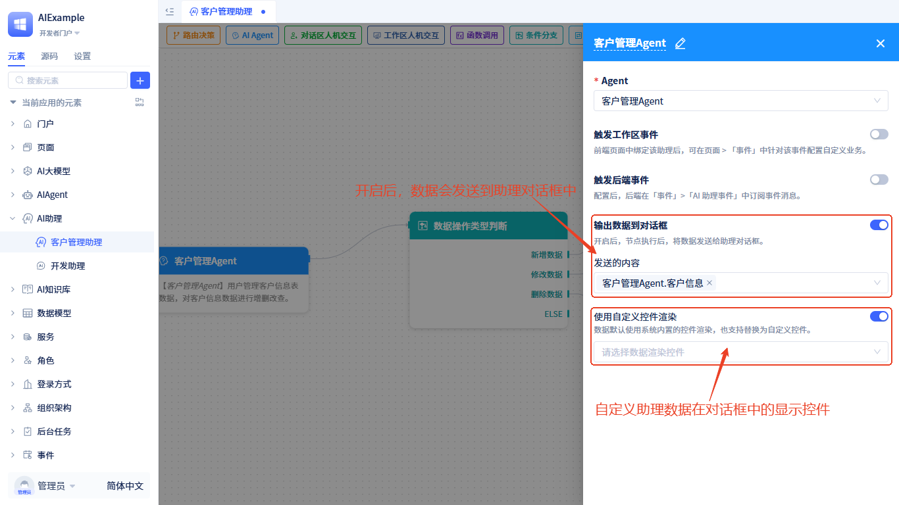

# AI助理的输入与输出

## 输入参数 {#input-parameters}
每个助理有一个固定的输入参数：用户输入(userInput)。除此之外，你还可以自定义其他输入参数。在使用助理时需要为这些参数赋值。
设置步骤如下：

点击流程编辑器右上方的`设置`按钮，打开设置窗口，添加输入参数。

如果助理设置了自定义的输入参数，在[门户或页面中使用AI助理](../using-ai-in-portals-and-pages)时，需要给这些参数赋值。

## 输出内容 {#message-output}

### 运行过程日志输出
在[门户或页面中使用AI助理](../using-ai-in-portals-and-pages)时，可以指定助理输出运行过程日志内容，有以下可选项：
- **输出简要过程日志**：不会输出助理运行过程日志，同时Agent节点中大模型仅输出简单的运行过程日志。该模式输出内容相对简单，运行过程相对较快。
- **输出详细过程日志**：输出助理运行过程日志，同时Agent节点中大模型会输出详细的运行过程及工具调用日志。该模式下输出的日志可用于观测调试，运行过程相对较慢，请谨慎选择。
- **不输出过程日志**：不会输出运行过程日志。

### 状态数据输出
通过在节点上配置**输出数据到对话框**，当节点运行后会将指定的[状态数据](./ai-assistant-state)发送到对话框的回复区。支持该配置项的节点有：AIAgent节点、函数调用节点、条件分支节点和多任务执行节点。
输出的数据默认会使用内置的控件渲染，你也可以**使用[自定义控件](../frontend-ui-customization/custom-controls)渲染**。

配置方式如下：

### 对话区人机交互节点输出
在[对话区人机交互节点](./process-orchestration-node-configuration#dialog-human-machine-interaction)配置的**需展示的数据**会在助理对话框中输出。

### 工作区人机交互节点输出
在[工作区人机交互节点](./process-orchestration-node-configuration#workspace-human-machine-interaction)配置的**操作提示**会在助理对话框中输出。

