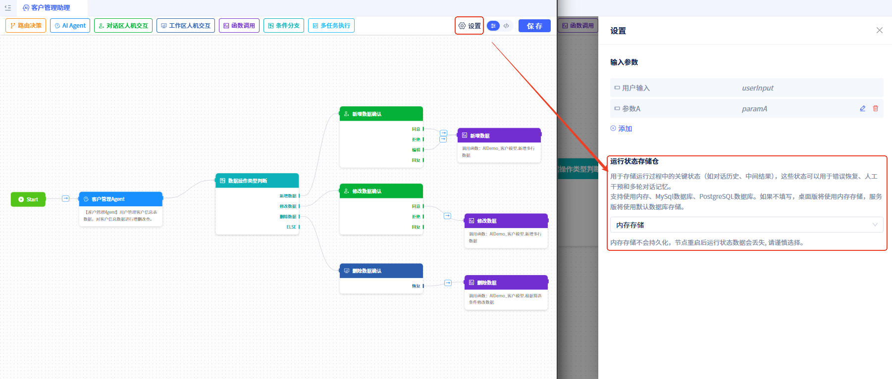

# AI助理的运行状态

运行状态数据是AI助理流程执行过程中的"记忆库"，存储了所有节点产生的数据，这些数据可以在整个流程中的任意节点使用，也可以发送到助理的对话框中展示，还能用于错误恢复、人工干预和多轮对话记忆。

## 状态数据存储仓 {#state-data-storage-repository}
我们需要为其配置一个持久化存储仓库，有以下可选项：
- **内存存储**：速度快，但重启后数据丢失，适合开发测试。
- **关系型数据库**：数据持久化，支持复杂查询，功能更强大，适合生产环境。目前支持[MySQL数据库](../data-modeling/manage-database-connections)和[PostgreSQL数据库](../data-modeling/manage-database-connections)。

若不配置，桌面版将默认使用内存存储，服务版本将使用内置数据库(MySQL)存储。

设置步骤如下：

点击可视化编辑器右上方的`设置`按钮，打开设置窗口，设置**运行状态存储库**。

## 运行状态数据内容 {#state-data-content}
运行状态数据包含以下几类：
- **用户输入**：用户发送的消息和自定义参数
- **节点输出**：各节点执行后的结果数据
- **中间变量**：循环索引、循环项等流程控制数据
- **用户反馈**：人机交互时用户的操作结果

## 数据使用方式 {#data-usage-methods}
运行状态数据在AI助理流程中的多种使用场景：

- **节点配置**：在节点配置时选择数据作为输入参数
- **条件判断**：在条件分支中基于数据值做判断
- **循环处理**：在循环节点中遍历数组类型数据
- **数据展示**：在对话区或工作区中展示数据给用户
- **事件传递**：事件触发时作为参数传递给其他组件

## 数据流向 {#data-flow}
AI助理中的数据流向遵循一个清晰的模式，数据在节点间传递和累积，形成完整的执行上下文。

### 数据输入阶段 {#data-input-phase}
1. **用户输入**：用户发送的消息作为`userInput`参数传入
2. **自定义参数**：通过高级设置配置的其他输入参数
3. **初始数据**：所有输入数据存储在运行状态中，供后续节点使用

### 节点间数据传递 {#inter-node-data-transfer}
1. **路由决策节点**：接收用户输入消息，传递给大模型分析内容

2. **AIAgent节点**：从运行状态读取输入参数，传递给绑定的Agent处理任务，将Agent返回结果存储到运行状态中。

3. **函数调用节点**：从运行状态读取函数参数，传递给绑定的函数，将函数返回值存储到运行状态。

4. **工作区人机交互节点**：从运行状态读取需要展示的数据，等待用户操作和输入，将用户操作结果存储到运行状态。

