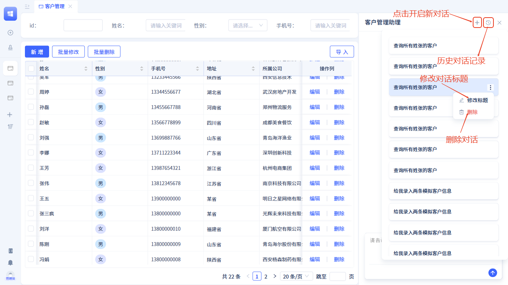

# 对话记录

对话记录是AI助理的"完整备忘录"📝，记录每次交流的内容和状态，让AI能够基于历史上下文提供更准确的回答。不同对话记录之间相互隔离，确保交流的准确性和连续性。

## 创建和管理对话 {#creating-and-managing-conversations}

- **新建对话**：点击对话框右上角的 ` + ` 开启新对话
- **自动保存**：发送第一条消息后自动保存，截取前20个字作为标题
- **修改标题**：可手动重命名对话标题
- **删除对话**：可删除不需要的对话记录

## 使用历史对话 {#using-historical-conversations}

### 基本操作 {#basic-operations}
1. **查看历史**：点击左侧历史记录列表选择对话
2. **继续对话**：在历史对话中直接提问，AI基于该对话上下文回答
3. **切换对话**：随时切换到其他对话，每个对话上下文独立

### 应用场景 {#use-cases}
- 保持长期项目讨论的连续性
- 回顾之前的解决方案和思路
- 在不同主题间快速切换而不丢失上下文
