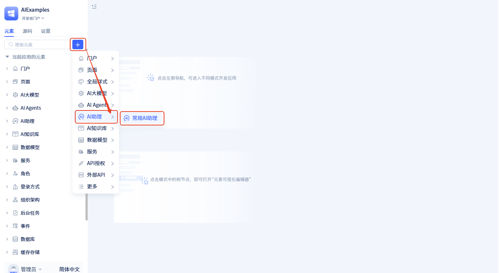
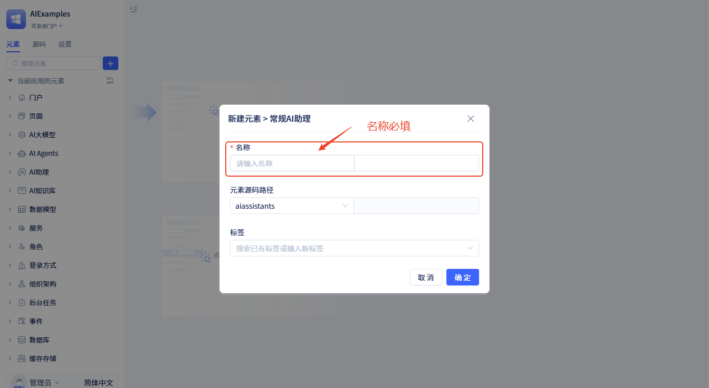

# 创建AI助理元素 

## AI助理是什么 {#what-is-ai-assistant}
AI助理是一种生产级的AI应用元素，它由多个Agent、处理函数及UI人机交互节点组成，通过拖拽式流程设计器来编排构建。

### 功能特性 {#features}
AI助理支持多种交互方式。用户可以通过聊天界面与它对话，获得回答和处理结果，同时也能触发界面操作。其他系统也可以通过接口直接调用AI助理，获得处理结果并触发相应的操作。

在应用场景上，AI助理非常灵活。它可以作为独立的助手，以对话框的形式为用户提供专门服务；也可以嵌入到具体的工作页面中，作为侧边栏助手，与工作页面紧密配合，帮助用户完成专业操作；还可以，嵌入到任意网页中，作为该网页的AI助理，为已有应用系统进行AI赋能。

### 技术实现原理 {#technical-implementation}

从技术角度看，AI助理是一个多智能体协作框架，同时也是AI与用户界面协作的框架。它能够协调多个智能体协同工作，调用后端服务处理数据，控制前端界面显示和交互，并管理整个处理流程。

AI助理的核心设计理念包括三个方面：

[**可视化编排设计**](./process-orchestration-node-configuration)：通过直观的拖拽操作构建复杂的业务流程，降低了开发门槛，让业务人员也能参与AI应用的构建，实现了"低代码"的AI应用开发模式。

[**状态驱动的数据流**](./ai-assistant-state)：整个系统以运行状态数据为核心，数据在节点间传递和累积，形成完整的执行上下文。数据流向遵循"输入→处理→输出→存储"的清晰模式，确保信息在流程中的连续性和可追溯性，支持复杂的多轮对话和状态保持。

[**事件驱动的扩展性**](./ai-assistant-event.md)：通过完善的事件系统，AI助理可以灵活地与前端页面和后端业务逻辑集成，支持复杂的业务场景和定制化需求。事件系统使得AI助理能够与现有系统无缝集成，实现真正的企业级AI应用。

简单来说，AI助理就是一个能够将后端AI处理与前端用户操作完美结合的智能系统。

### 与其他工具的区别 {#compare-with-others}

AI助理与Coze、Dify、n8n等平台的工作流工具有本质不同。传统的这些工具只能创建简单的处理函数，功能相对单一，其达到的效果等同于JitAI的"服务函数"。而AI助理则是一个完整的智能应用系统，功能更加强大和灵活。详情请见：[对比JitAI与主流AI应用平台](../../tutorial/jitai-comparison)

### 主要优势 {#advantages}

AI助理具有简单易用、灵活配置、功能强大等优势。通过简单的拖拽操作，任何人都能快速搭建出专业的AI应用，无需编程知识。同时，AI助理能够整合前端界面、后端服务和AI智能体，打造出功能完整的智能解决方案。

## 创建AI助理 {#creating-ai-assistant}

创建方式如下：

点击 +  → **AI助理** → **常规AI助理**，打开助理信息填写表单，填完表单后点击 `确定` 按钮即可创建助理。

在弹窗中，填入**名称**，然后点击**确定**完成创建。创建完成后会自动打开[可视化编排](./process-orchestration-node-configuration)页。

:::tip 命名建议
- 使用有意义的名称，如"客户服务助理"、"订单处理助理"
- 避免使用过于简单的名称，如"助理1"、"测试助理"
- 名称应该反映助理的主要功能或应用场景
:::
