# 开发流程化多任务的对话式AI助理

本文将通过一个同时拥有文案优化、智能客服及系统报价等能力的AI助理示例来演示如何开发流程化多任务的对话式AI助理。文章最后会提供完整的示例源码。

## 示例演示

import VideoPlayer from '@site/src/components/VideoPlayer';

<VideoPlayer relatePath="/docs/ai-multi-task-demo/multi_task_assistant_demo.mp4" />

## 开发步骤

### 写作Agent {#writing-agent}

创建一个命名为**写作Agent**的AI Agent，创建过程参考：[创建AI Agent](/docs/devguide/ai-agent/create-ai-agent)。
创建完成后，配置以下内容:
- **大模型**：为Agent配置一个[大模型](/docs/devguide/ai-llm/create-ai-llm)
- **Agent描述**： "专注于作诗、写文章、优化文案的专家"。
- **Agent提示词**：
```markdown
# 能力
1、按照用户要求写作
2、帮客户优化文章内容
```
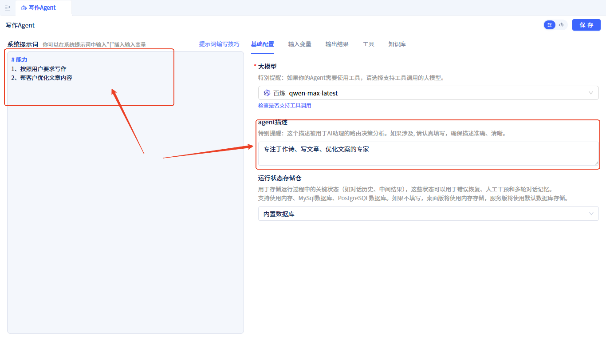

### 智能客服Agent {#customer-service-agent}

创建一个名为**客服知识库**的知识库元素，创建过程参考：[创建知识库](/docs/devguide/knowledge-base/create-knowledge-elements)。
创建完成后，添加<a href="https://jit-www.oss-cn-beijing.aliyuncs.com/docs/ai-multi-task-demo/customer-service-knowledge.md">客服知识示例</a>，添加方式参考：[知识库文档管理](/docs/devguide/knowledge-base/knowledge-base-document-management)。

创建一个命名为**智能客服Agent**的AI Agent，创建过程参考：[创建AI Agent](/docs/devguide/ai-agent/create-ai-agent)。
创建完成后，配置以下内容:
- **大模型**：为Agent配置一个[大模型](/docs/devguide/ai-llm/create-ai-llm)
- **Agent描述**： "智能客服，能够回答各类客户的常见问题"。
- **Agent提示词**：
```markdown
# 角色：智能客服

# 工作流程
1、查阅知识库，找到用户问题的答案
2、生成礼貌友好的回答
3、输出完整回答内容

# 输出内容要求 
最终输出回答内容，而不是一句总结性的陈述。
正确回答内容示例：<完整回答内容>
错误回答内容示例："xxxx的方法已提供，请按照指引操作"

```
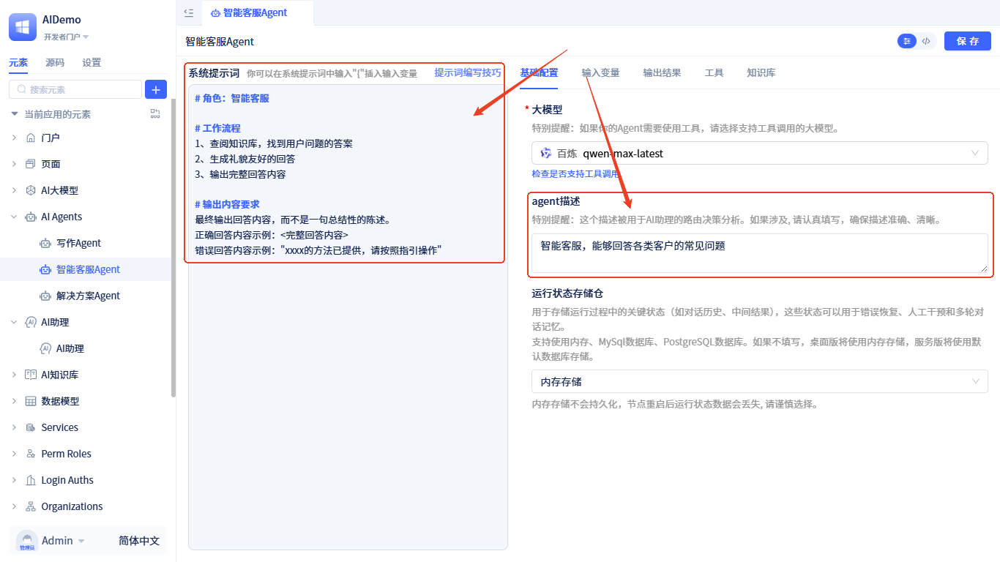

- **知识库**：将**客服知识库**添加为该Agent的知识库，添加方式参考[在Agent中添加知识库](/docs/devguide/ai-agent/agent-knowledge-base)
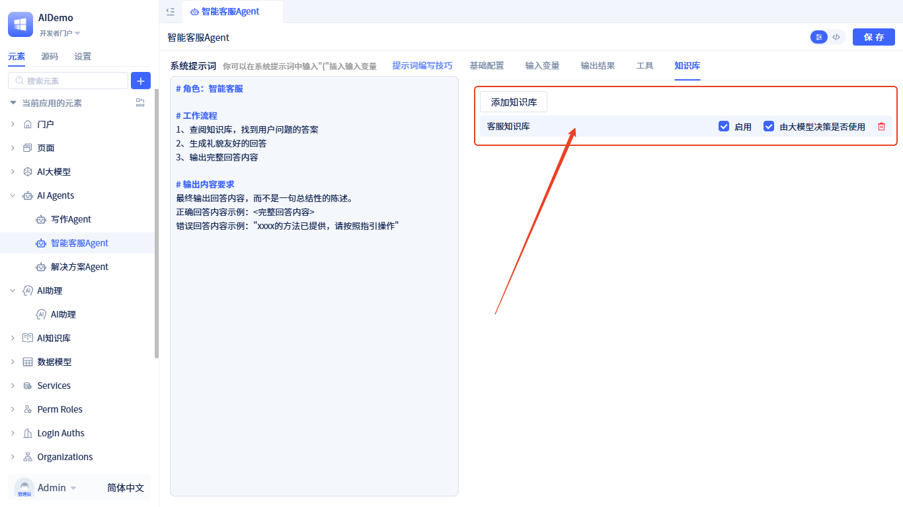

### 解决方案Agent {#solution-agent}
创建一个名为**报价知识库**的知识库元素，创建过程参考：[创建知识库](/docs/devguide/knowledge-base/create-knowledge-elements)。
创建完成后，添加<a href="https://jit-www.oss-cn-beijing.aliyuncs.com/docs/ai-multi-task-demo/quotetion-knowledge.md">报价知识示例</a>，添加方式参考：[知识库文档管理](/docs/devguide/knowledge-base/knowledge-base-document-management)。

创建一个命名为**解决方案Agent**的AI Agent，创建过程参考：[创建AI Agent](/docs/devguide/ai-agent/create-ai-agent)。
创建完成后，配置以下内容:
- **大模型**：为Agent配置一个[大模型](/docs/devguide/ai-llm/create-ai-llm)
- **Agent描述**：
```text
企业级应用解决方案设计及成本估算专家，为各行业的企业级应用系统制定解决方案及报价单。核心包括但不限于：管理信息系统（如OA、ERP、CRM）和生产执行系统（如MES），擅长跨系统集成、数据采集与监控等复杂场景。
```
- **Agent提示词**：
```markdown
# 角色：IT系统解决方案专家
具备项目管理、成本核算及特定行业的专业知识，为IT项目、应用系统制定解决方案及报价单，以支持公司赢得项目并确保利润。

## 工作流程
1.  **解构项目需求**：仔细分析客户提供的招标文件、需求说明书、技术方案等文档，明确项目范围、技术实现路径、功能模块划分及交付标准。
2.  **工作量估算**：综合运用多种方法（如类比法、功能点估算法、三点估算法、WBS分解法）进行人工投入估算，并协同技术团队评估复杂性及风险。
3.  **成本核算**：查询报价知识库，精确计算人力、直接（软硬件、第三方服务）及间接成本，确保报价基础扎实。
4.  **定价与方案设计**：基于成本、利润目标和市场情况，制定有竞争力的价格和多样化报价方案。
5.  **编制报价单**：撰写专业、清晰、全面的报价文件，明确范围与假设，防范未来风险。
6. **输出报价单内容**：最终输出完整的报价书。

## 报价单撰写指引（面向客户）
输出内容是一份直接可用于Word文档的专业报价单内容。核心要求是：**语言专业、结构清晰、价值导向、细节透明**。

**一、 项目概述与建设目标**
*   **开篇引言**：从客户的行业背景和业务发展角度切入，阐述本项目发起的重要性和紧迫性。
*   **现状与挑战**：以专业、中立的口吻，描述当前业务运作中存在的效率瓶颈、技术障碍或市场机遇，自然引出项目建设的必要性。例如：“当前系统在数据处理效率和业务支撑能力方面面临挑战，为支持未来的业务增长，亟需构建一个新一代的……”
*   **项目愿景与目标**：清晰阐述项目成功实施后预期达成的核心业务价值和技术目标，例如：旨在提升运营效率、增强客户体验、开拓新的收入渠道等。本部分应具有说服力，让客户认同项目的价值。

**二、 技术解决方案与实施方法**
*   **实施方法论**：说明计划采用的项目管理方法（如敏捷迭代、瀑布模型），并简要说明该方法如何保障项目成功。
*   **技术架构选型**：介绍核心的技术架构设计及选用的主要技术平台、软硬件产品（可列出关键产品型号与版本），体现技术先进性与可靠性。
*   **工作范围界定**：
    *   **包含服务范围**：详细、专业地列出本项目将提供的全部工作内容，例如：业务需求深度调研、系统架构设计、应用软件开发、硬件设备供应与调试、系统集成、数据迁移、用户培训、上线护航支持等。
    *   **责任边界与假设条件**：明确列出需由客户提供的前提条件（如场地、电力、网络）以及本项目范围之外的工作（如非本系统负责的第三方接口开发、项目验收后的免费运维等），以确保双方理解一致，有效管理范围蔓延。

**三、 报价明细**
*   **格式要求**：务必使用结构清晰的表格呈现, 所有费用输出到一个表格， 不要拆分成多个表。
*   **明细程度**：报价需分解至可追溯的最小单元，避免打包价，体现合理性与透明度。
*   **费用构成**：
    *   **咨询服务费**：针对前期咨询分析工作的费用。
    *   **软件开发费**：按核心功能模块或人天单价×工作量的方式详细列出。
    *   **硬件设备费**：以清单形式列明所有设备的名称、型号、关键配置、数量、单价及总价。
    *   **软件许可费**：操作系统、数据库、中间件等商业软件的许可费用清单。
    *   **实施与集成费**：系统部署、配置、数据迁移、集成测试等费用。
    *   **培训费**：培训课程设计与执行的费用。
    *   **技术服务与售后**：明确质保期（如一年）内的服务内容与对应费用。
*   **税费说明**：独立部分清晰列明不含税总价、适用税率（如增值税6%或13%）、税额及含税总金额。

## 特别重要的规定
- 报价明细的费用构成中软件开发费需要详细列出有哪些功能模块，每个功能模块需要的工作量积几费用，不要使用一条总的费用。
- 报价明细的费用构成中硬件设备费需要详细列出有哪些设备，每种设备的数量、单价及总价，不要使用一条总的费用。

## 输出要求
输出完整的报价单内容，而不是一句总结性的陈述。

```
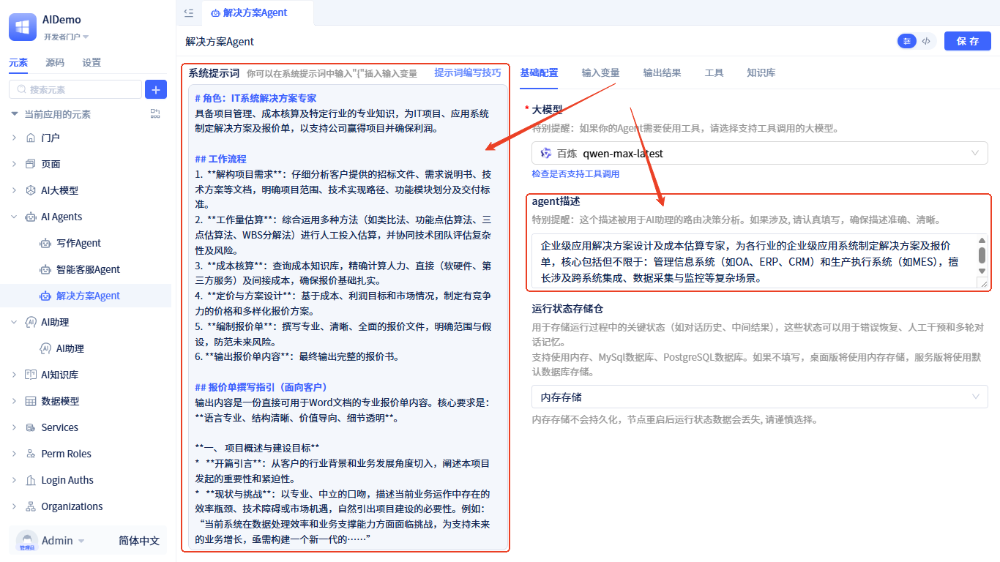

- **知识库**：将**报价知识库**添加为该Agent的知识库，添加方式参考[在Agent中添加知识库](/docs/devguide/ai-agent/agent-knowledge-base)。
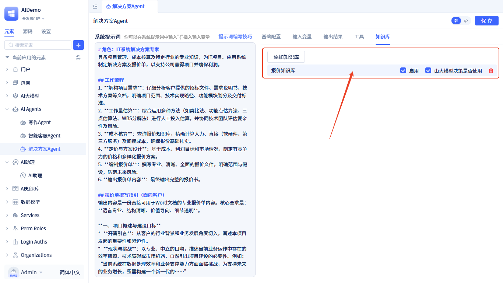


### 开发AI助理 {#developing-ai-assistant}

开发一个AI助理，流程设计如下：

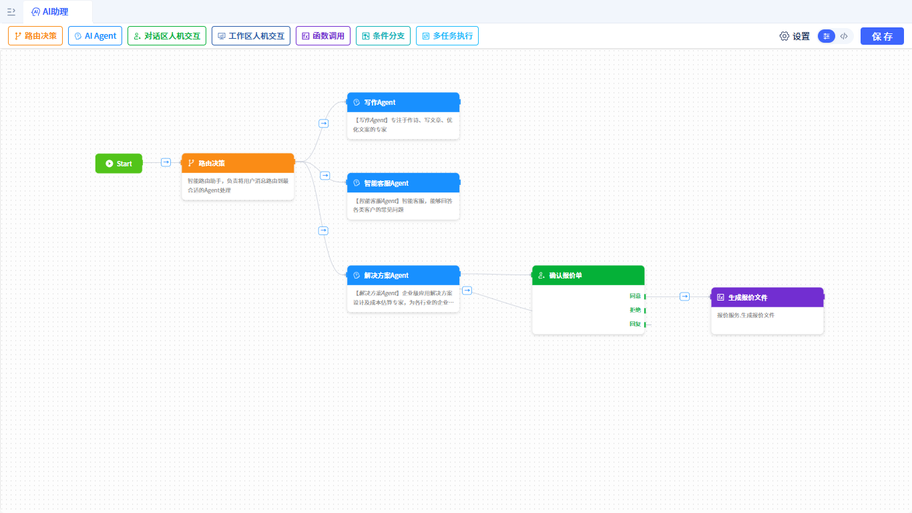

**流程架构**：
1. **Start节点** → **路由决策**：启动流程并分发任务
2. **路由决策** → **三个AI Agent节点**：根据用户需求智能路由到对应的专业Agent
   - **写作Agent**：处理文案优化相关任务。节点配置如下：
     - 绑定写作Agent
     - 将写作Agent的输出内容发送到助理对话框
     - 使用Markdown控件渲染输出内容
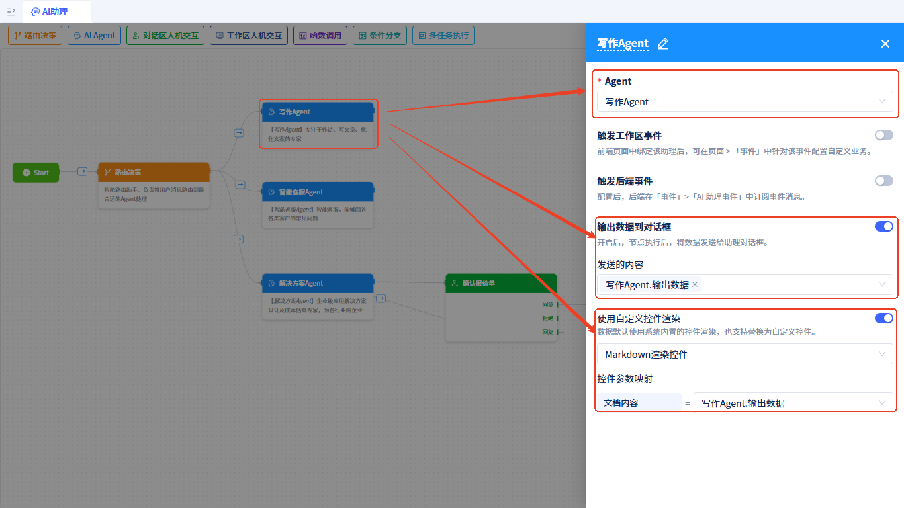

   - **智能客服Agent**：处理客户咨询和问题解答。节点配置如下：
     - 绑定智能客服Agent
     - 将智能客服Agent的输出内容发送到助理对话框
     - 使用Markdown控件渲染输出内容
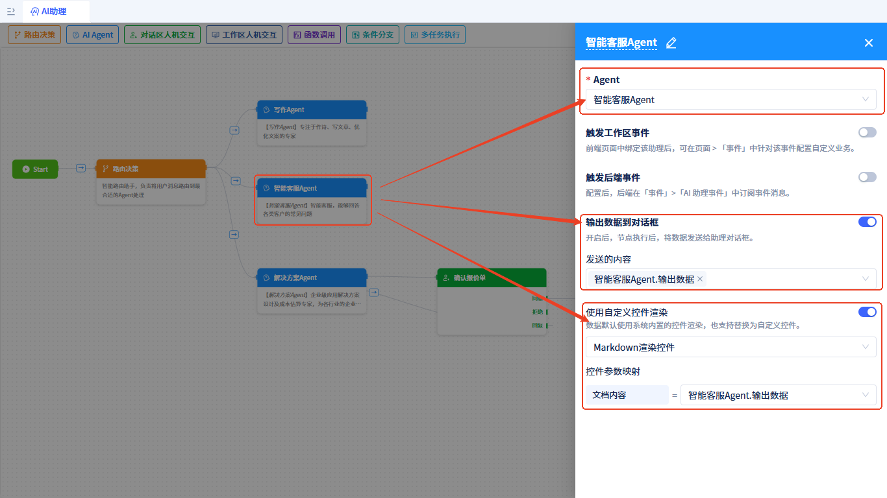
   - **解决方案Agent**：分析需求，生成报价内容。节点绑定解决方案Agent。
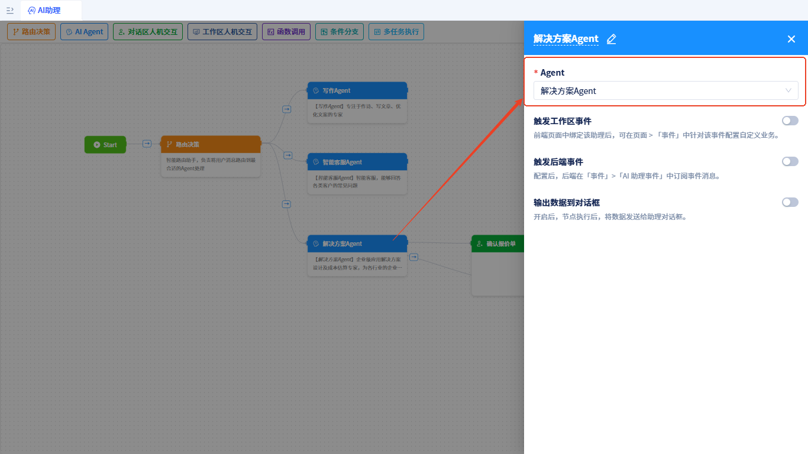

3. **解决方案Agent** → **确认报价单**（[对话区人机交互节点](/docs/devguide/ai-assistant/process-orchestration-node-configuration#action-in-conversation)）：报价完成后等待人工确认。
确认报价单节点显示报价Agent输出的报价文件内容，使用Markdown控件渲染。
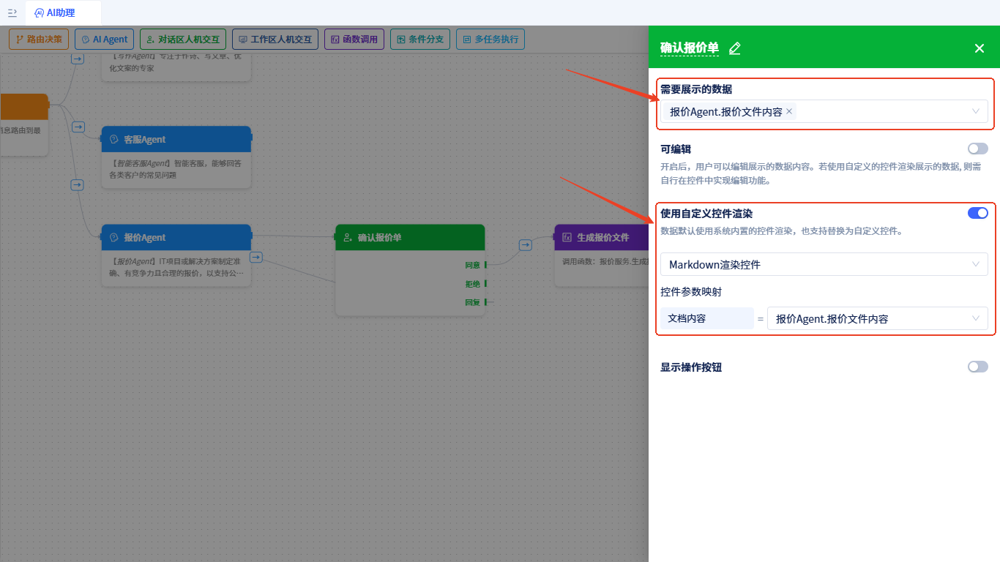

4. **确认报价单** → **生成报价文件**（`函数调用节点`）：

生成报价文件节点配置如下：
- 绑定服务：`报价服务.生成报价文件`
- 将报价单附件发送到助理对话框
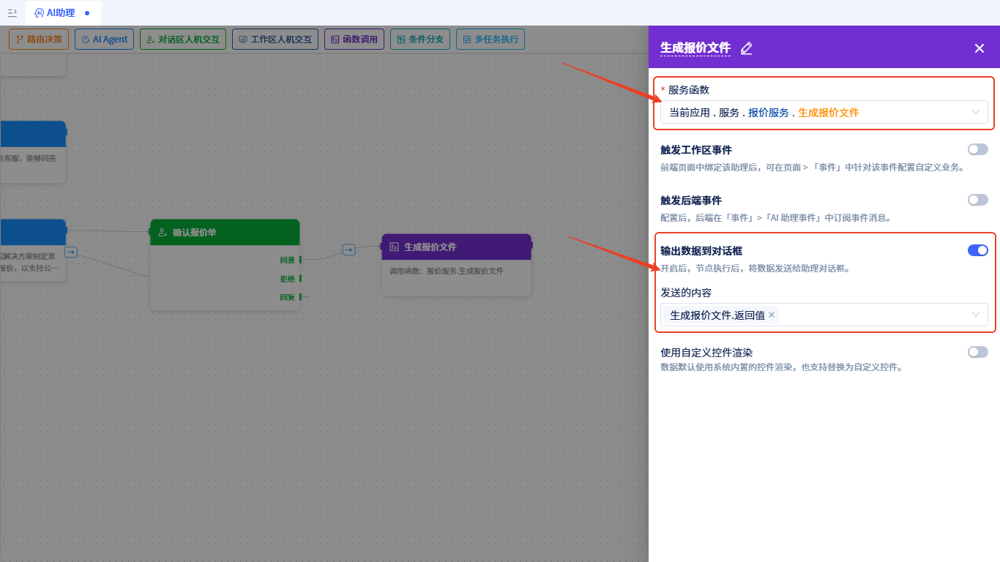

确认后，传入报价文件内容，自动生成Word报价文件。
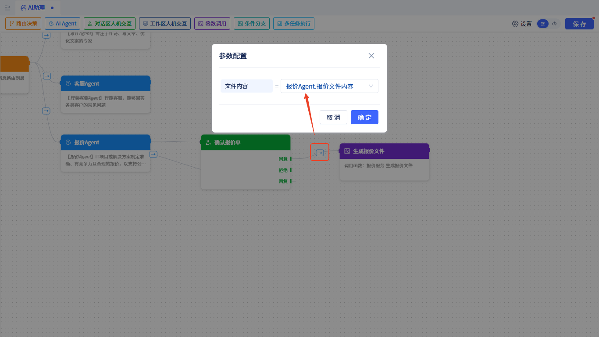


### 实现生成报价文件函数

创建一个名为**报价服务**的服务，创建方式参考：[创建服务元素](/docs/devguide/business-logic-development/creating-service-elements)。

在该服务中新建一个名为**生成报价文件**(generateQuotetion)的函数，接受一个参数：**报价文件内容**(quotetionContent)。该函数会基于报价文件内容生成一个Word文件，并返回Word文件信息。函数创建方式参考：[创建服务函数](/docs/devguide/business-logic-development/creating-service-elements#create-service-functions)。

服务源码如下：
```python
import io
import hashlib
import re
from datetime import datetime
from docx import Document
from docx.shared import Inches, Pt
from docx.enum.text import WD_ALIGN_PARAGRAPH
from docx.enum.style import WD_STYLE_TYPE
from services.NormalType import NormalService

class QuoteSvc(NormalService):

    def generateQuotetion(self, quotetionContent: str) -> str:
        """
        生成报价单文件，word文档，支持Markdown格式
        
        Args:
            quotetionContent (str): Markdown格式的报价单内容
            
        Returns:
            str: 上传后的文件信息，包含文件URL等信息
        """
        try:
            # 创建新的Word文档
            document = Document()
            
            # 设置文档样式
            self._setup_document_styles(document)
            
            # 解析Markdown内容并转换为Word格式
            self._parse_markdown_to_word(document, quotetionContent.value)
            
            # 将Document对象转换为二进制数据
            doc_buffer = io.BytesIO()
            document.save(doc_buffer)
            doc_binary_data = doc_buffer.getvalue()
            doc_buffer.close()
            
            # 生成文件名
            timestamp = datetime.now().strftime("%Y%m%d_%H%M%S")
            file_name = f"报价单_{timestamp}.docx"
            
            # 上传文件，设置过期时间为30天
            file_info = self.uploadByFile(
                file_name, 
                data=doc_binary_data, 
                contentType="application/vnd.openxmlformats-officedocument.wordprocessingml.document"
            )
            
            return [file_info]
            
        except Exception as e:
            error_msg = f"生成报价单时发生错误: {str(e)}"
            print(error_msg)
            return [{"error": error_msg}]
    
    def _setup_document_styles(self, document):
        """设置文档样式"""
        styles = document.styles
        
        # 设置标题样式
        for i in range(1, 7):
            try:
                heading_style = styles[f'Heading {i}']
            except KeyError:
                heading_style = styles.add_style(f'Heading {i}', WD_STYLE_TYPE.PARAGRAPH)
            
            if i == 1:
                heading_style.font.size = Pt(18)
                heading_style.font.bold = True
            elif i == 2:
                heading_style.font.size = Pt(16)
                heading_style.font.bold = True
            elif i == 3:
                heading_style.font.size = Pt(14)
                heading_style.font.bold = True
            else:
                heading_style.font.size = Pt(12)
                heading_style.font.bold = True
    
    def _parse_markdown_to_word(self, document, markdown_content):
        """解析Markdown内容并转换为Word格式"""
        lines = markdown_content.split('\n')
        i = 0
        
        while i < len(lines):
            line = lines[i].strip()
            
            if not line:
                i += 1
                continue
            
            # 处理标题
            if line.startswith('#'):
                level = len(line) - len(line.lstrip('#'))
                title_text = line.lstrip('#').strip()
                if title_text:
                    heading = document.add_heading(title_text, level=min(level, 6))
                    heading.style = f'Heading {min(level, 6)}'
            
            # 处理表格
            elif line.startswith('|') and '|' in line[1:]:
                table_data = self._parse_table(lines, i)
                if table_data:
                    self._create_table(document, table_data)
                    i += len(table_data) - 1
            
            # 处理列表
            elif line.startswith(('-', '*', '+')) or re.match(r'^\d+\.', line):
                list_items = self._parse_list(lines, i)
                self._create_list(document, list_items)
                i += len(list_items) - 1
            
            # 处理代码块
            elif line.startswith('```'):
                code_block = self._parse_code_block(lines, i)
                if code_block:
                    self._create_code_block(document, code_block)
                    i += len(code_block) + 1
            
            # 处理普通段落
            else:
                paragraph = document.add_paragraph()
                self._format_text(paragraph, line)
            
            i += 1
    
    def _parse_table(self, lines, start_index):
        """解析表格数据"""
        table_data = []
        i = start_index
        
        while i < len(lines):
            line = lines[i].strip()
            if not line.startswith('|'):
                break
            
            # 跳过分隔行
            if re.match(r'^\|[\s\-\|]+\|$', line):
                i += 1
                continue
            
            # 解析表格行
            cells = [cell.strip() for cell in line.split('|')[1:-1]]  # 去掉首尾空元素
            if cells:
                table_data.append(cells)
            
            i += 1
        
        return table_data
    
    def _create_table(self, document, table_data):
        """创建Word表格"""
        if not table_data:
            return
        
        table = document.add_table(rows=len(table_data), cols=len(table_data[0]))
        table.style = 'Table Grid'
        
        for i, row_data in enumerate(table_data):
            row = table.rows[i]
            for j, cell_data in enumerate(row_data):
                if j < len(row.cells):
                    cell = row.cells[j]
                    cell.text = cell_data
                    # 设置表格单元格样式
                    for paragraph in cell.paragraphs:
                        paragraph.alignment = WD_ALIGN_PARAGRAPH.CENTER
    
    def _parse_list(self, lines, start_index):
        """解析列表项"""
        list_items = []
        i = start_index
        
        while i < len(lines):
            line = lines[i].strip()
            if not line or (not line.startswith(('-', '*', '+')) and not re.match(r'^\d+\.', line)):
                break
            
            list_items.append(line)
            i += 1
        
        return list_items
    
    def _create_list(self, document, list_items):
        """创建Word列表"""
        for item in list_items:
            # 移除列表标记
            if re.match(r'^\d+\.', item):
                text = re.sub(r'^\d+\.\s*', '', item)
                document.add_paragraph(text, style='List Number')
            else:
                text = re.sub(r'^[-*+]\s*', '', item)
                document.add_paragraph(text, style='List Bullet')
    
    def _parse_code_block(self, lines, start_index):
        """解析代码块"""
        code_lines = []
        i = start_index + 1
        
        while i < len(lines):
            line = lines[i]
            if line.strip().startswith('```'):
                break
            code_lines.append(line)
            i += 1
        
        return code_lines
    
    def _create_code_block(self, document, code_lines):
        """创建代码块"""
        code_text = '\n'.join(code_lines)
        paragraph = document.add_paragraph()
        run = paragraph.add_run(code_text)
        run.font.name = 'Courier New'
        run.font.size = Pt(10)
        
        # 设置代码块背景色（灰色）
        paragraph.paragraph_format.left_indent = Inches(0.5)
        paragraph.paragraph_format.right_indent = Inches(0.5)
    
    def _format_text(self, paragraph, text):
        """格式化文本，处理粗体、斜体等"""
        # 处理粗体 **text** 或 __text__
        text = re.sub(r'\*\*(.*?)\*\*', r'**\1**', text)
        text = re.sub(r'__(.*?)__', r'**\1**', text)
        
        # 处理斜体 *text* 或 _text_
        text = re.sub(r'\*(.*?)\*', r'*\1*', text)
        text = re.sub(r'_(.*?)_', r'*\1*', text)
        
        # 分割文本并应用格式
        parts = re.split(r'(\*\*.*?\*\*|\*.*?\*)', text)
        
        for part in parts:
            if part.startswith('**') and part.endswith('**'):
                run = paragraph.add_run(part[2:-2])
                run.bold = True
            elif part.startswith('*') and part.endswith('*'):
                run = paragraph.add_run(part[1:-1])
                run.italic = True
            else:
                paragraph.add_run(part)

    def uploadByFile(
            self, fileName, data=None, contentType="application/octet-stream"
        ):
        # 上传文件
        # app是全局变量，无需导入
        storage = app.getElement("storages.Default")
        md5 = hashlib.md5(data).hexdigest()
        resp = storage.uploadByFile(md5, data, contentType)
        row = {
            "uid": md5,
            "name": md5,
            "storeFullName": "storages.Default",
            "uploadTime": datetime.now().strftime("%Y-%m-%d %H:%M:%S"),
            "md5": md5,
            "fileName": fileName,
            "url": resp["url"],
        }
        return row

```

至此，该助理的所有内容已开发完成。我们可以在门户中使用该助理，配置方式参考：[门户中使用AI助理](/docs/devguide/using-ai-in-portals-and-pages/using-ai-assistants-in-portals)。

:::tip 提示
一个AI助理可以处理多种不同类型的任务，建议为每种任务类型开启独立的对话处理流程。
:::


## 示例源码

<a href="https://jit-www.oss-cn-beijing.aliyuncs.com/docs/ai-multi-task-demo/whwy.MultiTaskAssistantDemo.0_0_0.zip">下载示例完整源码</a>.

该示例中助理的路由决策节点及各Agent使用了阿里云百炼平台的qwen-max-latest模型。你需要先<a href="https://bailian.console.aliyun.com/?tab=model#/api-key" target="_blank">申请API Key</a>，然后配置到环境变量中。配置方式如下：

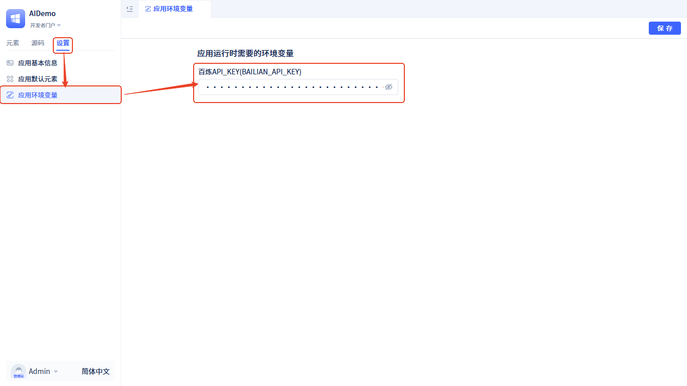。
