# 开发与UI页面协作的人机协作式企业级AI助理应用

## 产品核心特性概述 {#product-core-features-overview}

传统AI开发平台存在一个根本性限制：它们只能在后端运行，无法与用户界面进行深度交互。这就像让一个盲人做需要视觉判断的工作，效果可想而知。

**JitAi的创新突破**在于让AI能够真正"看到"和"操作"用户界面，实现AI与UI页面的深度融合协作。AI不仅能理解用户在页面上的操作，还能根据用户行为动态调整自己的决策。

**核心价值**：AI负责智能决策，人工负责质量把控，界面实现实时交互。三者完美结合，让AI应用真正变得实用和可靠。

**全栈AI能力**：突破前后端界限，让AI能够真正操作前端页面，具备"眼睛"和"手"的能力。

**可视化流程编排**：通过拖拽方式构建复杂的人机协作流程，无需编写代码。

## 技术实现解析 {#technical-implementation-analysis}

### AI与前端深度融合 {#deep-integration-of-ai-with-frontend}

#### 页面数据作为AI上下文 {#page-data-as-ai-context}

**技术原理**：将页面函数包装成AI可调用的工具，让AI能够实时获取用户操作数据。

**实现方式**：页面数据直接作为AI的输入参数，AI通过工具调用方式获取页面状态。

**应用价值**：AI能够动态感知用户行为，智能调整决策，实现真正的上下文感知。

### 人机协作节点设计 {#human-machine-collaboration-node-design}

#### 对话区人机交互节点 {#action-in-conversation-node}

**技术特性**：AI和用户通过对话框进行多轮对话交流。

**协作模式**：通过对话逐步明确需求，澄清问题，确认结果。

**应用价值**：特别适合需求澄清和结果确认的场景，确保AI完全理解用户意图。

#### 工作区人机交互节点 {#action-in-page-node}

**技术特性**：AI暂停执行，等待用户在前端页面完成操作。

**协作模式**：AI提供建议，用户做出最终决策，实现专家顾问式的协作。

**应用价值**：特别适合需要人工确认的复杂业务逻辑，如审批流程、质量检查等。

### 事件驱动的协作机制 {#event-driven-collaboration-mechanism}

**技术实现**：页面订阅AI助理的各种事件（开始执行、执行完成、异常等）。

**协作流程**：AI执行操作 → 触发事件 → 页面立即响应，实现实时同步。

**应用价值**：用户能够实时看到AI的工作状态，了解执行进展。

## 通过AI阅卷案例展示协作特性 {#demonstrating-collaboration-features-through-ai-grading-case-study}

### 案例背景与流程 {#case-background-and-process}

**业务场景**：教育机构老师需要批改试卷，传统手工批改工作量大且容易出错。

**核心需求**：AI帮助老师智能阅卷，关键质量把控由老师完成，既提高效率又保证质量。

**技术挑战**：如何在保证质量的前提下大幅提升效率？如何让AI和老师无缝协作？

**AI自动评分 + 人工复核模式**

**第一步：AI主导阶段**
阅卷Agent自动给每道题打分，并生成评分理由，大幅提高批改效率。

**第二步：人机协作节点**
AI评分完成后，通过对话区人机交互节点暂停，将评分结果输出到对话框由老师确认。
如果老师觉得某个分数不合适，可继续与AI对话，要求重新打分。

**第三步：UI页面协作**
如果老师觉得分数合适并确认后，会自动将评分结果更新到页面评分表单中。

### 效果展示 {#effect-demonstration}

import VideoPlayer from '@site/src/components/VideoPlayer';

<VideoPlayer relatePath="/docs/ai-grade-demo/demo-zhCN.mp4" />

## 开发步骤详解 {#detailed-development-steps}

### 前置准备 {#prerequisites}

- **题库表**（questionModel）
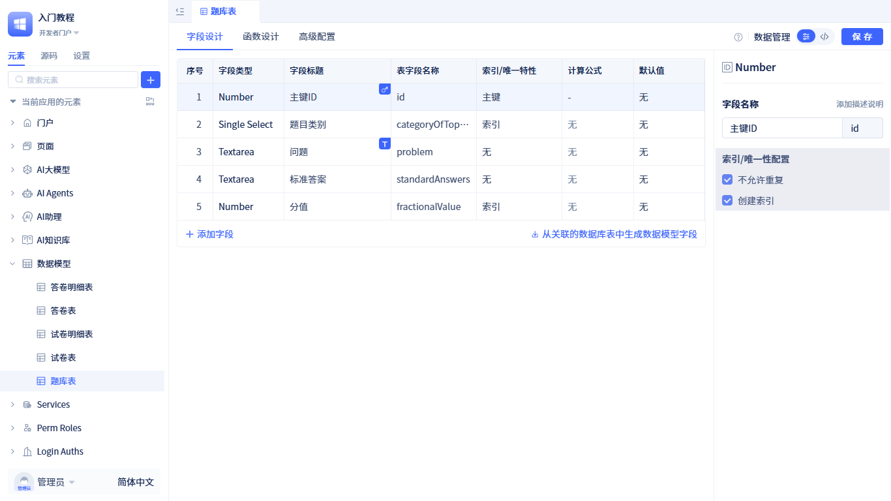

- **试卷表**（testTable）：
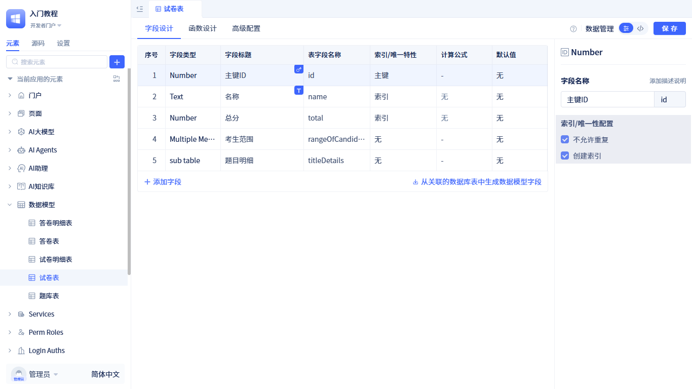

- **试卷明细模型**（detailedTitleOfTheTestPaper）：
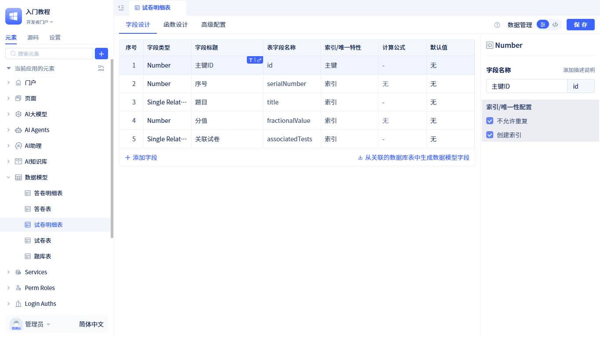

- **答卷表**（responseModel）：
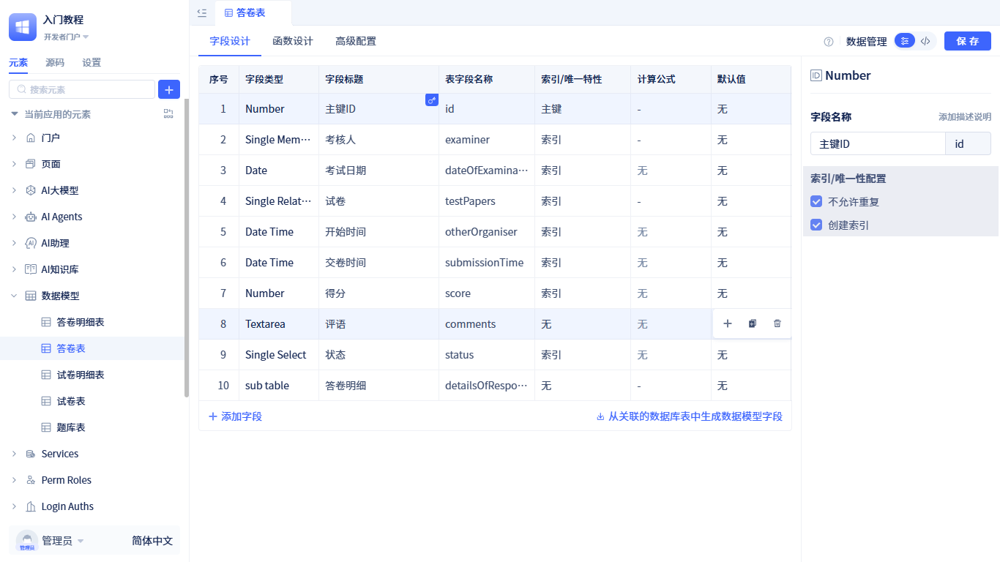

- **答卷明细表**（responseDetailModel）：
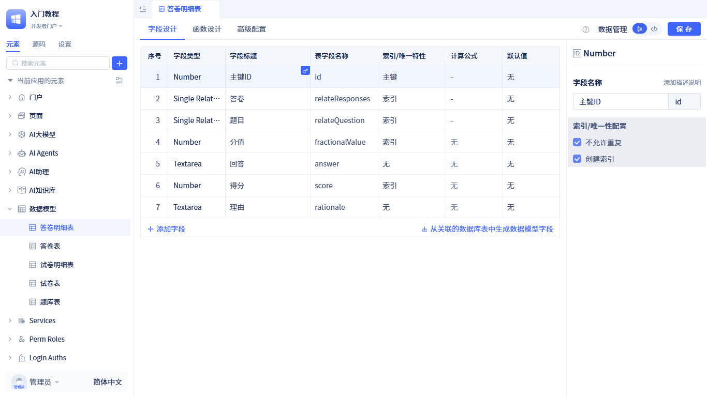

- **阅卷管理页面**(bookreadingManagement)：展示考生答卷列表，点击已完成答题的答卷，打开评分表单，表单中显示考卷信息、题目及考生的回答。

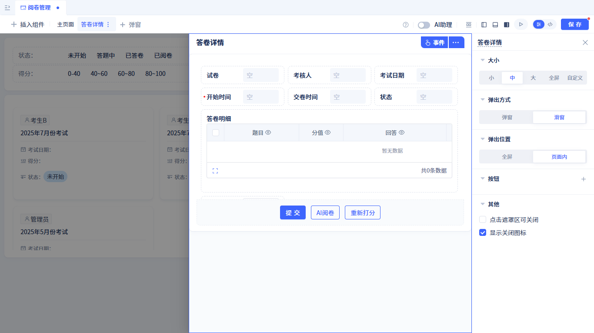

以上数据模型和页面结构我们提供了[完整源码](#source-code)，可直接下载使用。

接下来，我们为**阅卷管理页面**添加AI阅卷功能。

### 开发评分Agent {#developing-the-grading-agent}

评分Agent的工作流程如下：
从页面中获取答题明细，逐条评分，给出得分及理由并更新到答题明细中；然后根据整体得分情况给出一个总评语；最后输出包含得分及理由的答题明细与总评语。

- **创建评分Agent元素**：创建过程参考[创建AI Agent](../../ai-agent/create-ai-agent)。创建完成后[配置大模型](../../ai-agent/create-ai-agent#selecting-models-configuring-parameters)。
- **编写提示词**：
```markdown
# 角色：阅卷专家

# 核心任务
对考生答卷逐题打分，每一题都要打分并给出理由，若未答题，该题得0分。所有题目打分完成后写一个总评语。


# 工作流程
1. 调用 pages.bookreadingManagement.getVariableValue 工具，参数是'Form4.formData', 获取 `评分表单.表单模型` 的值，该值就是考生答卷信息，其中答卷信息中的detailsOfResponses是考生答题明细。
2. 对第1步获取的答题明细逐条打分并给出理由。打分方式：对比 `题目标准答案` 分析 `考生的回答`，结合 `题目分值` 给出一个公正客观的得分，并给出评分理由。更新答题明细中的得分(score字段)和理由(rationale字段)，返回更新后的答题明细
3. 根据所有题目的答题情况给出一个总结评语

# 重要约束
若任意一题的回答违背下列几种情况，所有题目分数一律为0，即使其他题目回答非常准确，得分也是0：
1. 销售话术需要有礼貌，尊重客户，秉承客户至上的原则；严禁出现内涵、辱骂客户的回答
2. 弘扬正确的价值观，回复内容避免出现敏感和违背社会主义核心价值观的内容
3. 态度积极，有耐心，避免情绪化

# 输出结果的特殊要求
- 要求数据在满足要求的情况下尽量简单
- 答题情况中的主键ID字段的值必须是答题明细中的id值，不要自己构造
- 答题情况中relateQuestion字段的值必须是答题明细中的relateQuestion字段的值，只需要id和problem属性
- 答题情况中relateResponses字段的值必须是答题明细中的relateResponses字段的值，只需要id属性

# 输出结果示例:
{
  "output": [
    {
      "id": 1,
      "relateResponses": {"id": 27},
      "relateQuestion": {"id": 542, "problem": "你们的服务费用是如何计算的？是否有灵活的付款方式？"},
      "fractionalValue": 20,
      "answer": "按月付费",
      "score": 5,
      "rationale": "回答过于简略，未详细说明费用计算方法及优惠政策，且与标准答案的核心内容不符。"
    },
  ],
  "comments": "xxxxx"
}
```

- **配置输出结果**：有两个输出参数：
    - 答题明细(output)：**考生明细表**的多行数据
    - 评语(comments)：对答卷的整体评语
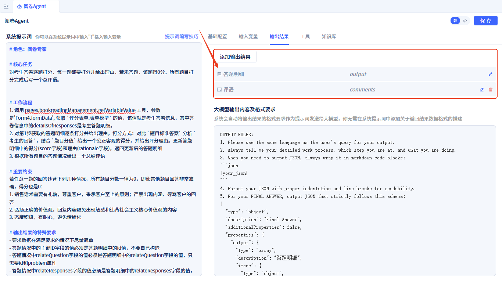

配置方式参考：[配置输出参数](../../ai-agent/agent-input-output#configuring-output-results)

- **配置调用工具**：将**阅卷管理页面**`获取变量值`添加为工具，Agent通过该工具获取页面中评分表单中的答题明细数据。

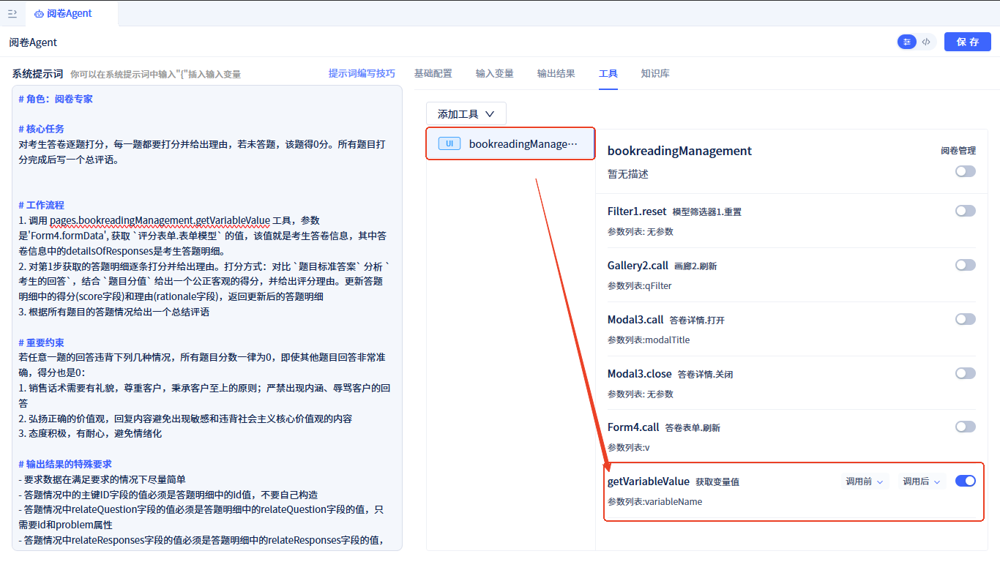

配置方式参考：[Agent 添加页面工具](../../ai-agent/agent-tools#calling-page-functions)


### 开发评分助理 {#developing-the-grading-assistant}

- **创建评分助理**：创建方式参考[创建AI助理](../create-ai-assistant)

- **编排助理流程**：
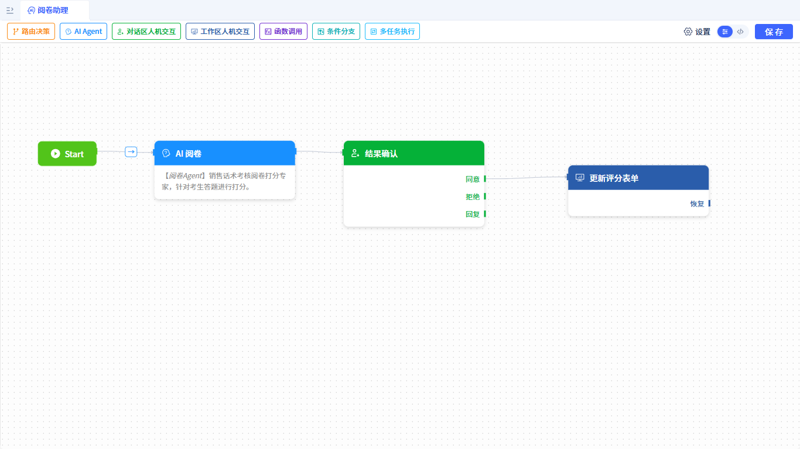

流程步骤为：`Start` -> `AI评分` -> `确认分数` -> `更新评分表单`
    - **AI评分**：[AI Agent节点](../process-orchestration-node-configuration#ai-agent)，绑定评分Agent。
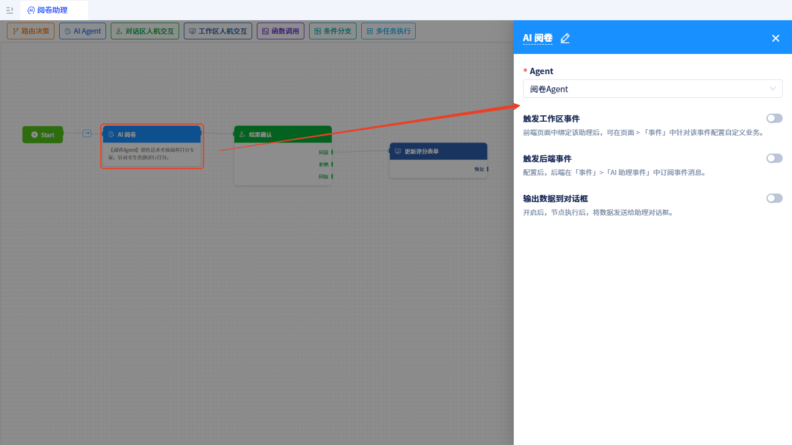
    - **确认分数**：[对话区人机交互节点](../process-orchestration-node-configuration#action-in-conversation)，展示评分Agent输出的答题明细及评语，等待人工确认，确认后更新评分表单。
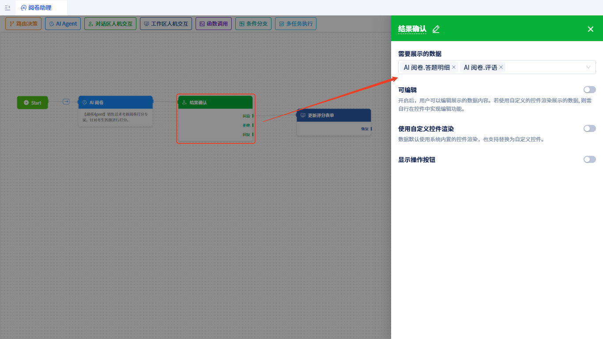
    - **更新评分表单**：[工作区人机交互节点](../process-orchestration-node-configuration#action-in-page)，暂停流程，并输出答题明细及评语到页面中。设置一个友好的提示语，提示用户下一步操作。
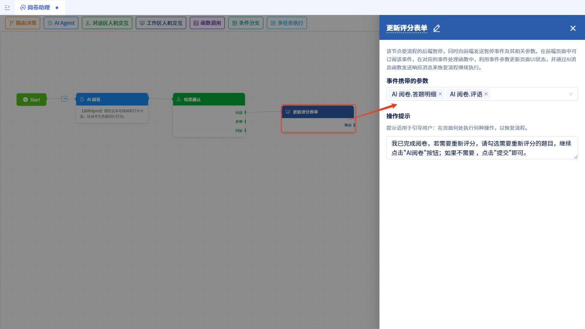

### 评分页面使用评分助理 {#using-the-grading-assistant-on-the-grading-page}

[开启AI助理](../../using-ai-in-portals-and-pages/using-ai-assistants-in-component-pages#enable-ai-assistant)并绑定评分助理。

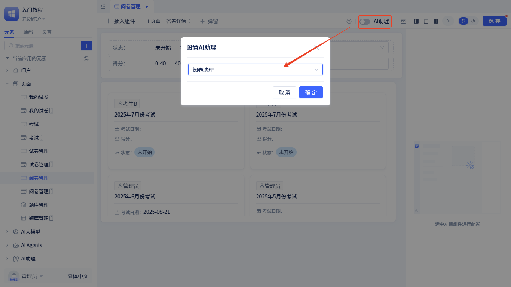

在评分表单中添加一个`AI评分`按钮，点击按钮后发送AI消息：'给当前考卷评分'。

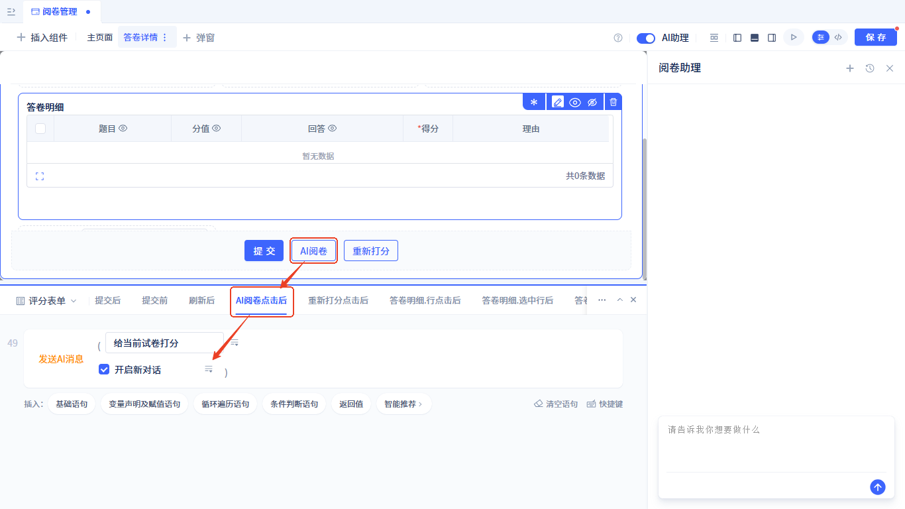

订阅评分助理-更新评分表单节点的暂停后事件，更新评分表单的答题明细、答卷总分、总评语及答卷状态。

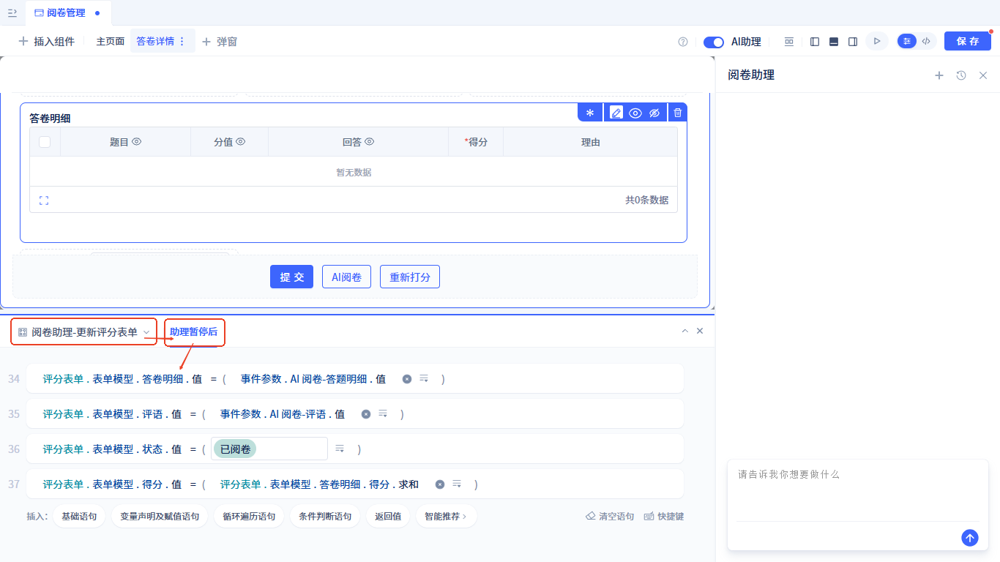


至此，我们就完成了AI阅卷功能的开发。是不是很简单？


### 示例源码 {#source-code}

下载地址: <a href="https://jit-www.oss-cn-beijing.aliyuncs.com/docs/ai-grade-demo/whwy.quickTutorial.0_0_0.zip">AI阅卷Demo源码</a>。

进入[JitNode控制台](../../creating-and-publishing-applications/runtime-environment-management#node-local-default-runtime-environment), 导入即可。

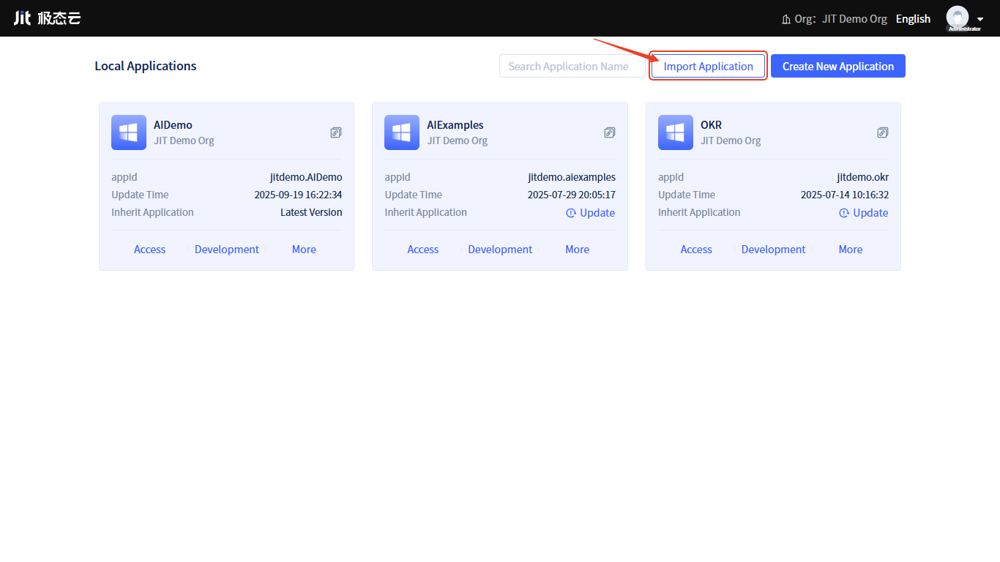