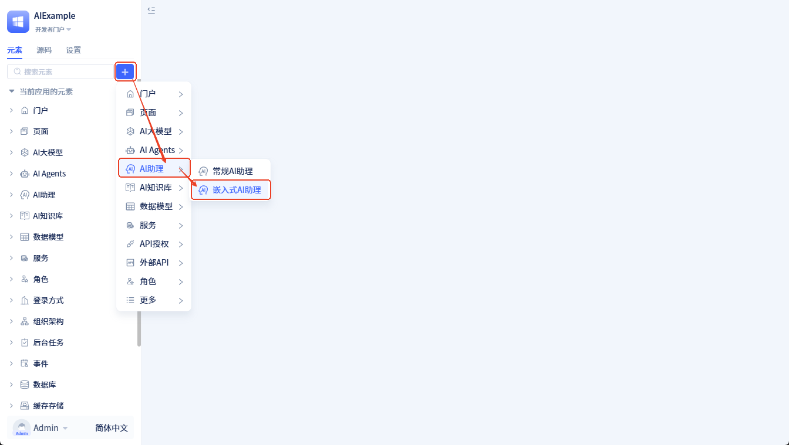
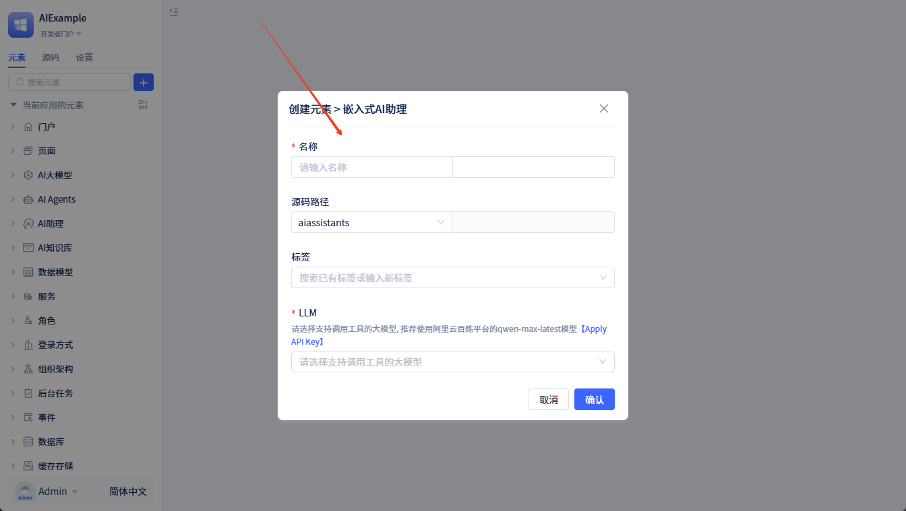
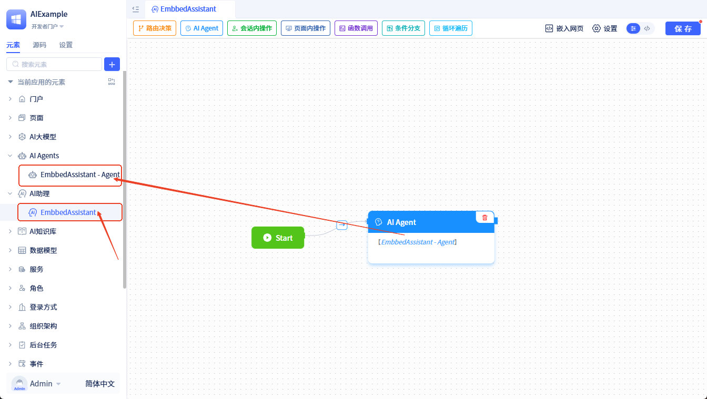
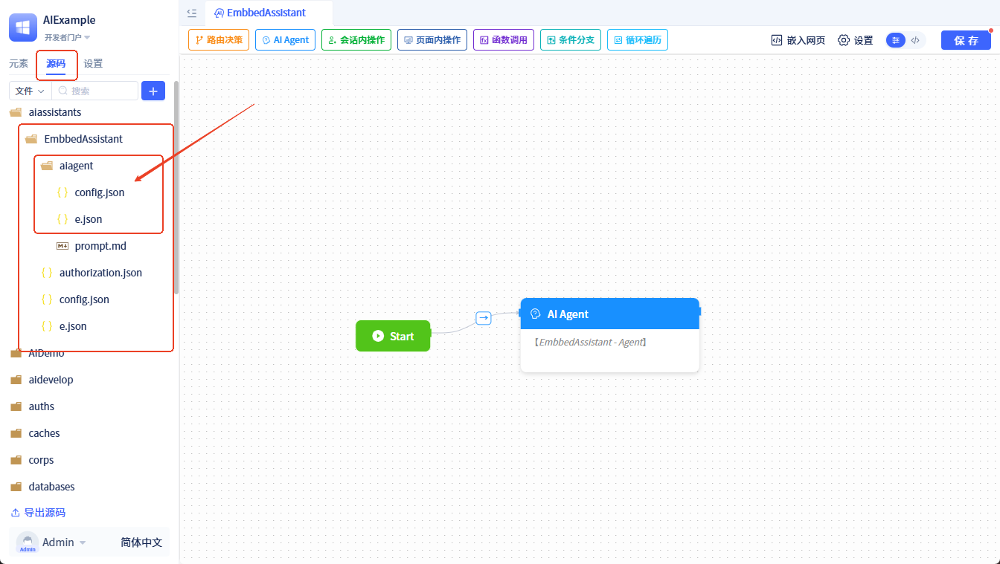
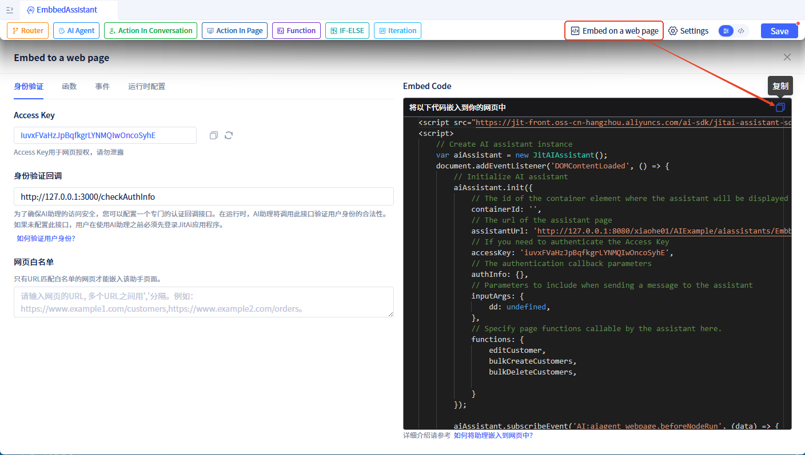
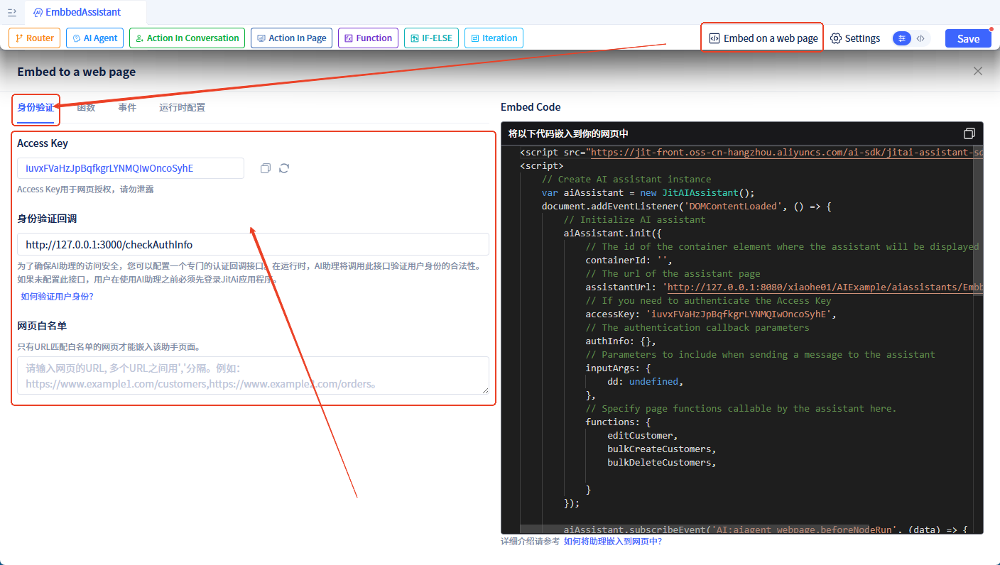
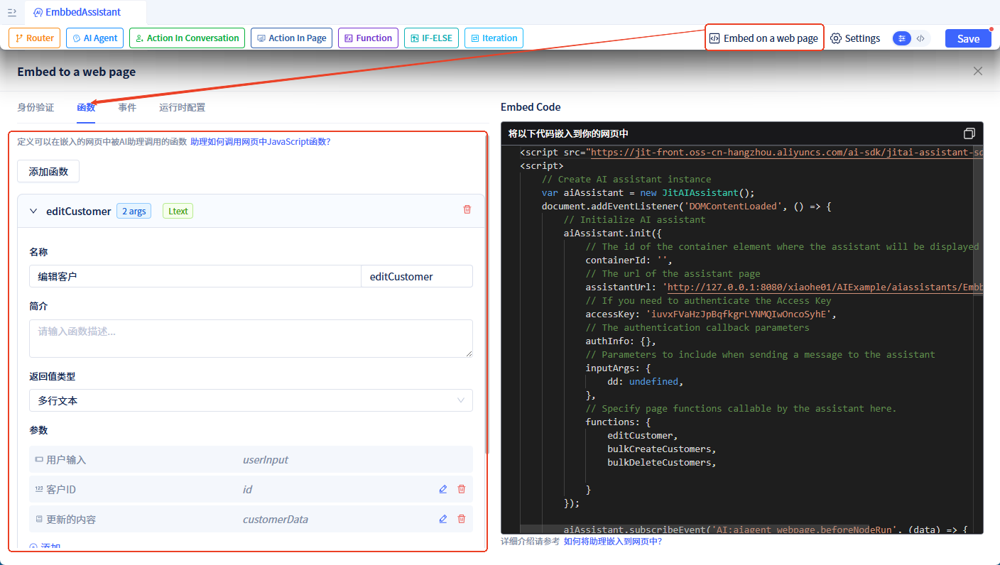
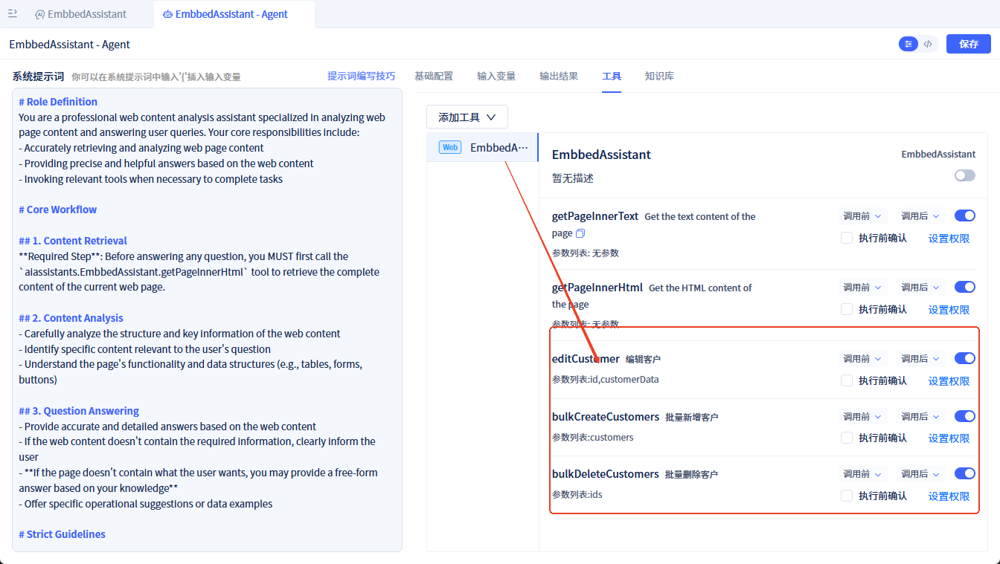
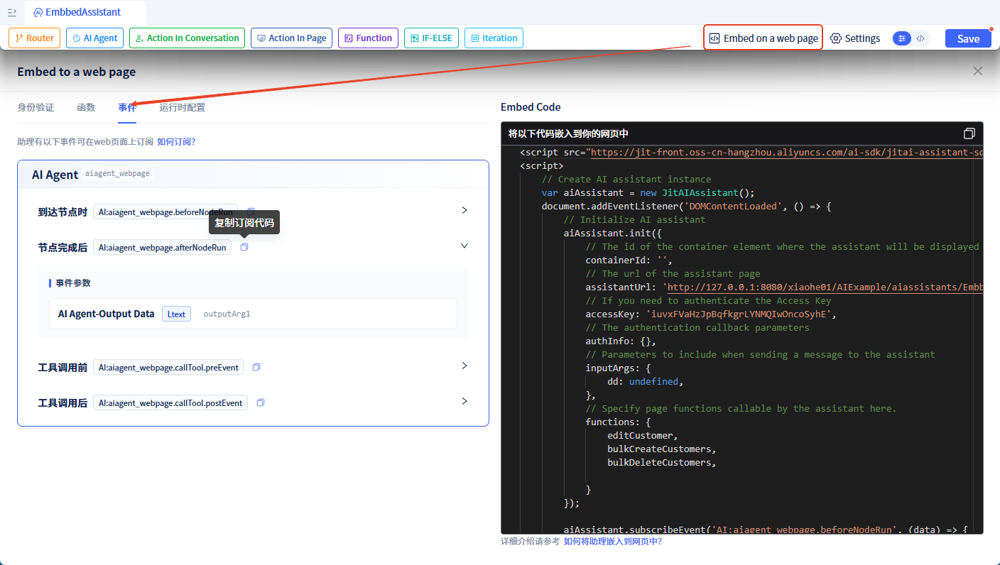

# 嵌入式AI助理

## 什么是嵌入式AI助理 {#what-is-embedded-ai-assistant}

在企业应用的实际场景中，常常需要在现有的网站、系统中集成AI能力。嵌入式AI助理是一种可以嵌入到任何外部网页中的AI助理。与普通AI助理页面不同，它专门针对外部集成场景进行了封装，支持跨域通信、授权验证等安全特性。

## 核心优势 {#core-advantages}

与市面上其他AI产品不同，JitAI的嵌入式AI助理实现了**网页与AI的深度双向交互**。传统AI产品只能做简单的对话问答，而嵌入式AI助理在此基础上增加了两大核心能力：

1. **AI操控网页**：AI助理能够理解对话意图，主动调用网页中的功能（如提交表单、删除数据、跳转页面等）
2. **网页驱动AI**：网页可以主动触发AI执行任务，并实时监听AI的执行过程和结果

**这意味着什么？**

我们的方案让AI真正成为网页的"智能操作员"，而不仅仅是一个聊天窗口。比如：
- 用户说"帮我删除这 3 个客户"，AI 不仅能理解，还能直接调用删除功能完成操作
- 用户点击网页上的"智能分析"按钮，AI 立即开始分析数据并返回结果

这种深度集成能力是目前市场上其他 AI 产品所不具备的。

## 集成流程 {#integration-process}

将AI助理集成到外部网页只需三个步骤：

1. **创建嵌入式AI助理**：创建一个专门用于嵌入的AI助理页面，获取访问 URL 和 Access Key
2. **在你的网页中引入SDK并初始化**：通过几行代码将AI助理嵌入到你的网页中
3. **配置双向交互（可选）**：根据需要配置AI助理调用网页功能、网页控制AI等高级能力

### 步骤一：创建嵌入式AI助理页面 {#creating-embedded-ai-assistant}

**创建步骤：**

1. 点击 <span style={{ background:"#3d65fd", display: "inline-block", borderRadius: "8px", textAlign: "center", lineHeight: "100%", color: "#ffffff", fontSize: "24px", padding: "0px 10px 5px" }}>+</span>  → **AI助理** → **嵌入式AI助理**



2. 填写助理信息（助理名称、说明等），点击"确定"按钮创建助理



3. 创建完成后，系统会自动生成：
   - 一个嵌入式AI助理元素
   - 一个 [AI Agent 元素](/docs/devguide/ai-agent/create-ai-agent)（名称为 `{助理名称}-Agent`）

助理中有一个 [AI Agent 节点](/docs/devguide/ai-assistant/process-orchestration-node-configuration#ai-agent)，绑定了新生成的 AI Agent 元素。



新生成的 AI Agent 元素源码在助理元素目录下，源码目录结构如下：



### 步骤二：将AI助理嵌入到外部网页 {#how-to-embeded-to-a-web-page}

创建完嵌入式AI助理后，你可以通过 JS SDK 将其嵌入到你的网页中。

**获取嵌入代码：**

点击编辑器顶部的"嵌入网页"，可以看到自动生成的嵌入代码：



**嵌入到你的网页：**

将上图中的代码复制到你的网页中即可。注意：需要将 `containerId` 替换为你网页中实际的 div 元素的 id。

示例代码：

```html
<!DOCTYPE html>
<html>
<head>
    <title>我的网页</title>
</head>
<body>
    <!-- 你的网页内容 -->
    <div id="ai-assistant-container" style="width: 400px; height: 600px;"></div>

    <!-- 引入JitAI SDK -->
    <script src="https://jit-front.oss-cn-hangzhou.aliyuncs.com/ai-sdk/jitai-assistant-sdk.min.js"></script>
    <script>
        var aiAssistant = new JitAIAssistant();
        document.addEventListener('DOMContentLoaded', () => {
            aiAssistant.init({
                containerId: 'ai-assistant-container',  // 容器ID
                assistantUrl: 'YOUR_ASSISTANT_URL',     // 替换为你的AI助理URL
                accessKey: 'YOUR_ACCESS_KEY'            // 替换为你的 Access Key，用于网页认证
            });
        });
    </script>
</body>
</html>
```

:::info 如何获取 assistantUrl 和 accessKey
- **assistantUrl**：在嵌入式AI助理页面的嵌入代码中可以找到，格式为 `http://域名/组织id/应用id/助理路径`
- **accessKey**：创建页面时自动生成，可在配置中查看和刷新
:::

### 步骤三：配置双向交互（可选） {#configure-interaction}

完成基本嵌入后，AI助理就可以正常工作了。如果你需要实现更高级的双向交互能力，可以继续配置以下功能。

## 身份验证 {#authentication}

### 网页认证 {#web-page-authentication}

为了保证安全，你可以配置以下访问控制策略：

- **Access Key 校验**：外部网页需要携带正确的 Access Key 才能使用 AI 助理。Access Key 用于网页认证，校验网页是否有权限访问该 AI 助理。创建助理后会自动生成一个 Access Key，你可以在配置中刷新替换。
页面中嵌入 AI 助理时需携带这个 Access Key，示例如下：

```javascript
var aiAssistant = new JitAIAssistant();
aiAssistant.init({
    ...,
    accessKey: 'YOUR_ACCESS_KEY',
    ...
});
```

- **网页白名单**：只有 URL 匹配白名单的网页才能嵌入该助理；如果不设置白名单，则所有网页均可嵌入。

### 用户认证 {#user-authentication}
**身份验证回调**：为了确保AI助理的访问安全，你可以配置一个专门的用户身份认证接口。在运行时，AI助理将调用此接口验证用户身份的合法性。如果未配置此接口，用户在使用AI助理之前必须先登录 JitAI 应用程序。

AI 助理会以 POST 的方式调用该接口，以 JSON 格式传入 `authInfo`，参数格式如下：
```json
{
    "authInfo": "xxxx"
}
```
`authInfo` 的内容是你在调用 JS SDK 时传入的，格式由你自己定义。示例如下：
```javascript
var aiAssistant = new JitAIAssistant();
aiAssistant.init({
    containerId: 'YOUR_CONTAINER_ID',
    assistantUrl: 'YOUR_ASSISTANT_URL',
    accessKey: 'YOUR_TOKEN',
    authInfo: "",  // 身份认证信息
    ...
});
```

接口需要按以下 JSON 格式返回校验结果：
- **success**: boolean，身份验证是否通过
- **userInfo**: object，身份验证通过时返回用户信息
  - userName: string，用户名，必须返回
  - userNick: string，用户昵称，非必须
- **message**: string，身份验证未通过时返回异常信息

示例如下：
```json
{
    "success": true | false,  // 身份验证是否通过
    "userInfo": {         // 身份验证通过时，返回用户信息
        "userName": "",   // 用户名
        "userNick": ""    // 用户昵称
    },
    "message": "xxx"      // 身份验证未通过时，返回异常信息
}
```




## 让 AI 调用网页中的 JavaScript 函数 {#how-to-call-page-functions}

如果你希望AI助理能够调用你网页中的函数，按以下步骤配置：

**第一步：声明可调用的函数**

在嵌入式AI助理中，内置了两个可供 AI 调用的工具：
- getPageInnerText：获取网页中的文本内容
- getPageInnerHtml：获取网页中的 HTML 内容

除此之外，开发者还可以声明其他函数：



函数声明后会自动注册到对应的 Agent 中作为可调用工具：



**第二步：在你的网页中实现这些函数并传给 SDK**

```javascript
<script src="https://jit-front.oss-cn-hangzhou.aliyuncs.com/ai-sdk/jitai-assistant-sdk.min.js"></script>
<script>
    // 实现可被 AI 调用的函数

    function editCustomer(id, info) {
        // todo: Edit Customers
        return { success: true };
    }

    function bulkCreateCustomers(customers) {
        // todo: Bulk Create Customers
        return { success: true };
    }

    function bulkDeleteCustomers(customerIds) {
        // todo: Bulk Delete Customers
        return { success: true };
    }

    // 初始化时传入函数
    var aiAssistant = new JitAIAssistant();
    aiAssistant.init({
        containerId: 'YOUR_CONTAINER_ID',
        assistantUrl: 'YOUR_ASSISTANT_URL',
        accessKey: 'YOUR_ACCESS_KEY',
        // ...
        functions: {     // 传入可调用的函数
            editCustomer,
            bulkCreateCustomers,
            bulkDeleteCustomers
        }
    });
</script>
```

:::warning 注意
网页中的函数名必须与 JitAI 平台中声明的函数名保持一致。
:::

## 在网页中订阅 AI 事件 {#subscribe-ai-events}

如果你需要监听 AI 的执行过程（比如显示加载状态、获取执行结果等），可以订阅 AI 事件：

```javascript
var aiAssistant = new JitAIAssistant();
aiAssistant.init({...}); // 初始化

// 订阅事件
aiAssistant.subscribeEvent('AI:aiagent_webpage.afterNodeRun', (data) => {
    console.log('AI 节点执行完成', data);
    // 你的处理逻辑
});
```

在 JitAI 平台的**事件**页签中可以查看所有可订阅的事件：



详细的事件列表和说明请参考 [AI助理事件文档](/docs/devguide/ai-assistant/ai-assistant-event#frontend-page-events)。

## 运行时配置 {#runtime-config}

- **Container id**：网页中用于显示助理的容器元素的 id。
- **欢迎语**：配置用户打开或首次进入 AI 助理界面时显示的简短问候语。
- **开场白**：引导用户进入主题、启发可问范围、加速意图收集的问话模板。
- **输出运行过程日志**：指定助理运行过程中输出的[日志内容](/docs/devguide/ai-assistant/ai-assistant-input-output#message-output)。
- **输入参数**：在 AI 助理运行时发送消息可以额外携带一些参数，这些参数需要在助理中提前设置好。设置方式参考：[自定义输入参数](/docs/devguide/ai-assistant/ai-assistant-input-output#input-args)。


```javascript
var aiAssistant = new JitAIAssistant();
aiAssistant.init({
    containerId: 'YOUR_CONTAINER_ID',
    assistantUrl: 'YOUR_ASSISTANT_URL',
    accessKey: 'YOUR_ACCESS_KEY',
    // 助理初始化时显示的欢迎语
    welcomeMessage: "Hi there! I'm your Web Page Assistant~ I can help you summarize long articles, translate foreign-language content, or answer any questions you have about a page. Just let me know what you need help with!​😊",
    // 助理初始化时显示的开场白
    prologues: ["Summarize the content of this page"],
    // 助理输出日志类型
    logContent: "LLM_CONCISE_LOG"
    // ...
});
```

## 从网页主动发送消息给 AI {#send-message-to-ai}

你可以让网页中的按钮或其他操作触发 AI 执行任务：

```html
<body>
    <button onclick="searchWithAI('查询本月销售数据')">智能查询</button>
    
    <div id="ai-assistant-container"></div>

    <script src="https://jit-front.oss-cn-hangzhou.aliyuncs.com/ai-sdk/jitai-assistant-sdk.min.js"></script>
    <script>
        var aiAssistant = new JitAIAssistant();
        aiAssistant.init({...}); // 初始化

        function searchWithAI(query) {
            aiAssistant.sendMessage(query);  // 发送消息给 AI
        }
    </script>
</body>
```


## JS SDK {#js-sdk}

### 引入 SDK {#import-sdk}

在 HTML 页面中引入 SDK 文件：

```html
<script src="https://jit-front.oss-cn-hangzhou.aliyuncs.com/ai-sdk/jitai-assistant-sdk.min.js"></script>
```

### API 参考 {#api-reference}

#### 创建实例 {#create-instance}

```javascript
var aiAssistant = new JitAIAssistant();
```

创建一个 AI 助理实例对象。

#### init(options) {#init-method}

初始化 AI 助理并嵌入到指定容器中。

**参数说明：**

| 参数名 | 类型 | 必填 | 说明 |
|--------|------|------|------|
| containerId | string | 是 | 承载 AI 助理的 HTML 容器元素的 ID |
| assistantUrl | string | 是 | AI 助理页面的完整 URL 地址 |
| accessKey | string | 是 | Access Key，用于网页认证，校验网页是否有权限使用该 AI 助理 |
| authInfo | string | 否 | 身份认证信息，用于身份验证回调接口 |
| welcomeMessage | string | 否 | 给助理设置[欢迎语](/docs/devguide/ai-assistant/welcome-message-and-opening) |
| prologues | array | 否 | 给助理设置[开场白](/docs/devguide/ai-assistant/welcome-message-and-opening) |
| logContent | string | 否 | 指定助理运行过程中输出的[日志内容](/docs/devguide/ai-assistant/ai-assistant-input-output#message-output) |
| inputArgs | object | 否 | 给助理[输入参数](/docs/devguide/ai-assistant/ai-assistant-input-output#input-args)赋值 |
| functions | object | 否 | 网页中可供 AI 助理调用的 JavaScript 函数集合 |

**示例：**

```javascript
aiAssistant.init({
    containerId: 'ai-assistant-container',
    assistantUrl: 'http://127.0.0.1:8080/xiaohe01/AIExample/aiassistants/EmbbedAssistant',  
    accessKey: 'iuvxFVaHzJpBqfkgrLYNMQIwOncoSyhE',
    authInfo: 'user-token-xxx',
    welcomeMessage: "Hi there! I'm your Web Page Assistant~ I can help you summarize long articles, translate foreign-language content, or answer any questions you have about a page. Just let me know what you need help with!​😊",
    prologues: ["Summarize the content of this page"],
    logContent: "LLM_CONCISE_LOG",
    inputArgs: {
        currentPage: 'home'
    },
    functions: {
        bulkDeleteCustomers
    }
});
```

#### sendMessage(message, inputArgs) {#send-message-method}

向 AI 助理发送消息。

**参数说明：**

| 参数名 | 类型 | 必填 | 说明 |
|--------|------|------|------|
| message | string | 是 | 要发送的消息内容 |
| openNewConversation| 1 | 0 | 否 | 是否开启新的会话 |
| inputArgs | object | 否 | 发送消息时携带的输入参数，会覆盖 init 时设置的 inputArgs |

**示例：**

```javascript
// 发送简单消息
aiAssistant.sendMessage('帮我查询最近一周的销售数据');

// 发送消息并携带参数
aiAssistant.sendMessage('分析用户行为', 0, {
    userId: '12345',
    dateRange: 'last7days'
});
```

#### subscribeEvent(eventName, callback) {#subscribe-event-method}

订阅 AI 助理的事件。

**参数说明：**

| 参数名 | 类型 | 必填 | 说明 |
|--------|------|------|------|
| eventName | string | 是 | 事件名称，格式为 `AI:{元素名称}.{事件名}` |
| callback | function | 是 | 事件回调函数，接收事件数据作为参数 |

**示例：**

```javascript
// 订阅 AI Agent 节点运行完成事件
aiAssistant.subscribeEvent('AI:aiagent_webpage.afterNodeRun', (data) => {
    console.log('节点运行完成', data);
});

// 订阅多个事件
aiAssistant.subscribeEvent('AI:aiagent_webpage.beforeNodeRun', (data) => {
    console.log('节点开始运行', data);
});

aiAssistant.subscribeEvent('AI:aiagent_webpage.onError', (data) => {
    console.error('运行出错', data);
});
```


### 完整示例 {#complete-example}

以下是一个完整的嵌入式 AI 助理使用示例，展示了如何集成所有功能：

```html
<!DOCTYPE html>
<html>
<head>
    <meta charset="UTF-8">
    <title>嵌入式 AI 助理示例</title>
    <style>
        #ai-assistant-container {
            width: 400px;
            height: 600px;
            border: 1px solid #e0e0e0;
            border-radius: 8px;
        }
    </style>
</head>
<body>
    <h1>客户管理系统</h1>
    
    <button onclick="analyzeData()">智能分析数据</button>
    <button onclick="askAI('帮我统计今天新增的客户数量')">查询新增客户</button>
    
    <!-- AI 助理容器 -->
    <div id="ai-assistant-container"></div>

    <!-- 引入 JitAI SDK -->
    <script src="https://jit-front.oss-cn-hangzhou.aliyuncs.com/ai-sdk/jitai-assistant-sdk.min.js"></script>
    <script>
        // 定义网页函数供 AI 调用
        function editCustomer(id, info) {
            console.log('编辑客户:', id, info);
            // 实现编辑客户的逻辑
            return { success: true, message: '客户信息已更新' };
        }

        function bulkDeleteCustomers(customerIds) {
            console.log('批量删除客户:', customerIds);
            // 实现批量删除逻辑
            return { success: true, deletedCount: customerIds.length };
        }

        function getCustomerList() {
            // 返回客户列表
            return {
                success: true,
                data: [
                    { id: 1, name: '张三', phone: '13800138000' },
                    { id: 2, name: '李四', phone: '13900139000' }
                ]
            };
        }

        // 创建 AI 助理实例
        var aiAssistant = new JitAIAssistant();

        // 页面加载完成后初始化
        document.addEventListener('DOMContentLoaded', () => {
            aiAssistant.init({
                containerId: 'ai-assistant-container',
                assistantUrl: 'http://127.0.0.1:8080/xiaohe01/AIExample/aiassistants/CustomerAssistant',
                accessKey: 'your-access-key-here',
                authInfo: 'user-session-token',
                welcomeMessage: '你好！我是您的客户管理助手，我可以帮您查询、编辑、删除客户信息。',
                prologues: [
                    '查询所有客户',
                    '统计客户数量',
                    '删除指定客户'
                ],
                logContent: 'LLM_CONCISE_LOG',
                inputArgs: {
                    currentUser: 'admin',
                    department: 'sales'
                },
                functions: {
                    editCustomer,
                    bulkDeleteCustomers,
                    getCustomerList
                }
            });

            // 订阅事件
            aiAssistant.subscribeEvent('AI:customer_agent.afterNodeRun', (data) => {
                console.log('AI 任务完成:', data);
                // 可以在这里更新页面 UI
            });

            aiAssistant.subscribeEvent('AI:customer_agent.onError', (data) => {
                console.error('AI 任务出错:', data);
                alert('操作失败，请重试');
            });
        });

        // 网页主动触发 AI 分析
        function analyzeData() {
            aiAssistant.sendMessage('请帮我分析当前客户数据的特征', 1, {
                analysisType: 'comprehensive'
            });
        }

        // 网页主动向 AI 提问
        function askAI(question) {
            aiAssistant.sendMessage(question);
        }
    </script>
</body>
</html>
```
