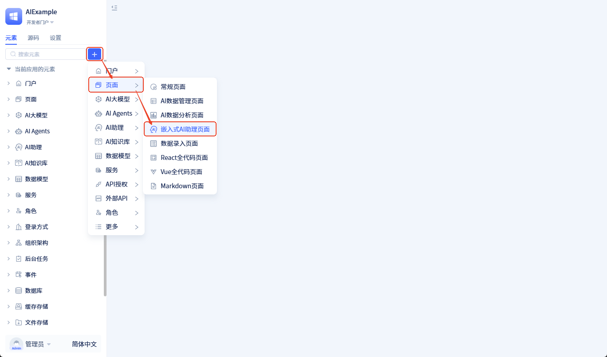
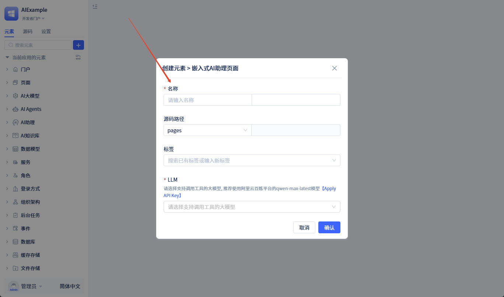
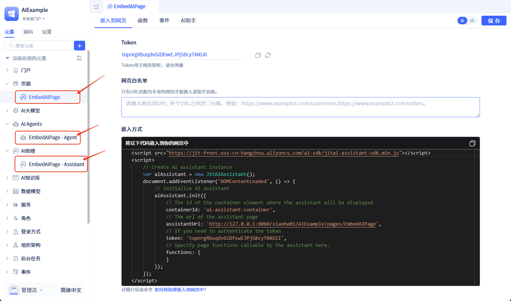
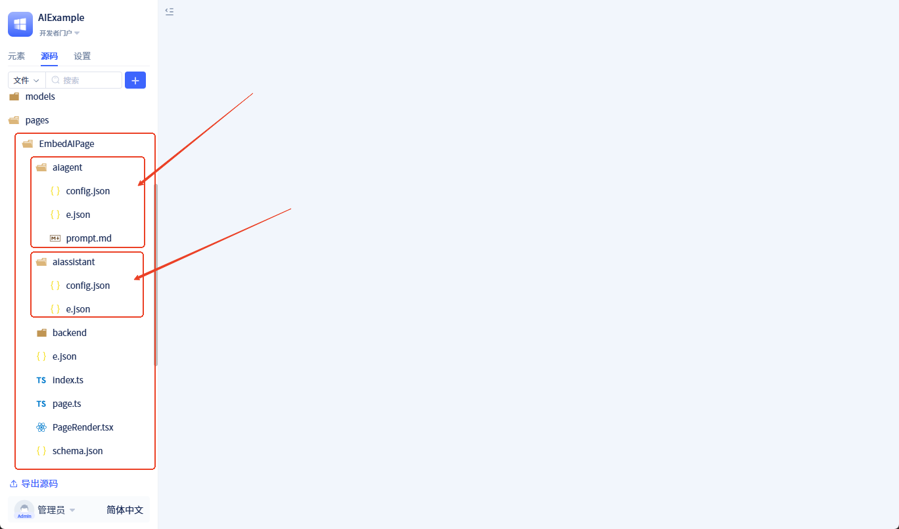
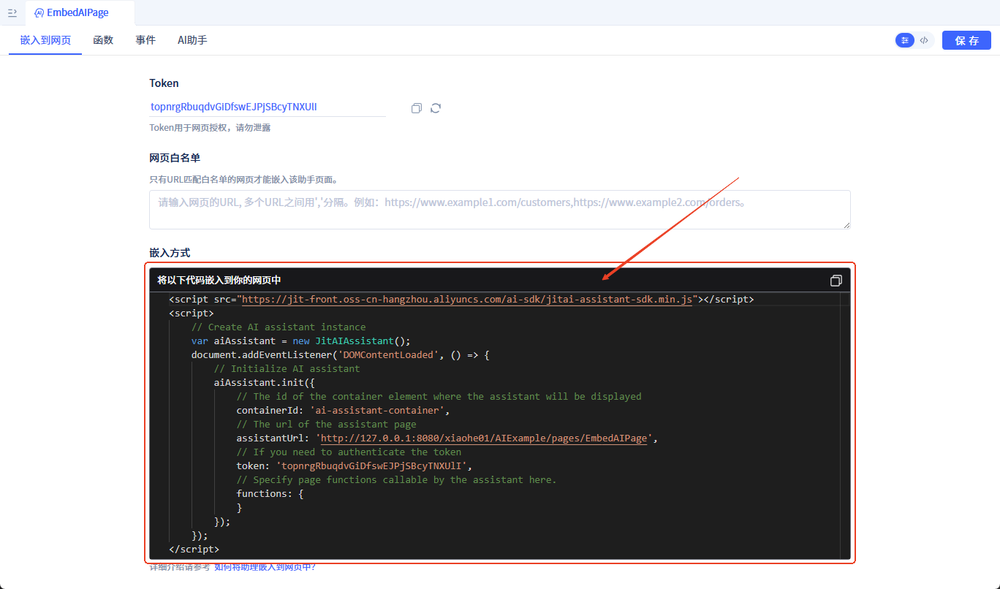
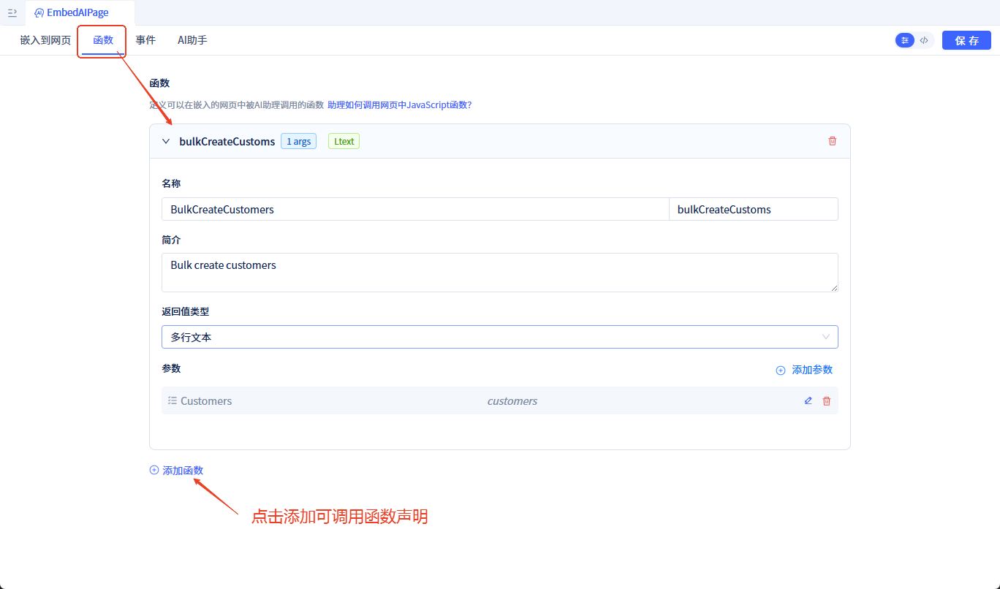
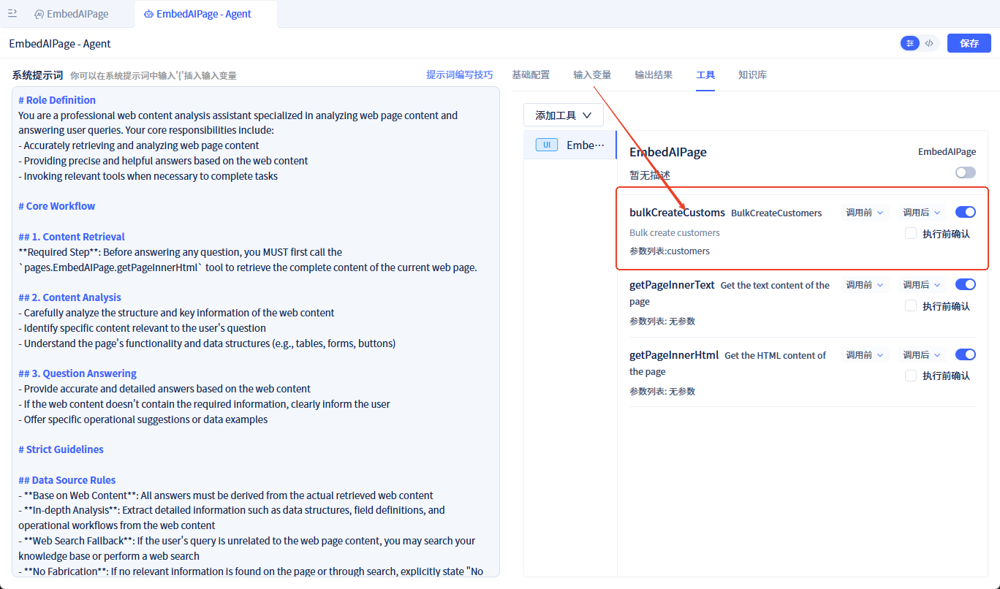
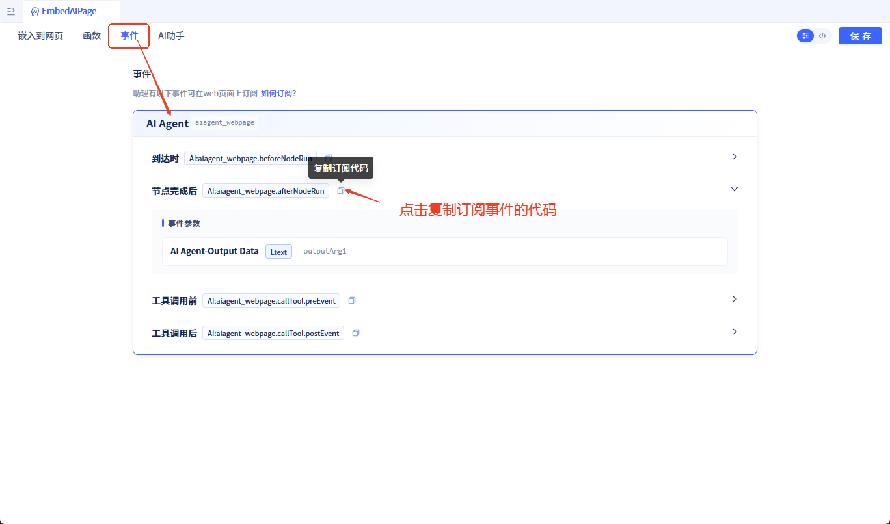
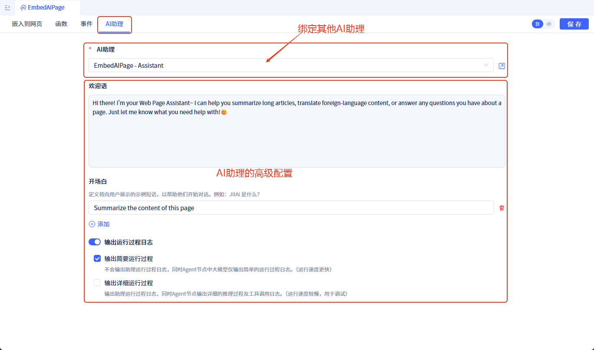

# 外部网页中嵌入AI助理

企业在实际应用中，常常需要在现有的网站、系统中集成AI能力。本方案支持将AI助理快速嵌入到任何网页中，为用户提供智能化服务。

## 核心优势 {#core-advantages}

与市面上其他AI产品不同，JitAi实现了**网页与AI的深度双向交互**。传统AI产品只能做简单的对话问答，而JitAi在此基础上增加了两大核心能力：

1. **AI操控网页**：AI助理能够理解对话意图，主动调用网页中的功能（如提交表单、删除数据、跳转页面等）
2. **网页驱动AI**：网页可以主动触发AI执行任务，并实时监听AI的执行过程和结果

**这意味着什么？**

我们的方案让AI真正成为网页的"智能操作员"，而不仅仅是一个聊天窗口。比如：
- 用户说"帮我删除这3个客户"，AI不仅能理解，还能直接调用删除功能完成操作
- 用户点击网页上的"智能分析"按钮，AI立即开始分析数据并返回结果

这种深度集成能力，是目前市场上其他AI产品所不具备的。

## 集成流程 {#integration-process}

将AI助理集成到外部网页只需三个步骤：

1. **创建嵌入式AI助理页面**：创建一个专门用于嵌入的AI助理页面，获取访问URL和Token
2. **在你的网页中引入SDK并初始化**：通过几行代码将AI助理嵌入到你的网页中
3. **配置双向交互（可选）**：根据需要配置AI调用网页功能、网页控制AI等高级能力

本文将详细介绍每个步骤的具体操作方法。

## 步骤一：创建嵌入式AI助理页面 {#creating-embeded-ai-assistant-page}

首先，你需要创建一个**嵌入式AI助理页面**。

:::tip 什么是嵌入式AI助理页面？
嵌入式AI助理页面是一种特殊的页面类型，它封装了AI助理的交互界面和运行逻辑，可以方式嵌入到任何外部网页中。与普通AI助理页面不同，它专门针对外部集成场景进行了优化，支持跨域通信、Token验证等安全特性。
:::

**创建步骤：**

1. 点击 <span style={{ background:"#3d65fd", display: "inline-block", borderRadius: "8px", textAlign: "center", lineHeight: "100%", color: "#ffffff", fontSize: "24px", padding: "0px 10px 5px" }}>+</span>  → **页面** → **嵌入式AI助理页面**



2. 填写页面信息（页面名称、说明等），点击 `确定` 按钮创建页面



3. 创建完成后，系统会自动生成：
   - 一个嵌入式AI助理页面
   - 一个[AI助理元素](/docs/devguide/ai-assistant/create-ai-assistant)（名称为 `{页面名称}-Assistant`）
   - 一个[AI Agent元素](/docs/devguide/ai-agent/create-ai-agent)（名称为 `{页面名称}-Agent`）



源码目录结构：



## 步骤二：将AI助理嵌入到外部网页 {#how-to-embeded-to-a-web-page}

创建完嵌入式AI助理页面后，你可以通过 JS SDK 将其嵌入到你的网页中。

**获取嵌入代码：**

在嵌入式AI助理页面的编辑界面，可以看到自动生成的嵌入代码：



**嵌入到你的网页：**

将上图中的代码复制到你的网页中即可。注意：需要将 `containerId` 替换为你网页中实际的 div 标签的 id。

示例代码：

```html
<!DOCTYPE html>
<html>
<head>
    <title>我的网页</title>
</head>
<body>
    <!-- 你的网页内容 -->
    <div id="ai-assistant-container" style="width: 400px; height: 600px;"></div>

    <!-- 引入JitAi SDK -->
    <script src="https://jit-front.oss-cn-hangzhou.aliyuncs.com/ai-sdk/jitai-assistant-sdk.min.js"></script>
    <script>
        var aiAssistant = new JitAIAssistant();
        document.addEventListener('DOMContentLoaded', () => {
            aiAssistant.init({
                containerId: 'ai-assistant-container',  // 容器ID
                assistantUrl: 'YOUR_ASSISTANT_URL',     // 替换为你的AI助理页面URL
                token: 'YOUR_TOKEN'                     // 替换为你的Token
            });
        });
    </script>
</body>
</html>
```

:::info 如何获取 assistantUrl 和 token？
- **assistantUrl**：在嵌入式AI助理页面的嵌入代码中可以找到，格式为 `http://域名/组织id/应用id/页面路径`
- **token**：创建页面时自动生成，可在页面配置中查看和刷新
:::

### 访问控制 {#access-control}

为了保证安全，你可以配置以下访问控制策略：

- **Token 校验**：外部网页需要凭借正确的 Token 才能访问AI助理。创建页面时会自动生成一个 Token，你可以随时刷新。
- **网页白名单**：只有URL匹配白名单的网页才能嵌入该助理；如果不设置白名单，则所有网页均可嵌入。

## 步骤三：配置双向交互（可选） {#configure-interaction}

完成基本嵌入后，AI助理就可以正常工作了。如果你需要实现更高级的双向交互能力，可以继续配置以下功能。

### 让AI调用网页中的 JavaScript 函数 {#how-to-call-page-functions}

如果你希望AI助理能够调用你网页中的函数（比如删除数据、提交表单等），按以下步骤配置：

**第一步：在页面中声明可调用的函数**

在嵌入式AI助理页面中，声明哪些函数可以被AI调用：



函数声明后会自动注册到对应的 Agent 中作为可调用工具：



**第二步：在你的网页中实现这些函数并传给SDK**

```javascript
<script src="https://jit-front.oss-cn-hangzhou.aliyuncs.com/ai-sdk/jitai-assistant-sdk.min.js"></script>
<script>
    // 实现可被AI调用的函数
    function bulkDeleteCustomers(customerIds){
        console.log('删除客户：', customerIds);
        // 你的删除逻辑
        return { success: true, message: '删除成功' };
    }

    // 初始化时传入函数
    var aiAssistant = new JitAIAssistant();
    document.addEventListener('DOMContentLoaded', () => {
        aiAssistant.init({
            containerId: 'ai-assistant-container',
            assistantUrl: 'YOUR_ASSISTANT_URL',
            token: 'YOUR_TOKEN',
            functions: {
                bulkDeleteCustomers  // 传入可调用的函数
            }
        });
    });
</script>
```

:::warning 注意
网页中的函数名必须与JitAi平台中声明的函数名保持一致。
:::

### 在网页中订阅 AI 事件 {#subscribe-ai-events}

如果你需要监听AI的执行过程（比如显示加载状态、获取执行结果等），可以订阅AI事件：

```javascript
var aiAssistant = new JitAIAssistant();
aiAssistant.init({...}); // 初始化

// 订阅事件
aiAssistant.subscribeEvent('AI:aiagent_webpage.afterNodeRun', (data) => {
    console.log('AI节点执行完成', data);
    // 你的处理逻辑
});
```

在JitAi平台的**事件**页签中可以查看所有可订阅的事件：



详细的事件列表和说明请参考[AI助理事件文档](/docs/devguide/ai-assistant/ai-assistant-event#frontend-page-events)。

### 从网页主动发送消息给 AI {#send-message-to-ai}

你可以让网页中的按钮或其他操作触发AI执行任务：

```html
<body>
    <button onclick="searchWithAI('查询本月销售数据')">智能查询</button>
    
    <div id="ai-assistant-container"></div>

    <script src="https://jit-front.oss-cn-hangzhou.aliyuncs.com/ai-sdk/jitai-assistant-sdk.min.js"></script>
    <script>
        var aiAssistant = new JitAIAssistant();
        aiAssistant.init({...}); // 初始化

        function searchWithAI(query){
            aiAssistant.sendMessage(query);  // 发送消息给AI
        }
    </script>
</body>
```

## AI 助理配置 {#assistant-configuration}

### 绑定 AI 助理 {#bind-assistant}

新建嵌入式AI助理页面时会自动创建并绑定一个AI助理元素。你也可以替换为其他已有的AI助理。

:::warning 注意
如果替换为其他AI助理，在页面中声明的可调用函数将不会自动更新到新助理所用的 Agent 中，需要手动配置。
:::

### 高级配置 {#assistant-advanced-configuration}

你可以对AI助理进行以下高级配置：

- 自定义[欢迎语与开场白](/docs/devguide/ai-assistant/welcome-message-and-opening)
- 自定义[输出运行过程日志](/docs/devguide/ai-assistant/ai-assistant-input-output#message-output)，默认会输出简要过程日志




## JS SDK {#js-sdk}

### 引入 SDK {#import-sdk}

在 HTML 页面中引入 SDK 文件：

```html
<script src="https://jit-front.oss-cn-hangzhou.aliyuncs.com/ai-sdk/jitai-assistant-sdk.min.js"></script>
```

### API 参考 {#api-reference}

#### 创建实例 {#create-instance}

```javascript
var aiAssistant = new JitAIAssistant();
```

创建一个 AI 助理实例对象。

#### init(options) {#init-method}

初始化 AI 助理并嵌入到指定容器中。

**参数说明：**

| 参数名 | 类型 | 必填 | 说明 |
|--------|------|------|------|
| containerId | string | 是 | 承载 AI 助理的 HTML 容器元素的 ID |
| assistantUrl | string | 是 | AI 助理页面的完整 URL 地址 |
| token | string | 是 | 访问 Token，用于身份验证 |
| functions | object | 否 | 网页中可供 AI 助理调用的 JavaScript 函数集合 |

**示例：**

```javascript
aiAssistant.init({
    containerId: 'ai-assistant-container',
    assistantUrl: 'http://127.0.0.1:8080/xiaohe01/AIExample/pages/EmbedAIPage',
    token: 'topnrgRbuqdvGiDfswEJPjSBcyTNXUlI',
    functions: {
        bulkDeleteCustomers,
        updateUserInfo
    }
});
```

#### sendMessage(message) {#send-message-method}

向 AI 助理发送消息。

**参数说明：**

| 参数名 | 类型 | 必填 | 说明 |
|--------|------|------|------|
| message | string | 是 | 要发送的消息内容 |

**示例：**

```javascript
aiAssistant.sendMessage('帮我查询最近一周的销售数据');
```

#### subscribeEvent(eventName, callback) {#subscribe-event-method}

订阅 AI 助理的事件。

**参数说明：**

| 参数名 | 类型 | 必填 | 说明 |
|--------|------|------|------|
| eventName | string | 是 | 事件名称，格式为 `AI:{元素名称}.{事件名}` |
| callback | function | 是 | 事件回调函数，接收事件数据作为参数 |

**示例：**

```javascript
aiAssistant.subscribeEvent('AI:aiagent_webpage.afterNodeRun', (data) => {
    console.log('节点运行完成', data);
});
```

### 完整示例 {#complete-example}

```html
<!DOCTYPE html>
<html>
<head>
    <title>AI 助理集成示例</title>
</head>
<body>
    <div id="ai-assistant-container" style="width: 100%; height: 600px;"></div>

    <script src="https://jit-front.oss-cn-hangzhou.aliyuncs.com/ai-sdk/jitai-assistant-sdk.min.js"></script>
    <script>
        // 定义可供 AI 助理调用的函数
        function queryData(params) {
            console.log('查询数据', params);
            // 执行查询逻辑
            return { success: true, data: [] };
        }

        // 创建 AI 助理实例
        var aiAssistant = new JitAIAssistant();

        // DOM 加载完成后初始化
        document.addEventListener('DOMContentLoaded', () => {
            // 初始化 AI 助理
            aiAssistant.init({
                containerId: 'ai-assistant-container',
                assistantUrl: 'http://127.0.0.1:8080/xiaohe01/AIExample/pages/EmbedAIPage',
                token: 'topnrgRbuqdvGiDfswEJPjSBcyTNXUlI',
                functions: {
                    queryData
                }
            });

            // 订阅事件
            aiAssistant.subscribeEvent('AI:aiagent_webpage.afterNodeRun', (data) => {
                console.log('AI 处理完成', data);
            });
        });

        // 发送消息示例
        function sendQuery() {
            aiAssistant.sendMessage('帮我查询数据');
        }
    </script>
</body>
</html>
```
