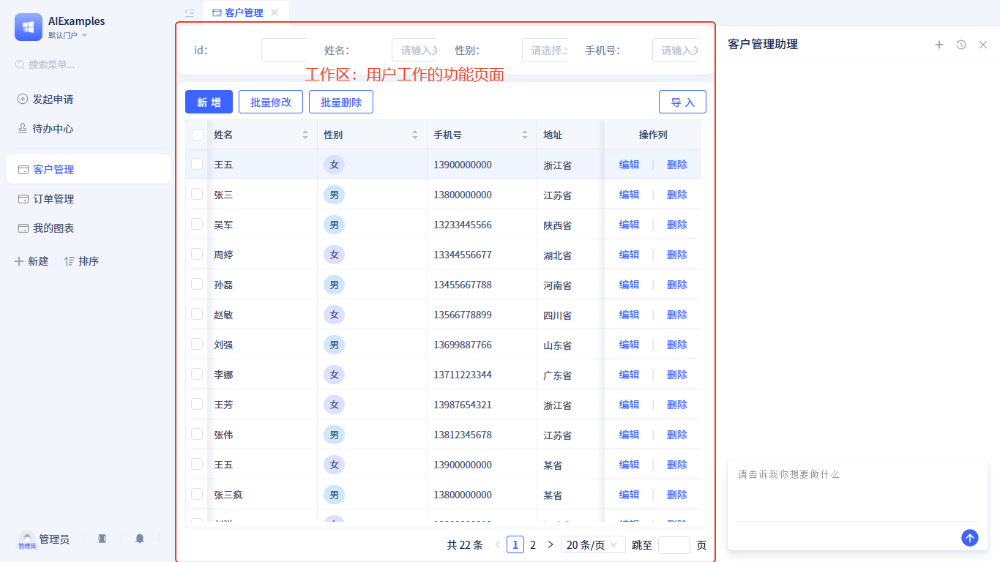
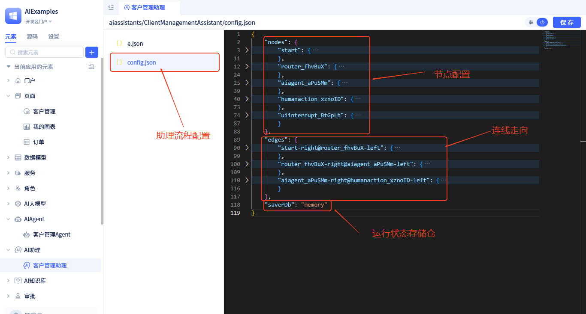

# 流程编排与节点配置

## 可视化编排 {#visual-orchestration}
AI助理的可视化编排工具让你能够通过直观的拖拽操作设计复杂的业务流程，无需编写代码即可构建智能工作流。

#### 添加节点 {#adding-nodes}
1. 从顶部工具栏选择需要的节点类型
2. 拖拽到画布中的合适位置
3. 释放鼠标完成节点添加

#### 连接节点 {#connecting-nodes}
1. 将鼠标悬停在源节点的输出端口上
2. 按住鼠标左键拖拽到目标节点的输入端口
3. 释放鼠标建立连接

:::tip 编排技巧
- **合理布局**：将相关节点放在相近位置，保持流程清晰
- **命名规范**：为节点设置有意义的名称，便于后续维护
:::

## 节点类型详解 {#node-types-explained}

### 开始节点 {#start-node}
这是工作流的起点，就像项目的入口一样。它接收用户的输入和其他[输入参数](./ai-assistant-input-output#input-args)，把这些信息存到[状态数据](./ai-assistant-state)里，然后开始执行任务。
每个AI助理中只能有一个开始节点，而且创建助理后会自动生成，你不需要手动添加。

### 路由决策 {#routing-decision}
这个节点很聪明，它能根据用户的消息内容，决定下一步该调用哪个AI助手来处理。
:::tip 注意
路由决策节点的下一步只能是AIAgent节点，不能是其他类型。
:::
路由决策时会调用大模型来分析用户输入，然后智能地选择最合适的处理路径。

#### 绑定大模型 {#binding-large-language-model}
路由决策需要大模型帮忙分析，所以我们要给它配一个大模型。配置方法如下：

在流程中点击路由决策节点，右侧会打开配置窗口；选择[大模型](../ai-llm/create-ai-llm)，配置好参数就完成了。

#### 输入消息配置 {#input-message-configuration}
路由决策节点有个输入参数，运行时会根据这个参数来决定下一步怎么走；我们需要给这个参数赋值。配置方法如下：

从其他节点连线到路由决策节点时会自动弹出输入配置窗口，后续也可以通过点击连线上的` → `按钮打开。你可以把[助理状态](./ai-assistant-state)中的变量传给它。

### AIAgent {#ai-agent}
AIAgent节点就是调用具体的AIAgent来处理特定任务。
我们需要在这个节点上绑定一个[AIAgent](../ai-agent/create-ai-agent)，配置方法如下：

#### 输入参数配置 {#input-parameter-configuration}
节点运行时会调用Agent，并传入[Agent需要的参数](../ai-agent/agent-input-output#configuring-input-variables)。
我们需要给这些参数赋值，配置方法如下：

点击连线上的` → `按钮打开输入参数配置窗口。左边是Agent需要的变量，右边选择[运行状态数据](./ai-assistant-state.md#state-data-content)中的数据给Agent的变量赋值。
这个节点运行完成后会把[Agent的输出结果](../ai-agent/agent-input-output#configuring-output-results)存储到运行状态中，供其他节点使用。

### 对话区人机交互 {#action-in-conversation}
**什么是对话区**：对话区就是一个AI对话框，是用户和助理聊天的地方。

当任务流程运行到这个节点时会暂停，在对话框中显示数据，用户确认数据并进行相应操作后流程才能继续。如果没有下一步节点，流程就自动结束了。
在这个节点用户可以做**同意**、**拒绝**、**回复**及**编辑数据**(需要开启编辑功能)等操作。
运行时进行**同意**、**拒绝**、**回复**及**编辑数据**操作后会恢复流程，同时触发[对话区人机交互事件](./ai-assistant-event#action-in-conversation-events)。

#### 节点配置详解 {#conversation-node-configuration-details}
- **需展示的数据**：你可以自由定义需要用户确认的数据内容，这些数据来源于[运行状态数据](./ai-assistant-state#state-data-content)。
- **可编辑**：开启后，用户才能编辑展示的数据，编辑后的数据会自动更新到运行状态中。
- **使用自定义控件渲染**：默认会用平台内置的数据渲染控件显示数据，你也可以使用[自定义控件](../frontend-ui-customization/custom-controls)渲染。
- **显示操作按钮**：你可以在这个节点自定义操作按钮，点击后可触发[对话区人机交互事件](./ai-assistant-event#action-in-conversation-events)。

运行时效果如下：

### 工作区人机交互 {#action-in-page}
和助理对话区配合的还有一个**工作区**：用户工作的功能页面。

工作区指的是用户工作的前端页面。
当任务流程运行到这个节点时，流程的后端会暂停，同时向前端发送暂停事件和相关信息。在工作区可以[订阅暂停后事件](../ai-assistant/ai-assistant-event#action-in-page-events)，在对应的事件处理函数中，用事件参数更新页面UI状态，然后等待用户做相关操作恢复流程继续执行。

#### 节点配置详解 {#page-node-configuration-details}
- **事件携带的参数**：助理向前端工作区发送暂停事件时携带的参数，这些从[运行状态数据](./ai-assistant-state#state-data-content)中选择，前端可以通过这些参数更新UI状态。
- **操作提示**：一个用来引导用户的提示语，告诉用户在页面哪里执行什么操作来恢复流程；提示语会在助理对话框中显示。

#### 恢复流程 {#resume-flow}
在工作区订阅这个节点的暂停事件，进行相关处理逻辑后调用[发送AI消息](../using-ai-in-portals-and-pages/using-ai-assistants-in-component-pages#send-ai-message)函数就能恢复流程。发送的消息内容会作为节点的输出参数存储到运行状态数据中，供其他节点使用。 

### 函数调用 {#function}
这个节点用来调用模型/服务函数对运行状态中的数据进行加工、清理或计算等处理。
这个节点需要绑定一个服务/模型函数。当任务流程运行到这个节点时会调用绑定的函数，并把函数的返回值存储到运行状态数据中，供其他节点使用。

#### 绑定函数 {#binding-function}

#### 输入参数配置 {#function-input-parameter-configuration}
函数调用节点的输入参数就是它绑定的函数的参数，参数配置方法和[AIAgent节点](#ai-agent)的输入参数配置方法一样。

### 条件分支 {#if-else}
根据当前助理状态中的数据情况决定流程的下一步走向。

#### 条件分支配置详解 {#conditional-branch-configuration-details}
- **条件表达式**：使用简单的逻辑表达式判断数据
- **支持操作符**：等于、不等于、大于、小于、包含、为空等
- **多条件组合**：可以使用"且"、"或"组合多个条件
- **条件分支**：可以设置多个分支，满足不同条件时走不同路径

### 多任务执行 {#iteration}
这个节点用来循环执行特定任务，需要设置一个循环的变量，从助理运行状态中选择`多行数据`或`列表`类型的数据。

#### 多任务执行配置详解 {#iteration-configuration-details}
- **循环变量选择**：选择要循环处理的数据，必须是`多行数据`或`列表`类型
- **循环执行分支**：设置每次循环时要执行的任务流程
- **循环结束分支**：设置所有循环完成后的流程走向

这个节点有两个分支：**循环执行**：遍历循环的变量，依次执行某个任务；**循环结束**：循环完成后的流程走向。

#### 循环变量说明 {#loop-variable-description}
这个节点运行时会向运行状态中存储两个数据：
- **`循环索引`**：当前循环的序号（从0开始）
- **`循环项`**：当前循环处理的数据项
- **使用场景**：在循环执行分支中，可以通过这两个变量访问当前循环的信息

## 全代码开发 {#full-code-development}
点击助理编辑器右上角`</>`按钮，切换到源码编辑模式。
源码模式下左侧展示源码文件，点击源码文件后右侧显示源码内容。
- **e.json**：助理元素的声明文件，其中"inputArgs"存储自定义输入参数配置

- **config.json**：助理元素的流程配置，记录流程节点及连线走向。

