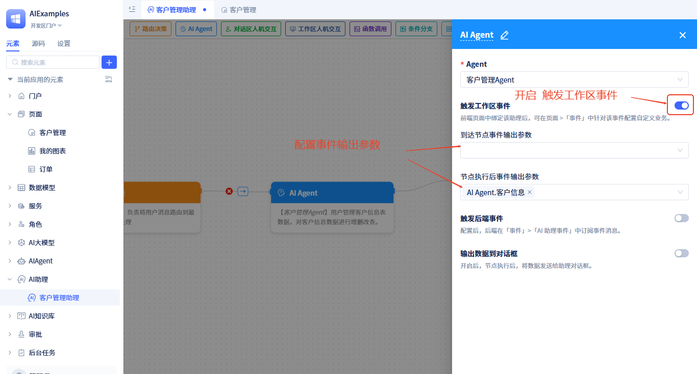

# AI助理的事件

AI助理在运行过程中会触发多种类型的事件，这些事件可以在前端工作区和后端业务逻辑中订阅和处理，实现更灵活的流程控制和用户交互。

## 事件类型概览 {#event-type-overview}
AI助理支持以下主要事件类型：
- **节点运行事件**：节点到达和运行完成后触发
- **工具调用事件**：AI Agent使用工具前后触发
- **对话区人机交互事件**：用户在助理对话区中的确认操作触发
- **工作区人机交互事件**：助理运行至工作区人机交互节点时触发

## 前端工作区事件 {#frontend-workspace-events}
前端工作区事件主要用于页面UI状态更新和用户交互处理。 

### 节点运行事件 {#node-running-events}
AI Agent节点、函数调用节点、条件分支节点及多任务执行节点在到达节点时及运行后可触发工作区事件。前提是需要开启触发工作区事件，开启方式如下：

页面中绑定该助理后即可订阅节点运行事件，订阅方式请见[页面中订阅节点运行事件](../using-ai-in-portals-and-pages/using-ai-assistants-in-component-pages#subscribe-node-running-events)

### 工具调用事件 {#agent-call-tool-events}
对于AI Agent节点，在Agent运行过程中如果会用到工具，那么在工具调用前和工具调用后也会触发工作区事件。前提需要Agent[开启工具触发事件](../ai-agent/create-ai-agent#tool-function-call-pre-post-event-triggering)。

工具调用事件携带的参数是字典(JitDict)类型，有以下属性：
- **toolName**：工具名称，如："services.ASvc.func1"。在事件处理逻辑中，开发者需要根据工具名称来做对应的处理。
- **toolType**：工具类型，可选值有：model-模型函数、service-服务函数、ui-页面函数、mcp-MCP服务、externalApi-外部API
- **args**：参数，如果是工具调用前事件，且开启了`事件消息中包含数据`，args的值就是调用工具的入参；如果是工具调用后事件，且开启了`事件消息中包含数据`，args的值就是工具的返回值。

页面中绑定该助理后即可订阅工具调用事件，订阅方式请见[页面中订阅工具事件](../using-ai-in-portals-and-pages/using-ai-assistants-in-component-pages#subscribe-call-tool-events)

### 对话区人机交互事件 {#chat-area-human-machine-interaction-events} 
当流程运行到对话区人机交互节点时，对话框中会显示`同意`、`拒绝`、`编辑`、`回复`确认操作按钮及自定义按钮。
用户做了确认操作或点击自定义按钮后，会触发工作区事件；事件中携带的参数是节点上展示的数据。

页面中绑定该助理后即可订阅这些事件，订阅方式请见[页面中订阅对话区人机交互事件](../using-ai-in-portals-and-pages/using-ai-assistants-in-component-pages#subscribe-chat-area-human-events)

### 工作区人机交互事件 {#workspace-human-machine-interaction-events} 
当流程运行到工作区人机交互节点时，会触发助理暂停事件，该事件会携带节点上配置的参数。

页面中绑定该助理后即可订阅助理暂停事件，订阅方式请见[页面中订阅工作区人机交互事件](../using-ai-in-portals-and-pages/using-ai-assistants-in-component-pages#subscribe-workspace-human-events)

## 后端业务事件 {#backend-business-events}
后端业务事件主要用于业务逻辑处理、数据持久化和系统集成。

### 节点运行事件 {#backend-node-events}
AI Agent节点、函数调用节点、条件分支节点及多任务执行节点在到达节点时及运行后可触发后端事件。前提是需要开启触发后端事件，开启方式如下：

后端如何订阅节点运行事件，参考：[AI助理事件](../business-logic-development/event-handling#ai-assistant-events)

### 工具调用事件
对于AI Agent节点，在Agent运行过程中如果会用到工具，那么在工具调用前和工具调用后也会触发后端事件。前提是工具需要开启[触发事件](../ai-agent/create-ai-agent#tool-function-call-pre-post-event-triggering)。

后端如何订阅工具调用事件，参考：[Agent工具调用事件](../business-logic-development/event-handling#agent-tool-call-events)
