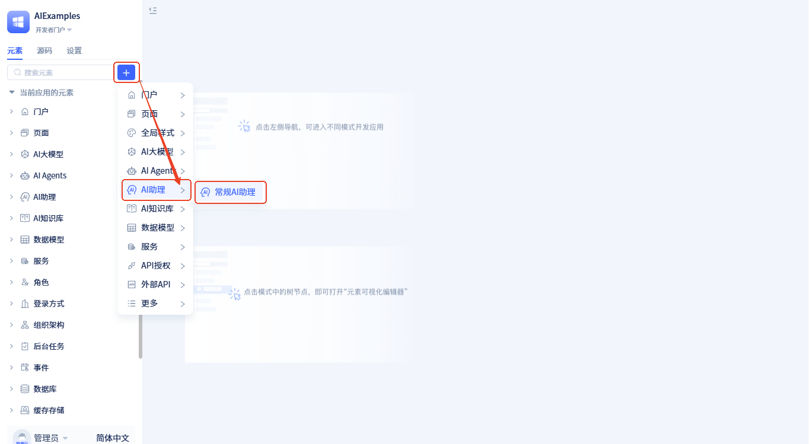

# 创建AI助理元素

AI助理是一个基于可视化流程编排的智能工作流系统，能够理解用户的自然语言指令，并自动执行复杂的业务流程。它通过拖拽操作构建智能工作流，无需编写代码即可实现人机协作的智能应用。

## 创建AI助理 {#create-ai-assistant}

创建方式如下：

点击 +  → **AI助理** → **常规AI助理**，打开助理信息填写表单，填完表单后点击 `确定` 按钮即可创建助理。

在弹窗中，填入**名称**，然后点击**确定**完成创建。创建完成后会自动打开[可视化编排](./process-orchestration-node-configuration)页。

:::tip 命名建议
- 使用有意义的名称，如"客户服务助理"、"订单处理助理"
- 避免使用过于简单的名称，如"助理1"、"测试助理"
- 名称应该反映助理的主要功能或应用场景
:::

## AI助理设计原理

**[可视化编排设计](./process-orchestration-node-configuration)**：
AI助理采用可视化流程编排的设计理念，通过直观的拖拽操作构建复杂的业务流程。这种设计降低了开发门槛，让业务人员也能参与AI应用的构建，实现了"低代码"的AI应用开发模式。

**[状态驱动的数据流](./ai-assistant-state)**：
整个系统以运行状态数据为核心，数据在节点间传递和累积，形成完整的执行上下文。数据流向遵循"输入→处理→输出→存储"的清晰模式，确保信息在流程中的连续性和可追溯性，支持复杂的多轮对话和状态保持。

**[事件驱动的扩展性](./ai-assistant-event)**：
通过完善的事件系统，AI助理可以灵活地与前端页面和后端业务逻辑集成，支持复杂的业务场景和定制化需求。事件系统使得AI助理能够与现有系统无缝集成，实现真正的企业级AI应用。
