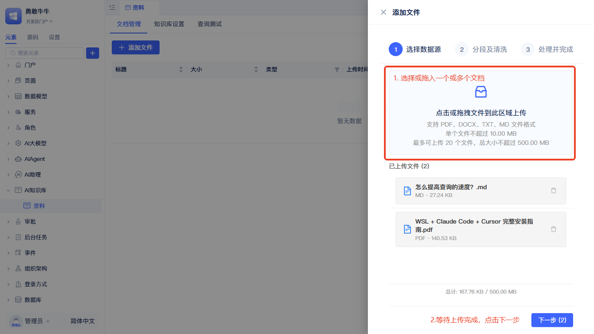

# AI知识库
在传统应用系统中，经常面临用户手册散落在各个文档，常见问题答案需要反复查找的问题。

AI知识库元素正是为了解决这些痛点而生。它不仅是文档的存储容器，还具备语义理解的检索能力。它将各类文档转化为可被“理解”的结构化知识，当用户提出问题时，知识库会理解语义意图，返回知识库中匹配的答案。

## 创建AI知识库元素 {#create-ai-knowledge-base-element}
:::tip
建议先完成[大模型厂商](./ai-llm/create-ai-llm#create-llm-vendor-element)和[向量数据库](./vector-database)的创建，再创建AI知识库，以便在创建流程中直接选择对应元素。大模型厂商推荐`阿里百炼`和`硅基流动`，他们有比较丰富的向量和重排模型供开发者选择。
:::

在元素目录树点击搜索框右侧的`+`按钮，选择`AI知识库`-`标准知识库`。随后弹出创建AI知识库元素的弹窗。

创建弹窗中需依次完成`名称`,`向量数据库`，`向量模型`和`重排模型`的选择。点击`确定`完成创建。

:::tip
向量模型对搜索的结果有较大的影响，请根据实际情况选择，创建完成后不允许再次修改。
:::

创建完成后会在左侧元素树中显示。

## AI知识库设置如何参与查询流程 {#how-ai-knowledge-base-settings-participate-in-query-flow}
AI知识库的配置参数直接影响知识检索的质量和效果。

## AI知识库的管理 {#ai-knowledge-base-management}
点击左侧元素树中创建好的AI知识库元素，进入AI知识库管理页面。

### 文档管理 {#document-management}
在`文档管理`页添加与维护AI知识库文档：

点击`+ 添加文件`，弹出添加文件滑窗。

在`选择数据源`的分步引导页中，点击虚线框选择文档或拖文档到虚线框中，等待文档上传完成，点击`下一步`。

:::tip
文档格式支持PDF、DOCX、TXT、MD格式，单个文档大小不超过10M。
:::

进入`分段及清洗`的分步引导页后，根据当前上传文档的实际情况，依次配置`分段标识符`、`分段最大长度`、`分段重叠长度`和`清洗设置`，配置完成后，点击`下一步`。参数的说明参考[向量化配置说明](#vectorization-configuration-description)

进入`处理并完成`的分步引导以后，系统会在后台处理每一个文档，可以等待所有文档向量化完成，也可点击`返回文档列表`直接关闭滑窗，滑窗关闭不影响后台处理流程。

在文档列表中点击刷新按钮，可以查看当前文档向量化状态。
### AI知识库设置 {#ai-knowledge-base-settings}
`知识库设置`中的配置项会影响搜索结果准确性和最终返回内容的大小。

`向量数据库`和`向量模型`的设置不允许修改，开发者可以使用[查询测试](#query-testing)的反馈来动态调整`重排模型`、`TopK`、`TopN`、`向量相似度阈值`及`重排分数阈值`这5个参数。

:::tip
提高准确性需要先了解[AI知识库设置项如何参与查询流程](#how-ai-knowledge-base-settings-participate-in-query-flow)。另外，修改配置项后，要点击保存按钮，才能在[查询测试](#query-testing)中生效。
:::

### 查询测试 {#query-testing}
为了方便开发者调试AI知识库的效果，我们提供了查询测试功能。

开发者输入问题，点击`测试查询`后，系统会理解查询条件的语义，返回查询结果，在查询结果中，会显示符合条件的文档数量，以及每个文档向量相似度评分和重排分数评分。根据查询效果的反馈，开发者可以不断调整[AI知识库设置](#ai-knowledge-base-settings)中的配置项，来提高查询效果。
## 在后端可视化编程中调用AI知识库 {#call-ai-knowledge-base-in-backend-visual-programming}
在后端可视化编程函数(服务函数/模型函数/任务函数/事件函数)中，知识库元素提供了查询、新增文档、删除文档，关键词查询4个方法。

### 查询

点击函数面板中空白语句上的`请选择`文案，在面板中选择`知识库`-`【知识库名称】`-`查询`，完成后会生成AI知识库查询函数，开发者可以在查询函数的输入框中选择查询条件。

### 新增文档

点击函数面板中空白语句上的`请选择`文案，在面板中选择`知识库`-`【知识库名称】`-`新增文档`，完成后会生成AI知识库新增文档函数，点击函数中`文档添加配置`弹出新增文档的详细配置。

填入`业务ID`、`文档文件`及其它文档向量化的配置，点击`保存`完成设置。其中`业务ID`是当前添加文档的标识，后面删除文档时，可根据`业务ID`进行删除。`文档文件`支持附件字段中的多个文件。

:::tip
其它配置参考[向量化配置说明](#vectorization-configuration-description)
:::

### 删除文档

点击函数面板中空白语句上的`请选择`文案，在面板中选择`知识库`-`【知识库名称】`-`删除文档`，完成后会生成AI知识库删除文档函数，填入业务ID，运行后会删除该业务ID下的所有文档。

### 关键词查询
单独的知识库检索并不能代替关键词查询，为了提高查询的精度，AI知识库提供了关键词查询功能。

点击函数面板中空白语句上的`请选择`文案，在面板中选择`知识库`-`【知识库名称】`-`关键词查询`，完成后会生成AI知识库查询函数，配置关键词列表和查询数量，会返回对应的查询结果。

:::tip
使用大模型将问题中的关键词提取出来，然后通过关键词进行查询。
:::

## 在AIAgent中使用AI知识库 {#use-ai-knowledge-base-in-ai-agent}
## AI知识库编程接口 {#ai-knowledge-base-programming-interface}
### query {#query-testing}
智能查询AI知识库，返回与查询相关的知识内容。[API文档](../reference/framework/JitAi/ai-knowledge-base#query)
### addDocumentByBusinessId
按业务ID添加文档到AI知识库。[API文档](../reference/framework/JitAi/ai-knowledge-base#adddocumentbybusinessid)
### deleteDocumentByBusinessId
按业务ID删除AI知识库文档。[API文档](../reference/framework/JitAi/ai-knowledge-base#deletedocumentbybusinessid)
### queryKeywords
基于关键词列表查询AI知识库。[API文档](../reference/framework/JitAi/ai-knowledge-base#querykeywords)

## 原理及参数说明 {#principle-and-parameter-description}
### 文档向量化流程

文档上传后，系统会自动解析文档内容，将长文本切分成合适的片段，清洗掉无用信息，然后通过向量模型转换为数学向量，最终存储到向量数据库中供语义检索使用。

### AI知识库设置项如何参与查询流程 

用户查询时，系统先从向量数据库中检索TopK个相似文档，通过向量相似度阈值过滤掉不相关的内容，然后用重排模型精确排序并取出TopN个最相关的结果，最后通过重排分数阈值做最终筛选，确保返回给用户的都是高质量答案。

### 向量化配置说明 {#vectorization-configuration-description}
- **分段标识符**：用于拆分文档的分隔符，可选择多个。系统按照所有选择的分隔符进行分段，默认使用段落分隔符（`\n\n`）。支持段落分隔符、换行符、句号后跟空格等多种预设选项。

- **分段最大长度**：每个文本块的最大字符数，建议在500-2000字符之间。较小的块大小提高检索精确度但可能丢失上下文信息，大块保留更多上下文但可能导致检索不精确。

- **分段重叠长度**：相邻文本块之间的重叠字符数，确保跨块信息不丢失。建议设置为块大小的10%-20%，太小可能导致上下文丢失，太大会增加冗余。

- **开启分段清洗**：提高文本质量和检索精度的清洗功能。包括多余空白字符清理、非ASCII字符处理（全角转半角）、断行段落修复等，特别适用于PDF文档。

### 知识库配置参数说明
| 参数名称 | 默认值 | 建议范围 | 说明 |
|---------|--------|----------|------|
| 向量模型 | - | - | 决定文档和查询的语义理解能力，创建后不可修改 |
| 重排模型 | - | - | 对召回结果进行精细排序，可随时更换以优化效果 |
| TopK | 50 | 1-100 | 向量召回条数，控制初步检索的文档数量 |
| TopN | 5 | 1-10 | 重排后返回条数，最终返回给用户的文档数量 |
| 向量相似度阈值 (vectorScore) | 0.6 | 0.1-1.0 | 过滤召回结果，值越高要求越严格 |
| 重排分数阈值 (reRankScore) | 0.3 | 0.1-1.0 | 过滤重排结果，值越高要求越精确 |

:::tip 参数建议
一般建议先增大 TopK（扩大召回覆盖），再用较合适的 reRankScore 做精细过滤。若召回噪声较多，可适当调高 vectorScore。
:::
