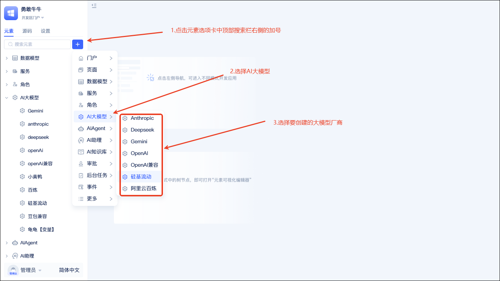
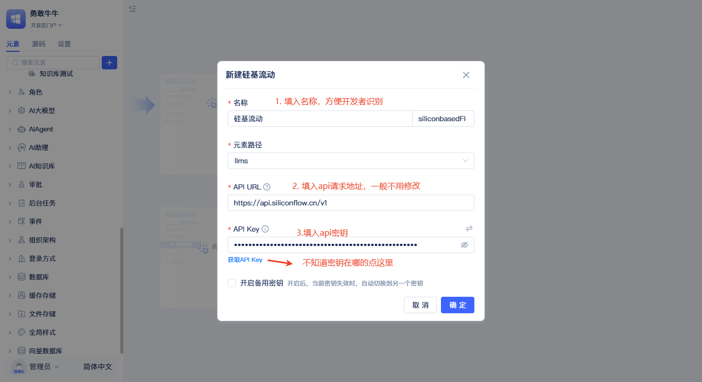
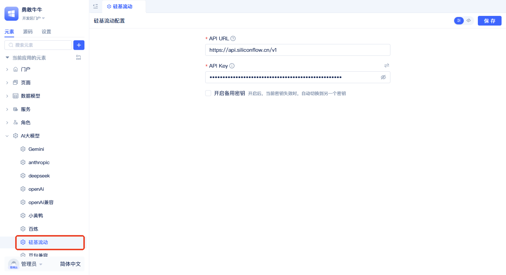
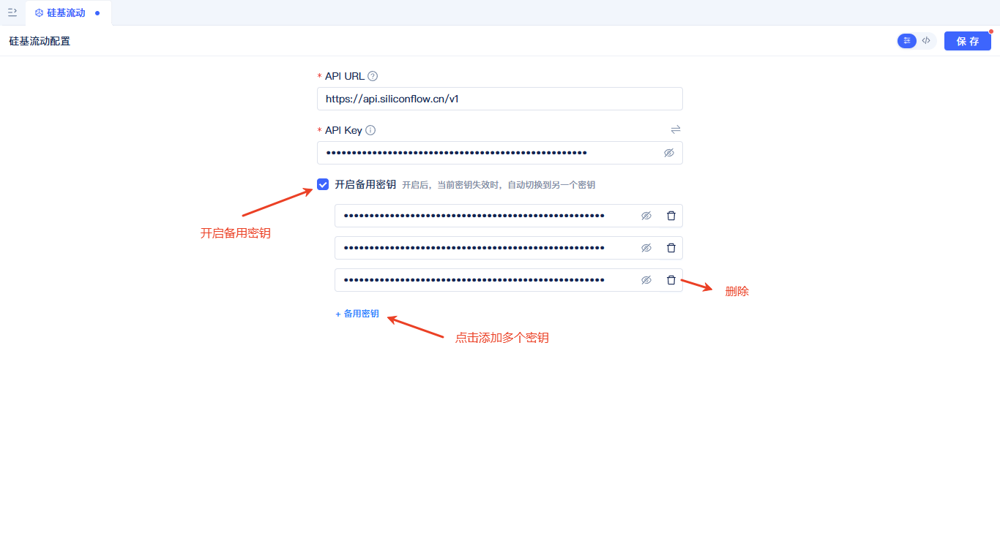
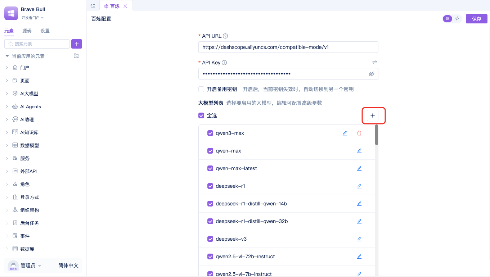
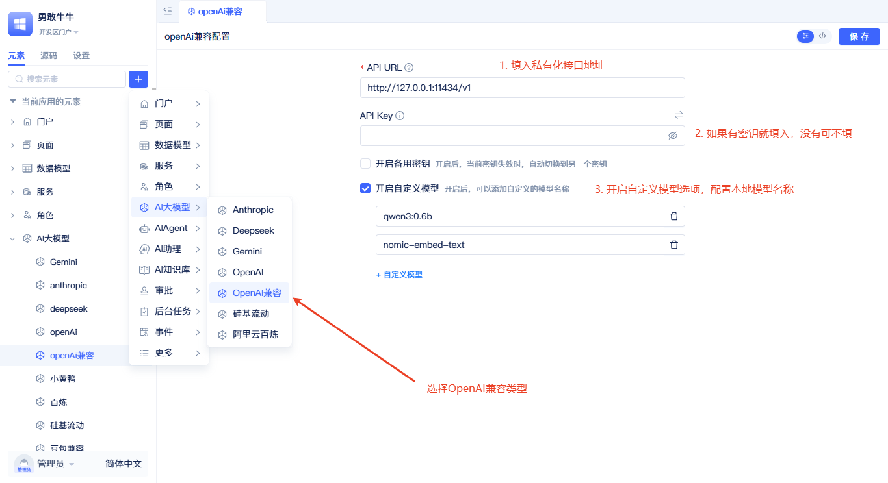
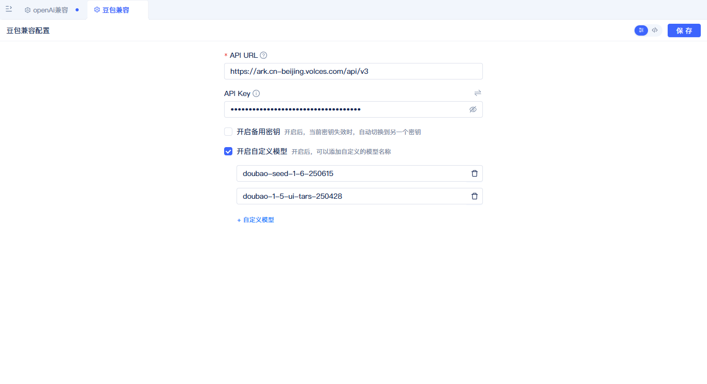

# 为 Agent、知识库和业务函数接入 AI 大模型
AI 大模型元素用于统一接入模型服务。配置完成后，同一个大模型元素可被 [AI Agent](../ai-agent/overview)、[AI知识库](../knowledge-base/create-knowledge-elements)、服务函数、页面事件和多模态生成函数复用。

大模型元素解决的是“应用通过哪个模型服务获得智能能力”的问题。Agent 使用它进行对话和工具调用，知识库使用它完成向量化和重排，业务函数可以直接调用它生成文本和结构化数据；选择支持多模态生成的来源后，还可以生成图片或视频。

## 按 Agent、知识库和多模态场景选择模型来源 {#mainstream-llm-vendor-support-list}

平台内置以下大模型来源：

- **Jit**：平台内置模型服务。适合快速体验、原型验证和不想先准备外部 API Key 的场景。
- **阿里云百炼**：适合通义千问、向量模型、重排模型和通义万相多模态生成场景。
- **硅基流动**：适合接入多种开源模型、推理模型、向量模型等。
- **OpenAI**：适合接入 OpenAI 原生模型。
- **Deepseek**：适合接入 DeepSeek 系列模型。
- **Anthropic**：适合接入 Claude 系列模型。
- **Gemini**：适合接入 Google Gemini 系列模型。
- **OpenAI 兼容**：适合接入兼容 OpenAI API 的模型服务，包括豆包、腾讯混元、Ollama、Moonshot、智谱，以及企业私有化部署的兼容服务。

选择建议：

- 做 Agent 对话、工具调用、复杂推理：优先选择支持`工具调用`或推理能力较强的对话模型。
- 做知识库：需要可用的`向量模型`；如需提升召回结果排序，可再配置`重排模型`。
- 做图片或视频生成：选择提供对应多模态函数的模型来源，当前文档主要使用百炼万相能力说明配置方法。
- 做私有化或本地模型：使用`OpenAI 兼容`，并填写兼容服务的 API URL。

## 创建可复用的大模型厂商元素 {#creating-llm-vendor-elements}

在元素目录树上点击搜索框右边的`+`按钮，在弹出的菜单中选择`AI大模型`，根据实际情况再选择对应的大模型厂商，选择完成后会弹出如下弹窗。

创建时填写元素名称，并根据所选厂商配置 API URL、API Key 和可用模型。

- **Jit**：只需要填写名称即可创建，不需要配置 API URL 和 API Key。
- **内置厂商**：API URL 默认带出，通常只需要填写 API Key。
- **OpenAI 兼容**：先选择预设厂商，或选择`Custom`后手动填写 API URL。Ollama 等本地模型可以不填 API Key。

API Key 可以通过输入框右侧的环境变量按钮引用环境变量，避免把密钥明文写入应用源码。

:::tip
内置厂商的 API URL 一般不需要修改。只有使用代理、专有网络或私有化兼容服务时，才需要调整 API URL。
:::

创建完成后会在左侧元素树中显示。

## 用备用 API Key 提高模型调用稳定性 {#retry-backup-api-key-mechanism}
为了降低单个密钥限流、过期或临时失败对业务的影响，大模型元素支持备用 API Key。开启备用密钥后，可以添加多个 Key；当当前 Key 调用失败时，平台会尝试切换到其他 Key 并重试。

在界面上点击`开启备用密钥`，再点击`+备用密钥`添加输入框，填入备用 Key 后保存即可。备用 Key 同样建议使用环境变量管理。

## 管理可被 Agent 和知识库选择的模型能力 {#custom-model-configuration}
大模型元素的模型列表用于控制当前元素对外提供哪些模型。你可以勾选需要启用的模型，也可以点击`编辑`调整模型类型、模型特性和高级参数，让 Agent、知识库和业务函数在选择模型时能够匹配正确能力。

模型类型包括：

- **Dialogue Model**：对话模型，用于 Agent、页面/后端函数的文本生成和结构化输出。
- **Vector Model**：向量模型，用于知识库文档向量化和语义检索。
- **Rerank Model**：重排模型，用于对知识库召回结果进行二次排序。

对话模型可标记模型特性：

- **视觉能力 (vision)**：模型可理解图片等视觉输入。
- **工具调用 (tool-call)**：模型可作为支持工具调用的对话模型被 Agent 选择，适合 Agent 使用工具、模型、服务函数等能力。
- **推理能力 (agent-thought)**：模型适合复杂任务推理、规划和多步骤分析。

点击右上角`+`可以添加自定义模型。自定义模型适合以下场景：

- 模型厂商已发布新模型，但平台预置列表尚未包含。
- OpenAI 兼容服务或私有化服务使用自定义模型名称。
- 需要把某个模型标记为向量模型、重排模型，或补充特定 JSON 参数。

## 接入本地或私有化 OpenAI 兼容模型 {#private-llm-integration}
为了信息安全或成本控制，开发者可能会部署私有化模型。平台通过`OpenAI 兼容`元素接入这类模型。

以 Ollama 为例，选择`OpenAI 兼容`后选择`Ollama`预设，默认地址为`http://localhost:11434/v1`。如果本地服务不需要鉴权，可以不填 API Key；随后在模型列表中添加完整模型名称，例如`qwen3:0.6b`、`nomic-embed-text`。

:::tip
OpenAI 兼容元素内置了 Doubao、Hunyuan、Ollama、Moonshot、Zhipu AI、Custom 等选项。选择预设厂商会自动带出 API URL；选择 Custom 时需要手动填写。
:::

