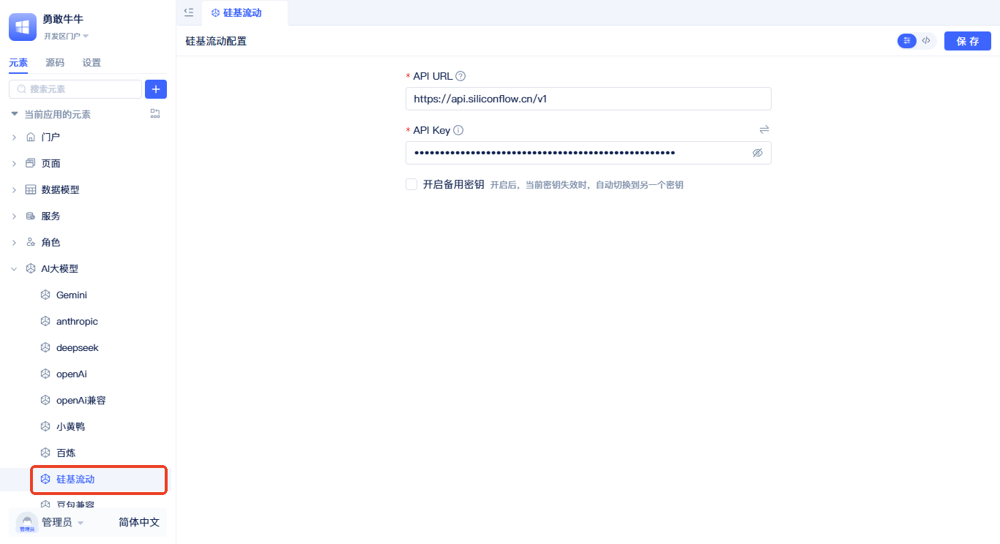
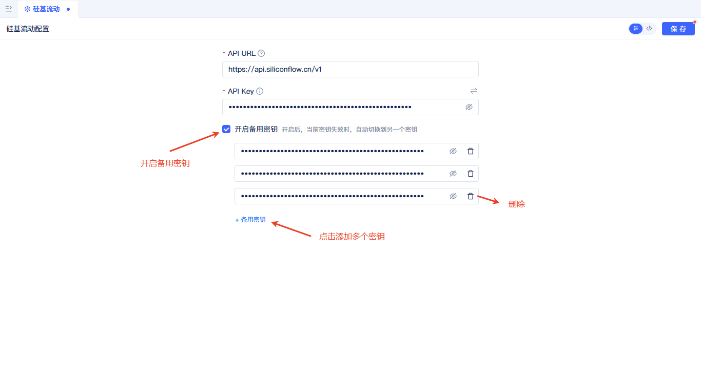

# 创建大模型元素
大模型元素是JitAi平台统一接入各类AI大模型服务的核心组件。它为平台中的[AI Agent](../ai-agent/create-ai-agent)、[AI助理](../ai-assistant/create-ai-assistant)、[AI知识库](../knowledge-base/create-knowledge-elements)提供底层模型能力支撑。

平台内置支持Anthropic、OpenAI、Gemini、Deepseek、阿里云百炼、硅基流动等主流大模型厂商，同时提供OpenAI兼容接口以支持任何兼容OpenAI协议的大模型服务（包括私有化部署的）。通过灵活的API Key管理和智能重试机制，确保模型调用的稳定性和可靠性。开发者也可以扩展新的大语言模型Type元素，即可支持任意不同协议、不同厂商的开源/闭源大模型服务。

## 主流大模型厂商支持列表 {#mainstream-llm-vendor-support-list}
*   Anthropic
*   阿里云百炼
*   Deepseek
*   Gemini
*   OpenAI
*   硅基流动
*   OpenAI兼容

## 创建大模型厂商元素 {#creating-llm-vendor-elements}

在元素目录树上点击搜索框右边的`+`按钮，在弹出的菜单中选择`AI大模型`，根据实际情况再选择对应的大模型厂商，选择完成后会弹出如下弹窗。

在弹窗中，填入名称，然后到对应模型厂商的配置页添加一个API Key(不知道地址的可以点击左下角的`获取API Key`)，然后再将API Key填入这里，点击`保存`按钮完成创建。
API Key可以通过点击右上角的按钮使用环境变量，避免泄露。
:::tip
API URL一般不需要修改，每个厂商的默认配置已经填写。
:::

创建完成后会在左侧元素树中显示。

## 重试及备用API Key机制 {#retry-backup-api-key-mechanism}
为了避免单个密钥速率限制、请求过多等限制导致模型调用失败，我们提供了重试及多密钥机制。最大重试3次，每次重试的等待时间分别为1秒、2秒、4秒。如果配置了多个API Key，每次重试都会轮询到备用的API Key。这意味着系统不会在同一个失效的Key上反复尝试，而是智能地切换到备用Key来提高成功率。如果只有一个API Key，系统将会在这个Key上尝试4次(1次调用 + 3次重试)。

在界面上点击`开启备用密钥`-`+备用密钥`就可以添加一个密钥输入框，将你的备用没要密钥填入，然后点击`保存`即可。

## 私有化大模型集成 {#private-llm-integration}
为了信息安全，开发者可能会部署私有化模型，平台同样支持私有化模型集成。

私有化模型使用OpenAI兼容元素进行连接，以Ollama为例，默认地址为`http://127.0.0.1:11434/v1`，若有API Key则填入，需要注意的是，私有化模型要开启`开启自定义模型`配置项，并输入完整的模型名称，如：qwen3:0.6b、nomic-embed-text。

:::tip
支持OpenAI接口的厂商，都可以使用OpenAI兼容元素进行连接，下图以火山引擎的豆包为例作为参考。
:::

