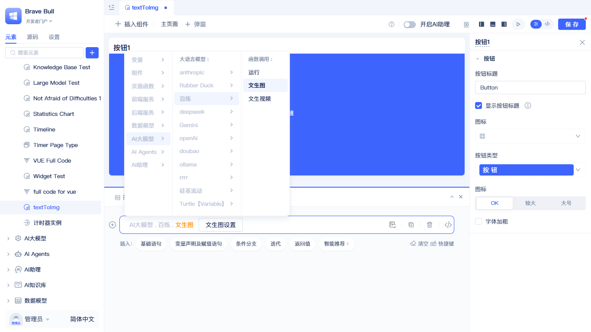
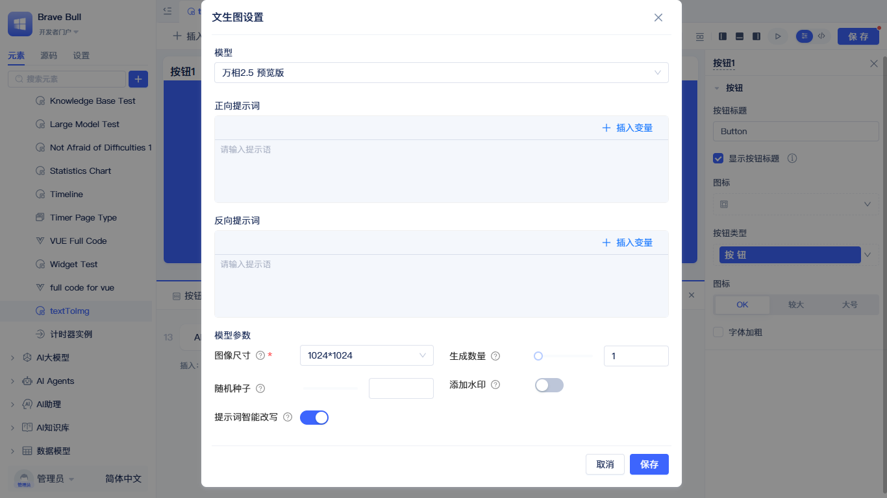
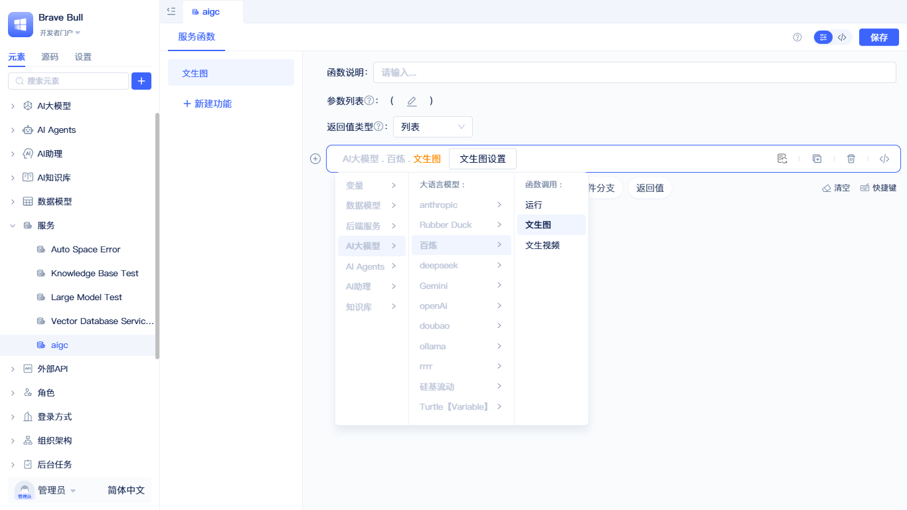
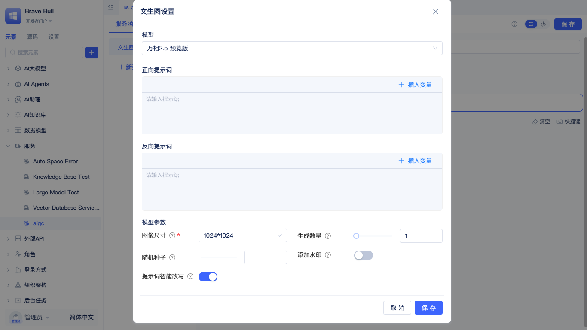

import VideoPlayer from '@site/src/components/VideoPlayer';

# 使用大模型函数实现多模态AIGC {#implementing-multimodal-aigc}

多模态 AIGC（人工智能生成内容）是指利用人工智能技术，根据文本提示词自动生成图像、视频等多种形式内容的能力。JitAi 平台深度集成了多模态生成能力，让开发者能够在应用中轻松实现文生图和文生视频等创新功能。

:::tip
当前版本中，仅支持**阿里云百炼**平台的万相系列模型（Wanx）。使用前请确保已在系统中配置好百炼的 API 密钥。更多大模型厂商的支持正在开发中。
:::

## 百炼 {#bailian}

### 文生图功能 {#text-to-image}

#### 示例 {#text-to-image-example}

想象一下，只需输入一段故事文本，系统就能自动为您生成配套的精美绘本插图——这正是 JitAi 平台文生图能力的实际应用。

以儿童绘本创作为例，我们实现了一个智能化的文本转图像工作流：系统通过 5 个 AI 处理阶段（故事拆分 → 角色设计 → 场景设计 → 插画风格 → 提示词优化），将一段普通故事文本逐步转化为专业的文生图提示词，最终批量生成风格统一、叙事连贯的插图。整个过程无需人工干预，几分钟内就能完成原本需要设计师数小时甚至数天的工作。

这个例子展示了 JitAi 平台的核心优势：**通过串联多个大模型调用，构建复杂的 AI 工作流**。您可以像搭积木一样，组合文本生成、逻辑判断、图像生成等能力，打造属于自己的 AIGC 应用。

#### 在页面中调用文生图 {#calling-text-to-image-in-pages}

在页面中可以快速集成文生图功能。

打开页面中的事件面板，新建基础语句，选择`AI大模型`-`百炼大模型实例`-`文生图`，会生成对应的函数调用代码。点击代码中的`文生图`按钮，会弹出文生图配置面板。

在配置面板中，选择合适的模型，并配置好提示词、模型参数，点击确定即可完成配置。参数详细说明请参考[文生图参数](#text-to-image-parameters)。

#### 在后端函数中调用文生图 {#calling-text-to-image-in-backend-functions}

在后端函数（服务、模型函数、任务、事件）中，均可调用文生图功能。

在后端函数面板中，新建基础语句，选择`AI大模型`-`百炼大模型实例`-`文生图`，会生成对应的函数调用代码。点击代码中的`文生图`按钮，会弹出文生图配置面板。

在配置面板中，选择合适的模型，并配置好提示词、模型参数，点击确定即可完成配置。参数详细说明请参考[文生图参数](#text-to-image-parameters)。

### 文生视频功能 {#text-to-video}

#### 示例 {#text-to-video-example}

<VideoPlayer
  url="https://jit-www.oss-cn-beijing.aliyuncs.com/text-to-video-example.mp4"
  controls={true}
  autoplay={false}
  muted={false}
  loop={false}
/>

文生视频不仅仅是简单的"文字变视频"，更是将静态文本转化为动态影像叙事的创作过程。

以古诗词可视化为例，我们构建了一个专业的文本转视频工作流：系统通过 5 个专业化的 AI 处理阶段（段落拆分 → 剧情编写 → 运镜设计 → 特效后期 → 提示词优化），将古诗词或文言文逐步转化为专业的电影级视频提示词。每个阶段都模拟真实影视制作流程——从故事板设计、镜头语言规划，到光影色彩调校，最终批量生成风格统一、镜头流畅的短视频片段。

相比传统视频制作需要编剧、导演、摄像、后期等多个环节协作，这套工作流将专业知识编码为 AI Prompt，让普通用户也能创作出具有专业水准的视频内容。这正是 JitAi 平台的独特价值：**将复杂的专业知识沉淀为可复用的 AI 工作流，让创作更加民主化**。

#### 在页面中调用文生视频 {#calling-text-to-video-in-pages}

用法与文生图一致，请参考[在页面中调用文生图](#calling-text-to-image-in-pages)。配置参数请参考[文生视频参数](#text-to-video-parameters)。

#### 在后端函数中调用文生视频 {#calling-text-to-video-in-backend-functions}

用法与文生图一致，请参考[在后端函数中调用文生图](#calling-text-to-image-in-backend-functions)。配置参数请参考[文生视频参数](#text-to-video-parameters)。

### 图生图功能 {#image-to-image}

图生图功能支持基于参考图片进行图像编辑和创作，包括**单图编辑**和**多参考图生图**两种模式。通过输入图片和文本提示词，可以实现图像风格转换、元素替换、多图融合等创意功能。

#### 在页面中调用图生图 {#calling-image-to-image-in-pages}

用法与文生图一致，请参考[在页面中调用文生图](#calling-text-to-image-in-pages)。配置参数请参考[图生图参数](#image-to-image-parameters)。

#### 在后端函数中调用图生图 {#calling-image-to-image-in-backend-functions}

用法与文生图一致，请参考[在后端函数中调用文生图](#calling-text-to-image-in-backend-functions)。配置参数请参考[图生图参数](#image-to-image-parameters)。

### 图生视频功能 {#image-to-video}

图生视频功能支持基于首帧图片生成动态视频内容。通过上传一张图片作为视频的起始画面，配合文本提示词或特效模板，系统将自动生成流畅的视频动画。该功能特别适合为静态图片添加动态效果，制作产品展示、人物动画等内容。

#### 在页面中调用图生视频 {#calling-image-to-video-in-pages}

用法与文生图一致，请参考[在页面中调用文生图](#calling-text-to-image-in-pages)。配置参数请参考[图生视频参数](#image-to-video-parameters)。

#### 在后端函数中调用图生视频 {#calling-image-to-video-in-backend-functions}

用法与文生图一致，请参考[在后端函数中调用文生图](#calling-text-to-image-in-backend-functions)。配置参数请参考[图生视频参数](#image-to-video-parameters)。

### 首尾帧生视频功能 {#keyframe-to-video}

首尾帧生视频功能支持通过指定视频的首帧和尾帧关键帧图片，自动生成中间过渡动画的视频内容。该功能可以精确控制视频的起始和结束画面，适合制作转场动画、状态变化展示等需要明确起止状态的视频内容。

#### 在页面中调用首尾帧生视频 {#calling-keyframe-to-video-in-pages}

用法与文生图一致，请参考[在页面中调用文生图](#calling-text-to-image-in-pages)。配置参数请参考[首尾帧生视频参数](#keyframe-to-video-parameters)。

#### 在后端函数中调用首尾帧生视频 {#calling-keyframe-to-video-in-backend-functions}

用法与文生图一致，请参考[在后端函数中调用文生图](#calling-text-to-image-in-backend-functions)。配置参数请参考[首尾帧生视频参数](#keyframe-to-video-parameters)。

### 参数说明 {#parameter-reference}

#### 文生图参数 {#text-to-image-parameters}

##### 模型选择 {#image-model-selection}

系统支持万相系列的 6 个文生图模型，根据不同场景选择合适的模型：

| 模型名称 | 特点 | 适用场景 |
|---------|------|---------|
| **wan2.5-t2i-preview** | 支持自由尺寸（768×768 至 1440×1440） 宽高比 1:4 至 4:1 | 需要特殊尺寸（如长图、宽图）的创意设计 |
| **wan2.2-t2i-flash** | 速度提升 50%，极速生成 | 快速迭代、批量生成场景 |
| **wan2.2-t2i-plus** | 稳定性与成功率全面提升 | 商业项目、对质量要求高的场景 |
| **wanx2.1-t2i-turbo** | 生成速度快 | 快速原型设计、预览效果 |
| **wanx2.1-t2i-plus** | 高质量图像生成 | 专业设计、精细化创作 |
| **wanx2.0-t2i-turbo** | 经典版本，稳定可靠 | 一般性图像生成需求 |

##### 配置参数 {#image-config-params}

在配置面板中可设置以下参数：

- **正向提示词（prompt）** *：描述期望生成的图像内容，支持变量插入
- **反向提示词（negative_prompt）**：指定要避免出现的元素
- **图像尺寸（size）** *：生成图像的尺寸，如 1024×1024、1280×720 等
- **生成数量（n）**：一次生成的图片张数，取值 1-4
- **随机种子（seed）**：固定种子可获得可重现的结果
- **水印设置（watermark）**：是否在生成的图片上添加水印
- **提示词智能改写（prompt_extend）**：使用大模型优化提示词，对短提示词效果提升明显

:::tip
不同模型支持的参数略有差异，配置面板会根据选择的模型自动展示可用参数。详细参数说明请参考[通义万相文生图官方文档](https://help.aliyun.com/zh/model-studio/text-to-image-v2-api-reference)
:::

#### 文生视频参数 {#text-to-video-parameters}

##### 模型选择 {#video-model-selection}

系统支持万相系列的 4 个文生视频模型，根据不同需求选择合适的模型：

| 模型名称 | 音频支持 | 分辨率 | 时长 | 特点 | 适用场景 |
|---------|---------|-------|------|------|---------|
| **wan2.5-t2v-preview** | ✅ 有声视频 | 480P/720P/1080P | 5秒/10秒 | 支持自动配音和自定义音频 | 需要音画同步的宣传视频、教育内容 |
| **wan2.2-t2v-plus** | ❌ 无声视频 | 480P/1080P | 5秒 | 稳定性提升 50%，速度更快 | 商业项目、批量生成 |
| **wanx2.1-t2v-turbo** | ❌ 无声视频 | 480P/720P | 5秒 | 生成速度快 | 快速迭代、原型设计 |
| **wanx2.1-t2v-plus** | ❌ 无声视频 | 720P | 5秒 | 高质量视频生成 | 精细化创作、专业设计 |

:::tip 有声视频
仅 **wan2.5-t2v-preview** 模型支持音频功能（自动配音或自定义音频）。其他模型生成无声视频。
:::

##### 配置参数 {#video-config-params}

在配置面板中可设置以下参数：

- **正向提示词（prompt）** *：描述期望生成的视频内容，应包含场景、动作、镜头等元素
- **反向提示词（negative_prompt）**：指定要避免出现的元素或效果
- **视频分辨率（size）**：如 1280×720 (720P)、1920×1080 (1080P) 等
- **视频时长（duration）**：5秒 或 10秒（wan2.5 支持10秒，其他模型仅5秒）
- **自定义音频（audio_url）**：上传自定义音频文件（5-12秒），仅 wan2.5 支持
- **自动配音（audio）**：模型自动生成匹配的背景音频，仅 wan2.5 支持
- **水印设置（watermark）**：是否在生成的视频上添加水印
- **提示词智能改写（prompt_optimizer）**：使用大模型优化提示词，提升生成效果

:::warning 重要提示
- 文生视频采用异步调用，通常需要 1-5 分钟
- 返回的 `video_url` 仅保留 **24 小时**，建议及时下载并转存到永久存储
- 按视频秒数计费，仅任务成功时才会计费
:::

:::tip
不同模型支持的参数略有差异，配置面板会根据选择的模型自动展示可用参数。详细参数说明请参考[通义万相文生视频官方文档](https://help.aliyun.com/zh/model-studio/text-to-video-api-reference)
:::

#### 图生图参数 {#image-to-image-parameters}

##### 模型选择 {#image-to-image-model-selection}

系统支持万相系列的图生图模型：

| 模型名称 | 特点 | 适用场景 |
|---------|------|---------|
| **wan2.5-i2i-preview** | 支持单图编辑和多参考图生图 保持输入图像宽高比例 | 图像风格转换、元素替换、多图融合创作 |

##### 配置参数 {#image-to-image-config-params}

在配置面板中可设置以下参数：

- **输入图片（images）** *：
  - **单图编辑**：输入单个图片URL或选择变量
  - **多参考图生图**：输入JitList变量或多个图片URL
- **正向提示词（prompt）** *：描述期望的图像编辑效果或生成内容，支持变量插入
- **反向提示词（negative_prompt）**：指定要避免出现的元素
- **生成数量（n）**：一次生成的图片张数，取值 1-4
- **随机种子（seed）**：固定种子可获得可重现的结果，范围 0-4294967290
- **水印设置（watermark）**：是否在生成的图片上添加水印

:::warning 重要提示
- 图生图采用异步调用，通常需要 1-2 分钟
- 返回的图片 URL 仅保留 **24 小时**，建议及时下载并转存到永久存储
- 按成功生成的图像张数计费
:::

:::tip
详细参数说明请参考[通义万相图生图官方文档](https://help.aliyun.com/zh/model-studio/wan2-5-image-edit-api-reference)
:::

#### 图生视频参数 {#image-to-video-parameters}

##### 模型选择 {#image-to-video-model-selection}

系统支持万相系列的多个图生视频模型，根据不同需求选择合适的模型：

| 模型名称 | 音频支持 | 分辨率 | 时长 | 特点 | 适用场景 |
|---------|---------|-------|------|------|---------|
| **wan2.5-i2v-preview** | ✅ 有声视频 | 480P/720P/1080P | 5秒/10秒 | 支持音频、特效模板 | 静态图片动画化、产品展示 |
| **wan2.2-i2v-plus** | ❌ 无声视频 | 480P/1080P | 5秒 | 稳定性提升，速度更快 | 商业项目、批量生成 |
| **wan2.2-i2v-flash** | ❌ 无声视频 | 480P/720P/1080P | 5秒 | 极速生成 | 快速预览、原型设计 |
| **wanx2.1-i2v-turbo** | ❌ 无声视频 | 480P/720P | 5秒 | 生成速度快 | 快速迭代 |
| **wanx2.1-i2v-plus** | ❌ 无声视频 | 720P | 5秒 | 高质量视频生成 | 精细化创作 |

:::tip 有声视频
仅 **wan2.5-i2v-preview** 模型支持音频功能（自动配音或自定义音频）。其他模型生成无声视频。
:::

##### 配置参数 {#image-to-video-config-params}

在配置面板中可设置以下参数：

- **首帧图片URL（img_url）** *：视频的起始画面图片，支持URL或变量
- **特效模板（template）**：选择预设的动画特效，可选值包括：
  - **通用特效**：魔法悬浮(flying)、解压捏捏(squish)、转圈圈(rotation)、戳戳乐(poke)、气球膨胀(balloon)、赠人玫瑰(rose)、闪亮玫瑰(crystalrose)
  - **单人特效**：搞怪热舞(dance1)、午夜蹦迪(dance2)、星摇时刻(dance3)、指感节奏(dance4)、舞动开关(dance5)、人鱼觉醒(mermaid)、学术加冕(graduation)、巨兽追袭(dragon)、财从天降(money)、水母之约(jellyfish)、瞳孔穿越(pupil)
  - **双人特效**：爱的抱抱(hug)、唇齿相依(frenchkiss)、双倍心动(coupleheart)
- **正向提示词（prompt）**：描述期望的视频动画效果（使用特效模板时可选）
- **反向提示词（negative_prompt）**：指定要避免出现的元素或效果
- **视频分辨率（resolution）**：如 480P、720P、1080P
- **视频时长（duration）**：5秒 或 10秒（wan2.5 支持10秒，其他模型仅5秒）
- **自定义音频（audio_url）**：上传自定义音频文件（5-12秒），仅 wan2.5 支持
- **自动配音（audio）**：模型自动生成匹配的背景音频，仅 wan2.5 支持
- **水印设置（watermark）**：是否在生成的视频上添加水印
- **提示词智能改写（prompt_optimizer）**：使用大模型优化提示词，提升生成效果

:::warning 重要提示
- 图生视频采用异步调用，通常需要 1-5 分钟
- 返回的 `video_url` 仅保留 **24 小时**，建议及时下载并转存到永久存储
- 按视频秒数计费，仅任务成功时才会计费
:::

:::tip
不同模型支持的参数略有差异，配置面板会根据选择的模型自动展示可用参数。详细参数说明请参考[通义万相图生视频官方文档](https://help.aliyun.com/zh/model-studio/image-to-video-api-reference)
:::

#### 首尾帧生视频参数 {#keyframe-to-video-parameters}

##### 模型选择 {#keyframe-to-video-model-selection}

系统支持万相系列的首尾帧生视频模型：

| 模型名称 | 分辨率 | 时长 | 特点 | 适用场景 |
|---------|-------|------|------|---------|
| **wan2.2-kf2v-flash** | 480P/720P/1080P | 5秒 | 极速生成，支持特效模板 | 转场动画、状态变化展示 |
| **wanx2.1-kf2v-plus** | 720P | 5秒 | 高质量视频生成 | 精细化创作、专业设计 |

##### 配置参数 {#keyframe-to-video-config-params}

在配置面板中可设置以下参数：

- **首帧图片URL（first_frame_image_url）** *：视频的起始画面图片，支持URL或变量
- **尾帧图片URL（last_frame_image_url）**：视频的结束画面图片，支持URL或变量（可选）
- **特效模板（template）**：选择预设的动画特效，可选值包括：
  - 唐韵翩然(hanfu-1)
  - 机甲变身(solaron)
  - 闪耀封面(magazine)
  - 机械觉醒(mech1)
  - 赛博登场(mech2)
- **正向提示词（prompt）**：描述期望的视频过渡效果（使用特效模板时可选）
- **反向提示词（negative_prompt）**：指定要避免出现的元素或效果
- **视频分辨率（resolution）**：如 480P、720P、1080P（wan2.2-kf2v-flash 支持）或 720P（wanx2.1-kf2v-plus）
- **视频时长（duration）**：固定为 5秒
- **水印设置（watermark）**：是否在生成的视频上添加水印
- **提示词智能改写（prompt_optimizer）**：使用大模型优化提示词，提升生成效果

:::warning 重要提示
- 首尾帧生视频采用异步调用，通常需要 1-5 分钟
- 返回的 `video_url` 仅保留 **24 小时**，建议及时下载并转存到永久存储
- 按视频秒数计费，仅任务成功时才会计费
- 如果不提供尾帧图片，系统将仅基于首帧生成视频
:::

:::tip
详细参数说明请参考[通义万相首尾帧生视频官方文档](https://help.aliyun.com/zh/model-studio/image-to-video-by-first-and-last-frame-api-reference)
:::

## openAI {#openai}
敬请期待……
