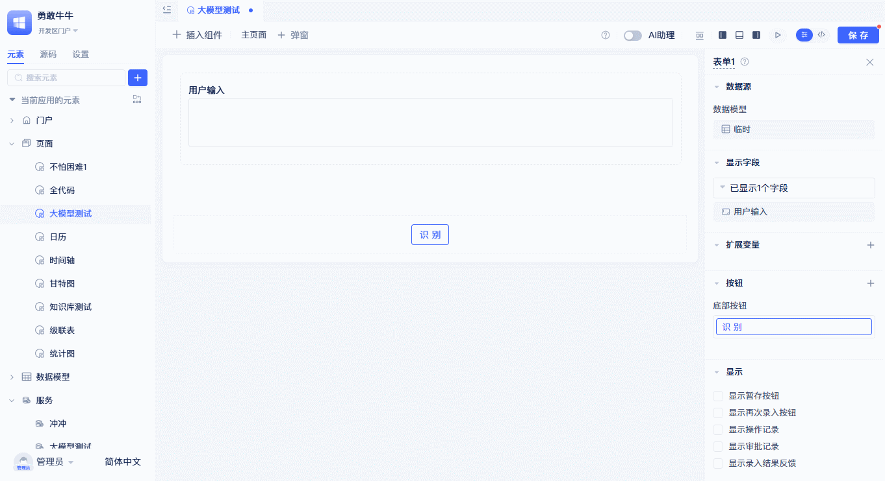
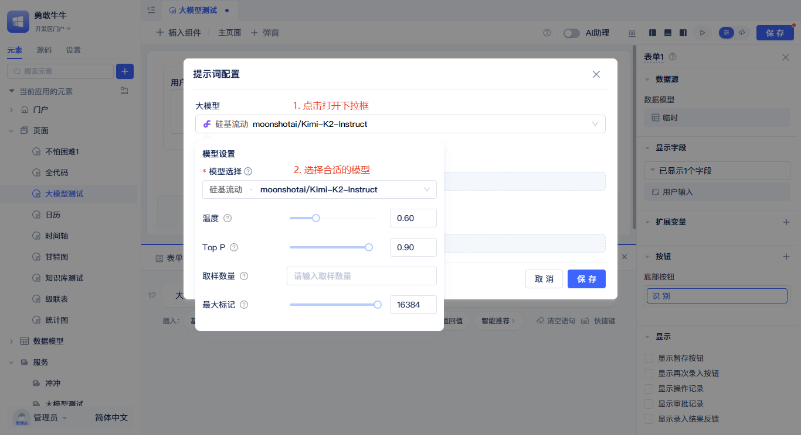
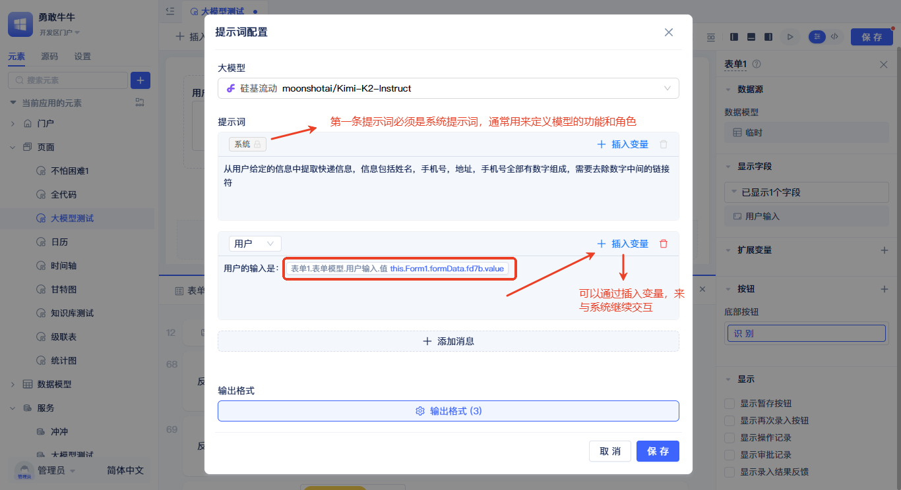

# 大模型函数的输入输出

大语言模型的核心执行函数是 `runLlm`，它是所有大模型调用的统一入口。该函数接受两类关键输入参数：**大模型配置**（包括模型选择和参数设置）和**提示词内容**（包括系统提示词、用户提示词及变量），并通过**控制输出**配置来规范返回结果的格式和结构。

## 在页面中调用大模型 {#call-llm-in-pages}
在页面函数及事件函数逻辑里，开发者可以使用大模型厂商元素的运行函数来调用大模型，获取大模型返回值。这些配置最终都会作为 `runLlm` 函数的输入参数。



点击组件右上角的`事件`，点击事件面板中空白语句上的`请选择`文案，在面板中选择`大模型`-`大模型厂商`，完成后会生成大模型厂商运行函数，点击`提示词配置`，会弹出大模型`提示词配置`面板。

### 函数输入一：设置大语言模型 {#call-llm-input}


在`提示词配置`弹窗中，首先要选择使用的大模型，点击大模型选择框，在弹出的下拉面板中选择对应的大模型即可。选择模型后会自动匹配对应模型的参数，开发者可根据具体模型的特性进行修改。这些模型配置信息将作为 `runLlm` 函数的 `config` 参数中的 `llmConfig` 部分。
:::tip
不同模型支持的配置参数不同，但是一般都支持温度参数，温度参数是最重要的参数之一，开发者可根据业务情况来选择合适的温度参数从而控制模型生成的随机性。
:::

### 函数输入二：使用提示词
提示词是决定大模型输出质量的关键，构成了 `runLlm` 函数的核心输入内容。系统提示词总是作为第一个提示词输入，一般用于定义模型的角色、行为准则、语气风格、安全限制等。用户提示词作为第二个提示词输入，一般用于描述用户意图、需求、上下文等。



点击`+添加消息`可以添加新的提示词输入框，左上角的下拉菜单可以切换提示词类型，系统提示词不允许修改类型，也不允许删除。开发者可根据大模型的用途自行规划提示词的内容，填入到不同类型的提示词输入框中。
点击右上角`插入变量`按钮，可将页面变量内容插入到提示词中，变量内容可以动态改变提示词的内容，从而控制大模型输出。这些变量将作为 `runLlm` 函数的 `context` 参数传入，实现动态的变量替换。


#### 智能链接解析
当你在提示词中输入包含链接的文本时，系统会自动识别并处理这些链接，将获取到的内容直接合并到提示词中发送给AI大模型。

:::tip
图片链接需要使用支持多模态或视觉功能的AI大模型（如qwen-vl-max-latest、GPT-4o等）才能正确识别和分析图片内容。使用纯文本模型时，图片链接将被跳过处理。
:::

#### 使用示例
在提示词中直接输入包含链接的内容：

```
请分析这份技术文档：https://example.com/tech-report.pdf
同时参考这个网页的信息：https://example.com/guide.html
```

系统会自动获取链接内容，将处理后的内容合并到提示词中发送给AI大模型进行分析。

:::tip 支持的链接类型与限制
- **文本文档**：纯文本、HTML网页、Markdown - 最多4096字符
- **PDF文档**：提取前10页文本内容 - 最多4096字符
- **图片文件**：JPEG、PNG、WebP、GIF、BMP、TIFF - 自动压缩至1024×1024像素
- **处理限制**：单次最多5个链接，单个文件最大5MB，请求超时10秒
:::


### 函数输出：控制输出
开发者如果想控制 `runLlm` 函数返回结果的格式，无需在提示词中描述，使用下图的`控制输出`配置即可实现。这些配置将作为 `config` 参数中的 `outputArgs` 部分，指导函数返回结构化数据。


例如图中展示的是提取快递信息中的姓名、手机号、地址。

为了控制大模型结构化输出这三个信息，可以依次点击`输出格式`，在弹出的面板中点击`添加输出结果`，再根据业务情况依次填写名称、标题和类型。注意这里填写的名称尽量和你的业务名称一致或者有关联，比如要提取`姓名`，那么就添加一个`姓名`的输出。系统会根据配置生成一份标准的`控制输出`提示词，如下图。


:::tip
若不配置控制输出配置项，默认输出的是文本。
:::
配置完成后，开发者可以使用 `runLlm` 函数返回的结构化数据在函数语句中与其他业务逻辑进行交互。


:::warning 注意
若大模型返回的数据结构正确，仍然拿不到结构化数据的值，检查图中铅笔所示的位置，查看配置是否与大模型提示词`输出格式`的配置保持一致。
:::

## 在后端函数中调用大模型 {#call-llm-in-backend-functions}
`runLlm` 函数不仅可以在前端页面中使用，也可以在后端函数(服务函数/模型函数/事件函数/任务函数)中使用，输入输出参数保持一致。

配置参考[在页面中调用大模型](#call-llm-in-pages)

## 大模型编程接口 {#llm-programming-interface}
### runLlm
`runLlm` 是大模型模块的核心函数，接受配置参数（config）和上下文变量（context）作为输入，返回大模型的响应结果。所有通过界面配置的模型设置、提示词内容和输出格式，最终都会转换为该函数的调用参数。[API文档](../../reference/framework/JitAi/ai-large-models#runllm)

### embedDocuments
ai-llm的文档向量化方法，用于将文本列表转换为高维向量表示。[API文档](../../reference/framework/JitAi/ai-large-models#embeddocuments)

### rerankDocuments
ai-llm的文档重排方法，用于基于查询文本对候选文档进行重新排序。[API文档](../../reference/framework/JitAi/ai-large-models#rerankdocuments)


