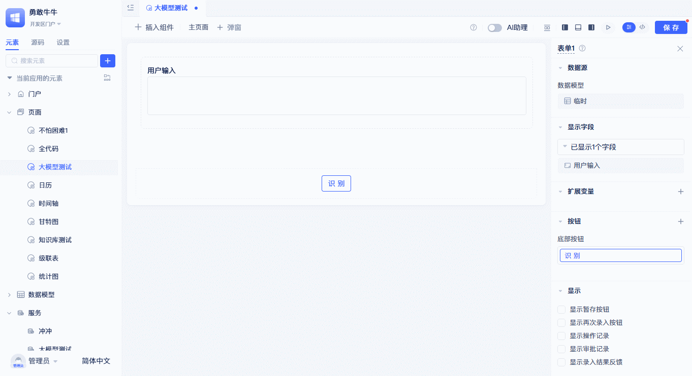
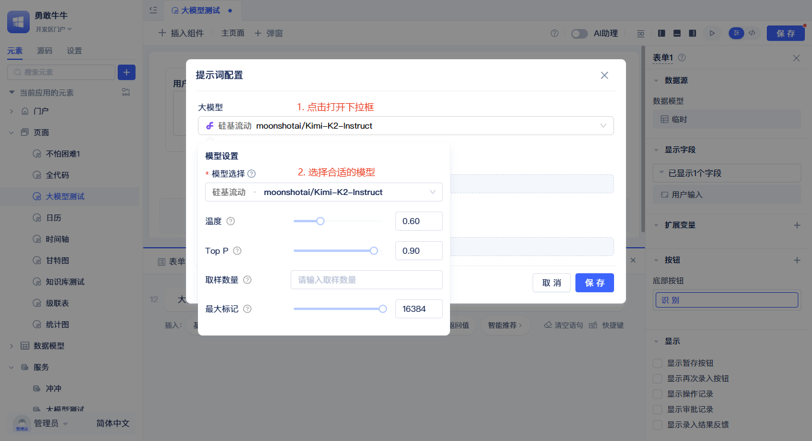
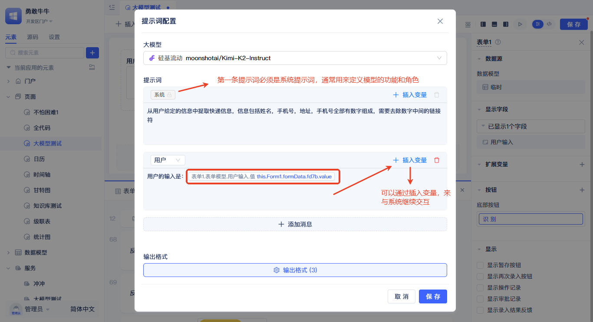
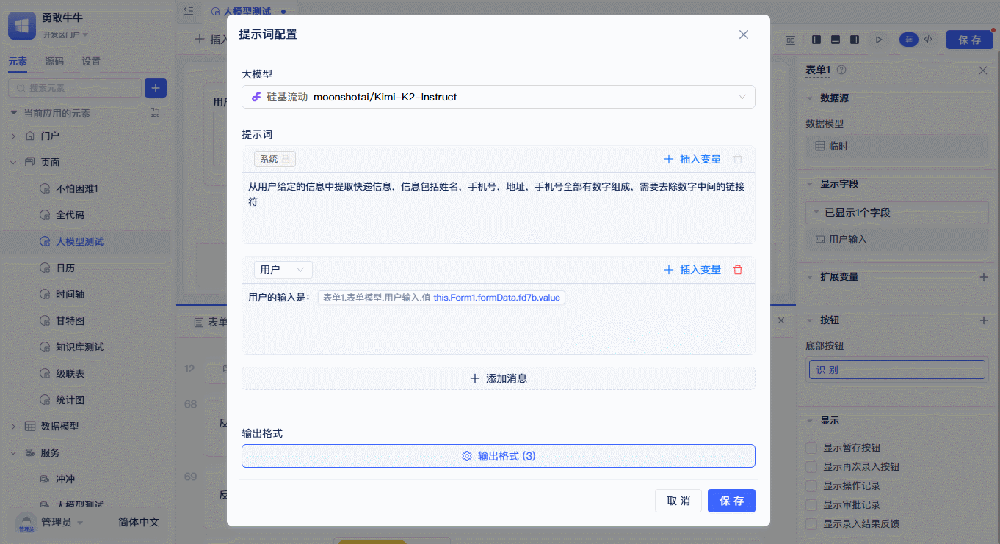
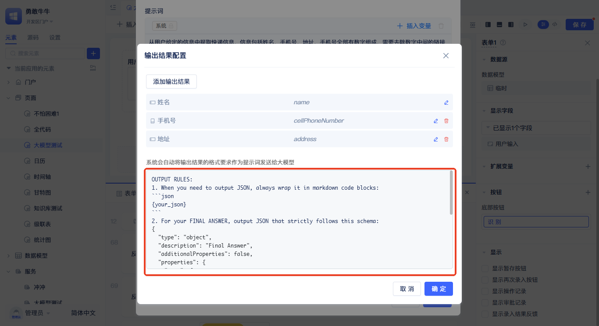
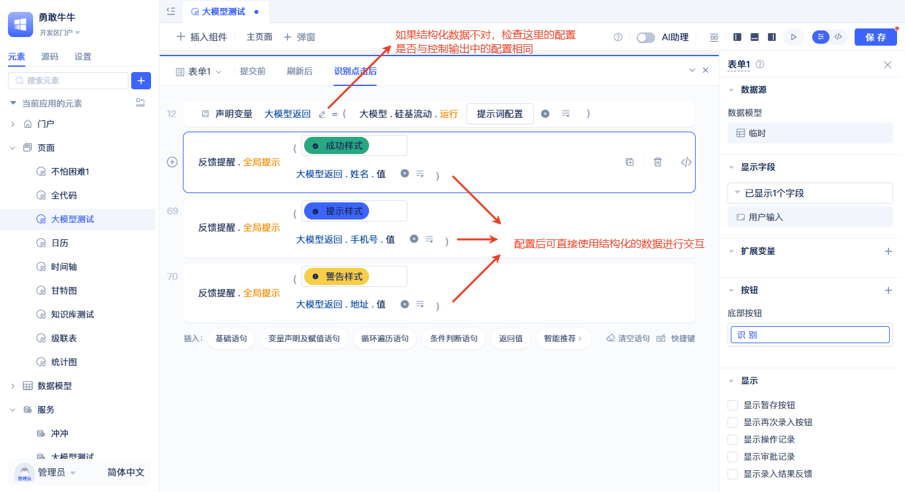

# 在函数中调用 AI 大模型并控制输入输出

`runLlm` 是文本对话和结构化生成的核心函数。它接受两类关键输入参数：**大模型配置**（包括模型选择和参数设置）和**提示词内容**（包括系统提示词、用户提示词及变量），并通过**控制输出**配置来规范返回结果的格式和结构。

除 `runLlm` 外，大模型元素还提供向量化、重排和多模态生成函数。知识库通常使用向量化和重排能力，业务函数可按需调用文生图、图生图、文生视频、图生视频等能力。不同厂商支持的函数范围不同，多模态生成请以[百炼万相图片和视频生成](./implement-multimodal-aigc)中的说明和函数配置面板为准。

## 在页面中调用大模型 {#call-llm-in-pages}
在页面函数及事件函数逻辑里，开发者可以使用大模型厂商元素的运行函数来调用大模型，获取大模型返回值。这些配置最终都会作为 `runLlm` 函数的输入参数。



点击组件右上角的`事件`，点击事件面板中空白语句上的`请选择`文案，在面板中选择`大模型`-`大模型厂商`，完成后会生成大模型厂商运行函数，点击`提示词配置`，会弹出大模型`提示词配置`面板。

### 函数输入一：设置大语言模型 {#setting-language-model}


在`提示词配置`弹窗中，首先要选择使用的大模型，点击大模型选择框，在弹出的下拉面板中选择对应的大模型即可。选择模型后会自动匹配对应模型的参数，开发者可根据具体模型的特性进行修改。这些模型配置信息将作为 `runLlm` 函数的 `config` 参数中的 `llmConfig` 部分。
:::tip
不同模型支持的配置参数不同，但是一般都支持温度参数，温度参数是最重要的参数之一，开发者可根据业务情况来选择合适的温度参数从而控制模型生成的随机性。
:::

如果模型需要被 Agent 调用工具、识别图片、处理复杂推理，应优先选择在[大模型元素](./create-ai-llm#custom-model-configuration)中已标记相应特性的模型。

### 函数输入二：使用提示词 {#using-prompts}
提示词是决定大模型输出质量的关键，构成了 `runLlm` 函数的核心输入内容。系统提示词总是作为第一个提示词输入，一般用于定义模型的角色、行为准则、语气风格、安全限制等。用户提示词作为第二个提示词输入，一般用于描述用户意图、需求、上下文等。



点击`+添加消息`可以添加新的提示词输入框，左上角的下拉菜单可以切换提示词类型，系统提示词不允许修改类型，也不允许删除。开发者可根据大模型的用途自行规划提示词的内容，填入到不同类型的提示词输入框中。
点击右上角`插入变量`按钮，可将页面变量内容插入到提示词中，变量内容可以动态改变提示词的内容，从而控制大模型输出。这些变量将作为 `runLlm` 函数的 `context` 参数传入，实现动态的变量替换。


#### 在提示词中使用外部资料链接 {#intelligent-link-parsing}
提示词可以直接包含文档、网页或图片链接，把链接作为模型需要参考的上下文。模型能否理解链接对应内容，取决于所选模型、调用方式以及业务中是否已经把链接内容读取并传入提示词。

:::tip
如果业务需要分析图片内容，应选择已标记`视觉能力 (vision)`的对话模型，并在调用前确认该模型支持当前输入形式。纯文本模型通常只能把图片链接当作普通文本处理。
:::

#### 使用示例 {#usage-example}
在提示词中直接输入包含链接的内容：

```
请分析这份技术文档：https://example.com/tech-report.pdf
同时参考这个网页的信息：https://example.com/guide.html
```

如果需要模型基于链接中的正文、PDF 内容或图片内容作答，建议先在业务流程中读取并整理这些资料，再作为提示词变量传入。

:::tip
大量外部资料更适合先整理到[AI知识库](../knowledge-base/create-knowledge-elements)中，再由 Agent 或业务函数检索使用。这样可以避免把过长资料直接塞进一次提示词调用。
:::


### 函数输出：控制输出 {#output-control}
开发者如果想控制 `runLlm` 函数返回结果的格式，无需在提示词中描述，使用下图的`控制输出`配置即可实现。这些配置将作为 `config` 参数中的 `outputArgs` 部分，指导函数返回结构化数据。



例如图中展示的是提取快递信息中的姓名、手机号、地址。

为了控制大模型结构化输出这三个信息，可以依次点击`输出格式`，在弹出的面板中点击`添加输出结果`，再根据业务情况依次填写名称、标题和类型。注意这里填写的名称尽量和你的业务名称一致或者有关联，比如要提取`姓名`，那么就添加一个`姓名`的输出。系统会根据配置生成一份标准的`控制输出`提示词，如下图。



:::tip
若不配置控制输出配置项，默认输出的是文本。
:::
配置完成后，开发者可以使用 `runLlm` 函数返回的结构化数据在函数语句中与其他业务逻辑进行交互。



:::warning 注意
若大模型返回的数据结构正确，仍然拿不到结构化数据的值，检查图中铅笔所示的位置，查看配置是否与大模型提示词`输出格式`的配置保持一致。
:::

## 在后端函数中调用大模型 {#call-llm-in-backend-functions}
`runLlm` 函数不仅可以在前端页面中使用，也可以在后端函数(服务函数/模型函数/事件函数/任务函数)中使用，输入输出参数保持一致。

配置参考[在页面中调用大模型](#call-llm-in-pages)

## 在业务逻辑中选择合适的大模型函数 {#llm-programming-interface}
### runLlm
`runLlm` 是文本对话和结构化生成函数，接受配置参数（config）和上下文变量（context）作为输入，返回大模型的响应结果。通过提示词配置界面设置的模型参数、提示词内容和输出格式，最终都会转换为该函数的调用参数。[API文档](../../reference/framework/JitAi/ai-large-models#runllm)

### embedDocuments
`embedDocuments` 用于将文档文本列表转换为向量，常用于知识库入库、语义检索等场景。[API文档](../../reference/framework/JitAi/ai-large-models#embeddocuments)

### embedQuery
`embedQuery` 用于将用户查询文本转换为向量，常用于与文档向量进行相似度检索。[API文档](../../reference/framework/JitAi/ai-large-models#embedquery)

### rerankDocuments
`rerankDocuments` 用于基于查询文本对候选文档进行重新排序，适合提升知识库召回片段的相关性。[API文档](../../reference/framework/JitAi/ai-large-models#rerankdocuments)

### textToImage
`textToImage` 用于根据文本提示词生成图片。配置方式请参考[文生图功能](./implement-multimodal-aigc#text-to-image)。

### imageToImage
`imageToImage` 用于根据参考图片和文本提示词生成或编辑图片。配置方式请参考[图生图功能](./implement-multimodal-aigc#image-to-image)。

### textToVideo
`textToVideo` 用于根据文本提示词生成视频。配置方式请参考[文生视频功能](./implement-multimodal-aigc#text-to-video)。

### imageToVideo
`imageToVideo` 用于根据首帧图片生成视频。配置方式请参考[图生视频功能](./implement-multimodal-aigc#image-to-video)。

### keyframeToVideo
`keyframeToVideo` 用于根据首尾帧图片生成过渡视频。配置方式请参考[首尾帧生视频功能](./implement-multimodal-aigc#keyframe-to-video)。
