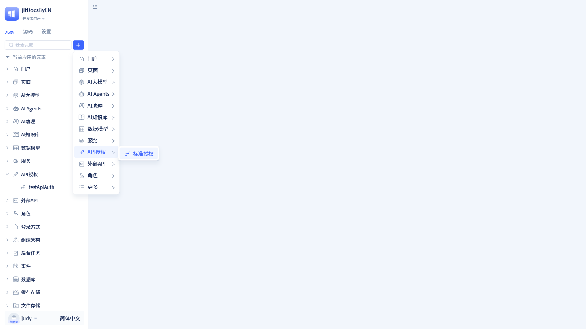
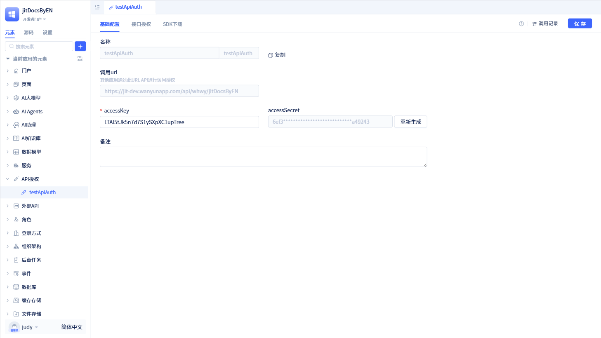

# 创建API授权元素
API授权是JitAi平台提供的接口访问控制机制，用于将应用内的元素能力安全地对外开放。通过创建API授权元素并配置访问凭证（accessKey/accessSecret），开发者可以将服务函数、数据模型、AI Agent、AI助理等业务能力以标准API的形式提供给外部系统调用。

平台提供完整的授权管理能力，包括接口授权配置、调用地址生成、调用记录追踪等。外部系统可以通过平台提供的多语言SDK（Python、Node.js、Java）进行调用，或者在JitAi应用之间通过[跨App服务元素](../business-logic-development/creating-service-elements#use-cross-app-service-elements-to-call-authorized-apis)实现互通，构建灵活的应用集成生态。

## 新建API授权 {#api-authorization-creation}

在左侧元素树上点击`+`会打开弹窗，将鼠标移动到“更多”中，会看到“API 授权”。点击“API 授权”里面的“标准授权”，就会打开标准授权的新建弹窗页面。

在标准授权的新建弹窗页面中，填写 API 授权名称和 accessKey 后，点击`保存`即可创建一个新的 API 授权。

:::tip 提示
accessKey 是 API 授权的密钥，是由 8-32 位字母或数字组成的字符串，不能包含特殊字符。

在创建 API 授权之前，系统会先根据 accessKey 生成 accessSecret。accessKey 和 accessSecret 是 API 授权访问的凭证。

:::

## API授权详情 {#api-authorization-detail}

在开发者在新建 API 授权弹窗里点击`确认`后，页面会跳转到授权列表页面，并显示刚创建的授权信息。或者通过左侧元素树中点击`API授权`，就可以查看所有已创建的授权信息。

API详情页面中可以查看授权信息，包括授权名称、accessKey、accessSecret、调用地址、授权接口等信息。其中，`调用url`就是授权接口的调用地址，调用方可以通过该 url 进行调用。`授权接口`可以对当前应用中的服务函数等进行授权。

在授权详情页面的左上角有个`复制`按钮，点击`复制`系统会将授权信息复制到剪贴板。

:::warning 注意

在授权页面，开发者可以修改 accessKey。修改完 accessKey 后，请务必重新生成新的 accessSecret，否则校验将无法通过。

:::

## 调用记录 {#call-records}

当调用方发起调用后，JitAi 会生成调用记录。

在授权 API 的可视化编辑器中，点击右上角的`调用记录`，打开调用记录弹窗。

在调用记录弹窗中可以查看接口地址、调用时间、调用 IP、调用结果等信息，还可以根据调用结果状态、调用时间进行筛选。