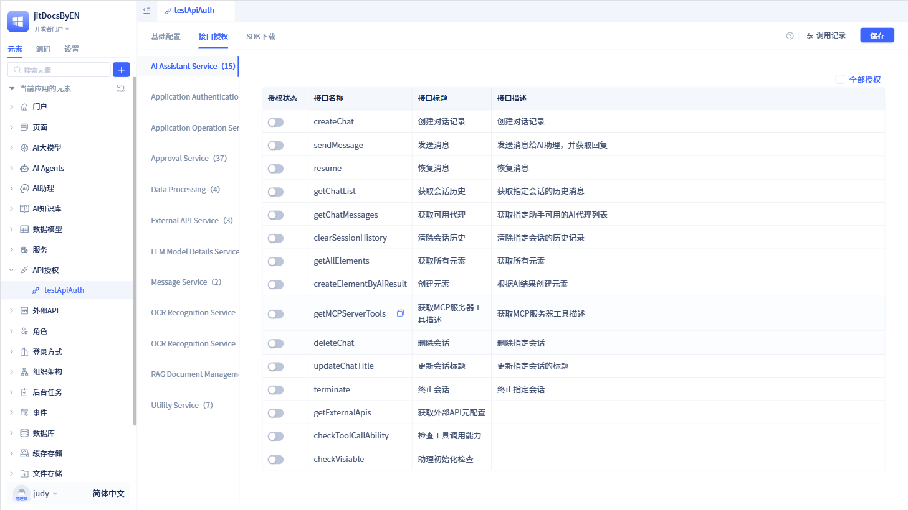

# 各类元素的API开放示例

创建API授权元素，并配置好授权信息后，就可以将系统中的服务函数、数据模型、大模型函数、agent、AI助理、审批流程等功能对外开放。目前，系统只支持对服务函数进行API授权。

## 服务函数的API授权 {#service-function-api-authorization}

服务函数的API授权，就是将服务函数开放给外部调用。在授权详情页面中，点击`服务`标签，就可以对服务函数进行API授权。

服务中的各个函数可以独立授权，在对应的接口名称前面打开`授权状态`开关即可，也可以点击右上角的`全部授权`将所有函数开放。

## 数据模型的API授权 {#data-model-api-authorization}

敬请期待...

## 大模型函数的API授权 {#large-language-model-function-api-authorization}

敬请期待...

## AI Agent的API授权 {#agent-api-authorization}

敬请期待...

## AI助理的API授权 {#ai-assistant-api-authorization}

敬请期待...

## 审批流程的API授权 {#approval-process-api-authorization}

敬请期待...
