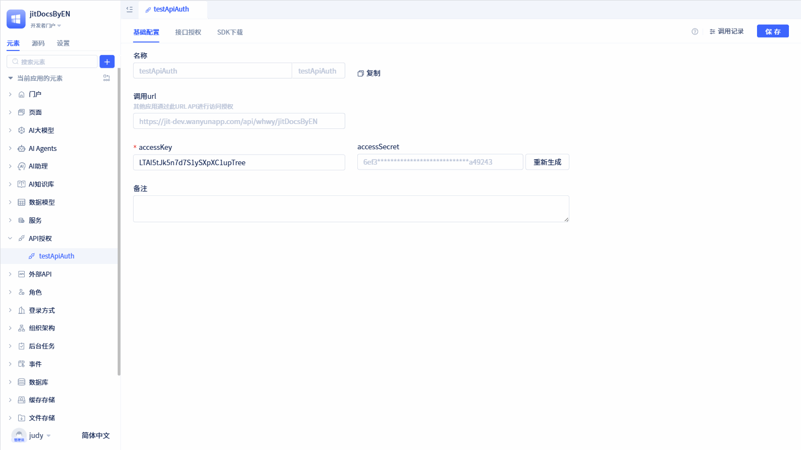

# 使用跨App服务元素调用授权元素API

当调用方也是JitAI应用时，除了通过SDK实现，也可以直接使用[跨App服务元素](../business-logic-development/creating-service-elements#use-cross-app-service-elements-to-call-authorized-apis)调用授权方开放的接口。

## 使用跨App服务元素 {#using-cross-app-service-elements}

在授权详情页面点击`复制`按钮，将复制后的授权信息粘贴到跨APP服务元素中。

