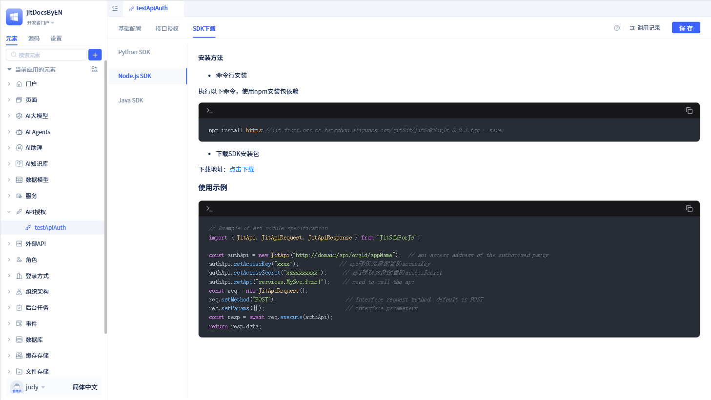
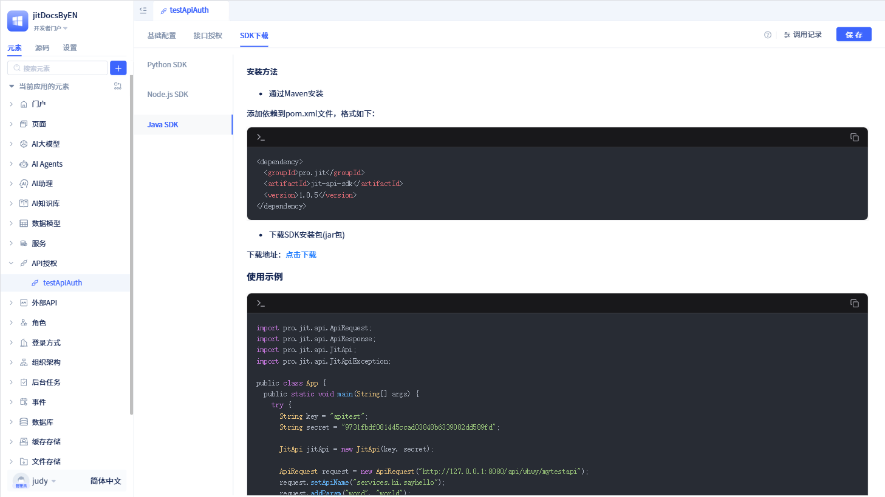

# 使用SDK调用授权元素API

开发者配置好授权信息和授权接口后，调用方可以通过调用 JitAi 提供的 SDK 来调用授权方开放的接口。

在授权详情页面中，点击`下载SDK`，可以查看SDK使用指南和下载地址。


JitAi 提供了 Python、Nodejs、Java 三种语言的 SDK。

## 使用Python SDK {#using-python-sdk}
作为Python 开发者，可以使用 Python SDK 来调用授权方开放的接口。


调用方可以使用命令行安装Python SDK或者在`下载SDK`弹窗中的`Python`标签页下点击`下载地址`进行下载SDK。

```typescript
pip install wanyun_JitSdk 
```
SDK安装成功后，在对应的项目中就可以引入SDK并配置好对应的授权信息，就可以调用授权方开放的接口了。

```typescript
from wanyun_JitSdk import JitApi 
from wanyun_JitSdk import JitApiRequest 
from wanyun_JitSdk import JitApiResponse 
 
authApi = JitApi("http://domain/api/orgId/appName")  # 授权方的api访问地址 
authApi.setAccessKey("xxxx")              # api授权元素配置的accessKey 
authApi.setAccessSecret("xxxxxxxxxx")     # api授权元素配置的accessSecret 
authApi.setApi("services.MySvc.func1")    # 需要调用的api 
req = JitApiRequest() 
req.setMethod("POST")                     # 接口请求方式，默认为POST 
req.setParams({})                         # 接口参数 
resp = req.execute(authApi) 
print(resp.data) 
```

## 使用Nodejs SDK {#using-nodejs-sdk}
作为Nodejs 开发者，可以使用 Nodejs SDK 来调用授权方开放的接口。



调用方可以使用命令行安装Nodejs SDK或者在`下载SDK`弹窗中的`Nodejs`标签页下点击`下载地址`进行下载SDK。

```typescript
 npm install https://jit-front.oss-cn-hangzhou.aliyuncs.com/jitSdk/JitSdkForJs-0.0.3.tgz --save 
```
SDK安装成功后，在对应项目中就可以引入SDK并配置好对应的授权信息，就可以调用授权方开放的接口了。

```typescript
 // 以es6模块规范为例 
 import { JitApi, JitApiRequest, JitApiResponse } from "JitSdkForJs"; 

 const authApi = new JitApi("http://domain/api/orgId/appName");  // 授权方的api访问地址 
 authApi.setAccessKey("xxxx");             // api授权元素配置的accessKey 
 authApi.setAccessSecret("xxxxxxxxxx");     // api授权元素配置的accessSecret 
 authApi.setApi("services.MySvc.func1");    // 需要调用的api 
 const req = new JitApiRequest(); 
 req.setMethod("POST");                      // 接口请求方式，默认为POST 
 req.setParams({});                          // 接口参数 
 const resp = await req.execute(authApi); 
 return resp.data; 

```

## 使用Java SDK {#using-java-sdk}
作为Java 开发者，可以使用 Java SDK 来调用授权方开放的接口。



调用方可以通过Maven进行安装Java SDK或者在`下载SDK`弹窗中的`Java`标签页下点击`下载地址`进行下载SDK。

```typescript
<dependency>
  <groupId>pro.jit</groupId>
  <artifactId>jit-api-sdk</artifactId>
  <version>1.0.5</version>
</dependency>
```
SDK安装成功后，在对应项目中就可以引入SDK并配置好对应的授权信息，就可以调用授权方开放的接口了。

```typescript
import pro.jit.api.ApiRequest;
import pro.jit.api.ApiResponse;
import pro.jit.api.JitApi;
import pro.jit.api.JitApiException;

public class App {
  public static void main(String[] args) {
    try {
      String key = "apitest";
      String secret = "9731fbdf081445ccad03848b6339082dd589fd";

      JitApi jitApi = new JitApi(key, secret);

      ApiRequest request = new ApiRequest("http://127.0.0.1:8080/api/whwy/mytestapi");
      request.setApiName("services.hi.sayhello");
      request.addParam("word", "world");
      ApiResponse result = jitApi.execute(request);
      System.out.println(result);
    } catch (JitApiException e) {
      throw new RuntimeException(e);
    }
  }
}
```

