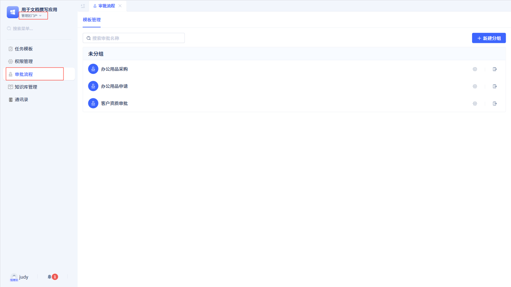

# 门户中的审批发起和待办
在门户中，用户可以通过“发起申请”和“待办中心”两个功能模块，对流程进行发起申请和查看处理等操作。

## 发起申请 {#initiate-application}
在开发区创建的所有审批流程，在这里都会展示。

当发起人选择其中一个审批流程后，就会进入对应的发起申请页面。

发起申请页面由审批表单和流程数据组成。页面右侧的审批流程是预测数据，因此都显示的是“未到达”状态。在发起申请页面填写好表单后，点击提交按钮，就会进入审批流程。

:::tip 注意
审批流程预测数据是根据当前审批流程的配置生成的。因此，如果配置不发生变化，预测数据不会发生变化。

如果当前审批流程有分支节点，预测数据会根据表单中填写的数据决定显示哪个分支。
:::

## 待办中心 {#todo-center}
待办中心是处理审批流程的入口，用户可以在待办中心查看与当自己相关的审批任务。

待办中心包括四个标签：待办、已办、已发起、抄送。每个标签都会展示当前状态下的审批任务，以摘要的形式展示。点击对应的审批任务，可以进入审批详情页面。

待办中心有两种展现模式：列表模式和卡片模式，默认显示列表模式。在列表模式下，每个审批任务最多显示 5 个摘要信息。

点击切换图标切换成卡片模式后，每个审批任务最多只展现 3 个摘要信息。

### 详情页面 {#detail-page}
在待办标签页下看到的审批任务都是待办任务。点击每一个待办任务，就可以打开对应的待办详情；同理，在已办标签下打开的是已办详情，在已发起标签下打开的是已发起详情，在抄送标签下打开的是抄送详情。

所有的详情页面分为左右结构，左边是审批表单页面，右边显示审批流程。

:::tip 提示

已办详情页面和抄送详情页面底部不会有操作按钮。

如果发起节点打开“撤销流程”功能，在已发起详情页面中，会显示`撤销流程`按钮。

如果在审批节点打开“拒绝”、“回退”等功能，在待办详情页面中就会显示`拒绝`、`回退`按钮。

如果在“审批配置”打开“分享”、“打印”等功能，在该审批的所有详情页面中就会显示`分享`、`打印`等按钮。

如果开启“评论”功能，在该审批所有详情页面的右侧会显示“评论”标签。

:::

### 委托他人处理 {#delegate-to-others-processing}
用户可能因为各种原因导致较长一段时间无法处理审批，这时可以通过委托功能，将审批委托给其他用户处理。

在待办中心的右上角点击`委托`，即可进入委托页面进行设置。

委托页面包括三个部分：发起委托、委托管理和代理记录。

在发起委托页面，需填写代理人、代理开始时间、代理结束时间、委托审批范围以及需要委托的审批流程。填写完毕之后，点击`发起委托`后，委托功能就会生效。

委托管理中可以查看当前已发起的委托列表，查看代理人、时间、流程等信息，并可以提前结束或删除已结束的委托。

代理记录中也可以查看在委托时间内代理人经手并操作的所有代理信息。

:::warning 注意
委托人发起委托后，对于委托期间尚未完成审批的数据，如果超过委托结束时间，也不会返还给委托人，仍然由代理人进行处理。
:::

## 审批流程管理页面 {#approval-process-management-page}

当管理员进入管理者门户后，可以看到审批流程管理页面。

在审批流程管理页面中，可以新建分组，然后将审批流程移动到分组中。

另外，对于每个审批流程，管理员可以重新配置各个节点的参数。

:::warning 注意

审批流程管理区只能对审批流程进行分组和节点配置，不能删除审批流程。

如果删除分组，系统会将分组下的所有审批流程移动到“未分组”中。

如果某个审批流程配置被修改，它将覆盖在开发区中的配置。

:::
