# 特殊节点配置
JitAI 的审批流程除了提供了常用的节点外，还支持一些特殊节点，比如抄送节点、分支节点、并行节点、子流程节点等。

## 抄送节点 {#cc-node}
当用户在发起申请或处理审批单时，需要抄送给其他用户时，可以使用抄送节点。

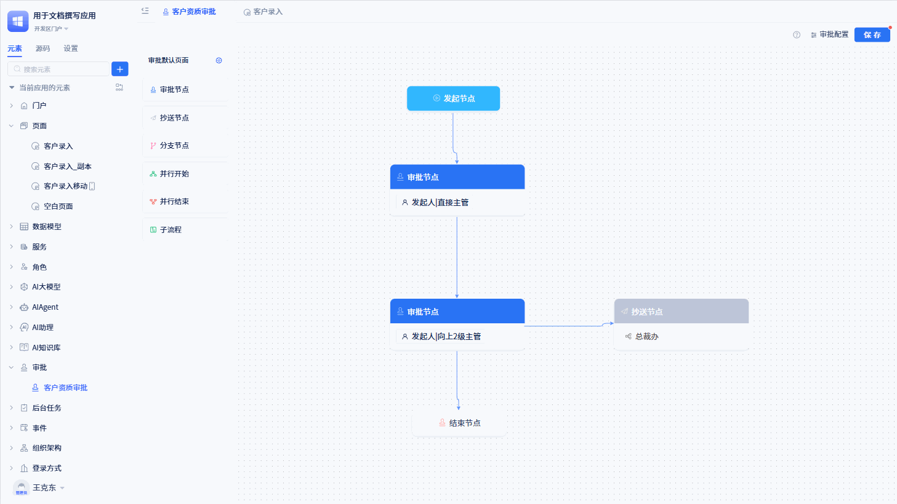

在配置面板点击对应的“抄送节点”就可以打开抄送配置面板。

抄送节点可以设置抄送人、短信通知、抄送页面设置、摘要字段设置、抄送页面字段显示设置以及页面控件显示设置。

### 抄送人 {#cc-recipients}
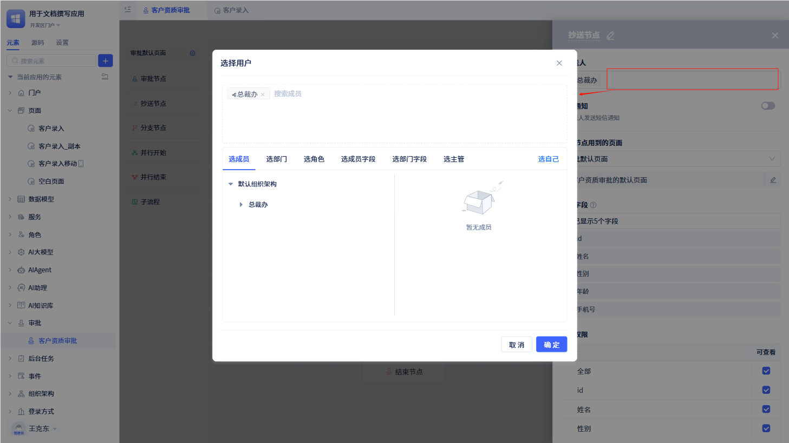

抄送人的设置与审批节点的设置一样，可以配置为用户、部门、角色、成员字段、部门字段等。具体参考[用户选择](./approval-node-configuration#approver-settings)。

### 短信通知 {#sms-notification}
当抄送信息发送给对应的抄送人时，抄送人会收到短信通知。它的配置与审批节点的短信通知配置一样。具体参考[短信通知](./approval-node-configuration#sms-notification)。

### 当前节点用到的页面 {#pages-used-by-current-node}
默认情况下，所有的抄送节点都使用审批流程的默认页面，如果需要自定义页面，可以在节点配置中设置节点的页面。如何创建自定义页面，请参考[审批页面定制](./approval-page-customization)。

### 字段权限 {#fieldpermission}
用户可通过字段权限控制“抄送”页面上的审批表单字段的查看权限。默认情况下，所有字段仅处于可查看状态。

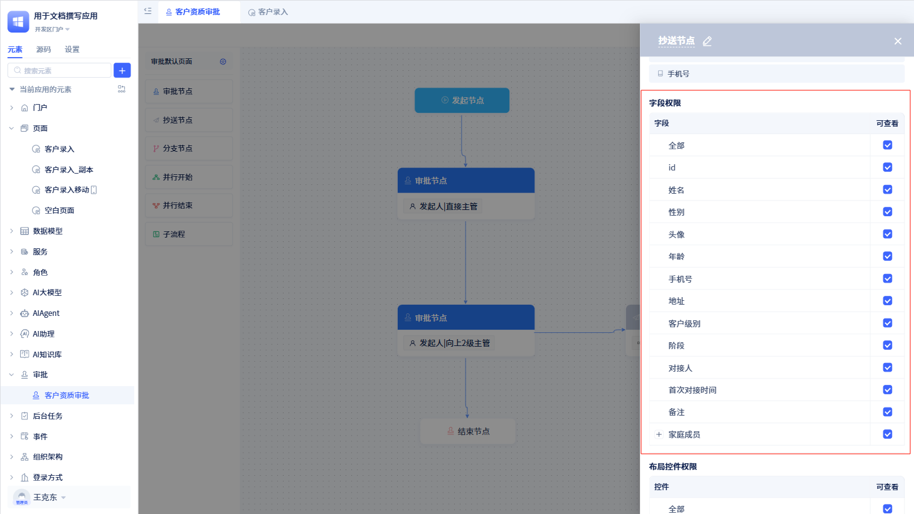

:::warning 注意

字段权限仅针对于当前节点下的“抄送”页面有效。

审批表单字段最终展示是同时受抄送节点权限控制和表单本身权限的影响。表单权限如何配置，参照[表单权限](../using-functional-components-in-pages/form-components#field-operation-permissions)。

当数据表新增某个字段后，需要先为其添加权限，再去对应的页面进行配置。
:::

### 布局控件权限 {#layout-control-permissions}
有些情况下，对于不同的节点，所展示的页面中某些布局控件可能不需要展示，此时可以使用布局控件权限进行权限控制。

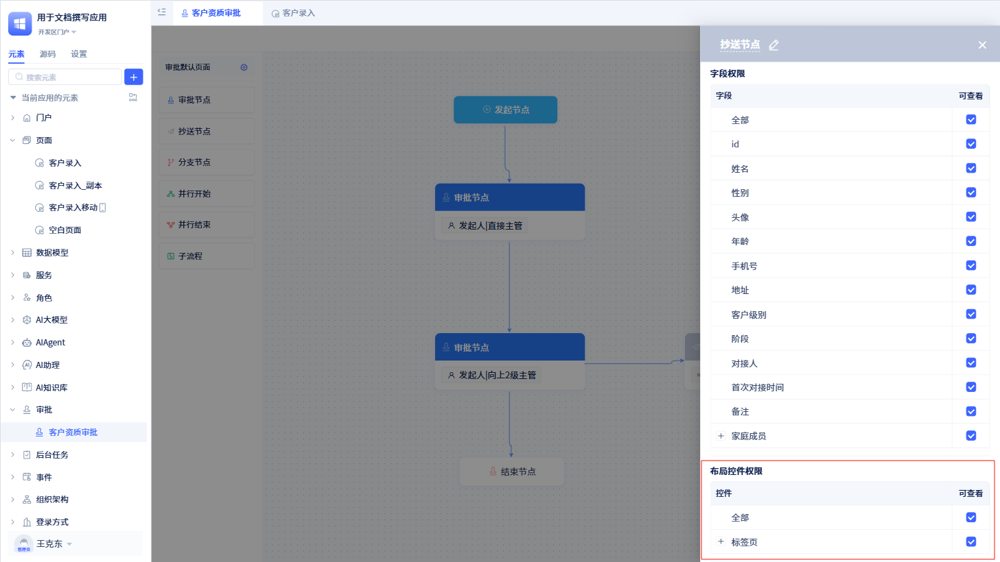

用户可以控制当前节点下页面展示时的布局控件是否显示。默认情况下，对应的页面没有添加布局控件，需要先到对应的页面添加布局控件后才能进行权限控制。

## 分支节点 {#branch-node}
当某个审批流程需要根据表单中某些字段的值来决定下一步审批节点时，可以使用分支节点。

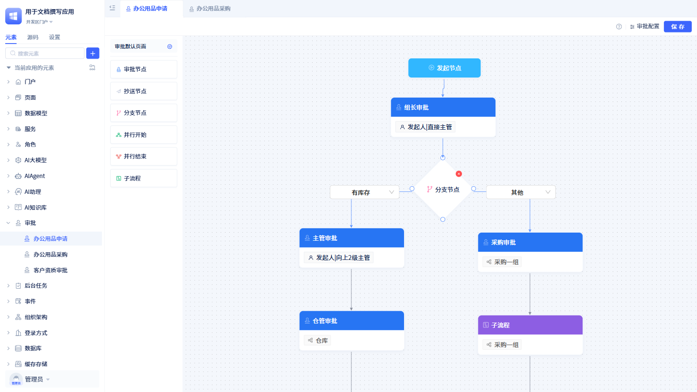

例如，在申请办公用品的时候，如果空余的办公用品数量小于 5 个，则需要通知采购部门进行采购。

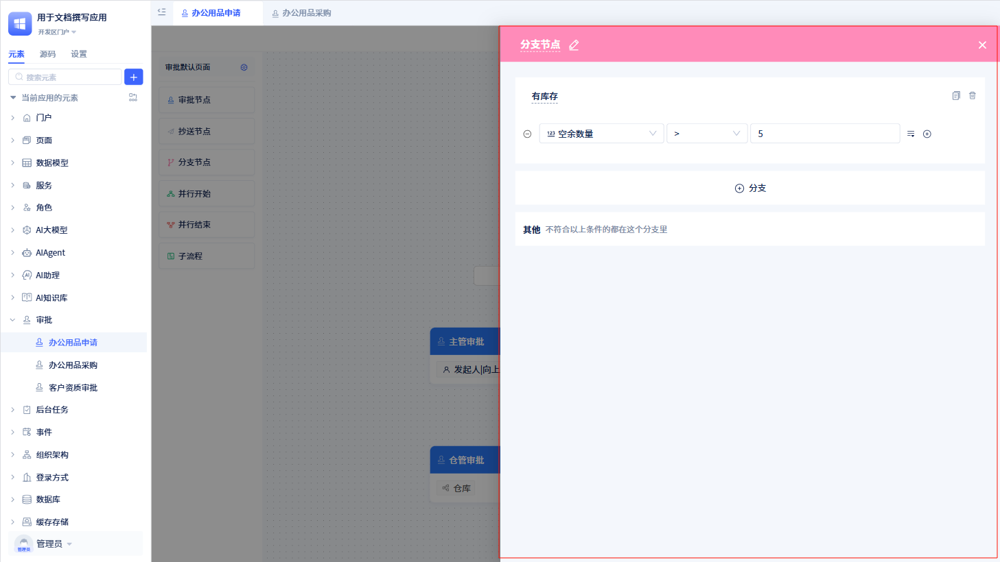

从“审批配置面板”点击对应的分支节点，就会打开该节点的配置面板，在配置面板中可以设置分支条件。

:::tip 提示

分支节点的每一个分支条件实际上都是一个针对审批关联模型的筛选条件。

分支节点的每一个分支都会有自己独立的流转路线，根据分支节点上设定的条件而分流。

分支节点默认会有一条“其他”分支，当不符合以上任意分支条件时，审批就会流转到“其他”分支。
:::

## 并行节点 {#parallel-node}
当用户希望多条审批路径能够同时流转时，就可以使用并行节点。

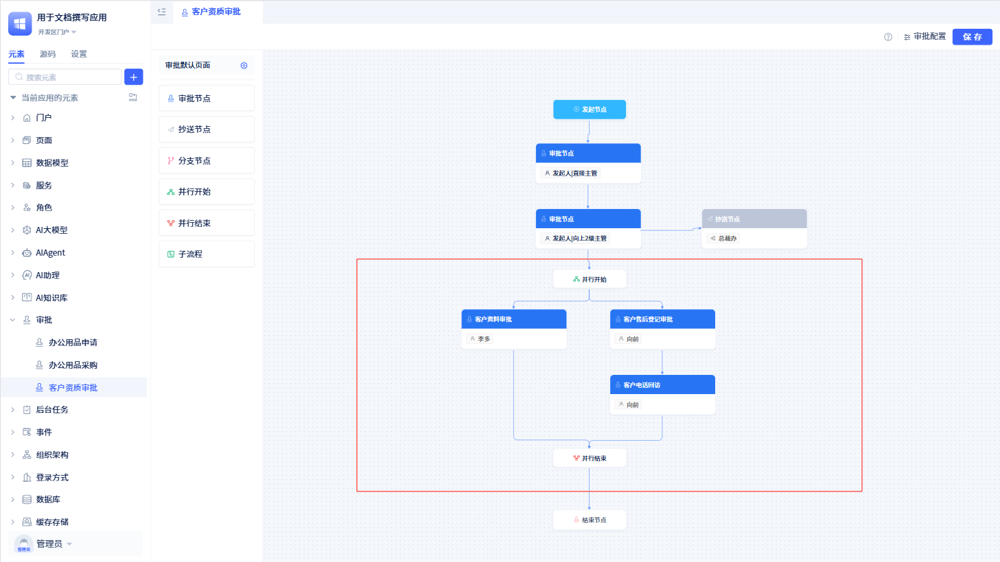

一个审批流程中可以有多组并行节点。

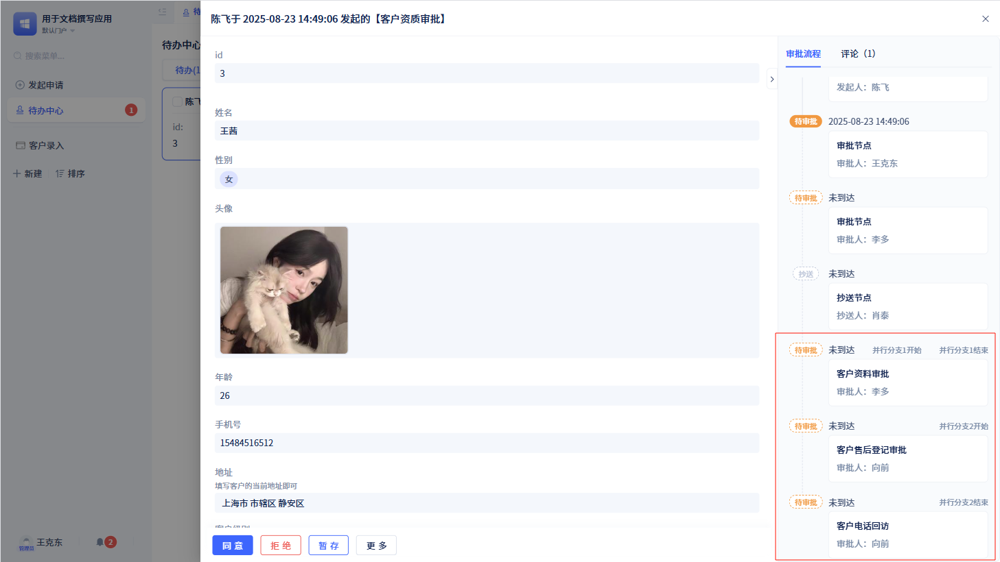

当流程进入并行节点时，会在审批记录上将呈现出所有的节点状态及流转情况。

:::warning 注意

并行开始和并行结束必须成对出现

所有的并行节点都必须从并行开始节点开始，并行结束节点结束

所有的并行分支都是独立的，互不影响

:::

## 子流程节点 {#sub-process-node}
子流程作为节点可以看作是对审批流程的提取，将功能/路线一致的流程图作为独立的审批流程存在，从而让多个主流程均可调用，而无需重复配置。

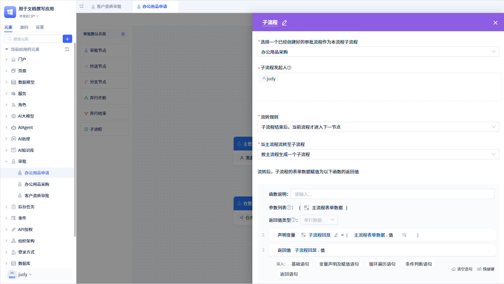

在审批配置面板点击对应的子流程节点，就可以进入子流程配置面板。子流程配置面板有很多配置项：

### 子流程名称 {#sub-process-name}
下拉选择，这里必须选择一个除当前审批外的审批流程作为当前审批流程的子流程。

### 子流程发起人 {#sub-process-initiator}
选择成员作为子流程的发起人，选人界面同[审批人选择](./approval-node-configuration#approver-settings)。

:::warning 注意
如果子流程发起人设置了多个成员，那么会由每一个发起人逐个发起子流程。
:::

### 子流程流转规则 {#sub-process-flow-rules}
当子流程发起后，可以通过子流程流转规则来指定子流程的流转。

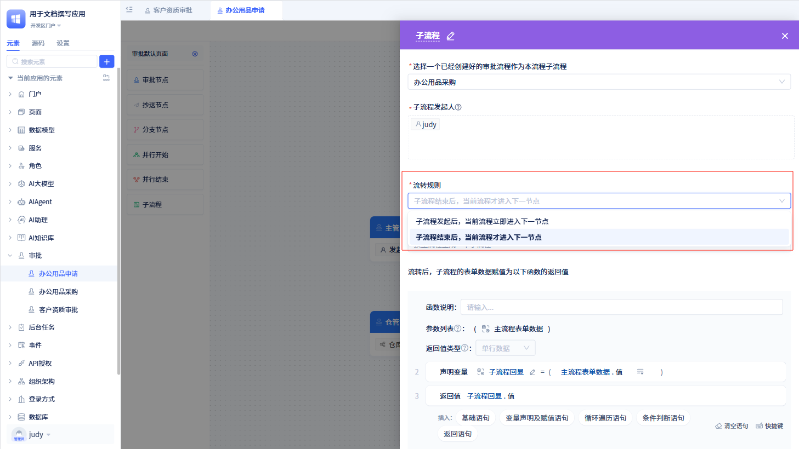

开发者可以选择是子流程发起后，当前流程就会进入下一个节点，还是选择子流程结束后，当前流程才进入下一节点。

当开发者选择“子流程发起后，当前流程就会进入下一个节点”时，子流程和当前流程将同时执行，两个流程是独立的，子流程是否完结对当前流程没有影响。

当开发者选择“子流程结束后，当前流程才进入下一节点”时，当前流程会暂停流转，等子流程结束后，才会进入下一个节点。

### 当主流程流转至子流程 {#when-main-process-flows-to-sub-process}
当主流程流转到子流程时，按照实际需要，开发者会根据配置生成不同的子流程数量。

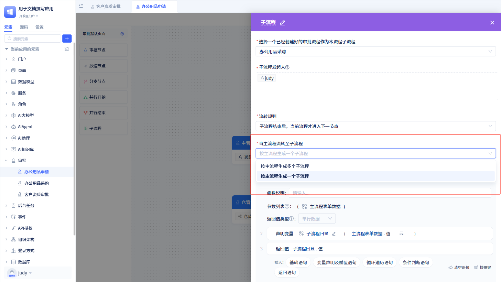

**按主流程生成一个子流程：** 大多数情况下都是这种情况，当前流程和子流程是 1 对 1 的关系。

**按主流程生成多个子流程：** 一般在主流程中存在多个子表的情况下，对子表生成多个子流程。

### 子流程流转后函数设计 {#sub-process-post-flow-function-design}
当前流程流转到子流程时，需要将当前流程的数据传递给子流程，在这里配置函数实现。

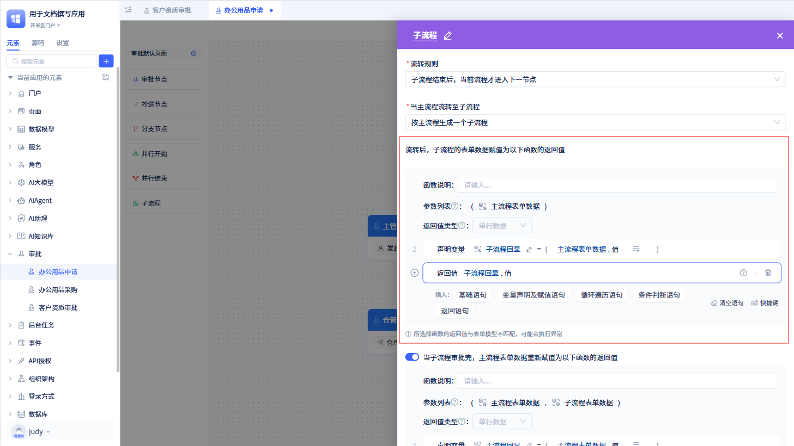

以可视化的形式进行函数设计。

:::warning 注意
入参固定为主流程的表单数据，返回值的类型是单行数据。如果所选函数的返回值与表单模型不匹配，会导致函数执行异常。
:::

### 单个子流程结束时更新主流程数据 {#update-main-process-data-single-sub-process-end}
当子流程结束后，根据具体需求是否需要将子流程的表单数据传递给主流程。如果需要，则开启此功能。

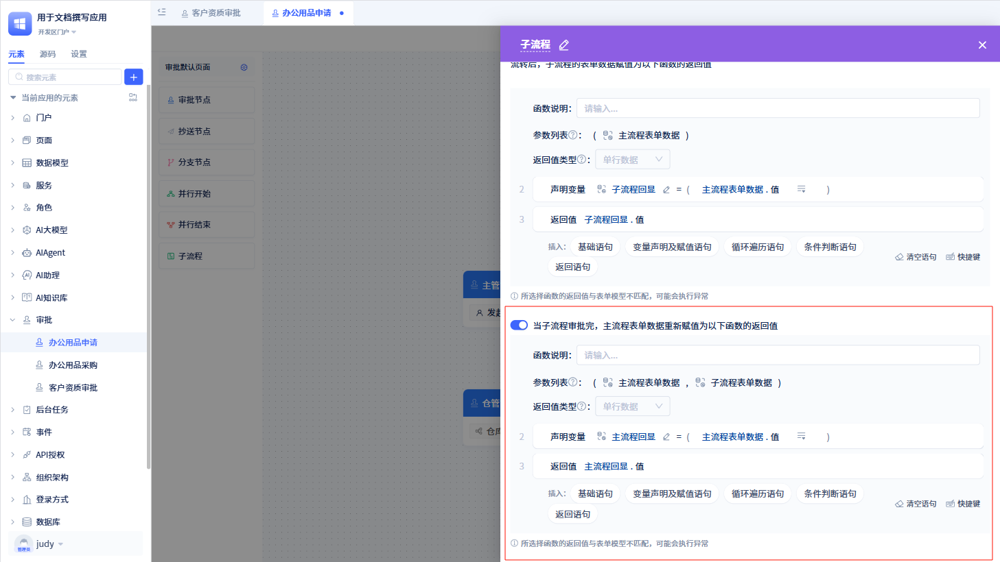

这里也是以可视化的形式进行函数设计。

:::warning 注意
入参固定为主流程的表单数据和子流程的表单数据，返回值的类型是单行数据。如果所选函数的返回值与表单模型不匹配，会导致函数执行异常。
:::

### 所有子流程结束时更新主流程数据 {#update-main-process-data-all-sub-processes-end}
当主流程流转至子流程时，按主流程生成多个子流程后。当所有子流程审批完，主流程是否需要子流程的表单数据进行操作。

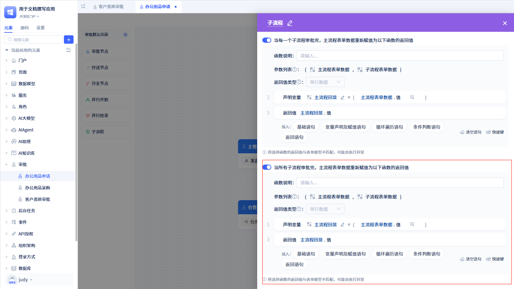

:::warning 注意
该功能只适用于产生多个子流程的场景。

入参固定为主流程的表单数据和子流程的表单数据，返回值的类型是单行数据。如果所选函数的返回值与表单模型不匹配，会导致函数执行异常。
:::
