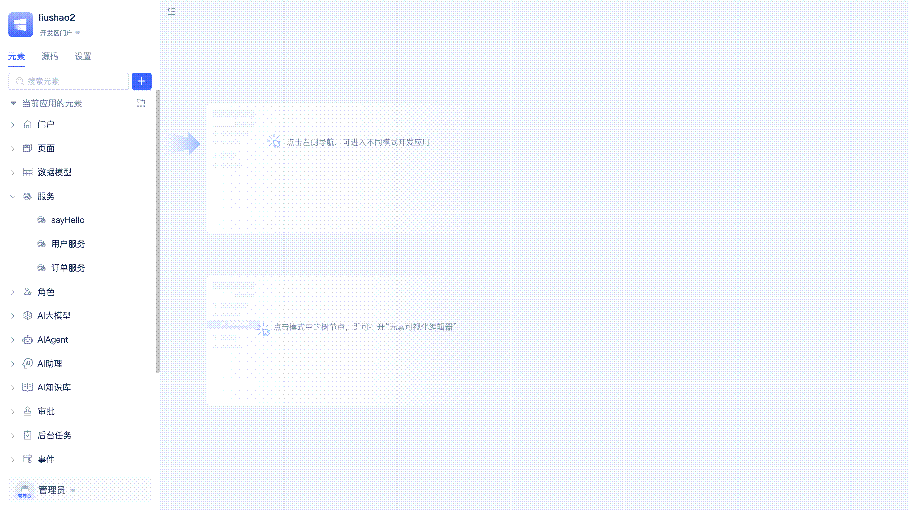
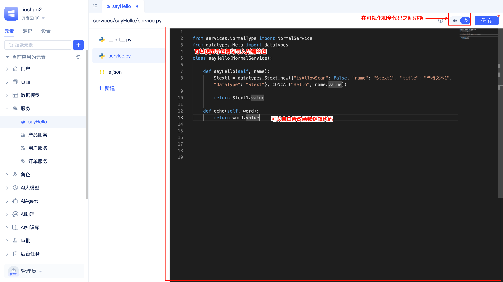
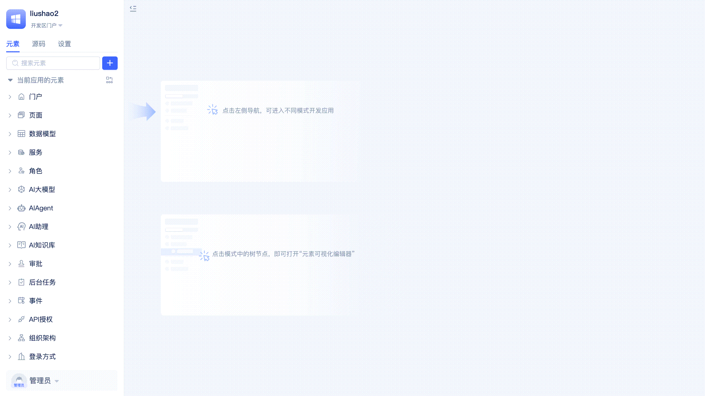
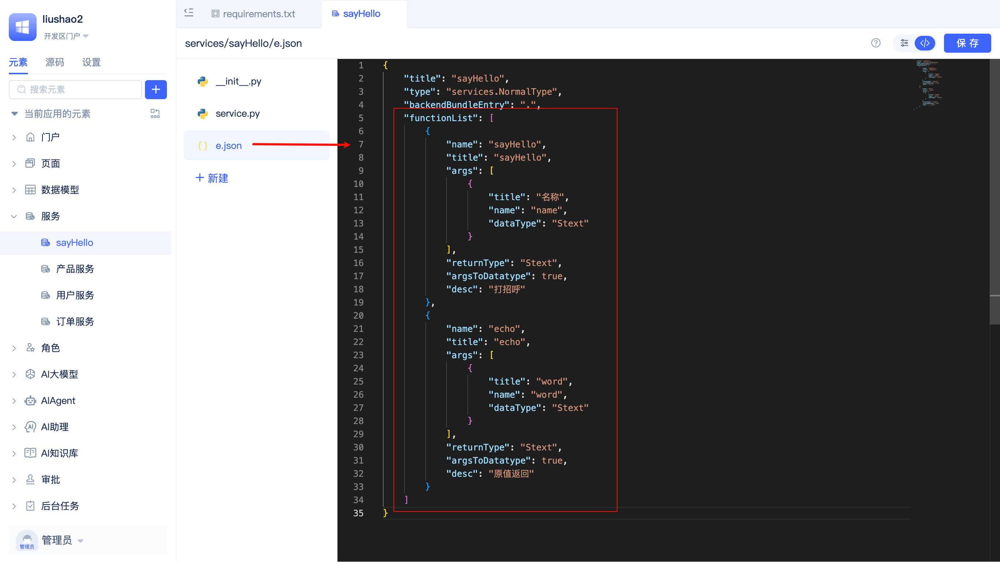
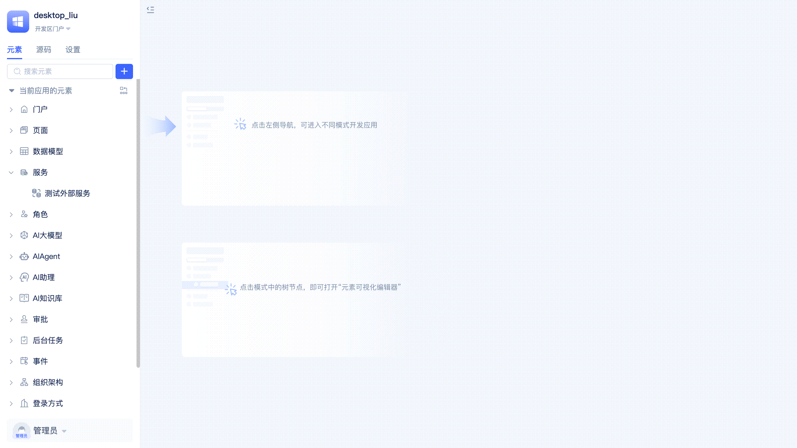
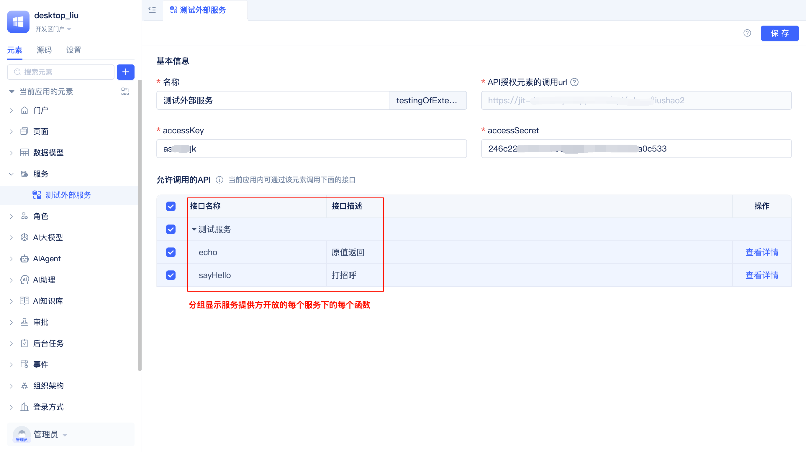
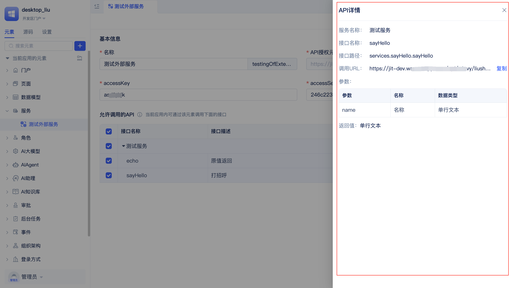

# Creating Service Elements
无论是在面向对象还是面向过程开发中，封装函数都可以让代码可复用、更易维护。通过封装函数可以把常用或复杂的业务逻辑独立出来，方便调用和管理。JitAi以服务元素的方式支持开发者自定义业务服务函数。

服务元素是基于Python的后端元素。在服务元素中，开发者可以灵活地声明多个服务函数，通过对服务函数的合理分类，有效组织和管理复杂的业务逻辑代码。

## 创建服务元素 {#create-service-elements}
开发者可以按照高内聚低耦合的原则，在应用中创建多个服务元素，分类管理不同的服务函数。例如：用户服务、订单服务、支付服务等。

开发者在元素目录树上找到`服务`，点击还右侧`+`按钮，选择`标准服务`，在弹窗中填写服务名称，点击`确定`后即可完成服务创建并自动进入可视化编辑器。

## 创建服务函数 {#create-service-functions}
JitAi支持开发者在一个服务元素中创建多个服务函数。

开发者点击服务元素编辑器左侧的`+ 新建函数`按钮，在弹窗中填写函数名称，点击`确定`后即可完成函数创建并自动跳转到函数编辑器。

## 源码模式编辑服务函数 {#edit-service-functions-source-code-mode}
当可视化编辑器无法满足复杂业务逻辑编排需要时，开发者可以切换到源码模式。例如：需要导入依赖库、封装一个辅助工具函数、使用可视化编辑器暂未支持的语法和特性，源码模式能提供更高的灵活性和扩展性。

开发者点击服务元素可视化编辑器右上角的`</>`按钮即可切换到代码模式进行开发。在编写服务函数时，开发者不仅可以使用原生的 import 语法导入所需的依赖包，还可以调用[平台API](../../reference/runtime-platform/backend)访问应用内的其它元素（如模型函数、其他服务函数等）、资源。

关于服务元素的详细内部结构，可以查看[自定义业务服务](../../reference/framework/JitService/custom-business-service)的参考文档。

## 添加新的依赖库 {#add-new-dependency-library}
开发者有时会需要使用成熟的第三方库来提升开发效率和代码质量。JitAi支持开发者修改`requirements.txt`文件，添加新的依赖库。

开发者需要将元素目录树切换到`源码`视图，找到`requirements.txt`文件并在文件中添加新的依赖库，点击`保存`按钮即可在服务函数中可以直接导入这些依赖库中的包。

## 服务函数在哪里使用 {#where-service-functions-are-used}
在[页面函数](../shell-and-page/component-based-page-development#page-functions)、[页面事件](../shell-and-page/component-based-page-development#page-events)、[前端组件事件函数](../shell-and-page/component-based-page-development#event-panel)、[任务函数](./background-tasks#task-execution-function-development)、[模型事件](./event-handling#model-events)、[审批事件](./event-handling#approval-events)、[自定义事件](./event-handling#custom-events)、[ai-assistant事件](./event-handling#ai-assistant-events)、[Agent工具调用事件](./event-handling#agent-tool-call-events)以及其它服务函数等所有可以编写函数逻辑的地方，开发者都可以调用服务函数。

服务函数还可以[作为ai-agent的工具](../ai-agent/agent-tools#agent-calling-service-functions)被大模型调用、在[ai-assistant的函数调用节点](../ai-assitant/process-orchestration-node-configuration#function-call)被调用、在[API授权元素](../api-exposure/api-authorization)中开放给第三方调用。

## 让AI更准确地理解服务函数 {#help-ai-understand-service-functions}
每个服务函数都在服务元素e.json中存在一个函数声明，即functionList中的一个函数定义。functionList可以让函数被IDE可视化编辑器识别从而支持可视化逻辑编排、让函数能够被正常调用、让函数被AI理解和使用。

完整的准确的函数名称、入参和出参名称、函数描述可以让AI更准确地理解函数功能和用法，从而更准确地调用服务函数。

借助可视化编辑器，开发者可以方便地填写函数名称、定义入参和出参、函数描述，functionList会自动生成到服务元素的e.json文件中。

:::tip
在[JAAP规范](../../reference/runtime-platform/JAAP)中，包括服务元素在内的任何元素都可以定义自己的functionList。
:::

## 使用跨App服务元素调用授权接口 {#use-cross-app-service-elements-to-call-authorized-interfaces} 
当一个JitAi应用使用[API授权元素](../api-exposure/api-authorization)对外开放了服务函数，另一个JitAi应用可以使用`跨APP服务`元素访问该授权函数，实现跨应用服务函数调用。这种调用方式仅限于在JitAi应用之间进行，调用方不是JitAi应用则依然需要使用[API授权元素SDK调用方式](../api-exposure/using-sdk-to-call-authorized-element-apis.md)。

### 创建跨App服务元素 {#create-cross-app-service-elements}

开发者在元素目录树上找到`服务`，点击右侧`+`按钮，选择`跨APP服务`，在弹窗中填写服务名称、API授权元素的调用url、accessKey、accessSecret，点击`确定`后即可完成创建并跳转到可视化编辑器。

在跨App服务元素的可视化编辑器中，开发者可以修改元素名称、accessKey、accessSecret，但调用url是只读的，不能修改。

编辑器中分组列出了服务提供方授权的每个服务下每个函数的接口名称和接口描述，被勾选的函数可以在当前应用中调用。默认是全部选中状态，开发者可以按需修改。在操作列中可以点击`查看详情`按钮打开API详情弹窗。

开发者在API详情中可以查看函数的详细信息，包括服务名称、接口名称、接口路径、调用URL、参数列表以及返回值类型。在`调用URL`的右侧提供了`复制`按钮，开发者可以一键复制URL。

### 在函数逻辑中使用跨App服务元素 {#use-cross-app-service-elements-in-functions}
开发者可以像使用普通服务函数一样在函数逻辑中调用跨App服务元素中的函数。

如上图所示，在按钮的点击事件逻辑中发起对跨App服务元素中的函数调用，并使用前端全局提示工具显示函数返回的内容。这里仅仅是用按钮事件函数举例，开发者可以在任意函数逻辑中调用，参考[服务函数在哪里使用](#where-service-functions-are-used)。
