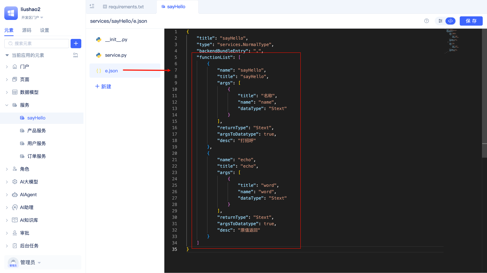

# 服务元素的使用场景

## 服务函数在哪里使用 {#where-service-functions-are-used}
在[页面函数](../shell-and-page/component-based-page-development#page-functions)、[页面事件](../shell-and-page/component-based-page-development#page-events)、[前端组件事件函数](../shell-and-page/component-based-page-development#event-panel)、[任务函数](./background-tasks#task-execution-function-development)、[模型事件](./event-handling#model-events)、[审批事件](./event-handling#approval-events)、[自定义事件](./event-handling#custom-events)、[AI助理事件](./event-handling#ai-assistant-events)、[AI Agent工具调用事件](./event-handling#agent-tool-call-events)以及其它服务函数等所有可以编写函数逻辑的地方，开发者都可以调用服务函数。

服务函数还可以[作为AI Agent的工具](../ai-agent/agent-tools#agent-calling-service-functions)被大模型调用、在[AI助理的函数调用节点](../ai-assistant/process-orchestration-node-configuration#function-call)被调用、在[API授权元素](../api-exposure/api-authorization)中开放给第三方调用。

## 让AI更准确地理解服务函数 {#help-ai-understand-service-functions}
每个服务函数都在服务元素e.json中存在一个函数声明，即functionList中的一个函数定义。functionList可以让函数被IDE可视化编辑器识别从而支持可视化逻辑编排、让函数能够被正常调用、让函数被AI理解和使用。

完整的准确的函数名称、入参和出参名称、函数描述可以让AI更准确地理解函数功能和用法，从而更准确地调用服务函数。

借助可视化编辑器，开发者可以方便地填写函数名称、定义入参和出参、函数描述，functionList会自动生成到服务元素的e.json文件中。

:::tip
在[JAAP规范](../../reference/runtime-platform/JAAP)中，包括服务元素在内的任何元素都可以定义自己的functionList。
:::
