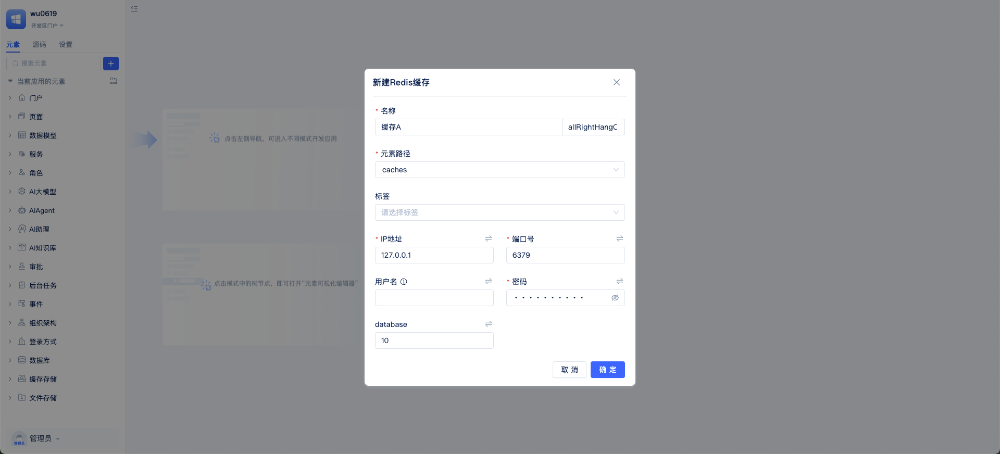
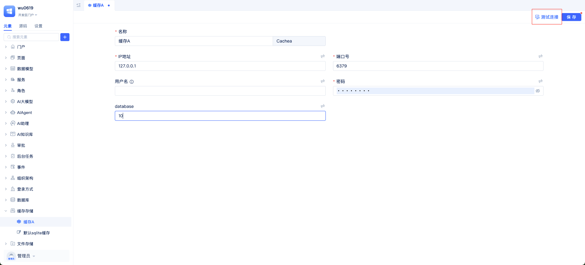
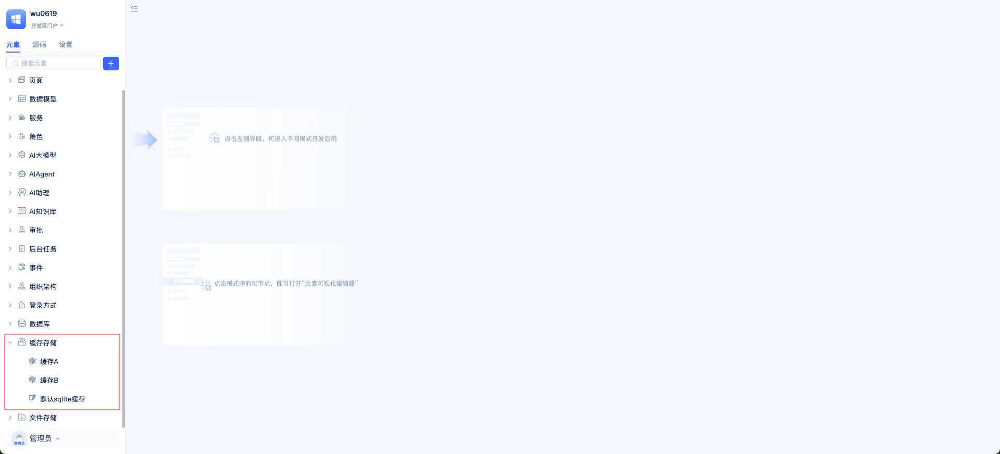

# 缓存配置与使用
在极态云中，平台支持多种缓存类型，包括 Redis、SQLite 和 TongRDS，能够覆盖从开发测试到生产部署的不同场景。缓存适合存放读取频繁且可容忍短暂不一致的数据，比如用户会话、验证码、热点配置、列表聚合结果、限流计数等。系统会自动为不同应用加上键名前缀，避免跨应用冲突。
内置缓存用于“开箱即用”的开发/测试环境：桌面环境默认使用 SQLite，服务器环境默认使用容器内Redis。生产环境推荐独立部署 Redis，并在应用中创建对应的缓存实例。

## 缓存服务配置 {#cache-service-configuration}
在配置缓存之前，先明确使用场景与部署环境：开发/测试可使用内置缓存快速启动，生产环境建议使用独立 Redis。


打开应用的开发者门户“元素目录树”，依次点击 `+`->`更多`->`缓存存储`，选择需要的缓存类型（Redis缓存、SQLite缓存、TongRDS缓存）。



弹出参数配置面板，按提示填写连接信息并保存。生产环境建议将连接参数通过环境变量注入，避免把密码等敏感信息写入仓库，参考：[数据库连接安全配置](/docs/devguide/data-modeling/manage-database-connections#database-connection-security-configuration)。



创建后可通过右上角`测试连接`按钮快速自检。

## 多缓存服务管理 {#multi-cache-service-management}
你可以在同一应用内创建多个缓存实例，例如 `缓存A`、`缓存B`、`默认sqlite缓存` 等，用于不同业务模块需要。



## 缓存编程接口使用 {#cache-programming-interface-usage}
获取缓存实例：
```python
fullName = "缓存元素的fullName" # caches.MyRedis / caches.DefaultCache 等
cache = app.getElement(fullName)  
```

字符串读写与过期：
```python
cache.set("user:1001:name", "张三", 3600)   # 写入，1小时过期
name = cache.get("user:1001:name")           # 读取
cache.expire("user:1001:name", 600)          # 将过期时间改为10分钟
```

数值与计数：
```python
cache.setNumeric("visit_count", 100)
current = cache.getNumeric("visit_count")
next_val = cache.incr("visit_count", 5)
```

键管理：
```python
kesy = cache.keys()

exists = cache.exists("user:1001:name")
if exists:
  cache.delete("user:1001:name")
```

连通性检查
```python
alive = cache.ping()  # True 表示连接正常
```

更详细接口参考：

[Redis缓存](/docs/reference/framework/JitStorage/cache/redis-cache#methods)

[SQLite缓存](/docs/reference/framework/JitStorage/cache/sqlite-cache#methods)

[TongRDS缓存](/docs/reference/framework/JitStorage/cache/tongrds-cache#methods)

