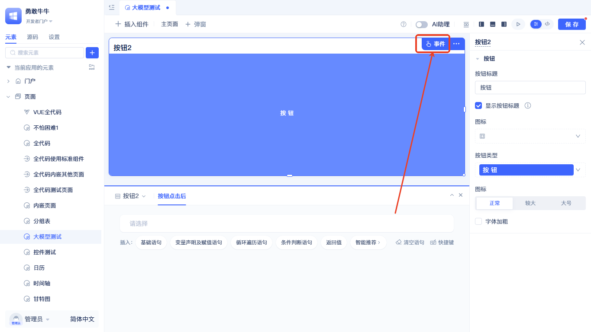
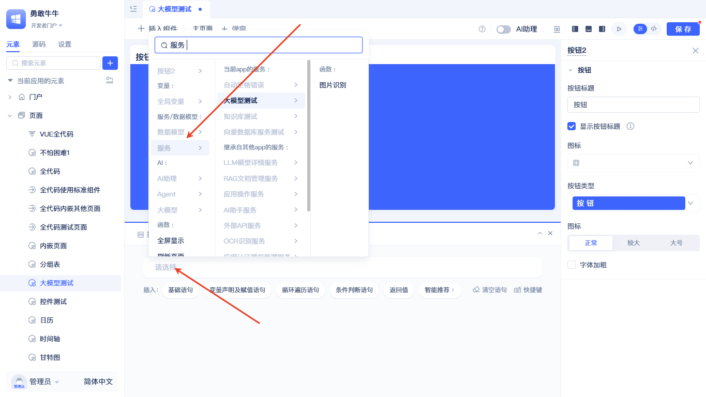
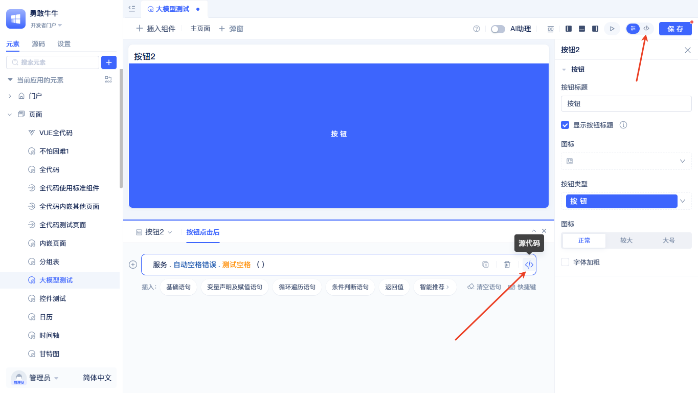
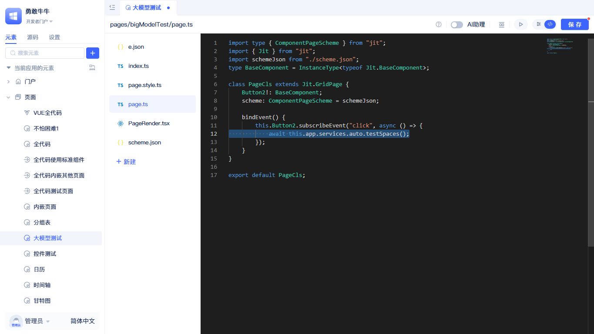
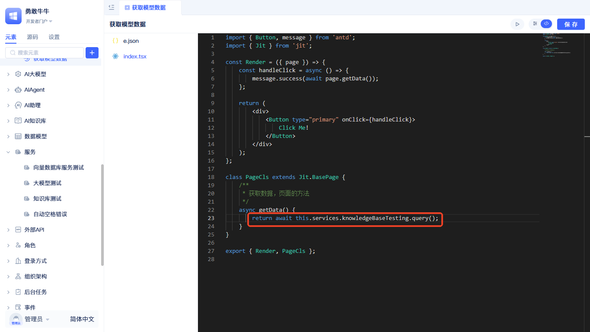

# 在页面中调用服务函数

页面可以直接调用后端服务函数，实现数据查询、业务处理、状态更新等操作。无需额外的中间层或复杂的配置，通过简单的语法即可完成前后端数据交互，极大提高了开发效率。

## 标准页面中调用服务函数 {#calling-service-functions-in-standard-pages}



在可视化页面编辑器中，选择要添加服务函数的组件，点击右上角的`事件`按钮，打开事件面板。



在事件面板中，添加空白语句，然后选择`服务`-`服务函数`。



通过页面右上角的`<>`按钮或当前语句右侧的`<>`按钮，可以查看生成的代码实现。



## 全代码页面中调用服务函数 {#calling-service-functions-in-full-code-pages}



全代码页面中调用服务函数更加简洁直接。在页面类的成员函数中，只需通过`this.app.services.[服务ID].[服务函数名]`即可调用服务函数。如何获取服务ID？你可以在元素目录树中，点击对应服务右侧的下拉菜单，再点击`复制元素ID`即可获取到服务ID。

除了在页面类的成员函数中调用，也可以在其他地方调用服务函数。所有的服务函数调用都通过app对象进行：在页面类的成员函数中，通过`this.app`获取app对象；在其他地方，可以通过以下方式获取：

```typescript
import { getRuntimeApp } from 'jit';
const app = getRuntimeApp();

```
获取app对象后，即可调用服务函数。

## 复杂参数处理 {#complex-parameter-handling}
对于参数较为复杂的服务函数，建议先在可视化界面（如事件面板）中配置好参数，然后复制生成的代码到全代码页面中使用，这样可以避免手动编写复杂参数时出错。

服务函数为页面提供了强大的后端能力扩展，通过简单的语法即可实现各种定制业务场景。如需了解如何创建服务函数，请查看[创建服务函数](../business-logic-development/creating-service-elements.md)。

## 相关文档

- [数据模型函数调用](./calling-data-model-functions-in-pages) - 了解数据模型函数的调用方式，语法与服务函数完全一致
