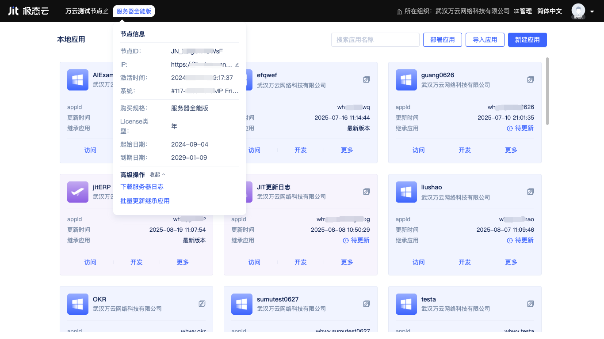

# 创建和部署应用

运维管理工具中的[节点控制台](../creating-and-publishing-applications/runtime-environment-management#node-local-default-runtime-environment)为开发者提供了应用创建、导入、导出、发布、部署等功能入口，覆盖了从立项到运维的全生命周期。

## 创建第一个应用 {#create-first-application}
在节点控制台中点击`新建应用`按钮，会打开新建应用弹窗。

开发者只需要填写应用名称、ID，然后点击确定，即可快速完成一个应用的创建。

## 基于已有应用快速开发 {#based-on-existing-application-quick-development}
为了方便开发者基于已有的应用快速开发定制，JitAi提供了两种方式：继承应用、创建副本。
  
### 继承应用
继承可以让一个应用拥有被继承应用的功能模块，每一个新建的应用都默认继承了两个官方应用模板：JIT开发框架、JIT开发工具。前者是JitAi官方开发框架，提供丰富的开箱即用的元素，后者为应用开发过程提供可视化与全代码双模式的开发工具。除了默认继承的官方应用模板，开发者也可以继续添加其它要继承的应用。

开发者点击展开`继承应用`折叠面板后点击右侧`添加应用模板`按钮，会打开应用模板列表。开发者在列表中查看全网公开或组织内部发布的应用模板，点击卡片即可添加到继承列表中。已添加的应用模板也可以点击右侧`移除`按钮进行移除，JIT开发框架不支持移除操作。

:::tip

被继承应用的开发者会持续发布新的版本，以修复bug、添加新功能等，开发者可以在[节点控制台](../creating-and-publishing-applications/runtime-environment-management#node-local-default-runtime-environment)或[在应用设置](../development-tool-and-publish-service/jitai-visual-development-tools#application-settings)中检查新版本并更新。详细的版本管理请参考[应用发布与更新](../creating-and-publishing-applications/publishing-and-updating-applications#application-version-updates)。

:::

在JitAi开发工具中，开发者既可以开发新的元素，也可以查看从被继承应用中继承的元素，并针对个别元素进行重写覆盖。

开发者点击`显示继承的应用`按钮，即可在元素目录树底部找到被继承应用中的元素，点击元素即可在右侧打开元素编辑器。继承的元素不支持直接编辑，但可以点击编辑器右上角的`重写`按钮进行覆盖重写。

### 创建副本
继承方式只能对指定的父应用的元素进行覆盖重写，如果想要在源码的基础上对应用进行修改，又不想破坏原来的应用，则可以创建一个副本。

创建出的副本是一个全新的应用，开发者需要填写新的应用名称和ID，在副本上的任何修改不会影响原应用。

## 数据存储与环境变量配置 {#data-storage-and-environment-variable-configuration}
在新建应用时，JitAi会使用本地磁盘作为应用的默认文件存储方式。桌面版本使用SQLite作为应用默认的数据库和缓存，服务器版本使用MySQL作为默认数据库以及使用Redis作为默认缓存。开发者可以在创建应用时对默认配置进行修改，连接到自己指定的OSS存储、数据库以及缓存服务。

以连接MySQL数据库为例，开发者准备好自己的MySQL服务，并填写连接信息即可（开发者需确保MySQL服务是可访问的）。

官方基础框架中封装了阿里云OCR识别、高德地图API，所需要的API密钥信息被定义成了环境变量。PDF转换、文件预览默认使用JitAi官方服务器，开发者可以自行搭建服务器，并在环境变量中配置服务地址。

开发者在开发自己的应用时也可以定义环境变量，比如用环境变量来存储数据库连接信息、API密钥等，应用导出/发布时就不会泄露敏感信息。

## 应用部署 {#application-deployment}
应用创建完成后，可以直接在当前运行环境中进行开发和测试。当需要发布正式版本时，请参考[应用发布与更新](../creating-and-publishing-applications/publishing-and-updating-applications)。发布应用版本后，就可以被其它节点和运行环境部署。

### 在指定节点上部署应用
当开发者团队只有少量节点、仅使用节点的默认运行环境时，可以直接通过每个节点的节点控制台来部署应用。

在[节点控制台](../creating-and-publishing-applications/runtime-environment-management#node-local-default-runtime-environment)中，点击`部署应用`按钮，会打开部署应用弹窗，开发者需选择应用、版本、部署方式，点击`确定`按钮即可完成部署。

### 在指定运行环境中部署应用
当开发者团队管理多个Jit节点、多个运行环境时，则需要在[组织管理控制台](../creating-and-publishing-applications/runtime-environment-management#node-local-default-runtime-environment)中为特定运行环境下的多个节点部署应用。

在[组织管理控制台](../creating-and-publishing-applications/runtime-environment-management#node-local-default-runtime-environment)中，选中目标运行环境，点击`部署应用`按钮，会打开部署应用弹窗，开发者需选择应用、版本、部署方式、目标节点，点击`确定`按钮即可完成部署。

在部署弹窗中，开发者可以添加1个或多个运行环境下的节点，并给每个节点配置不同的访问权重。
