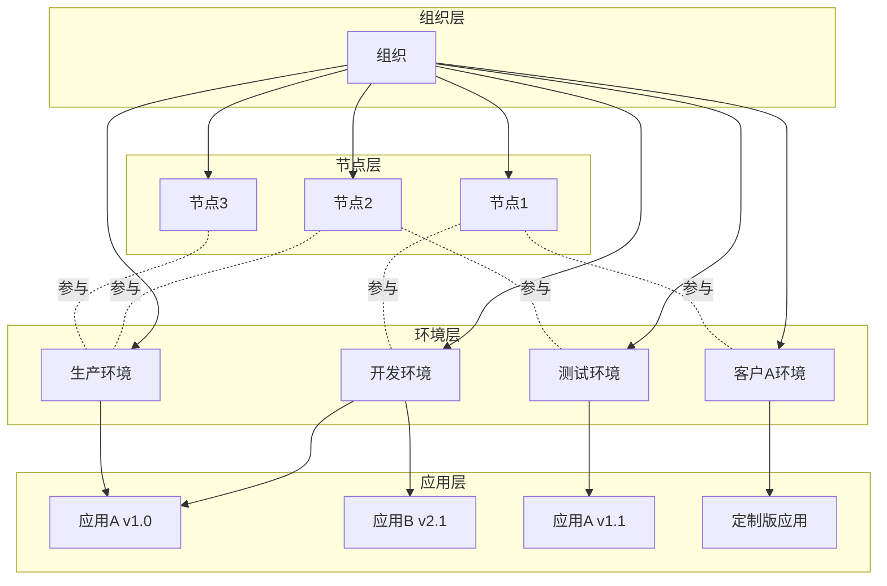
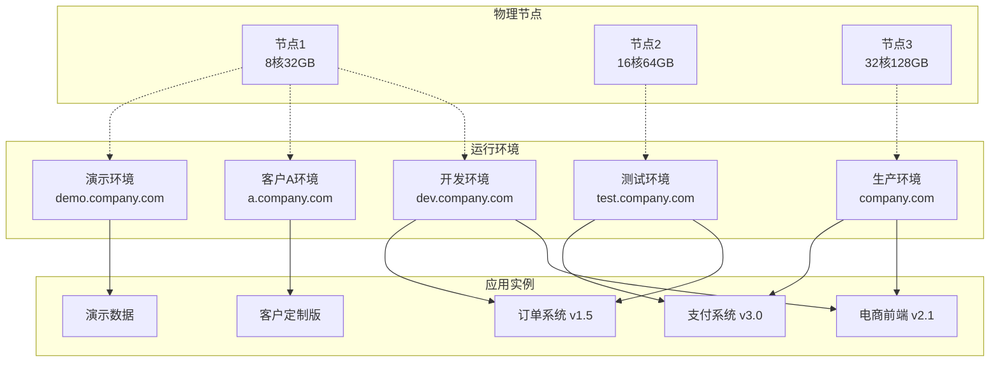

# 实现无限横向扩展的分布式集群架构

JitAi支持从单节点部署到大规模企业级集群部署，通过组织、节点、运行环境、应用的层级管理，实现了资源调度和负载均衡。

## 四层架构模型 {#four-layer-architecture}

每个组织可以拥有多个节点，每个节点可以参与到多个运行环境中，每个运行环境可以包括多个节点、部署多个应用。

## 企业级集群部署架构 {#enterprise-cluster-deployment}

### 典型部署拓扑 {#typical-deployment-topology}

### 多维度环境划分 {#multi-dimensional-environment-division}

运行环境支持按不同维度进行灵活划分，满足复杂的企业级部署需求：

| 分类维度 | 环境示例 | 使用场景 |
|----------|----------|----------|
| **按阶段** | 开发、测试、生产 | 标准软件开发流程 |
| **按业务** | 电商、支付、物流 | 业务模块隔离 |
| **按客户** | 客户A、客户B、演示 | 多租户部署 |
| **按用途** | 性能测试、安全测试 | 专项测试需求 |

### 入口地址配置策略 {#entry-address-configuration}

**入口地址配置示例：**

| 运行环境 | 主入口地址 | 备用入口地址 | 端口入口 |
|----------|------------|-------------|----------|
| 开发环境 | dev.company.com | dev2.company.com | :8080 |
| 测试环境 | test.company.com | staging.company.com | :8081 |
| 生产环境 | company.com | backup.company.com | :80 |
| 客户A环境 | a.company.com | a1.company.com | :8082 |
| 演示环境 | demo.company.com | - | :8083 |

## 集群扩展策略 {#cluster-scaling-strategies}

### 水平扩展模式 {#horizontal-scaling}

**节点级扩展**
- 新增物理或虚拟节点到集群
- 自动负载均衡和请求分发
- 支持跨地域节点部署

**环境级扩展**
- 在现有节点上创建新的运行环境
- 支持环境的动态迁移和复制
- 实现业务隔离和资源优化

**应用级扩展**
- 同一应用在多个环境中部署
- 支持版本并行和灰度发布
- 实现高可用和容灾备份

### 负载均衡与容错 {#load-balancing-fault-tolerance}

**多节点负载均衡**
- 智能请求路由和分发
- 节点健康检查和自动故障转移
- 支持权重配置和流量控制

**环境级容错**
- 环境间的故障隔离
- 自动故障检测和恢复
- 数据备份和同步机制

## 架构约束与最佳实践 {#architecture-constraints-best-practices}

### 版本管理约束 {#version-management-constraints}

| 场景 | 规则 | 状态 | 说明 |
|------|------|------|------|
| 同环境不同应用 | 任意版本组合 | ✅ 允许 | 如：开发环境同时部署应用A v1.0 和应用B v2.1 |
| 不同环境同应用 | 不同版本部署 | ✅ 允许 | 如：开发环境部署应用A v1.0，生产环境部署应用A v1.1 |
| 同环境同应用 | 多版本并存 | ❌ 禁止 | 同一环境内同一应用只能存在一个版本 |

### 网络访问约束 {#network-access-constraints}

| 操作类型 | 规则描述 | 状态 | 示例 |
|----------|----------|------|------|
| 多地址配置 | 一个环境配置多个入口 | ✅ 允许 | 生产环境：`app.com` + `backup.app.com` |
| 动态修改 | 运行时修改环境入口 | ✅ 允许 | 临时切换域名或增加备用入口 |
| 地址共享 | 多环境共享同一入口 | ❌ 禁止 | 两个环境不能同时使用 `test.com` |
| 冲突检测 | 系统自动检测冲突 | 🔍 自动 | 配置时实时检查并提示冲突 |

### 部署最佳实践 {#deployment-best-practices}

**版本管理**
- 使用不同环境来测试应用的不同版本
- 通过环境切换实现应用版本的平滑升级
- 建立清晰的版本命名和发布规范

**网络配置**
- 使用有意义的域名前缀区分环境
- 为重要环境配置备用入口地址
- 避免频繁修改生产环境的入口地址

**资源规划**
- 根据业务负载合理分配节点资源
- 定期评估和调整环境配置

