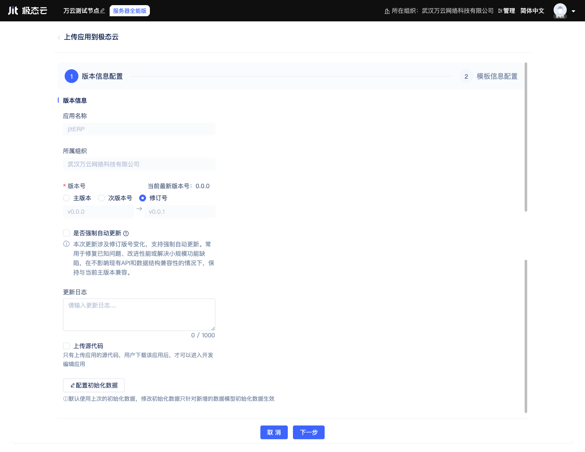
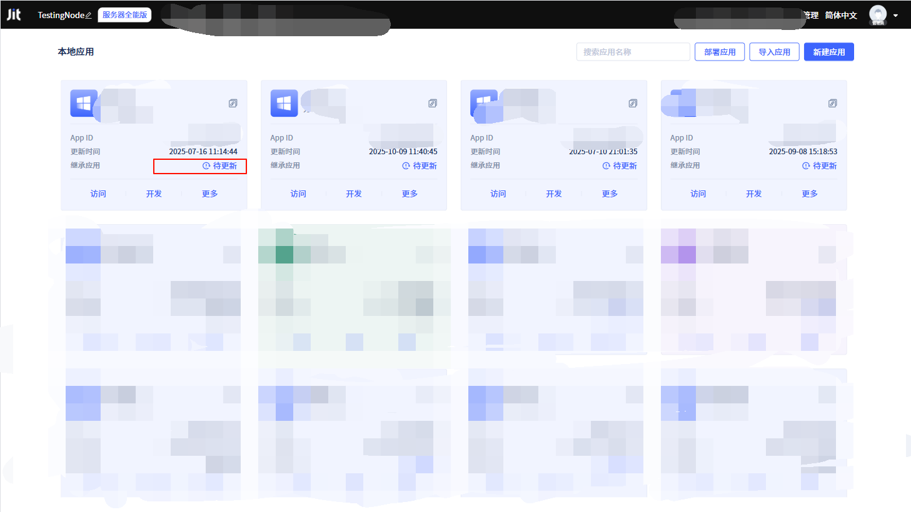
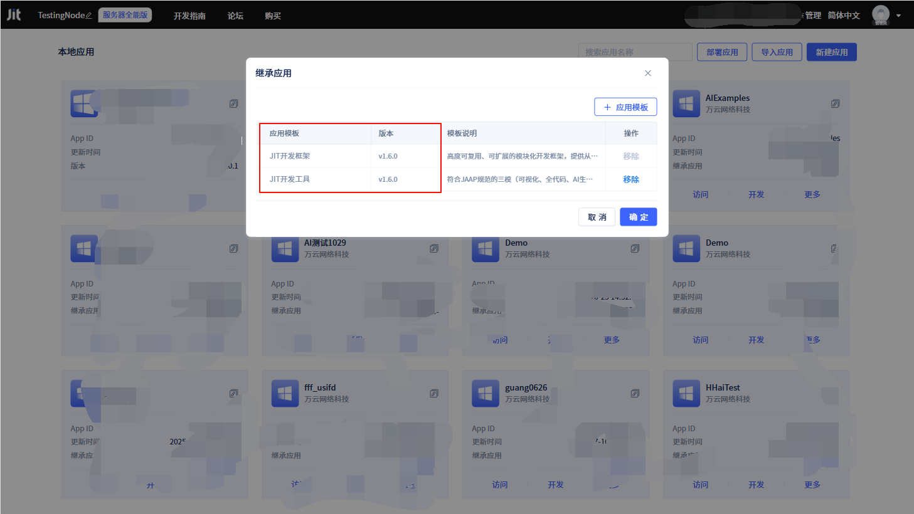

# 发布与升级应用

当应用完成开发后，开发者可以发布应用版本，以便在其它Jit节点的[运行环境](../creating-and-publishing-applications/runtime-environment-management#deploy-application-in-runtime-environment)中部署该应用版本。

## 应用版本管理与发布 {#application-version-management-and-publish}

在节点控制台的应用列表中，点击应用卡片上的`更多`按钮，在弹出菜单列表表点击`发布应用`按钮，会打开发布应用弹窗，开发者需确认和填写以下信息：版本号、是否强制自动更新、更新日志、是否上传源代码、包含哪些初始化数据。

### 语义化版本号 {#semantic-versioning}
默认情况下会更新修订版本号，如果需要更新次版本号或主版本号，开发者可以自行勾选对应选项。

:::tip 语义化版本号

建议开发者遵循[语义化版本](https://semver.org/lang/zh-CN/)规范，主版本号用于表示重大变更，次版本号用于表示功能新增或优化，修订版本号用于表示bug修复。

:::

### 是否强制自动更新 {#force-auto-update}
如果开发者选择强制自动更新，则部署该版本应用的运行环境会在应用有新版本时自动更新，否则需要手动更新。

### 有意义的更新日志 {#meaningful-update-logs}
建议开发者填写有意义的更新日志，以便用户了解应用的更新内容。

### 是否包含源代码 {#include-source-code}
如果开发者选择包含源代码，则应用部署时可以以[开发模式](../creating-and-publishing-applications/runtime-environment-management#deploy-in-development-mode)部署，否则只能以[生产模式](../creating-and-publishing-applications/runtime-environment-management#deploy-in-production-mode)部署。

平台会对源码进行加密，保证源码不会泄露。

### 包含一些初始化数据 {#include-initialization-data}
如果开发者选择包含一些初始化数据，则该应用版本被部署时会自动写入这些数据到数据库中。有部署演示版本的需求时，包含初始化数据会非常方便。

开发者可以选择要包含初始数据的数据表模型，但初始化数据累计最多1000条，请提前规划好每个数据表的数据量并准备好数据。

## 应用版本升级 {#application-version-updates}

被继承应用的开发者会持续发布新的版本，以修复bug、添加新功能等，开发者可以在[节点控制台](../creating-and-publishing-applications/runtime-environment-management#node-local-default-runtime-environment)或[在应用设置](../development-tool-and-publish-service/visual-development-tool#application-settings)中检查新版本并更新。

在节点控制台的应用列表中，可以点击应用卡片上的`待更新`按钮，即可进行应用升级。

同时，在应用卡片上的`更多`按钮中，点击`继承应用`按钮，可以查看继承应用的版本信息。

## 应用部署策略 {#application-deployment-strategies}

应用发布后，可以在不同的运行环境中进行部署，支持开发模式和生产模式两种部署方式，以及灵活的权重配置和自动更新策略。
