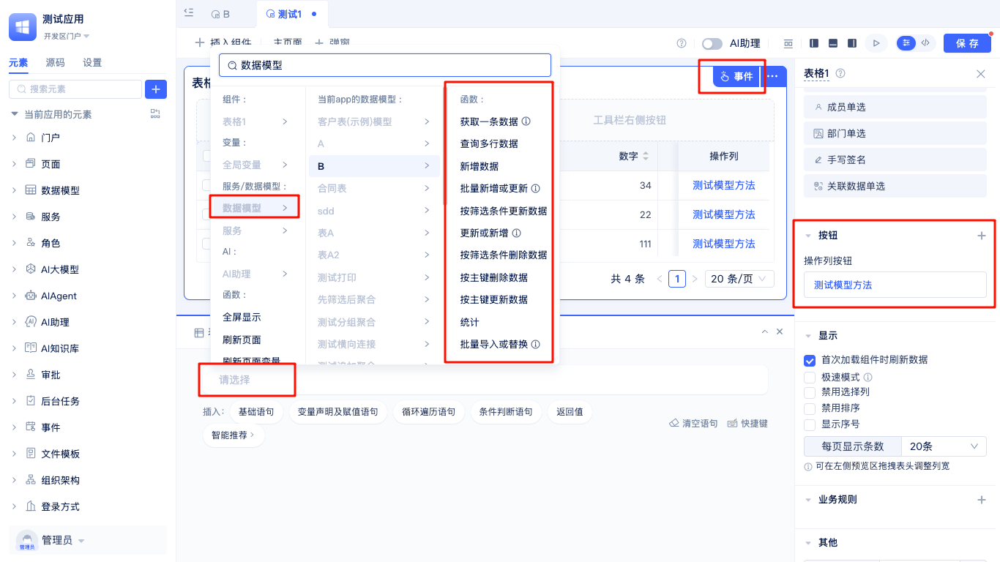
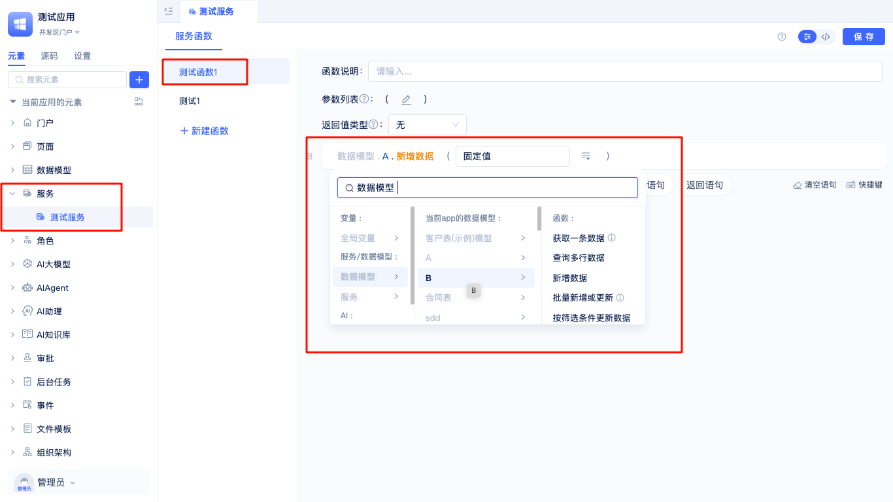

# 在页面和函数逻辑中调用数据模型 {#calling-data-models-in-pages-and-functions}

在JitAi平台开发应用时，数据模型不仅仅用于数据的存储和管理，还可以在页面展示、表单交互以及自定义函数逻辑中被灵活调用。通过在页面和函数中调用数据模型，开发者能够实现数据的动态读取、写入、更新和删除操作，从而满足各种业务场景下的数据处理需求。

## 模型内置函数 {#built-in-model-functions}

JitAi平台为每个数据模型内置了一系列常用的数据操作函数，方便开发者在页面、表单和自定义函数逻辑中灵活调用，实现数据的增删改查及统计等操作。常见的模型内置函数包括：

- **获取一条数据**：根据条件获取单条数据记录。
- **查询多条数据**：查询多条数据记录，支持条件筛选和分页。
- **新增数据**：向数据表中插入新的数据记录。
- **批量新增或更新**：批量插入多条数据或批量更新现有数据。
- **按条件更新数据**：根据指定条件批量更新符合要求的数据记录。
- **更新数据**：更新指定的数据记录。
- **按条件删除数据**：根据指定条件批量删除符合要求的数据记录。
- **按主键删除数据**：根据主键精确删除指定的数据记录。
- **按主键更新数据**：根据主键精确更新指定的数据记录。
- **统计**：对数据模型某个字段进行统计分析，如计数、求和、平均值等。
- **批量导入数据转换**：批量导入外部数据并进行数据转换处理（数据必须包含主键值）。

这些内置函数极大简化了数据操作流程，开发者只需在页面或函数逻辑中调用相应方法，并传入所需参数，即可完成复杂的数据处理任务。

了解更多详细用法，请参阅：[在页面（含全代码页面）中调用数据模型函数](../calling-business-elements-in-pages/calling-data-model-functions-in-pages.md)

## 在页面中调用数据模型 {#calling-data-models-in-pages}

在JitAi平台中，页面不仅用于展示和交互，还可以直接与数据模型进行集成，实现数据的动态操作。通过在页面事件中调用数据模型函数，开发者可以轻松实现数据的读取、写入、更新和删除等功能。

例如，在已有页面中添加一个按钮组件后，可以为该按钮配置点击事件。在事件配置界面中，选择"数据模型"，即可选择需要操作的数据模型及其对应的方法。通过灵活配置这些方法，可以实现如列表展示、详情查看、表单提交、数据编辑等多种业务场景。调用数据模型时，还可以设置参数、处理返回结果，并与页面的其他组件联动，提升页面的交互性和数据驱动能力。

此外，JitAi还支持将数据模型的调用结果与页面变量绑定，实现数据的自动刷新和动态展示，极大提升开发效率和用户体验。

## 在函数中调用数据模型 {#calling-data-models-in-functions}

在JitAi平台中，除了可以在页面中直接调用数据模型外，还可以在服务函数或模型函数中灵活调用数据模型，实现更复杂的业务逻辑和数据处理。

通过在函数中调用数据模型，开发者可以根据业务需求，编写自定义的逻辑流程。例如，可以在服务函数中批量处理数据、实现多表联合操作、数据校验等。常见的调用方式包括：

- 在服务函数中调用数据模型的内置方法，实现数据的增删改查、统计等操作。
- 在模型函数中实现与当前模型相关的复杂业务逻辑，如数据校验、自动计算字段值等。
- 支持链式调用多个数据模型，实现跨模型的数据处理和业务流转。

调用数据模型时，通常需要传递相应的参数（如查询条件、数据内容等），并可对返回结果进行处理。函数的返回值可以作为页面展示、后续流程处理或其他函数调用的输入，极大提升了系统的灵活性和可扩展性。

通过在函数中调用数据模型，开发者能够将数据操作与业务逻辑深度结合，满足各种复杂场景下的开发需求。